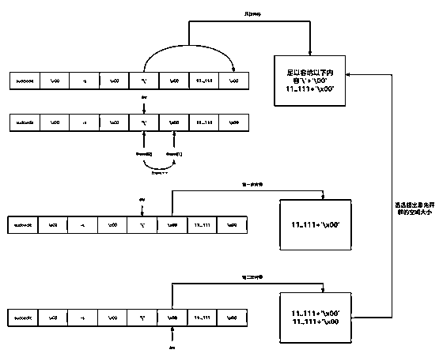
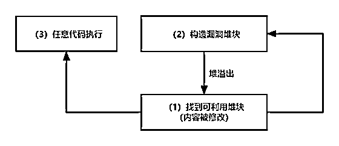
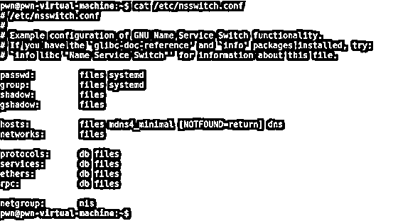
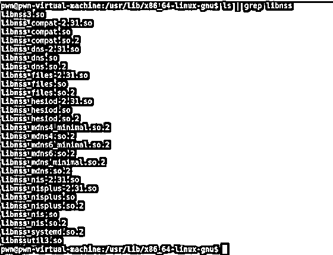
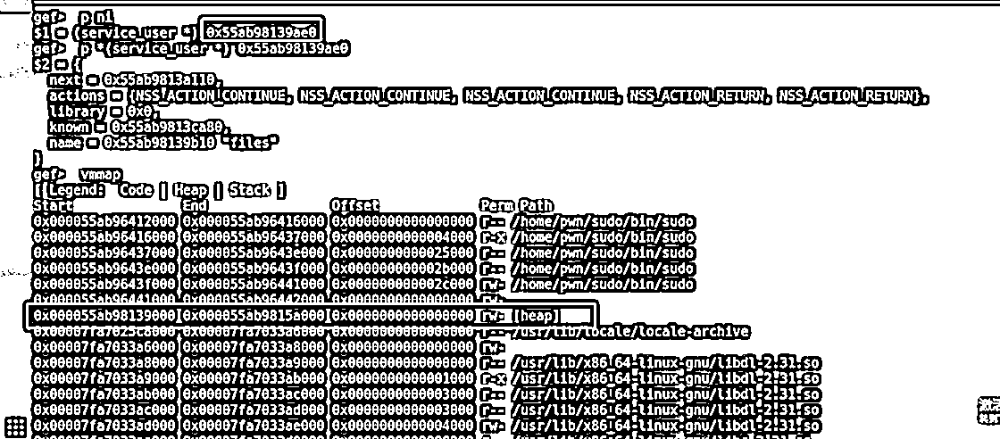
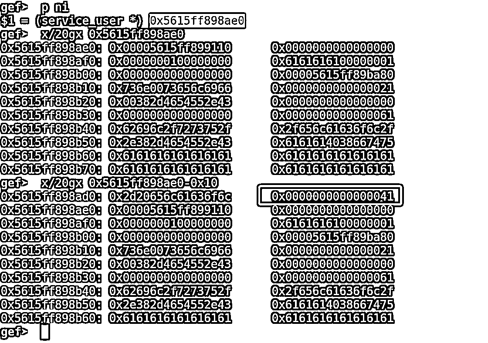
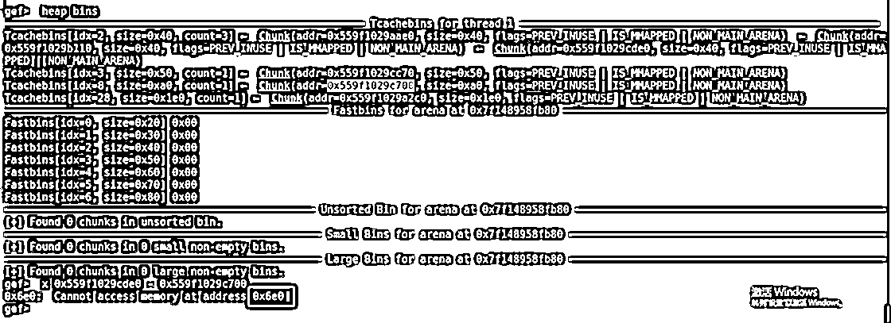
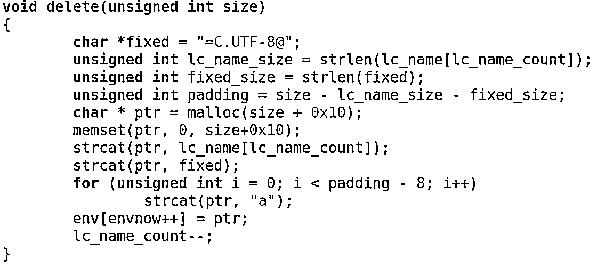

# Sudo 堆溢出漏洞(CVE-2021-3156)复现 - 合天网安实验室 - 博客园

> 原文：[`www.cnblogs.com/hetianlab/p/17511940.html`](https://www.cnblogs.com/hetianlab/p/17511940.html)

## 背景介绍

2021 年 1 月 26 日，Qualys Research Labs 在 sudo 发现了一个缺陷。sudo 解析命令行参数的方式时，错误的判断了截断符，从而导致攻击者可以恶意构造载荷，使得 sudo 发生堆溢出，该漏洞在配合环境变量等分配堆以及释放堆的原语下，可以致使本地提权。

## 环境搭建

环境版本

• ubuntu 20.04

• sudo-1.8.31p2

采用下述命令进行编译安装

```
cd ./sudo-SUDO_1_8_31p2
 mkdir build
 ./configure --prefix=/home/pwn/sudo CFLAGS=”-O0 -g"
 make && make install
```

## 漏洞验证

```
#poc
./sudoedit -s '\' 11111111111111111111111111111111111111111111111111111111111111111111
```

执行上述 POC 执行 sudoedit 会出现 malloc():invalid size 的字样，这是典型的堆溢出后导致的异常。


## 漏洞分析

源码分析

```
set_cmnd 函数
File: plugins\sudoers\sudoers.c
800: static int
801: set_cmnd(void)
802: {
            ...
819:     if (sudo_mode & (MODE_RUN | MODE_EDIT | MODE_CHECK)) { //需要满足标志位的设置才能进入转义的流程
            ...
845: 
846:    /* set user_args */
847:    if (NewArgc > 1) {
848:        char *to, *from, **av;
849:        size_t size, n;
850: 
851:        /* Alloc and build up user_args. */
852:        for (size = 0, av = NewArgv + 1; *av; av++) //遍历每一个参数
853:        size += strlen(*av) + 1; //计算每一个参数的长度
854:        if (size == 0 || (user_args = malloc(size)) == NULL) { //通过 malloc 动态分配一段内存，用于存放参数内容
855:        sudo_warnx(U_("%s: %s"), __func__, U_("unable to allocate memory"));
856:        debug_return_int(-1);
857:        }
858:        if (ISSET(sudo_mode, MODE_SHELL|MODE_LOGIN_SHELL)) { //需要满足标志位的设置才能进入转义的流程
859:        /*
860:         * When running a command via a shell, the sudo front-end
861:         * escapes potential meta chars.  We unescape non-spaces
862:         * for sudoers matching and logging purposes.
863:         */
864:        for (to = user_args, av = NewArgv + 1; (from = *av); av++) { //遍历每个环境变量，并将内容拷贝到内存中
865:            while (*from) {
                /*
                    漏洞点，当扫描参数内容时，遇到\需要进行转义处理，例如'\t'、'\n'等，因此 sudo 只判断\后是否跟随着空格字符，即用 isspace 函数进行判                    断。                     
                    isspace 包括的字符如下：
                    ' '     (0x20)    space (SPC) 空格符
                    '\t'    (0x09)    horizontal tab (TAB) 水平制表符    
                    '\n'    (0x0a)    newline (LF) 换行符
                    '\v'    (0x0b)    vertical tab (VT) 垂直制表符
                    '\f'    (0x0c)    feed (FF) 换页符
                    '\r'    (0x0d)    carriage return (CR) 回车符
                    以上不包括'\0'。
                    而参数之间是使用'\0'作为分隔符的，因此当'\\'后跟随的'\0'会使得 from++从而导致将后一个参数也被拷贝进来，最后致使堆块溢出。
                */
866:            if (from[0] == '\\' && !isspace((unsigned char)from[1])) 
867:                from++;
868:            *to++ = *from++;
869:            }
870:            *to++ = ' ';
871:        }
872:        *--to = '\0';
​
```

使用 POC 的例子对漏洞进行说明



漏洞原理图

【----帮助网安学习，以下所有学习资料免费领！加 vx：yj009991，备注 “博客园” 获取！】

　① 网安学习成长路径思维导图
　② 60+网安经典常用工具包
　③ 100+SRC 漏洞分析报告
　④ 150+网安攻防实战技术电子书
　⑤ 最权威 CISSP 认证考试指南+题库
　⑥ 超 1800 页 CTF 实战技巧手册
　⑦ 最新网安大厂面试题合集（含答案）
　⑧ APP 客户端安全检测指南（安卓+IOS）

因此漏洞点在于在进入 set_cmnd 函数时需要对转义字符进行转义，但是函数却没有判断转义字符作为参数末尾的情况，即**\ + \x00**

##### parse_args 函数

parse_args 函数用于反转义，即参数中若存在转义字符，会在每个转义字符之前增加一个\

```
File: src\parse_args.c
592:     if (ISSET(mode, MODE_RUN) && ISSET(flags, MODE_SHELL)) { //需要满足标志位的设置才会进入反转义流程
593:    char **av, *cmnd = NULL;
594:    int ac = 1;
595: 
596:    if (argc != 0) {
597:        /* shell -c "command" */
598:        char *src, *dst;
599:        size_t cmnd_size = (size_t) (argv[argc - 1] - argv[0]) +
600:        strlen(argv[argc - 1]) + 1;
601: 
602:        cmnd = dst = reallocarray(NULL, cmnd_size, 2);
603:        if (cmnd == NULL)
604:        sudo_fatalx(U_("%s: %s"), __func__, U_("unable to allocate memory"));
605:        if (!gc_add(GC_PTR, cmnd))
606:        exit(1);
607: 
608:        for (av = argv; *av != NULL; av++) {
609:        for (src = *av; *src != '\0'; src++) {
610:            /* quote potential meta characters */
611:            if (!isalnum((unsigned char)*src) && *src != '_' && *src != '-' && *src != '$')
612:            *dst++ = '\\';
613:            *dst++ = *src;
614:        }
615:        *dst++ = ' ';
616:        }
617:        if (cmnd != dst)
618:        dst--;  /* replace last space with a NUL */
619:        *dst = '\0';
620: 
621:        ac += 2; /* -c cmnd */
622:    }
​
```

这也是为什么 set_cmnd 函数需要对参数进行转义，因此若先经过 parse_args 函数进行反转义，后经过 set_cmnd 函数进行转义，那么 sudo 是不会出现漏洞情况的

绕过检验

那么如何绕过 set_cmnd 函数直接进入 parse_args 函数，才是漏洞能够被成功触发的关键因素

首先是如何才能过进入 set_cmnd 函数，sudo 会经过两重检测

1.  sudo_mode 需要具有 MODE_RUN、MODE_EDIT 或者 MODE_CHECK 的标志位

2.  sudo_mode 需要具有 MODE_SHELL 或者 MODE_LOGIN_SHELL 的标志位

```
File: plugins\sudoers\sudoers.c
            ...
819:     if (sudo_mode & (MODE_RUN | MODE_EDIT | MODE_CHECK)) { //需要满足标志位的设置才能进入转义的流程
            ...
858:        if (ISSET(sudo_mode, MODE_SHELL|MODE_LOGIN_SHELL)) { //需要满足标志位的设置才能进入转义的流程
想要获得 MODE_SHELL 的标志位，则需要设置-s 参数，此时通过 SET(flags, MODE_SHELL)，将 flag 设置上 MODE_SHELL，并且默认的 mode 是为 NULL，因此设置-s 参数可以使得 flag 即设置 MODE_SHELL 又设置 MODE_RUN。
File: src\parse_args.c
479:        case 's':
480:            sudo_settings[ARG_USER_SHELL].value = "true";
481:            SET(flags, MODE_SHELL);
482:            break;
            ...
534:    if (!mode)
535:        mode = MODE_RUN;        /* running a command */
536:     }
```

但是若使用 sudo -s，那么就会导致 flag 即设置 MODE_SHELL 又设置 MODE_RUN，就会进入 parse_args 函数的流程，该流程会把所有非字母数字的字符前方增加一个'\'，那么就会导致我们无法构造'' + '\x00'的漏洞字符，因此想要漏洞利用成功，我们不需要程序进入 set_cmd 函数，但是不能进入 parse_args 函数

```
File: src\parse_args.c
592:     if (ISSET(mode, MODE_RUN) && ISSET(flags, MODE_SHELL)) { //需要满足标志位的设置才会进入反转义流程
            ...
608:        for (av = argv; *av != NULL; av++) {
609:        for (src = *av; *src != '\0'; src++) {
610:            /* quote potential meta characters */
611:            if (!isalnum((unsigned char)*src) && *src != '_' && *src != '-' && *src != '$')
612:            *dst++ = '\\';
613:            *dst++ = *src;
614:        }
            ...
622:    }
```

在 parse_args 函数的开头，会检测是以 sudo 还是以 sudoedit 进行调用，若使用 sudoedit 调用，那么会直接给 mode 设置上 MODE_EDIT，从而绕过了 mode==NULL 时，需要将 flag 设置为 MODE_RUN，因此使用 sudoedit -s，可以使得 flag 即设置 MODE_EDIT 又设置 MODE_SHELL

```
File: src\parse_args.c
        ...
265:     proglen = strlen(progname);
266:     if (proglen > 4 && strcmp(progname + proglen - 4, "edit") == 0) {
267:    progname = "sudoedit";
268:    mode = MODE_EDIT;
269:    sudo_settings[ARG_SUDOEDIT].value = "true";
270:     }
```

想要进入 set_cmnd 第二条路径就是 flag 设置为 MODE_EDIT | MODE_SHELL，这样的输入就能够绕过 parse_args 函数而禁止进入 set_cmd 函数，这也是为什么 sudo 的堆溢出，需要使用 sudoedit -s 触发，而不是 sudo -s

```
File: plugins\sudoers\sudoers.c
            ...
819:     if (sudo_mode & (MODE_RUN | MODE_EDIT | MODE_CHECK)) { //需要满足标志位的设置才能进入转义的流程
            ...
858:        if (ISSET(sudo_mode, MODE_SHELL|MODE_LOGIN_SHELL)) { //需要满足标志位的设置才能进入转义的流程
```

## 漏洞利用

漏洞利用分析

由于程序存在一个明显的堆溢出漏洞，因此需要梳理一下堆溢出如何进行利用。

• 找到一个堆块，该堆块的值会影响程序执行的流程，这里称之为**可利用堆块**。

• 找到可以**随意控制堆块位置的操作**，将漏洞函数申请的堆块部署在可利用堆块的上方，当堆溢出触发时，可以将可利用堆块的值被改写成我们预期的值。



可利用堆块

nss 是用于解析和获取不同类型的名称信息，例如如何通过用名称去获取用户信息，在 sudo 需要获取用户信息时则需要调用 nss。

在使用 nss 去获取信息时，其实是通过不同的动态链接库去执行相应的行为，而这些库的文件名则存在于/etc/nsswitch.conf 的配置文件中



例如想要查询 passwd 文件则需要用到 libnss_files.so 与 libnss_systemed.so



那么如何加载这些动态链接库则需要依赖于 nss_load_library 函数，而且这些相关信息都被存放在 service_user 结构体中，而该结构体是存放在堆内存中的。



接着得先研究该结构体的值是否会影响程序的执行流程，代码如下。

```
File: nsswitch.c
327: static int
328: nss_load_library (service_user *ni)
329: {
330:   if (ni->library == NULL) 
331:     {
332:       /* This service has not yet been used.  Fetch the service
333:     library for it, creating a new one if need be.  If there
334:     is no service table from the file, this static variable
335:     holds the head of the service_library list made from the
336:     default configuration.  */
337:       static name_database default_table;
338:       ni->library = nss_new_service (service_table ?: &default_table,
339:                     ni->name); //若 ni->library 的值为 NULL，那么就会新建一个 ni->library 并将成员都进行初始化
340:       if (ni->library == NULL)
341:    return -1;
342:     }
343: 
344:   if (ni->library->lib_handle == NULL) //由于 ni->library 刚新建，因此 ni->library->lib_handle 必定为 NULL
345:     {
346:       /* Load the shared library.  */
347:       size_t shlen = (7 + strlen (ni->name) + 3
348:              + strlen (__nss_shlib_revision) + 1);
349:       int saved_errno = errno;
350:       char shlib_name[shlen];
351: 
352:       /* Construct shared object name.  */
353:       __stpcpy (__stpcpy (__stpcpy (__stpcpy (shlib_name,
354:                          "libnss_"),
355:                    ni->name),
356:              ".so"), //shalib_name 是根据拼接得到
357:        __nss_shlib_revision);
358: 
359:       ni->library->lib_handle = __libc_dlopen (shlib_name); //加载动态链接库
​
```

上述代码有个非常关键的点在于，程序会使用 __libc_dlopen 打开 shalib_name 指定的动态链接库，而 shalib_name 是通过 ni->name 进行一系列的拼接得到，而 ni->name 则是存放在结构体 service_user *ni 中的，该结构体又是存放在堆内存中的。那么我们就找到了关键的值 ni->name，它是能够完成修改程序执行流程的关键变量。


举个例子，例如我们将 ni->name 修改为 X/test，那么最后拼接的结果会得到 libnss_X/test.so，那么如果我们在当前目录下新建一个 libnss_X 并且在该目录中创建一个 test.so 的动态链接库，那么 sudo 就会加载并执行我们动态链接库中的代码。至此我们找到利用的第一个关键因素，可利用堆块。

布置堆块的操作

由于我们已经找到了可利用的堆块，如果能够将堆溢出的堆块部署在可利用堆块的上方，在利用堆溢出修改 ni->name，即可完成任意代码执行的效果。

在 sudo 的 main 函数中，会执行 setlocate 函数。setlocale 是一个用于设置程序的区域设置（locale）的函数，在许多编程语言和操作系统中都有对应的实现。

区域设置是指程序在运行时所采用的语言、地区、日期格式、货币符号等相关信息的集合。通过设置区域设置，程序可以根据不同的地区和语言环境来适应本地化需求。

export LC_ALL=en_US.UTF-8@XXXX

而在 setlocal 函数中涉及十分多的堆块分配与释放的操作，当调用 setlocal(LC_ALL,"")时，程序会通过环境变量设置的值去搜索区域设置的值，而环境变量的搜索则依靠 _nl_find_locale 函数。

```
_nl_find_locale 函数
File: locale\findlocale.c
101: struct __locale_data *
102: _nl_find_locale (const char *locale_path, size_t locale_path_len,
103:         int category, const char **name)
104: {
        ... 
184:   /* LOCALE can consist of up to four recognized parts for the XPG syntax:
185: 
186:        language[_territory[.codeset]][@modifier]
187: 
188:      Beside the first all of them are allowed to be missing.  If the
189:      full specified locale is not found, the less specific one are
190:      looked for.  The various part will be stripped off according to
191:      the following order:
192:        (1) codeset
193:        (2) normalized codeset
194:        (3) territory
195:        (4) modifier
196:    */
       /*
            区域的格式为 C_en_US.UTF-8@XXXXXX
            _nl_explode_name 用于判断(1)(2)(3)(4)哪部分存在，哪部分缺失
       */
197:   mask = _nl_explode_name (loc_name, &language, &modifier, &territory,
198:               &codeset, &normalized_codeset);
199:   if (mask == -1)
200:     /* Memory allocate problem.  */
201:     return NULL;
202: 
        //locale_file 则给区域设置进行动态内存的分配
205:   locale_file = _nl_make_l10nflist (&_nl_locale_file_list[category],
206:                    locale_path, locale_path_len, mask,
207:                    language, territory, codeset,
208:                    normalized_codeset, modifier,
209:                    _nl_category_names_get (category), 0); //返回 NULL
210: 
211:   if (locale_file == NULL)
212:     {
213:       /* Find status record for addressed locale file.  We have to search
214:     through all directories in the locale path.  */
215:       locale_file = _nl_make_l10nflist (&_nl_locale_file_list[category],
216:                    locale_path, locale_path_len, mask,
217:                    language, territory, codeset,
218:                    normalized_codeset, modifier,
219:                    _nl_category_names_get (category), 1);
220:       if (locale_file == NULL)
221:    /* This means we are out of core.  */
222:    return NULL;
223:     }
}
```

**_nl_make_l10nflist****函数**

_nl_make_l10nflist 会根据我们传入的值进行堆块的分配。

```
File: intl\l10nflist.c
150: struct loaded_l10nfile *
151: _nl_make_l10nflist (struct loaded_l10nfile **l10nfile_list,
152:            const char *dirlist, size_t dirlist_len,
153:            int mask, const char *language, const char *territory,
154:            const char *codeset, const char *normalized_codeset,
155:            const char *modifier,
156:            const char *filename, int do_allocate)
157: {
        ...
165:   //根据我们传入的区域值的长度进行动态分配
166:   abs_filename = (char *) malloc (dirlist_len
167:                  + strlen (language)
168:                  + ((mask & XPG_TERRITORY) != 0
169:                     ? strlen (territory) + 1 : 0)
170:                  + ((mask & XPG_CODESET) != 0
171:                     ? strlen (codeset) + 1 : 0)
172:                  + ((mask & XPG_NORM_CODESET) != 0
173:                     ? strlen (normalized_codeset) + 1 : 0)
174:                  + ((mask & XPG_MODIFIER) != 0
175:                     ? strlen (modifier) + 1 : 0)
176:                  + 1 + strlen (filename) + 1);
177: 
        ...
292: }
​
```

**setlocale****函数**

setlocale 函数总体操作则是读取环境变量的值获取区域设置的值，根据区域设置的值分配堆块大小，若其中存在不符合区域值的规范，则会将所有先前申请的堆块都释放掉。

```
File: locale\setlocale.c
334:       while (category-- > 0)
335:    if (category != LC_ALL)
336:      {
            //通过 _nl_find_locale 函数去获取环境变量的值，存放在 newdata[category]中
337:        newdata[category] = _nl_find_locale (locale_path, locale_path_len,
338:                         category,
339:                         &newnames[category]);
340: 
            ...
364:        else
365:          {
                //使用 __strdup 函数在堆内存中分配空间，并将 newdata[category]拷贝进去
366:            newnames[category] = __strdup (newnames[category]);
367:            if (newnames[category] == NULL)
368:              break;
369:          }
            ...
393:      if (category != LC_ALL && newnames[category] != _nl_C_name
394:          && newnames[category] != _nl_global_locale.__names[category])
395:        free ((char *) newnames[category]); //这里就是堆块释放的原语了，只要有一个区域设置的值不符合规范，则将之前所有申请的堆块都释放掉
​
```

因此可以通过区域值去控制堆块的大小，接着在最后设置一个错误的区域值去控制堆块的位置，至此我们找到可控制堆块的操作。

LC_IDENTIFICATION = C.UTF-8@XX..XX #若长度为 0x10，则 malloc(0x10) LC_MEASUREMENT = C.UTF-8@XX..XXX,#若长度为 0X20，则 malloc(0x20) LC_TELEPHONE = XXXX #不符合区域值的规范，则会调用 free()

exp 的分析

由于我们需要控制 server_user 的堆块，因此需要知道该堆块的大小为多少，通过调试可知是 0x40 的堆块，因此利用 setlocate 多释放几个 0x40 的堆块，那么 server_user 就会使用到我们所释放的堆块。



紧接着将漏洞堆块分配到 server_user 堆块的上方，由于 server_user 的堆块是我们自己构建的，因此只需要在释放该堆块的同时也释放漏洞堆块即可，并且漏洞堆块的申请可是根据参数的长度所设置的



将设置区域值的函数设置为堆块分配与释放的原语，使用@后面的字符控制堆块的大小



使用错误的区域值进行堆块的释放


最后就是如何填充到可利用堆块，这里使用堆溢出，并且在环境变量中构造填充字符串，使得漏洞堆块可以覆盖掉可利用堆块的内容值，但这里需要注意的是，我们需要将 ni->library 中用\x00 填充，而\x00 是无法直接输入到环境变量中的，因此需要再次观察漏洞函数是如何拷贝字符的。根据代码分析可知，只要''后紧跟着'\x00'，那么我们就能将\x00 的值直接拷贝的堆内存中。紧接着将 ni->name 修改为我们认为构造的动态链接库即可。

```
File: plugins\sudoers\sudoers.c
866:            if (from[0] == '\\' && !isspace((unsigned char)from[1])) //若 '\' 后跟着'\x00'
867:                from++; //此时 from 会指向\x00
868:            *to++ = *from++; //使用\x00 进行值的拷贝
869:            }
```

设置多个环境变量使得内存存在多个'' + '\x00'，从而使用'\x00'去覆盖堆的内存值。


**演示效果如下**


## 漏洞修复

漏洞的修复则是将 MODE_EDIT 的标志位进行了额外的判断，并且在''后面增加了对'\0'的校验

```
​
--- a/plugins/sudoers/sudoers.c Sat Jan 23 08:43:59 2021 -0700
+++ b/plugins/sudoers/sudoers.c Sat Jan 23 08:43:59 2021 -0700
@@ -547,7 +547,7 @@

     /* If run as root with SUDO_USER set, set sudo_user.pw to that user. */
     /* XXX - causes confusion when root is not listed in sudoers */
-    if (sudo_mode & (MODE_RUN | MODE_EDIT) && prev_user != NULL) {
+    if (ISSET(sudo_mode, MODE_RUN|MODE_EDIT) && prev_user != NULL) {
    if (user_uid == 0 && strcmp(prev_user, "root") != 0) {
        struct passwd *pw;

@@ -932,8 +932,8 @@
     if (user_cmnd == NULL)
    user_cmnd = NewArgv[0];

-    if (sudo_mode & (MODE_RUN | MODE_EDIT | MODE_CHECK)) {
-   if (ISSET(sudo_mode, MODE_RUN | MODE_CHECK)) {
+    if (ISSET(sudo_mode, MODE_RUN|MODE_EDIT|MODE_CHECK)) {
+   if (!ISSET(sudo_mode, MODE_EDIT)) { //对 MODE_EDIT 进行了额外的判断
        const char *runchroot = user_runchroot;
        if (runchroot == NULL && def_runchroot != NULL &&
            strcmp(def_runchroot, "*") != 0)
@@ -961,7 +961,8 @@
        sudo_warnx(U_("%s: %s"), __func__, U_("unable to allocate memory"));
        debug_return_int(NOT_FOUND_ERROR);
        }
-       if (ISSET(sudo_mode, MODE_SHELL|MODE_LOGIN_SHELL)) {
+       if (ISSET(sudo_mode, MODE_SHELL|MODE_LOGIN_SHELL) &&
+           ISSET(sudo_mode, MODE_RUN)) { //需要 sudo -s 才能进行转义
        /*
         * When running a command via a shell, the sudo front-end
         * escapes potential meta chars.  We unescape non-spaces
@@ -969,10 +970,22 @@
         */
        for (to = user_args, av = NewArgv + 1; (from = *av); av++) {
            while (*from) {
-           if (from[0] == '\\' && !isspace((unsigned char)from[1]))
+           if (from[0] == '\\' && from[1] != '\0' &&  //增加了'\0'的判断
+               !isspace((unsigned char)from[1])) {
                from++;
+           }
+           if (size - (to - user_args) < 1) {
+               sudo_warnx(U_("internal error, %s overflow"),
+               __func__);
+               debug_return_int(NOT_FOUND_ERROR);
+           }
            *to++ = *from++;
            }
+           if (size - (to - user_args) < 1) {
+           sudo_warnx(U_("internal error, %s overflow"),
+               __func__);
+           debug_return_int(NOT_FOUND_ERROR);
+           }
            *to++ = ' ';
        }
        *--to = '\0';
```

## 总结

Sudo 堆溢出攻击流程

首先利用 setlocate 作为堆块分配与释放的原语，构造出适合的堆布局确保 server_user 堆块尽可能贴近漏洞代码开辟出来的堆块。

其次利用堆溢出将 server_user 堆块的 ni->name 值覆盖，覆盖的值为恶意构造的动态链接库名。

最后等待动态链接库被加载执行。

Sudo 堆溢出利用的限制

由于 sudo 堆溢出依赖堆的布局，因此不同版本的 sudo 或者操作系统都会影响漏洞的利用。

**更多网安技能的在线实操练习，[请点击这里>>](https://www.hetianlab.com/)**