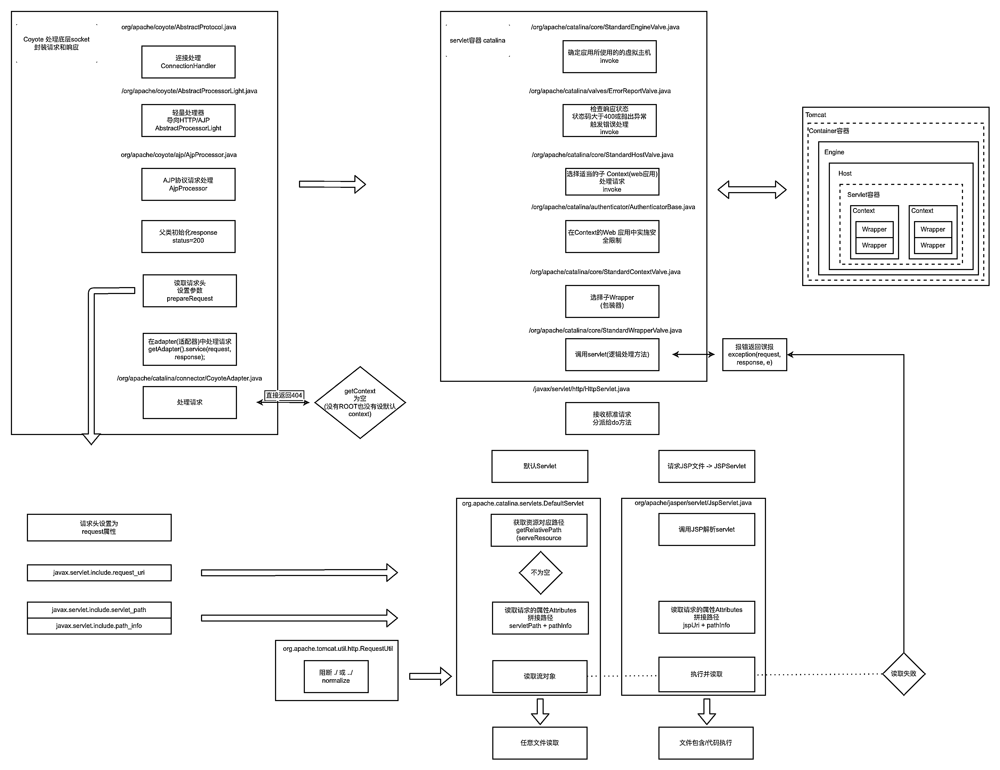

# Tomcat AJP ghostcat (CVE-2020-1938) 图解分析 - huim - 博客园

> 原文：[`www.cnblogs.com/huim/p/16617359.html`](https://www.cnblogs.com/huim/p/16617359.html)

简述：request 属性可控，导致可控制实际 tomcat 实际读取的路径，任意读取 webapp 下内容(默认解析器处理 JSP) 或任意执行非 JSP 文件(JSP 解析器处理非 JSP 文件)

需求与实现角度：
在 Tomcat AJP Ghostcat 漏洞（CVE-2020-1938）中，攻击者可以通过发送特定的 AJP 请求，将请求参数中的 req_attribute 设置为 javax.servlet.include.request_uri，从而读取和篡改 Web 应用程序中的敏感文件，甚至执行任意代码。

这个漏洞的原因是 AJP 协议的设计缺陷。在 AJP 协议中，请求参数是以二进制格式传输的。在处理 AJP 请求时，Tomcat 会将请求参数解析为一个名值对的列表，并将其转换为 HTTP 请求的属性，以便应用服务器更好处理请求。

由于 Tomcat 没有对 req_attribute 参数进行足够的验证，攻击者可以将其设置为 javax.servlet.include.request_uri，并在 Web 应用程序中实现任意文件读取和代码执行。这是因为在 Web 应用程序中，javax.servlet.include.request_uri 属性可以用于指定包含当前请求的 URI。

新版修复：
禁用 AJP 协议中的 req_attribute 参数

> 上周扫描到一个 Tomcat AJP，无法利用。
> 具体扫描方法是设置自定义属性。
> 但是目标机器删掉了 ROOT 文件夹也没有设置 context。
> 所以研究一下 Tomcat AJP，顺带看看 Tomcat 源码，找找利用或优化方法

> 直接读取文件：读取不到->500 报错
> 设置自定义属性：404 报错
> 没有 ROOT：走不到设置路径，404 报错
> 优化还是读一下具体的文件吧

> 参考链接:
> 分析: [`www.buaq.net/go-22691.html`](https://www.buaq.net/go-22691.html)
> servlet 选择: [`www.cnblogs.com/123-shen/p/11445832.html`](https://www.cnblogs.com/123-shen/p/11445832.html)
> servlet 和 servlet 容器: [`blog.csdn.net/baidu_36583119/article/details/79642407`](https://blog.csdn.net/baidu_36583119/article/details/79642407)
> tomcat 核心组件结构图: [`www.cnblogs.com/cenyu/p/11072543.html`](https://www.cnblogs.com/cenyu/p/11072543.html)
> 配置 ROOT 目录: [`www.manongjc.com/detail/50-hjbmkeakvliiynm.html`](http://www.manongjc.com/detail/50-hjbmkeakvliiynm.html)
> context 元素详解: [`www.cnblogs.com/shiyangxt/articles/1257052.html`](https://www.cnblogs.com/shiyangxt/articles/1257052.html)
> idea