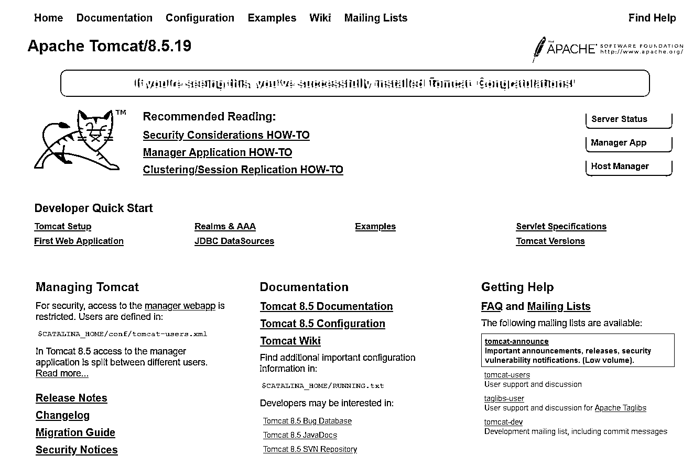
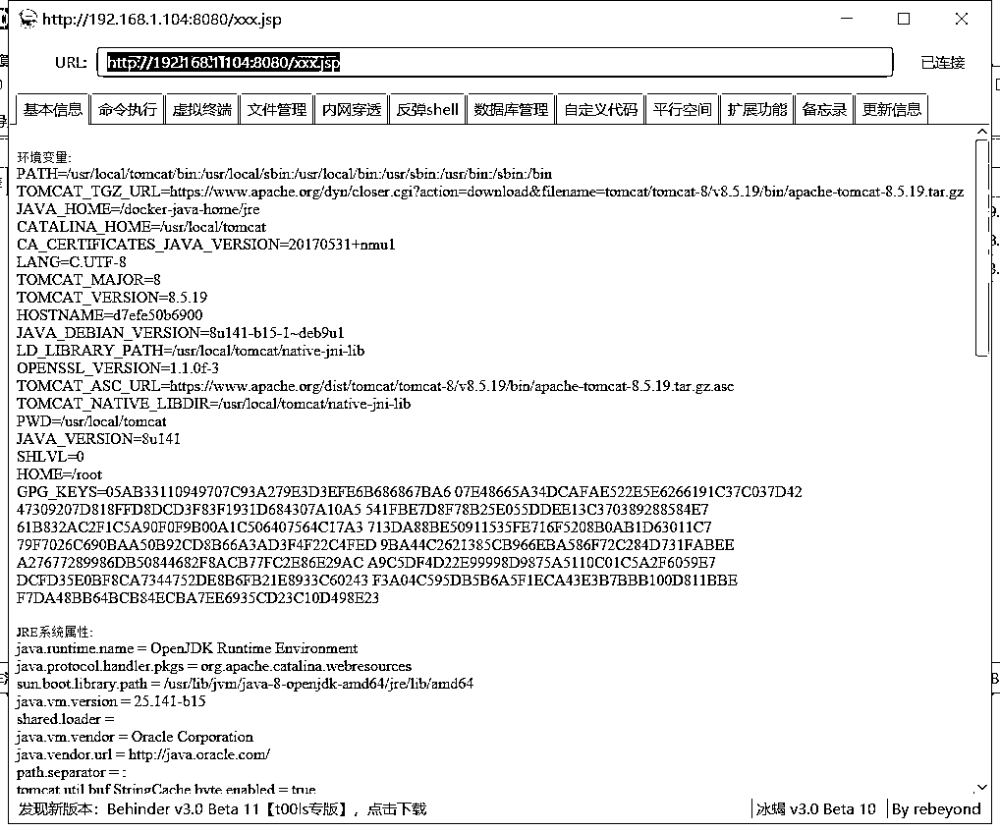

# Tomcat PUT 方法任意写文件漏洞（CVE-2017-12615） - oldliutou - 博客园

> 原文：[`www.cnblogs.com/oldliutou/p/15759868.html`](https://www.cnblogs.com/oldliutou/p/15759868.html)

Tomcat 版本：8.5.19

# 环境搭建

> docker-compose build
> docker-compose up -d

运行完成后访问 [`your-ip:8080`](http://your-ip:8080) 即可看到 Tomcat 的 Example 页面。


# 漏洞描述

> 当 Tomcat 运行在 Windows 操作系统时，且启用了 HTTP PUT 请求方法（例如，将 readonly 初始化参数由默认值设置为 false），攻击者将有可能可通过精心构造的攻击请求数据包向服务器上传包含任意代码的 JSP 文件，JSP 文件中的恶意代码将能被服务器执行。导致服务器上的数据泄露或获取服务器权限。

# 漏洞原理

> 当在 Tomcat 的 conf（配置目录下）/web.xml 配置文件中添加 readonly 设置为 false 时，将导致该漏洞产生，（需要允许 put 请求）
> 漏洞本质 Tomcat 配置了可写（readonly=false），导致我们可以往服务器写文件：

```
<servlet>
    <servlet-name>default</servlet-name>
    <servlet-class>org.apache.catalina.servlets.DefaultServlet</servlet-class>
    <init-param>
        <param-name>debug</param-name>
        <param-value>0</param-value>
    </init-param>
    <init-param>
        <param-name>listings</param-name>
        <param-value>false</param-value>
    </init-param>
    <init-param>
        <param-name>readonly</param-name>
        <param-value>false</param-value>
    </init-param>
    <load-on-startup>1</load-on-startup>
</servlet> 
```

虽然 Tomcat 对文件后缀有一定检测（不能直接写 jsp），但我们使用一些文件系统的特性（如 Linux 下可用`/`）来绕过了限制。

# 漏洞复现

**支持三种上传绕过方式 默认使用 put 加文件名是失败的 需要绕过**

> PUT /xxx.jsp%20
> PUT /xxx.jsp::$DATA
> PUT /xxx.jsp/


**冰蝎连接成功**


# 修复

设置 readonly 为 true