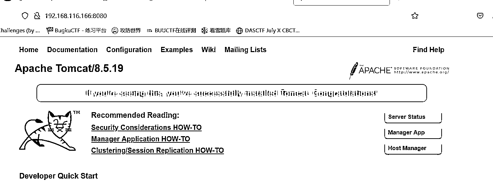
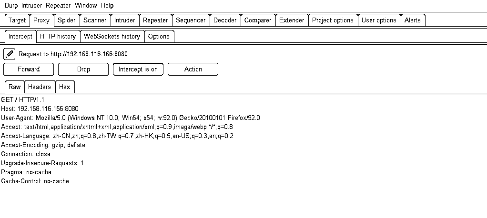
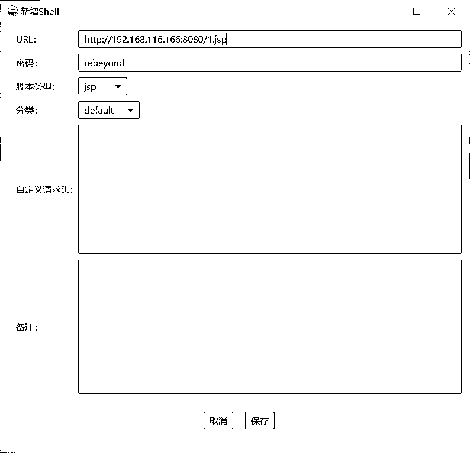
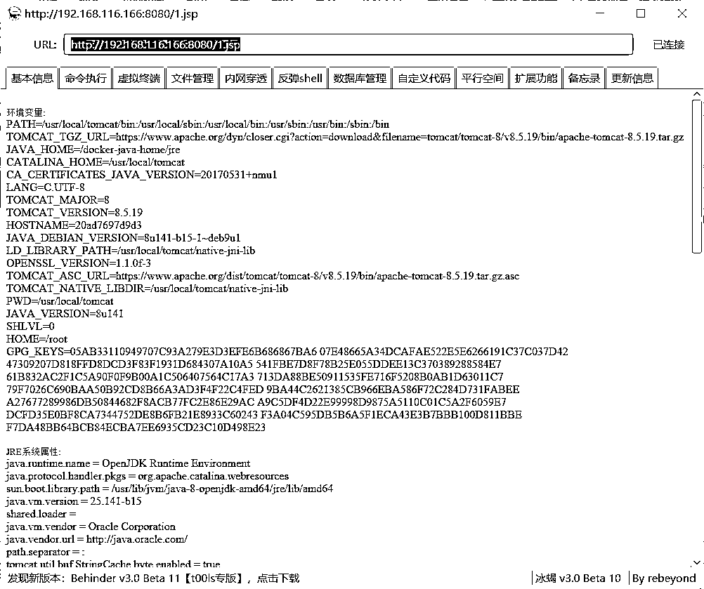

# Tomcat PUT 方法任意写文件漏洞（CVE-2017-12615） - 学安全的小白 - 博客园

> 原文：[`www.cnblogs.com/pursue-security/p/15310506.html`](https://www.cnblogs.com/pursue-security/p/15310506.html)

# Tomcat PUT 方法任意写文件漏洞（CVE-2017-12615）

影响版本：8.5.19

漏洞本质 Tomcat 配置了可写（readonly=false），导致我们可以往服务器写文件：

```
``` <servlet>
    <servlet-name>default</servlet-name>
    <servlet-class>org.apache.catalina.servlets.DefaultServlet</servlet-class>
    <init-param>
        <param-name>debug</param-name>
        <param-value>0</param-value>
    </init-param>
    <init-param>
        <param-name>listings</param-name>
        <param-value>false</param-value>
    </init-param>
    <init-param>
        <param-name>readonly</param-name>
        <param-value>false</param-value>
    </init-param>
    <load-on-startup>1</load-on-startup>
</servlet> ```
```

进入 vulhub 靶场，启动环境，测试环境是否正常



 使用 bp 拦截此页面



修改数据包


使用浏览器访问 1.jsp 文件

 

将冰蝎中的 shell.jsp 文件内容上传到服务器

 

 

 使用冰蝎进行连接



 

 成功 getshell。