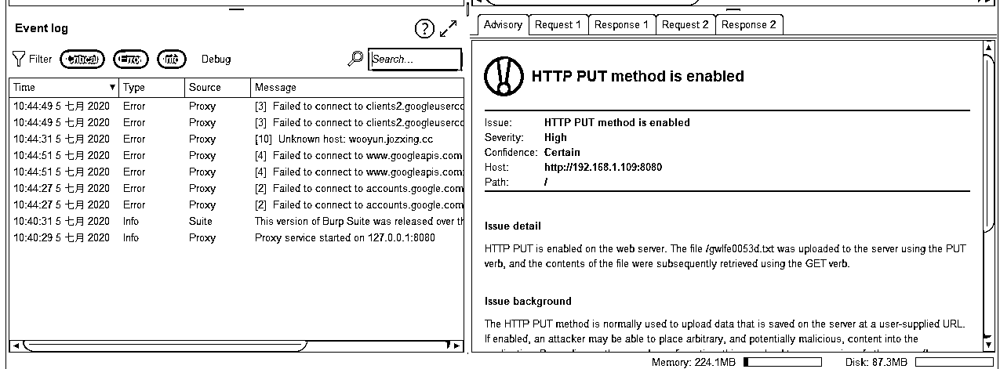
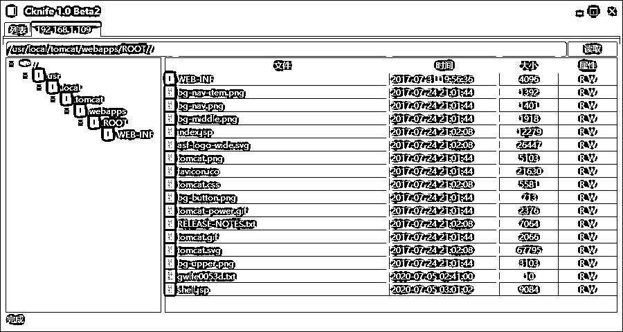

# Tomcat 任意文件上传漏洞（CVE-2017-12615） - 大雁 blogs - 博客园

> 原文：[`www.cnblogs.com/dyanbk/p/13276526.html`](https://www.cnblogs.com/dyanbk/p/13276526.html)

## 0x01 简介

2017 年 9 月 19 日，Apache Tomcat 官方确认并修复了两个高危漏洞，漏洞 CVE 编号:CVE-2017-12615 和 CVE-2017-12616,其中 远程代码执行漏洞（CVE-2017-12615） 影响： Apache Tomcat 7.0.0 - 7.0.79（7.0.81 修复不完全）

当 Tomcat 运行在 Windows 主机上，且启用了 HTTP PUT 请求方法（例如，将 readonly 初始化参数由默认值设置为 false），攻击者将有可能可通过精心构造的攻击请求向服务器上传包含任意代码的 JSP 文件。之后，JSP 件中的代码将能被服务器执行。

## 0x02 影响版本

Apache Tomcat 7.0.0 - 7.0.81

## 0x03 漏洞原理

在 tomcat 中启用 put 方法会导致任意文件可以上传，从而导致服务器权限被获取。

```
<!--   readonly            Is this context "read only", so HTTP           -->
<init-param><param-name>readonly</param-name><param-value>false</param-value></init-param> 
```

## 0x04 漏洞复现

### burp 检测：



### 上传后门文件：


### C 刀连接




## 0x05 漏洞修复

1.  配置 conf/web.xml 中 readonly 值为 True 或注释参数，禁止使用 PUT 方法并重启 tomcat。

    ```
     <!--   readonly            Is this context "read only", so HTTP           -->
    <init-param><param-name>readonly</param-name><param-value>true</param-value></init-param> 
    ```

2.  根据官方补丁升级最新版本。