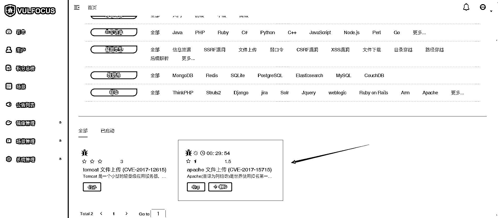
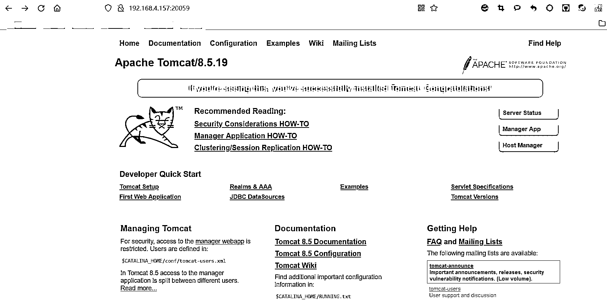
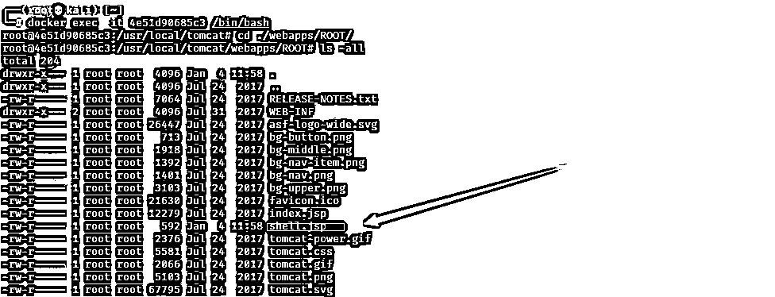

# Tomcat 远程代码执行漏洞（CVE-2017-12615） - kalibb - 博客园

> 原文：[`www.cnblogs.com/lzkalislw/p/17026031.html`](https://www.cnblogs.com/lzkalislw/p/17026031.html)

**1.漏洞描述**

　　当 Tomcat 运行在 Windows 操作系统时，且启用了 HTTP PUT 请求方法（例如，将 readonly 初始化参数 由默认值设置为 false），

攻击者将有可能可通过精心构造的攻击请求数据包向服务器上传包含任意代 码的 JSP 文件，JSP 文件中的恶意代码将能被服务器执行。

导致服务器上的数据泄露或获取服务器权限。

**2.漏洞原理**

　　当在 Tomcat 的 conf（配置目录下）/web.xml 配置文件中添加 readonly 设置为 false 时，将导致该漏洞产 生，（需要允许 put 请求）

****

**3.影响范围**

CVE-2017-12615 影响范围： Apache Tomcat 7.0.0 - 7.0.79 Apache Tomcat/8.5.19

**4.漏洞复现**

4.1 开启环境****

 　　4.2 支持三种上传绕过方式 默认使用 put 加文件名是失败的 需要绕过

　　　　PUT /shell.jsp%20

　　　　PUT /shell.jsp::$DATA

　　　　PUT /shell.jsp/

　　4.3 burp 抓包,进行拦截，上传 jsp 马

****

　　　4.4 成功将马上传到服务器上

 

** 5.漏洞修复建议**

　　设置 readonly 未 true