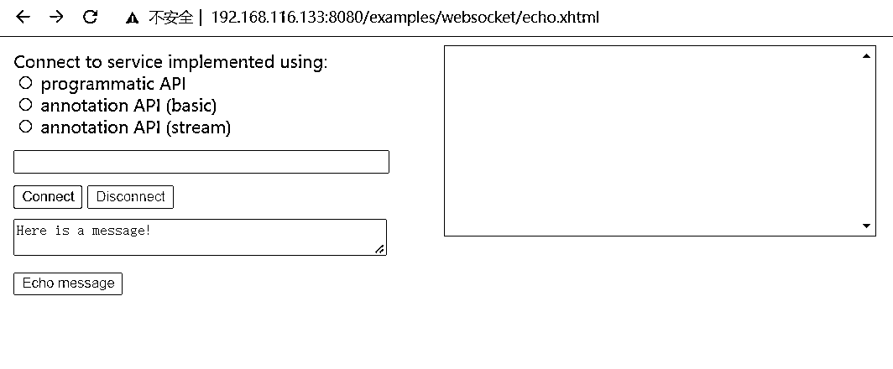

# Tomcat 拒绝服务攻击（CVE-2020-13935） - 学安全的小白 - 博客园

> 原文：[`www.cnblogs.com/pursue-security/p/17029164.html`](https://www.cnblogs.com/pursue-security/p/17029164.html)

漏洞简介 CVE-2020-13935Apache Tomcat 是美国阿帕奇（Apache）基金会的一款轻量级 Web 应用服务器。该程序实现了对 Servlet 和 JavaServer Page（JSP）的支持。 Apache Tomcat 中的 WebSocket 存在安全漏洞，该漏洞源于程序没有正确验证 payload 的长度。攻击者可利用该漏洞造成拒绝服务（无限循环）。影响版本 Apache Tomcat 10.0.0-M1-10.0.0-M6Apache Tomcat 9.0.0.M1-9.0.36Apache Tomcat 8.5.0-8.5.56Apache Tomcat 7.0.27-7.0.104 漏洞复现此漏洞使用 vulhub 上的 CVE-2020-1938 漏洞环境打开浏览器，在地址栏输入[`IPaddress:8080/examples/websocket/echo.xhtml`](http://IPaddress:8080/examples/websocket/echo.xhtml)查看是否可以访问，如果不可以访问，则说明该文件被删掉了，那就无法进行漏洞利用。在服务器上使用 top -bn 1 -i -c 命令，可以看到 CPU 占有率为 0.0在 kali 上使用 EXP 攻击使用此 EXP 前需要先编译再攻击 go env -w GOPROXY=[`goproxy.cn`](https://goproxy.cn) //修改 proxy 地址 go build //编译 go 程序，输出 tcdos.exe

 