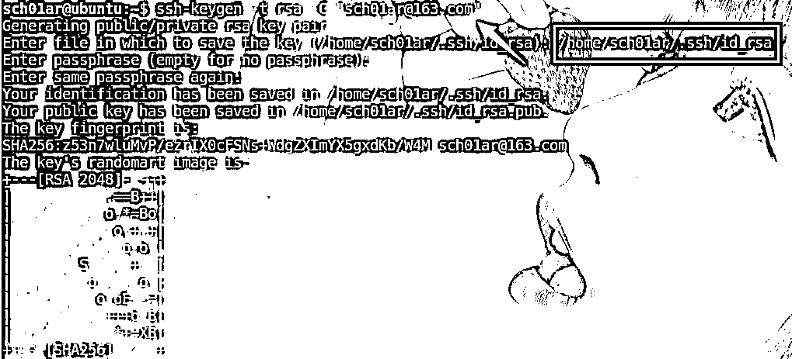
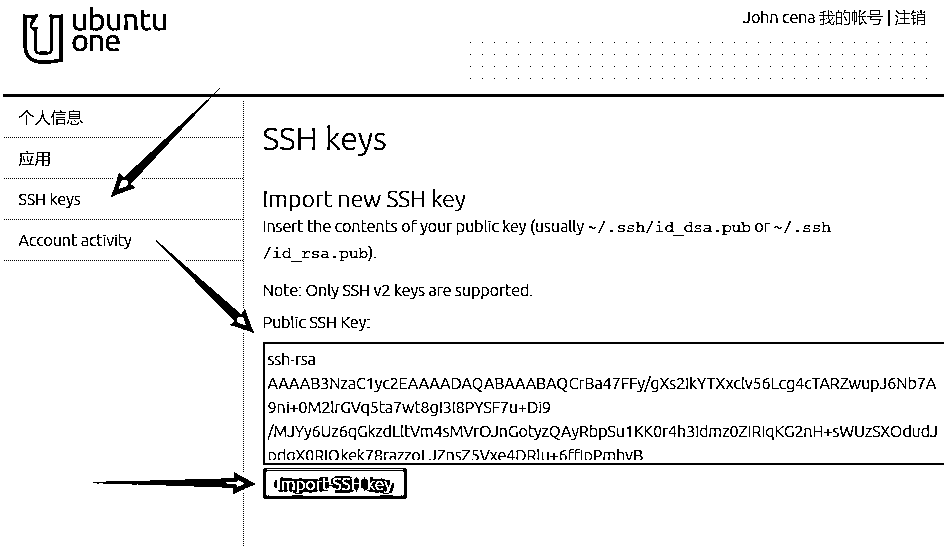
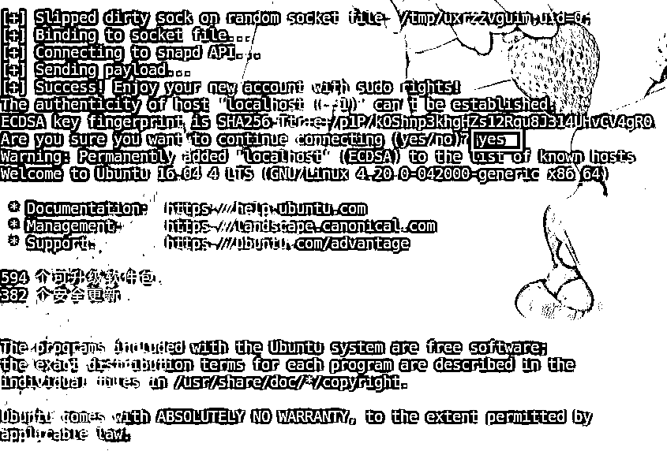
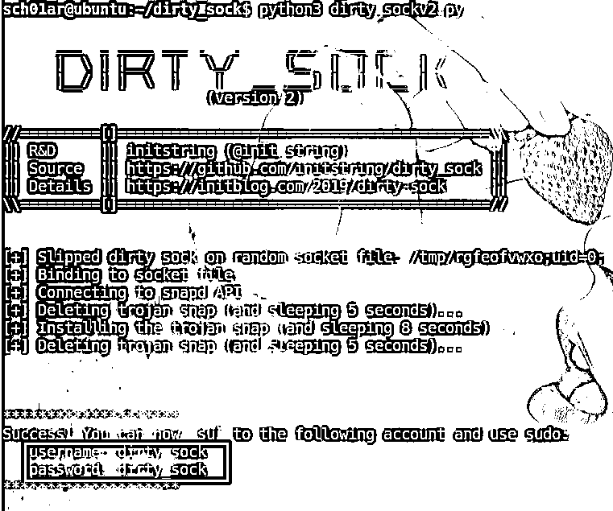

# Ubuntu 提权漏洞(CVE-2019-7304)复现 - Sch01aR# - 博客园

> 原文：[`www.cnblogs.com/sch01ar/p/10453368.html`](https://www.cnblogs.com/sch01ar/p/10453368.html)

# 漏洞描述：

Ubuntu 版本：

Ubuntu 18.10

Ubuntu 18.04 LTS

Ubuntu 16.04 LTS

Ubuntu 14.04 LTS


2.28 < snapd < 2.37 会存在该漏洞

Poc Github：https://github.com/initstring/dirty_sock

# #1

注册并登陆，[`login.ubuntu.com/`](https://login.ubuntu.com/)在 Ubuntu 上，生成密钥

```
ssh-keygen -t rsa -C "your_email@example.com"

```



查看公钥


将公钥复制到网站上



接下来执行 poc

```
python3 ./dirty_sockv1.py -u "sch01ar@163.com" -k "../.ssh/id_rsa"

```



执行完之后 sch01ar 被修改为 Ubuntu 上的用户名

接着切换为 root 用户

```
sudo -i

```

 

切换成 root 用户时不需要输入密码

# #2

直接运行脚本

```
python3 dirty_sockv2.py

```



执行完会生成一个 dirty_sock 的用户，密码也是这个