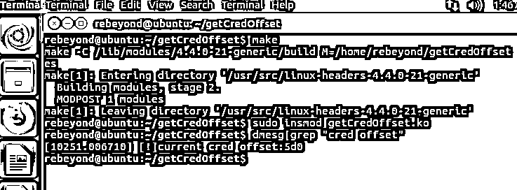

# Ubuntu 本地提权适配不同小版本内核（CVE-2017-16995） - rebeyond - 博客园

> 原文：[`www.cnblogs.com/rebeyond/p/8603056.html`](https://www.cnblogs.com/rebeyond/p/8603056.html)

朋友在执行的时候说有的会出现提权不成功，内核 crash 掉的现象。因为 cred 结构体的偏移量可能因为内核版本不同、内核编译选项不同而出现差异，作者给的 exp 偏移量是写死的，所以 exp 里面对应的偏移地址也要改一下。以下方法可以算出不同内核版本默认编译选项下的 cred 偏移地址：

1.Makefile

```
obj-m += getCredOffset.o

all:
        make -C /lib/modules/$(shell uname -r)/build M=$(PWD) modules

clean:
        make -C /lib/modules/$(shell uname -r)/build M=$(PWD) clean
```

2.getCredOffset.c

```
#include <linux/kernel.h> #include <linux/module.h> #include <linux/init.h> #include <linux/slab.h> #include <linux/kthread.h> #include <linux/errno.h> #include <linux/types.h>
    int init_module()

    {
        printk("[!]current cred offset:%x\n",(unsigned long)&(current->cred)-(unsigned long)current); return 0;
    } void cleanup_module()
    {
        printk("module cleanup\n");
    }
```

把上面俩文件扔到一目录里，make 一下，生成 getCredOffset.ko，执行 insmod getCredOffset.ko，然后新开一个命令行执行 dmesg | grep "cred offset"，OK 了，把得到的 offset 替换到 exp 里面。

前面说了，这个适合默认的内核编译选项，这样才能在本地环境中的 root 权限下 insmod，至于其他情况，只能通过其他方法来确定 cred 偏移量了。

这个漏洞是个任意地址读写漏洞，所以也可以在确定 task_struct 地址之后，以当前用户的 uid 为特征去搜索内存，毕竟 cred 离 task_struct 不远。

 