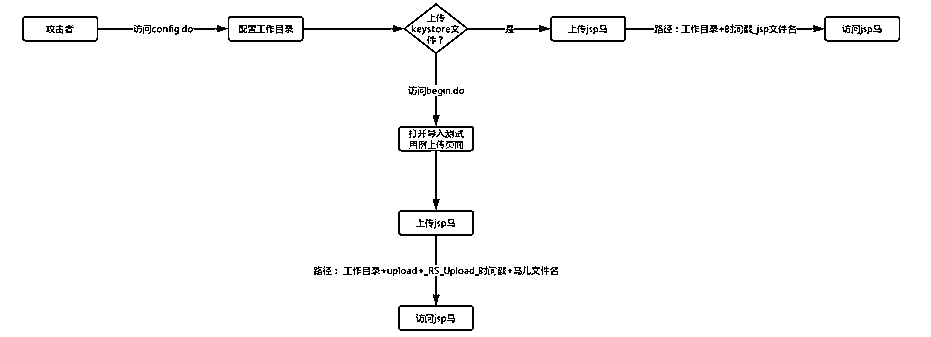
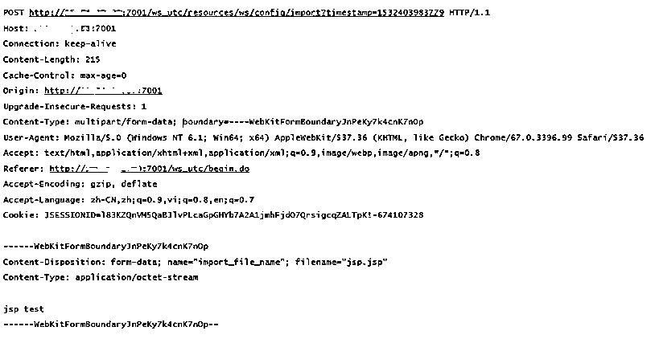
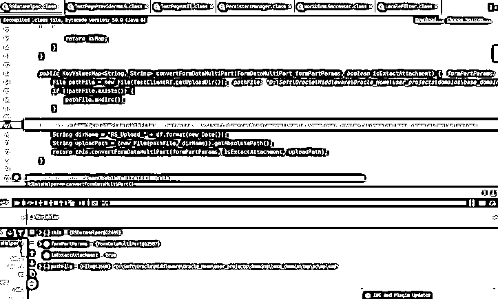
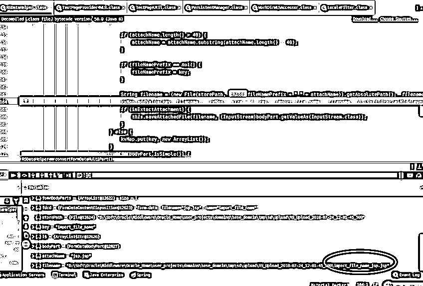
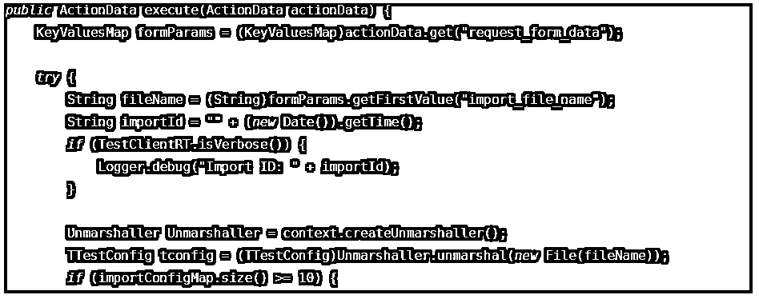
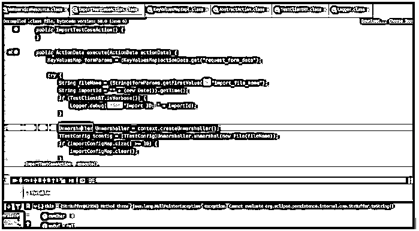
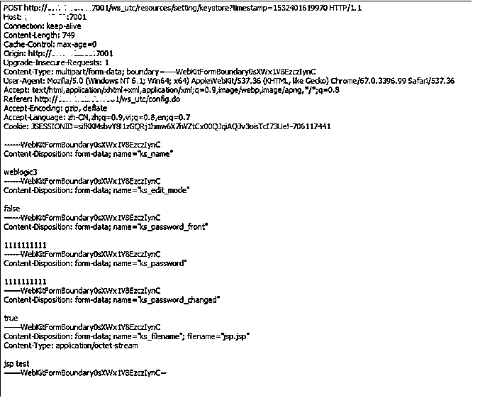
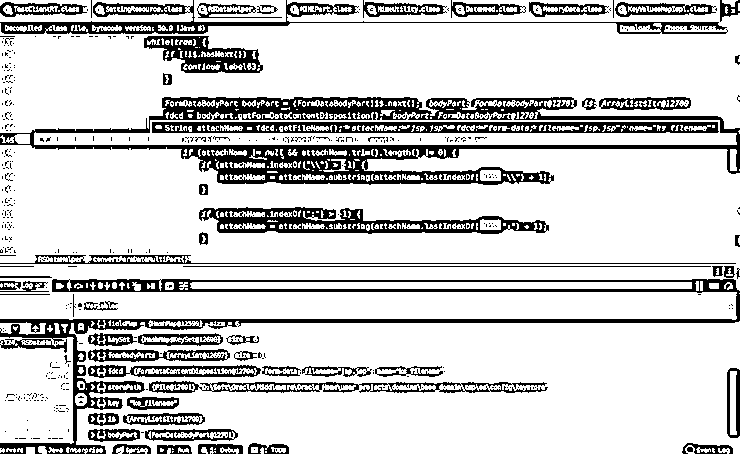
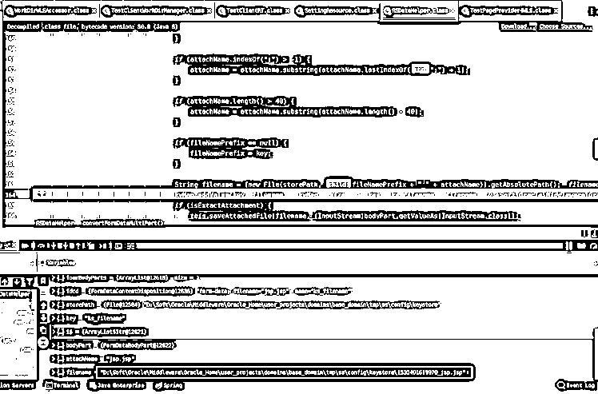

# WebLogic 两处任意文件上传漏洞动态分析（CVE-2018-2894） - Ivan1ee - 博客园

> 原文：[`www.cnblogs.com/Ivan1ee/p/10190776.html`](https://www.cnblogs.com/Ivan1ee/p/10190776.html)

# 0x01 前言

CNCERT 前几天发公告称发现 Oracle 公司出品的基于 JavaEE 结构的中间件 WebLogic 产品存在一个远程上传漏洞，并得到了厂商的确认，危害程度评分高达 9.8 分。鉴于厂商已进行了安全修复，笔者对该漏洞进行了一次分析。WebLogic 管理端未授权的两个页面存在任意上传 getshell 漏洞，可直接获取权限。两个页面分别为/ws_utc/begin.do，/ws_utc/config.do；漏洞的影响范围 Oracle WebLogic Server，版本 10.3.6.0，12.1.3.0，12.2.1.2，12.2.1.3；相关链接： [`www.oracle.com/technetwork/security-advisory/cpujul2018-4258247.html#AppendixFMW`](http://www.oracle.com/technetwork/security-advisory/cpujul2018-4258247.html#AppendixFMW)  , 下文笔者从这两个文件入手来系统调试跟踪找出漏洞产生的原理和位置。

# 0x02 漏洞流程

笔者首先访问了一下 [`IP/ws_utc/config.do`](http://ip/ws_utc/config.do)  并且将默认的目录 WSTestPageWorkDir 修改了为 user_projects\domains\base_domain\tmp\sd\  如下图

工作台设置一个新的目录后，weblogic 会将原来目录下的子目录和文件一起转移到新设定的目录下，但旧的目录依然保留。因为不是重点，笔者对这块的分析就此略过。笔者从攻击者的维度简单的画了一个草图，最初攻击者肯定需要配置工作目录，因为默认的工作目录在 URL 访问的时候不可达，然后攻击者考虑是从 config.do 页面上传 keystore 文件还是从 begin.do 上传，最终都是成功上传小马，只是小马的访问格式和路径不尽相同。如下图

如果要从原理上彻底搞清楚 weblogic 漏洞产生的过程还需要看下图，简单的描述一下，攻击者开始攻击后，Weblogic 在服务端做了很多的判断，如果设定了新的工作目录，那么程序会自动拷贝所有旧目录下的子目录和文件到新的设定目录里，并且设定新的目录作为工作目录，如果攻击者通过 begin.do 上传的话，Weblogic 在服务端会判断有没有 upload 目录，如果不存在会自动创建，再接着在 upload 目录下创建 Rs_Upload_ 格式化后的作为目录名，紧接着获取到 import_file_name 字段名作为后续的文件名拼接的一部分；如果通过 config.do 上传的话就获取 GET 请求中的 timestamp 参数作为后续 webshell 的文件名中的一部分，还是看下图吧：

# 0x03 begin.do 页面上传漏洞

首先在 IDE 里搭建好 WebLogic 环境，把应用跑起来后点击页面右上方的文件夹按钮，这里实现的是一个导入的功能

 

 选择任意文件上传，笔者选择上传 jsp 文件

抓取数据包可以看到其实真正存在上传漏洞的地址是

[`IP:7001/ws_utc/resources/ws/config/import?timestamp=1532403983779`](http://ip:7001/ws_utc/resources/ws/config/import?timestamp=1532403983779)

因为是漏洞复现和分析，笔者一边上传的时候就一边把数据包抓取下来，得到下图的 HTTP

这段没什么可说的就是一个简单的上传数据流，表单字段 import_file_name 是关键值，从产品防御的角度来看检测它们也是关键的特征之一。

接下来就需要在 IDE 里动态定位到漏洞的触发点，因为 weblogic 大多数漏洞都和 T3 协议有关联，根据之前分析过的 weblogic 漏洞定位的调试断点是在 com.bea.core.weblogic.rmi.client_4.0.0.0.jar 包里，多次调试后一步步跳转到了漏洞触发的核心包

并且查到了对应的触发漏洞类名的位置 ： \com\oracle\webservices\testclient\ws\util\RSDataHelper.class

定位到的方法 convertFormDataMultiPart，代码如下：

代码中检查了当前工作目录下是否存在 upload 目录，如果没有的话则创建，并且调用了 cleanObsoleteFile 方法强制遍历了一次目录中所有的文件，并且发现文件就删除掉，调试过程如下图

 

再创建了一个以字符串 Rs_Upload_ 打头的加格式化后的时间命名的目录，并且作为上传文件保存的目录。

接下来程序获得了上传的表单的 form-data , 经过循环遍历获取了所有的表单字段和对应的 value，数据做两块存储，一块保存在 kvMap 集合中、获取的附件通过 saveAttacheFile 方法保存到磁盘中，代码如下

下图红圈处是拼接后的物理路径名

接着追踪调试到 execute 方法，位于 ImportTestCaseAction.class 类

\user_projects\domains\base_domain\servers\AdminServer\tmp\_WL_internal\com.oracle.webservices.wls.ws-testclient-app-wls_12.1.3\cmprq0\war\WEB-INF\lib\ws-testpage-impl.jar!\com\oracle\webservices\testclient\ws\action\ImportTestCaseAction.class

由于笔者导入的文件格式以及数据并非 weblogic 能处理的，所以程序在 context.createUnmarshaller 方法处抛出空指针异常的错误，这就导致了上传成功后 Response 的状态码是 500，这也可以作为防御产品检测的特征之一。动态调试异常如下图

到此 begin.do 页面未授权访问引起的任意文件上传漏洞已经很明朗，防御的策略可以检测表单字段

# 0x04 config.do 页面上传漏洞

访问 [`IP:7001/ws_utc/config.do`](http://ip:7001/ws_utc/config.do) 页面后点击左侧的“安全”菜单，添加一个 Keystore，任意设置名字和密码，当然文件也是任意格式上传，这里真的很随意。

 

点击提交后，抓取触发地址： [`IP/ws_utc/resources/setting/keystore?timestamp=1532400069848`](http://ip/ws_utc/resources/setting/keystore?timestamp=1532400069848) ; 抓取的包如下

和之前的套路一样，上传的时候就已经打开了 IDE 调试功能，断点后还是定位到 RSDataHelper.class 文件，如下图

这次获取的表单字段是 ks_filename，值得收藏，加入特征检测范畴内；再跟进看下关键的 shell 生成那一步

 

上传后的 shell 位于工作台配置的目录下的/config/keystore/目录中，文件名的格式相对来说简单，采用了 POST 请求中 URL 地址上携带的参数 timestamp 的值加上下划线拼接起来的文件名，让笔者大跌眼镜的是 weblogic 作为知名软件提供商存在这样低级的漏洞实在匪夷所思，再加上其一系列的反序列化绕过漏洞，只能说 weblogic 的产品能不用就不用，实在不行少用为妙。

# 0x05 防御措施

1.  设置 Config.do、begin.do 页面登录授权后访问；
2.  IPS 等防御产品可以加入相应的特征；
3.  升级到官方最新版本；

# 0x06 参考链接

[`www.secrss.com/articles/4008`](https://www.secrss.com/articles/4008)

[`www.oracle.com/technetwork/security-advisory/cpujul2018-4258247.html#AppendixFMW`](http://www.oracle.com/technetwork/security-advisory/cpujul2018-4258247.html#AppendixFMW)