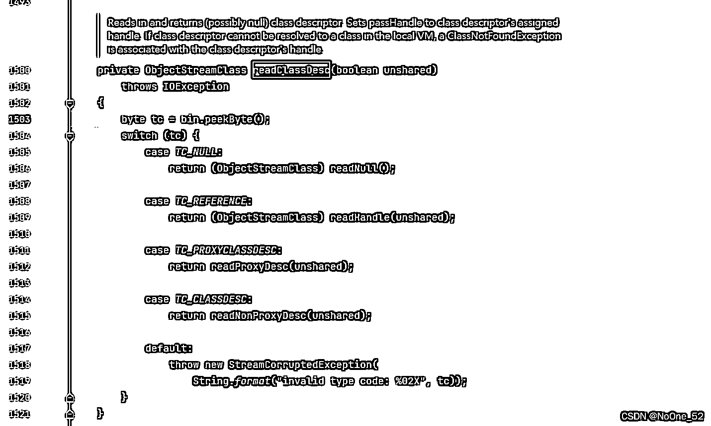
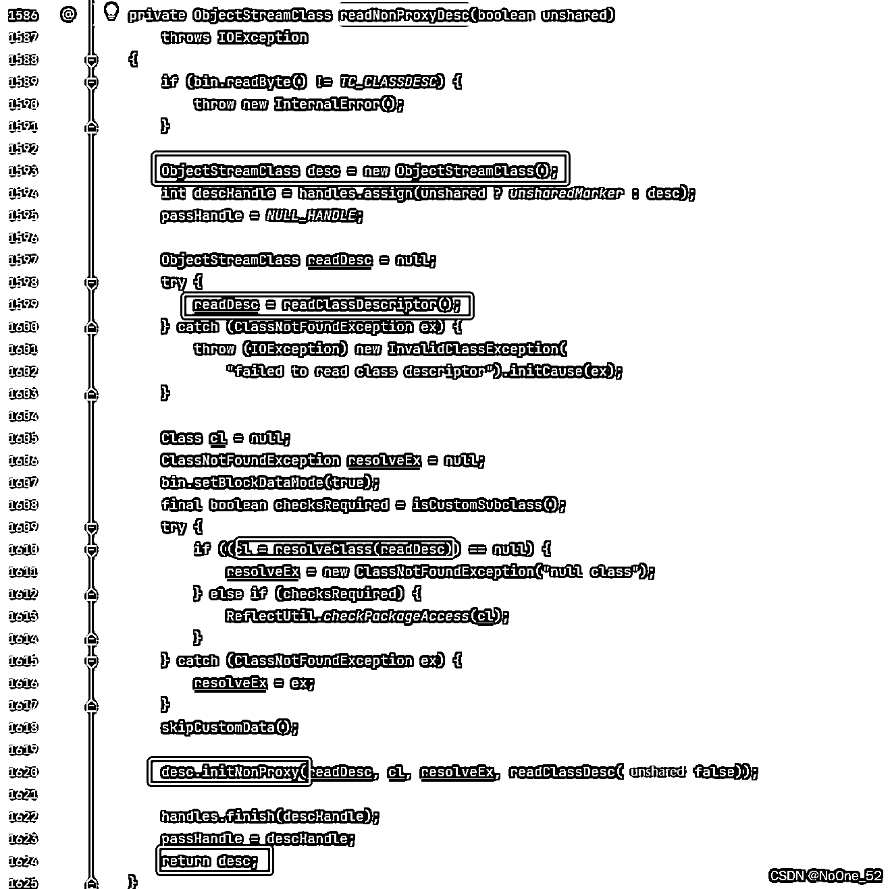
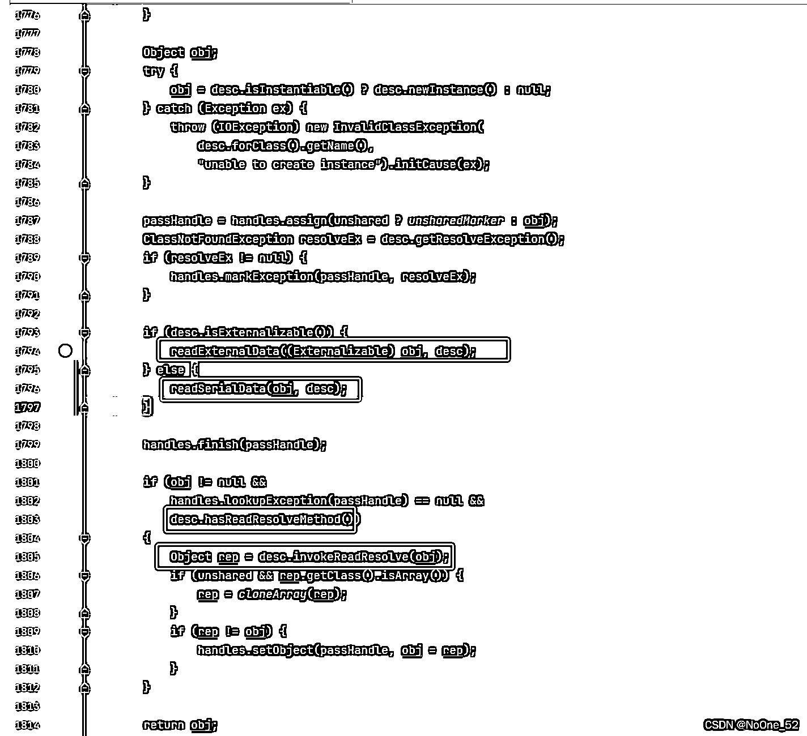
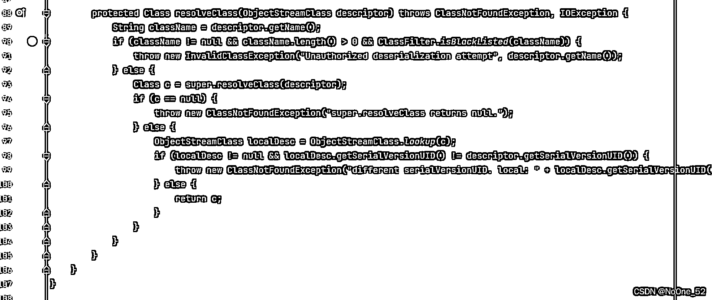
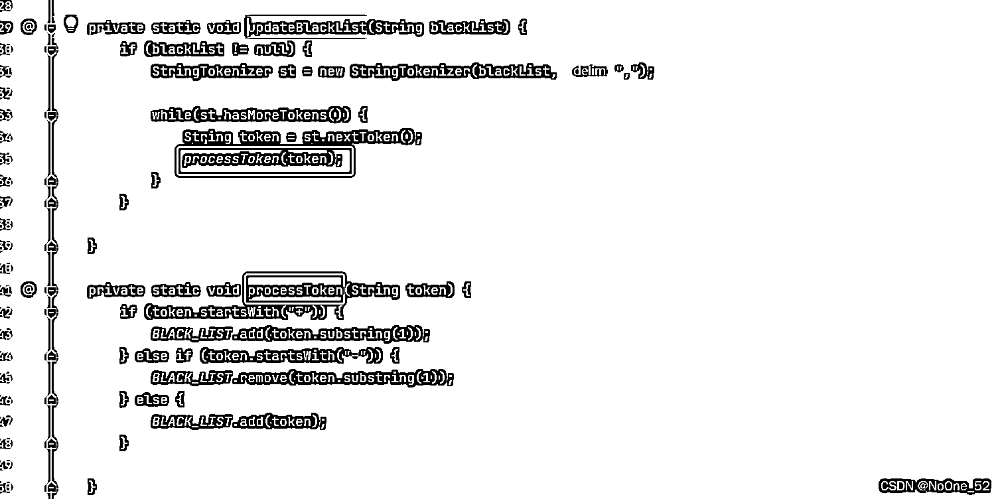
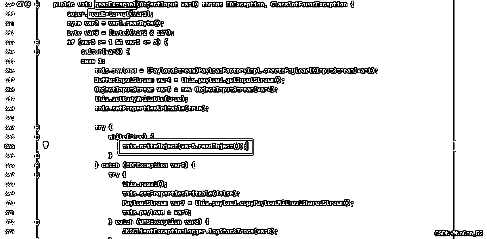
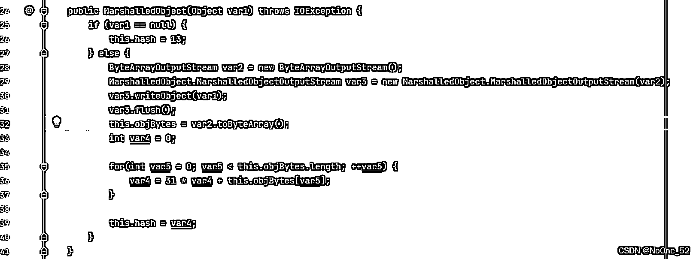

# Weblogic 处理流量中的 java 反序列化数据的流程(CVE-2015-4852、CVE-2016-0638、CVE-2016-3510) - noone52 - 博客园

> 原文：[`www.cnblogs.com/MoZiYa/p/16690194.html`](https://www.cnblogs.com/MoZiYa/p/16690194.html)

# 前言

想要搞明白 weblogicT3 协议中的反序列化和后续的反序列化绕过，就得先需要了解 weblogic 如何处理 T3 协议中的反序列化数据，了解流程之后再去分析 CVE-2015-4852、CVE-2016-0638、CVE-2016-3510 这些漏洞，会事半功倍。

# weblogic 处理反序列化的流程

首先我们看一张流程图，这是 weblogic 处理反序列化数据的时候的函数调用图


```
readObject()
			readObject0()
				readOrdinaryObject()
					readClassDesc()
						readNonProxyDesc()		resolveClass()				Class.forName()
						readProxyDesc()			resolveProxyClass()			Proxy.getProxyClass() 
```

截图比较粗糙，其起始位置是我们熟悉的 ObjectInputStream 类中的 readObject 方法。下面是一层层调用的函数，在红色框中的 resolveClass 函数我们很熟悉了，在上篇文章说过，就是 weblogic 反序列化时重写了这个 resolveClass 方法，由于只是继承了父类的 resolveClass 方法，造成了 CVE-2015-4852 漏洞。

好了我们接着说数据流向：
weblogic 获得(7001 端口)t3 协议的反序列化数据，经过一个个函数的处理来到 readClassDesc 函数，此时有两个流向(其实不止,下面会讲到)，两个分支最后都会获取反序列化数据的类对象。那么这个 readClassDesc 是什么呢？

# readClassDesc 是什么

先来看一看 readClassDesc 函数

上面绿色的官方解释是：读入并返回（可能为 null）类描述符。 将 passHandle 设置为类描述符的分配句柄。 如果类描述符无法解析为本地 VM 中的类，则 ClassNotFoundException 与类描述符的句柄相关联。此翻译来自 Google 翻译，哈哈。

官方注释比较生涩，我们知道 Java 序列化的时候，**java 序列化数据在流量传输，并不是随随便便杂乱无章的，序列化数据的格式是要遵循序列化流协议。**

序列化流协议定义了字节流中传输的对象的基本结构。(包括类，字段，写入的数据等)
字节流中对象的表示可以用一定的语法格式来描述。

比如说在字节流中传递的序列化数据中，字符串有字符串类型的特定格式、对象有对象类型的特定格式、类结构有着类结构。而 TC_STRING、TC_OBJECT、TC_CLASSDESC 则是他们的描述符，他们标识了接下来这段字节流中的数据是什么类型格式的。

这样我们就很容易明白上图中的 switch 语句中各个 case 后面字段的意思了，通过字节流中的描述符来确定传递的数据类型，并交给对应方法去处理。

上面说是数据到 readClassDesc 函数之后，会有两个流向，为什么是两个呢？为什么上面说其实不止两个 还有很多其他的流向呢？

**Question1 不止两个还有很多其他的流向**
从我们截图的函数可以看出，switch 语句中有标识符的有四个，这我很明显的回答了问题。

```
TC_NULL 描述符表示空对象引用
TC_REFERENCE 描述符表示引用已写入流的对象
TC_PROXYCLASSDESC 是新的代理类描述符
TC_CLASSDESC 是新的类描述符 
```

**Question2 为什么只有两个流向**
weblogic 是通过序列化我们发送的恶意类，才造成的漏洞，所以我们重点关注标识符是有关类的描述符，所以就只有两个流向。

跟进 readNonProxyDesc 函数：


readNonPorxyDesc 函数主要做了什么呢？
1：readClassDescriptor()从流量中获取序列化类的 ObjectStreamClass 并赋值给 readDesc 变量
2：把 readDesc 变量当参数传入 resolveClass 函数，结果赋值 cl 变量(获取反序列化数据类名)
3：把 ObjectStreamClass 流(readDesc)和 Class 类对象传入 initNonProxy 方法，初始化并赋给 desc.
4：将 ObjectStreamClass 类型的 desc 变量返回给 readNonProxyDesc 函数。


readNonProxyDesc 将会传递给 readClassDesc，进而传递给 readOrdinaryObject 函数。

接着就是核心部分 readOrdinaryObject 函数：

这是部分截图，weblogic 序列化的关键在于 readOrdinaryObject 尝试调用类对象中的 readObject、readResolve、readExternal 等方法。这些方法在上图中都已截图，感兴趣的可自行跟进。
下面看一张 readOrdinaryObject 调用各个函数的流程图：

在 Weblogic 从流量中的序列化类字节段通过 readClassDesc-readNonProxyDesc-resolveClass 获取到普通类序列化数据的类对象后，程序依次尝试调用类对象中的 readObject、readResolve、readExternal 等方法。

在这里提前透露下，CVE-2015-4852、CVE-2016-0638、CVE-2016-3510 这三个漏洞，所利用的恰好依次是恶意类”sun.reflect.annotation.AnnotationInvocationHandler”中的 readObject、”weblogic.jms.common.StreamMessageImpl”中的 readExternal、以及”weblogic.corba.utils.MarshalledObject”中的 readResolve 方法

试想一下这个场景：在没有任何防护或防护不当的时候，攻击者通过流量中传入恶意类的序列化数据，weblogic 将流量中的序列化数据还原为其对应的 Class 对象，并尝试执行恶意类中的 readObject、readResolve、readExternal 等方法。这就是 CVE-2015-4852、CVE-2016-0638、CVE-2016-3510 漏洞的核心。

# Weblogic CVE2016-0638

## 前言

上篇文章我们说了 weblogic CVE-2015-4852 的成因，因为 weblogic 在接收反序列化数据时，重写的 resolveClass 直接调用父类，未做任何过滤才导致漏洞。今天我们来看一下 CVE2016-0638，CVE2016-0638 这个漏洞本质是对上个漏洞补丁的绕过。

## 补丁

weblogic 的补丁都是购买了正版的服务才能在 Oracle 官网下载，不过再网上找到了 p20780171_1036_Generic 和 p22248372_1036012_Generic 这两个补丁包，这里是[链接](https://pan.baidu.com/s/1hrGJNNI)，打补丁的步骤也是比较容易，根据这篇[文章](https://www.cnblogs.com/knightlilz/p/p20780171_1036_Generic.html)下一步下一步就行。

```
docker cp ./p20780171_1036_Generic  weblogic1036jdk7u21:/p20780171_1036_Generic
docker cp ./p22248372_1036012_Generic  weblogic1036jdk7u21:/p22248372_1036012_Generic
docker exec -it weblogic1036jdk7u21 /bin/bash
cd /u01/app/oracle/middleware/utils/bsu
mkdir cache_dir
vi bsu.sh   编辑 MEM_ARGS 参数为 1024
cp /p20780171_1036_Generic/* cache_dir/
./bsu.sh -install -patch_download_dir=/u01/app/oracle/middleware/utils/bsu/cache_dir/ -patchlist=EJUW -prod_dir=/u01/app/oracle/middleware/wlserver/
cp /p22248372_1036012_Generic/* cache_dir/
./bsu.sh -install -patch_download_dir=/u01/app/oracle/middleware/utils/bsu/cache_dir/ -patchlist=ZLNA  -prod_dir=/u01/app/oracle/middleware/wlserver/ –verbose

重启 weblogic
cd /u01/app/oracle/Domains/ExampleSilentWTDomain/bin/
./stopWebLogic.sh
这时 docker 的镜像会停止
docker ps -a 查看刚才 docker 的 ID
docker restart <CONTAINER ID> 
```

接着把依赖包，代码，拷出来添加到 idea 的依赖中，这些步骤上篇文章有详细的过程，具体参考[上篇文章](https://blog.csdn.net/weixin_45682070/article/details/123230456?spm=1001.2014.3001.5501)。
打上补丁之后，补丁的位置位于：

```
weblogic.rjvm.InboundMsgAbbrev.class#ServerChannelInputStream
weblogic.rjvm.MsgAbbrevInputStream.class
weblogic.iiop.Utils.class 
```

weblogic.rjvm.InboundMsgAbbrev.class#ServerChannelInputStream

打了补丁后，代码中会在 classname 中进行一个类名单的检测。跟进我们看一下。
ClassFilter.isBlackListed()为静态调用，我们先看一下静态代码块：


在 debug 调试的时候发现 debug 不到静态代码块，后来查了一下，java 静态调用的时候，[静态代码块会优先执行](https://blog.51cto.com/u_11520563/2912142)，也就是说在虚拟机注册的时候，静态代码块已经执行了，嗯，就是这样。
两个判断为 true 的话才会进入到 updateBlackList 函数 去更新黑名单，相当于注册黑名单。


现在黑名单已经有了，然后传入的类就会过这个函数，看他是否在这个黑名单里，跟进 isBlackListed 函数：

很容易看明白，存在黑名单返回 true，不存在就返回 pkgName 的类名长度和类名。
既然是绕过黑名单肯定是找一个黑名单中没有的类，我们找到了`weblogic.jms.common.StreamMessageImpl`这个类，为是那么是这个类呢，上面分析了 weblogic 序列化的关键在于 readOrdinaryObject 尝试调用类对象中的 readObject、readResolve、readExternal 等方法。而 StreamMessageImpl 类的 readExternal 方法中正好是我们可利用的点。

StreamMessageImpl 类的 readExternal 方法在执行时，864 行去序列化 接收序列化数据的 readObject 方法。

具体整个流程为：


# Weblogic CVE-2016-3510

这个 cve 漏洞其实和上一个思路基本一直，都是黑名单绕过，而 CVE-2016-3510 用的是`weblogic.corba.utils.MarshalledObject`
首先看这个类的构造函数：

构造函数接收 object 类型的参数，序列化后转换为字节数组赋给 this.objBytes。
再看一下 readResolve 方法：
readResolve 方法会将 this.objBytes 反序列化，执行 readObject。this.objBytes 是我们可控的，由 MarshalledObject 构造方法中传入的 var 参数控制。
整体流程如下：


```
参考：
https://github.com/zhzhdoai/Weblogic_Vuln
https://www.cnblogs.com/nice0e3/p/14207435.html
http://redteam.today/2020/03/25/weblogic%E5%8E%86%E5%8F%B2T3%E5%8F%8D%E5%BA%8F%E5%88%97%E5%8C%96%E6%BC%8F%E6%B4%9E%E5%8F%8A%E8%A1%A5%E4%B8%81%E6%A2%B3%E7%90%86/#CVE-2016-0638
https://xz.aliyun.com/t/8443
https://mp.weixin.qq.com/s?__biz=MzU5NDgxODU1MQ==&mid=2247485058&idx=1&sn=d22b310acf703a32d938a7087c8e8704 
```