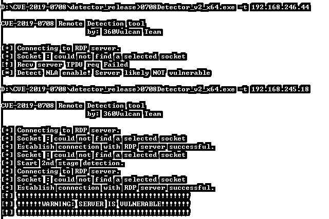

# Window 远程桌面漏洞风险，各个厂家的扫描修复方案（CVE-2019-0708） - Bypass - 博客园

> 原文：[`www.cnblogs.com/xiaozi/p/10929906.html`](https://www.cnblogs.com/xiaozi/p/10929906.html)

　　自微软公司于 2019 年 5 月 14 日发布远程桌面服务远程代码执行漏洞（CVE-2019-0708）安全公告后，整个业界都一直在密切关注，这个漏洞编号必将在当今网络中掀起腥风血雨。各大厂商也纷纷推出自己的修复方案，我们来一起看一看。

关注的第一梯队是安全软件厂商，关注的国内厂商如：360 安全、腾讯安全、安天、瑞星、江民 、金山毒霸等，只有 360 安全和腾讯安全都推出了扫描修复工具。

 远程扫描工具：360 安全只出了命令行版本，腾讯安全出了命令行版本和工具图形界面版本（支持区间扫描）

360 Window RDP 远程漏洞无损检测工具 测试截图：

 腾讯安全 远程桌面服务漏洞（RDS 漏洞）远程扫描工具 测试截图：

第二梯队是漏扫厂商，如 Tenable Nessus、绿盟 RSAS、启明天镜，都发布针对该漏洞的升级包，支持对该漏洞的远程安全扫描。

第三梯队是主机防护，如安恒主机卫士 EDR、安全狗等。

第四梯队为其他厂商，漏洞预警，打补丁，刷刷存在感。

以上只是我个人关注的一些点，如有不当之处，还请批评指正。

扫描测试：

1、Nessus 插件

https://www.tenable.com/plugins/search?q=2019-0708

2、绿盟远程安全评估系统 RSAS 已支持对此漏洞的远程安全扫描，请升级到最新插件升级包。

报道媒体：绿盟 NIPS 发布 CVE-2019-0708 漏洞防护规则：http://blog.nsfocus.net/nips-cve-2019-0708/ 

3、启明星辰天镜脆弱性扫描与管理系统 V6.0 于 2019 年 5 月 14 日紧急发布针对该漏洞的升级包，支持对该漏洞进行检测，用户升级天镜漏扫产品漏洞库后即可对该漏洞进行扫描。6070 版本升级包为 607000220，升级包下载地址：https://www.venustech.com.cn/article/type/1/146.html

**防范措施：**

**1、避免将 RDP 发布到公网，如为了远程运维方便，可通过 VPN 登录后才能访问，同时关闭关闭 445、139、135 等不必要的端口。**

**2、及时更新 Windows 发布的安全更新，受影响版本包括：Windows 7、Windows Server 2008 R2、Windows Server 2008、Windows 2003 Windows XP。**

**3、提高安全意识，不随意点击来源不明的邮件、文档、链接等，并及时为操作系统、IE、Flash 等常用软件打好补丁。**

**360 安全**

Windows RDP 远程漏洞无损检测工具下载

https://cert.360.cn/warning/detail?id=1caed77a5620fc7da993fea91c237ed5

360 远程桌面服务漏洞免疫工具 

[`dl.360safe.com/leakfixer/360SysVulTerminator_CVE-2019-0708.exe`](http://dl.360safe.com/leakfixer/360SysVulTerminator_CVE-2019-0708.exe)，

360 安全卫士热补丁工具

http://down.360safe.com/HotFix_CVE-2019-0708.exe

**腾讯安全**

腾讯安全团队已开发出多款远程桌面服务漏洞（CVE-2019-0708）扫描修复工具供网民使用，包括：本地电脑运行的 RDS 漏洞检测修复工具、远程桌面漏洞远程扫描工具命令行版与图形界面版，以及专门为不能重启系统的服务器开发的漏洞修复热补丁。

**方案一：供本地电脑运行的漏洞扫描修复工具**（包括联机版和离线版）

适用于任何用户下载到自己的电脑上运行，修复漏洞需要重启计算机。

（可以通过这里下载：https://guanjia.qq.com/news/n5/2517.html

**方案二：远程桌面服务漏洞（RDS 漏洞）远程扫描工具**

网管可以在内网批量扫描单个或特定 IP 段，了解局域网中哪些终端已经修补漏洞消除风险，哪些终端还存在漏洞必须尽快解决。网管找到存在漏洞的电脑，在该电脑上运行方案一提供的修复工具即可消除风险。

**RDS 漏洞远程扫描工具图形界面版下载地址：**

http://dlied6.qq.com/invc/xfspeed/qqpcmgr/versetup/portal/RDSRemoteScanTools1.1.zip

**方案三：远程桌面服务漏洞（RDS 漏洞）修复工具热补丁版**

由于部分服务器为避免业务应用中断，服务器不能重启，故需要使用热补丁修复漏洞，热补丁的特点就是安装后勿须重启，即刻具有漏洞免疫功能。

远程桌面服务漏洞（RDS 漏洞）热补丁下载地址：

[`dlied6.qq.com/invc/xfspeed/qqpcmgr/versetup/portal/RDSQuickHotFix1.0.exe`](http://dlied6.qq.com/invc/xfspeed/qqpcmgr/versetup/portal/RDSQuickHotFix1.0.exe)

热补丁运行时，会创建桌面卸载快捷方式，用于卸载热补丁修复模块。

注意事项：本修复工具无需重启，修复成功后直接生效，但重启后失效，需再次运行修复。

参考链接：https://mp.weixin.qq.com/s/ckVHic2oChjZmVvH_zmsHA