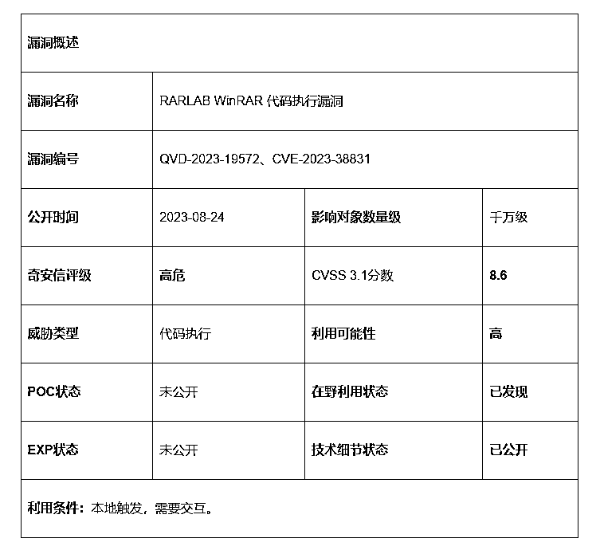
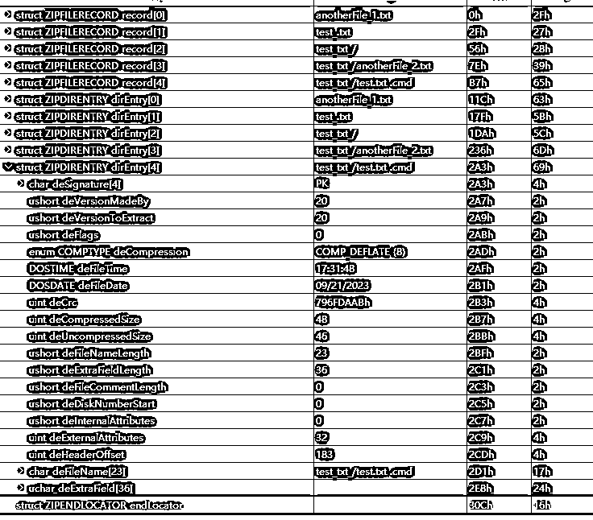
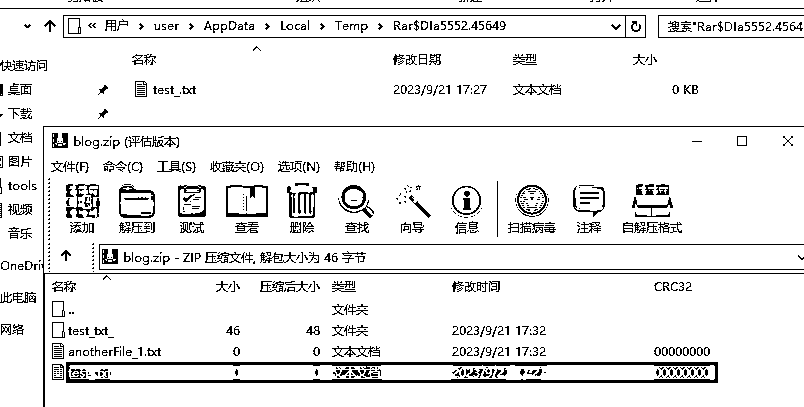
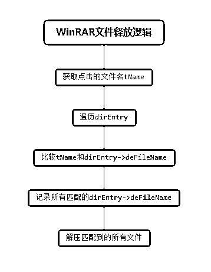
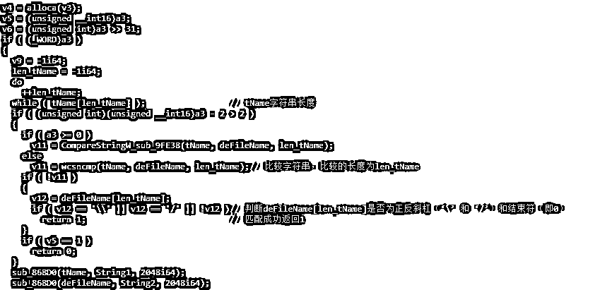
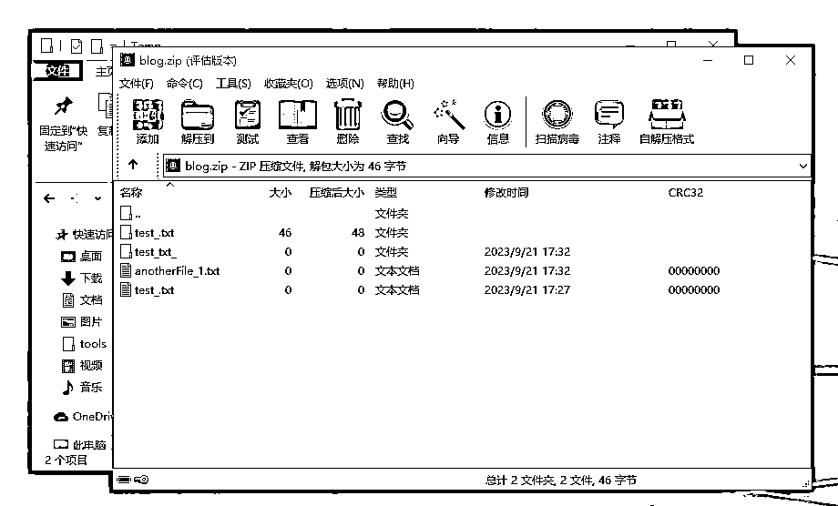
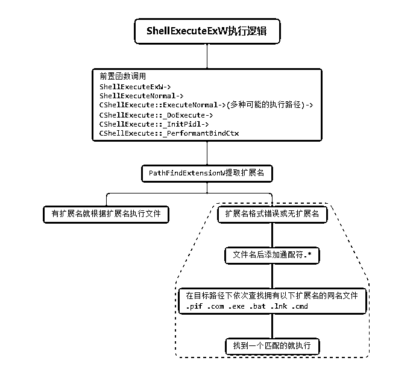
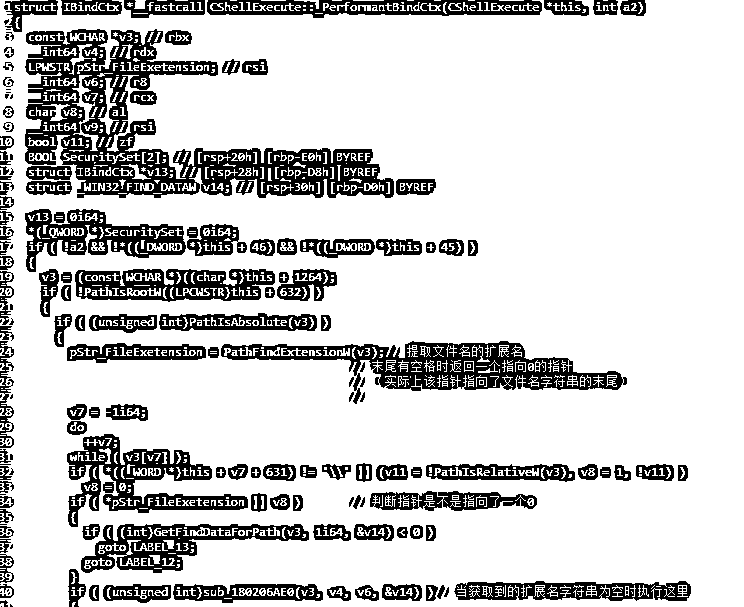
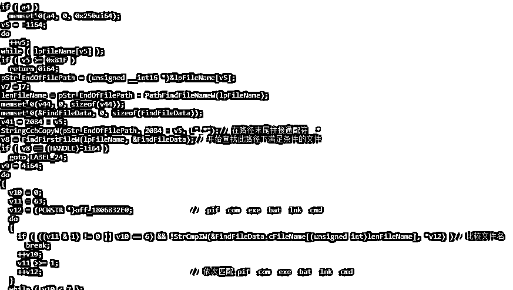
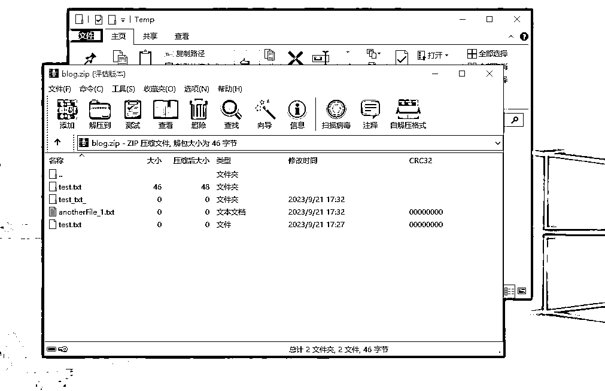

# Winrar 代码执行漏洞(CVE-2023-38831)的原理分析 - 好鱼 233 - 博客园

> 原文：[`www.cnblogs.com/GoodFish-/p/17715977.html`](https://www.cnblogs.com/GoodFish-/p/17715977.html)

　　**背景**

　　在 2023 年 8 月 23 日，Group-IB 威胁情报机构发布了一份报告，详细介绍了 WinRAR 任意执行漏洞 CVE-2023-38831 的攻击活动。根据该报告，这个漏洞最早于 2023 年 4 月被攻击者利用，然后在 2023 年 7 月被 Group-IB 威胁情报机构发现并报告给了 RARLAB。最终，RARLAB 在 2023 年 8 月 2 日发布了修复了 CVE-2023-38831 漏洞的正式版本 WinRAR v6.23。

**漏洞简介**

　　本次漏洞影响范围为低于 WinRAR v6.23 的所有版本，以下是该漏洞的基本信息：

(图源：[WinRAR 代码执行漏洞 (CVE-2023-38831) 安全风险通告 - 安全内参 | 决策者的网络安全知识库 (secrss.com)](https://www.secrss.com/articles/58122))

　　WinRAR 是一款功能强大的 Windows 文件压缩和解压缩工具，支持高效的压缩算法、密码保护、分卷压缩、恢复记录等功能，同时提供图形和命令行界面，以及自解压缩功能，为用户提供便捷且安全的文件管理和传输工具。

　　在 zip 文件格式中，使用了**ZIPDIRENTRY**结构体来管理压缩包内的文件和文件夹信息，包括名称、名称长度和修改日期等。WinRAR 允许用户预览和执行压缩包内文件。但由于字符串比较代码的问题，当用户打开 zip 压缩包并执行文件时，WinRAR 可能会**错误地释放非用户所选的文件**。

　　WinRAR 使用了**ShellExecuteExW**来启动目标文件，这是 Windows 系统的一个 API 函数，用于执行目标文件操作。然而，当**文件路径字符串末尾存在空格**时，该 API 会在路径末尾添加通配符“.*”并搜索匹配的文件来执行，导致了**非目标文件的执行**。

**　　综上所述，这个漏洞的触发包含两个环节：**

**　　a.文件释放：由于文件名字符串的比较函数存在一定的问题，导致了非目标文件被释放；**

**　　b.文件执行：释放的文件经 ShellExecuteExW 执行，当路径字符串末尾有空格时，可能会导致路径下其他特定文件的执行。**

*   **漏洞详细分析**

　　以 WinRAR v6.11(x64)为例，分析漏洞的实现原理和过程。

　　ZIP 文件采用了三种数据结构来有效管理压缩包内的文件内容：ZIPFILERECORD， ZIPDIRENTRY，ZIPENDLOCATOR，其中 ZIPDIRENTRY 在本次漏洞触发中扮演了关键的角色。在 zip 压缩包内，每个文件和文件夹都对应了一个 ZIPDIRENTRY 数据结构，该数据结构包含一个名为 deFileName 的成员，用于存储目标文件/文件夹的名称。

　　构建一个 zip 格式的压缩包，源文件如图：

　　打包为 zip 后数据结构如图，图中的 ZIPDIRENTRY dirEntry 是我们要重点关注的对象，这个数据结构下有个 deFileName，指的是这个结构体管理的目标文件的文件名：

　　用 WinRAR 打开这个压缩包，执行 test_.txt，可以看到 WinRAR 在 temp 目录下释放了该文件：

 　　WinRAR 释放目标文件的逻辑是这样的：

**文件释放漏洞**

　　红色部分是触发漏洞的关键点一，通过各种逆向分析手段，找到了该处代码：

 　　根据这处代码的逻辑，如果我们要解压的文件为 test_.txt，那么就会有三种类型的字符串被匹配上：“test_.txt”、“test_.txt\*****”、“test_.txt/*****”，这里的*表示任意字符串，例如“test_.txt\a.exe”。

　　所以，我们对之前构造的压缩包稍作修改：

　　 然后执行 test_.txt，就会发现，WinRAR 偷偷释放了我们不需要的文件：

　　至此，文件释放的漏洞解释完毕，接下来是文件执行。

**文件执行漏洞**

　　WinRAR 使用 API 执行文件：ShellExecuteExW，这是 shell32.dll 导出的一个函数，该 API 的执行逻辑大致如下：

 　　图中标红的函数 CShellExecute::_PerformantBindCtx 就是本次漏洞的关键点二，文件执行。

　　依旧是使用各种逆向分析手段定位到该函数：

 　　其中有两个关键函数 PathFindExtensionW 和 sub_180206AE0：

　　PathFindExtensionW 是 KernelBase.dll 的一个导出函数，用于从一个文件名中提取出扩展名所在位置的字符串指针，如传入参数为“C:\Windows\test.exe”时，返回值为指向这个字符串的“.exe”位置的指针，这个函数的代码是这样的：

　　可以看到它调用了另一个函数 PathCchFindExtension，这个子函数才是提取扩展名字符串的关键函数，代码逻辑也很简单，遍历文件路径字符串，查找末尾“.*”的位置。

　　需要注意的是，windows 下的文件名称本身（不包括路径），是不可以含有正反斜杠和空格的。

　　但我们只是在调用 API，我们可以给它传任意参数，比如说"C:\Windows\test.exe "，注意这里 test.exe 后面有个空格，那么这时会发生什么呢？

　　PathCchFindExtension 返回给 PathFindExtensionW 一个指向了 0 的字符串，PathFindExtensionW 又把这个指针返回给 CShellExecute::_PerformantBindCtx，

 　　然后就会导致函数 sub_180206AE0 被执行，这个函数就负责给文件名加上通配符，然后在路径下查找匹配的文件：

*   **漏洞完整验证**

　　至此我们已经把漏洞的两个关键环节都找到了，只要根据上面分析的结果构造一个特殊的 zip 文件，就可以触发这个漏洞：

 　   图中标红位置的字符串，在.txt 后面都跟着一个空格。

　　然后我们执行一下：

　　当当~验证完毕。

　　注：

　　此处使用的 WinRAR 版本为 6.11 中文版，64 位；

　　由于系统 dll 版本的不同，上述 API 的执行情况可能有所差别，请根据实际情况进行分析；

　　闲暇之余随手写的文章，行文格式很随意，看不懂的地方还请多看两遍（doge）;

　　文章中最后 poc 演示的 zip 文件下载链接：
　　https://drive.google.com/file/d/1MTDv5snH7ca1Y7lQXEj9_3vmKM8bjpXp/view?usp=drive_link

参考链接：

[WinRAR 代码执行漏洞 (CVE-2023-38831) 安全风险通告 - 安全内参 | 决策者的网络安全知识库 (secrss.com)](https://www.secrss.com/articles/58122)

[Konni APT 利用 WinRAR 漏洞（CVE-2023-38831）攻击数字货币行业 (seebug.org)](https://paper.seebug.org/3032/)

[CVE-2023-38831 WinRAR 漏洞分析 (seebug.org)](https://paper.seebug.org/3036/)