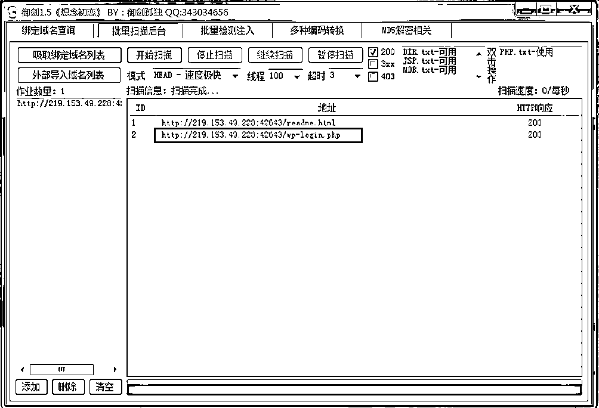
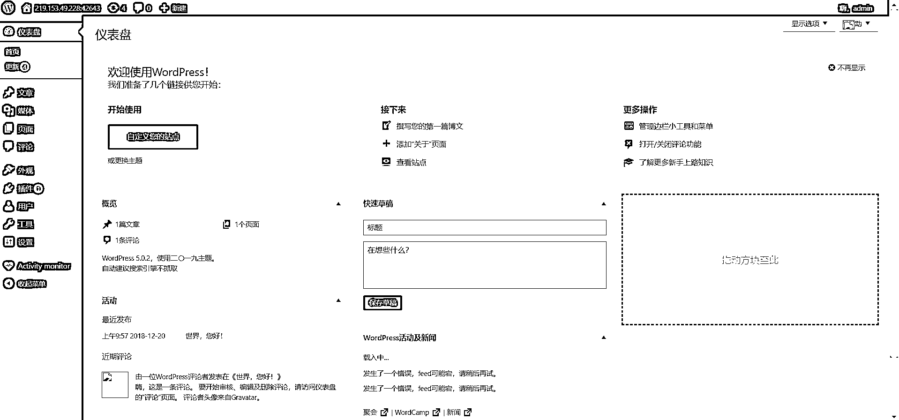
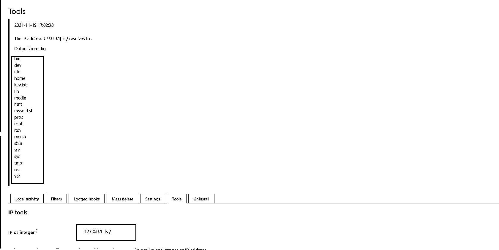
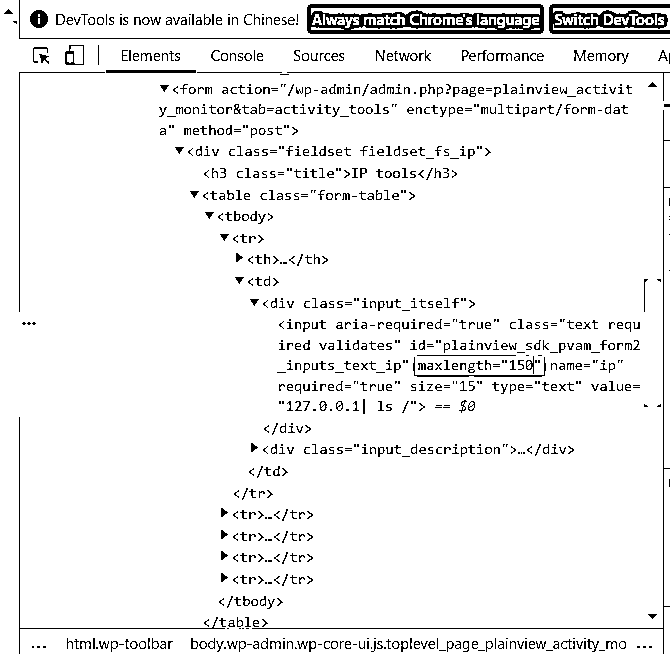
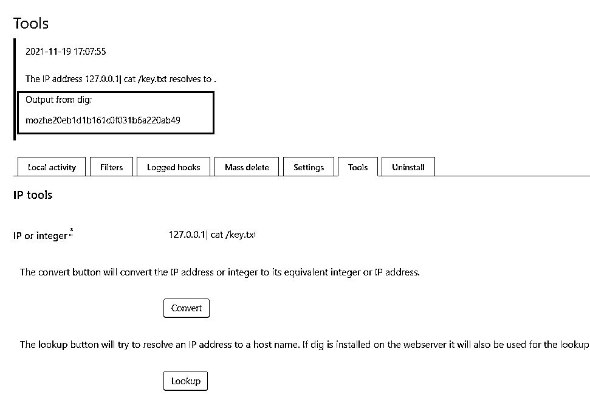

# WordPress 远程命令执行漏洞复现(CVE-2018-15877) - 小小小怪将军 - 博客园

> 原文：[`www.cnblogs.com/SeanGyy/p/15576711.html`](https://www.cnblogs.com/SeanGyy/p/15576711.html)

# 墨者学院-WordPress 远程命令执行漏洞

## 前言：

　　**CVE-2018-15877**漏洞是一个 WordPress 插件 Plainview Activity Monitor 存在远程命令执行的漏洞。Plainview Activity Monitor 是一款网站用户活动监控插件。远程攻击者可以通过构造的 url 来诱导 wordpress 管理员来点击恶意链接最终导致远程命令执行。

　　靶场地址：[`www.mozhe.cn/bug/detail/Zis0bC9SUnlJZEtBdlZkT01QVXRsUT09bW96aGUmozhe`](https://www.mozhe.cn/bug/detail/Zis0bC9SUnlJZEtBdlZkT01QVXRsUT09bW96aGUmozhe)

## 正文：

　　打开靶机环境


 　　利用御剑扫描后台目录，发现登陆界面（其实安装过 WordPress 的同学都应该知道默认登陆界面为 wp-login.php）



　　进入界面


　　笔者用 wpscan 查看了一下 WordPress 的用户名

```
wpscan --url http://xxx/ -e u
```

　　发现了叫 admin 的用户


　　其实细心的小伙伴应该可以发现，在登陆页面不同的用户报错是不一样的


　　细心一点，就会减少很多负担。

　　好了，言归正传，后台登陆界面并没有设置验证码，我们就用 burp 弱口令尝试爆破


　　发现密码为 123qwe，登陆后台



　　之前说到该漏洞是 WordPress 的插件 Plainview Activity Monitor 存在的 RCE 漏洞，笔者直接找到 Plainview Activity Monitor 页面


 　　通过在正常命令后加 ‘| ls /’ 来执行我们想要的命令

```
127.0.0.1| ls /
```



 　　发现我们要找的 key 就在根目录下

　　我们在查看 key 时

```
127.0.0.1| cat /key.txt
```

　　发现只能输入一半进去，应该是开发者限制了输入的字数

　　打开 F12,找到 maxlength，修改为 150



　　再次执行上面的命令



　　此时就拿到我们需要的 key 了。

## 反思：

 　　在我做这个靶场时，我之前已经在 linux 上安装过了 WordPress，对其目录有了一定的了解，比如默认的登陆地址，数据库用户名和密码的存放位置等等，这些都会再我们实际操作的时候有很大的帮助。

　　“知己知彼，百战不殆“，建议大家做到相关 cms 漏洞时，可以在自己的虚拟机上安装一遍，更了解它，才能更快的找到漏洞。