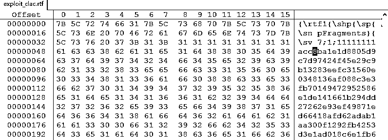

# cve-2010-3333 Microsoft Office Open XML 文件格式转换器栈缓冲区溢出漏洞 分析 - Ox9A82 - 博客园

> 原文：[`www.cnblogs.com/Ox9A82/p/5711536.html`](https://www.cnblogs.com/Ox9A82/p/5711536.html)

　　　 用的是泉哥的 POC 来调的这个漏洞

#### 　　　 0x0 漏洞调试

　　   **Microsoft Office Open XML 文件格式转换器栈缓冲区溢出漏洞**

        Microsoft Office 是微软发布的非常流行的办公软件套件。
        基于 Mac 平台的 Microsoft Office XP SP3，Office 2003 SP3，Office 2007 SP2，Office 2010，Office 2004 以及 2008 版本，基于 Mac 2011 平台的 Office，以及基于 MAC 平台的 Open XML 文件格式转换器中存在基于栈的缓冲区溢出漏洞。远程攻击者可以借助特制的 RTF 数据执行任意代码。该漏洞又名"RTF 栈缓冲区溢出漏洞"。

　　   加载 POC 后，程序中断在如下所示位置

```
(8a0.b70): Access violation - code c0000005 (first chance)
First chance exceptions are reported before any exception handling.
This exception may be expected and handled.
eax=0000c8ac ebx=05000000 ecx=0000019b edx=00000000 esi=1051c24c edi=00130000 eip=30edf864 esp=00123d98 ebp=00123dd0 iopl=0 nv up ei pl nz na pe nc
cs=001b  ss=0023  ds=0023  es=0023  fs=003b  gs=0000             efl=00010206 mso!Ordinal1488+0x29fd:
30edf864 f3a5            rep movs dword ptr es:[edi],dword ptr [esi] es:0023:00130000=78746341 ds:0023:1051c24c=4c36744c
```

　　此时若是查看栈回溯会发现得不到正确的结果，判断应该是栈被覆盖导致栈回溯被破坏得不到正确的结果，于是对 mso!Ordinal1488+0x29fd:位置下断。重新执行程序发现可以正常的得到回溯结果了。栈回溯结果如下

```
0:000> kp
ChildEBP RetAddr  
WARNING: Stack unwind information not available. Following frames may be wrong.
00123dd0 30f0f3cb mso!Ordinal1488+0x29fd 00123e00 30f0f359 mso!Ordinal901+0x2a3c 0012404c 30d4d762 mso!Ordinal901+0x29ca
00124074 30d4d70b mso!Ordinal4925+0x53
00124078 30d4d47d mso!Ordinal5148+0x36 0012407c 06270b10 mso!Ordinal4783+0x12f
00124080 06270b48 0x6270b10
00124084 062709f8 0x6270b48
00124088 30dd112c 0x62709f8 0012408c 00000000 mso!Ordinal2940+0x1588c
```

可以看到本段函数是由 mso!Ordinal901+0x2a3c（30f0f3cb）调用而来，对 30f0f3cb 函数进行查看发现并不是调用到本函数的，而是调用了 sub_30F0F422。如下所示

```
0:000> ub  30f0f3cb 
mso!Ordinal901+0x2a28:
30f0f3b7 23c1            and     eax,ecx
30f0f3b9 50 push    eax
30f0f3ba 8d47ff          lea     eax,[edi-1]
30f0f3bd 50 push    eax
30f0f3be 8b4508          mov     eax,dword ptr [ebp+8]
30f0f3c1 6a00            push 0 30f0f3c3 ff750c          push    dword ptr [ebp+0Ch]
30f0f3c6 e857000000      call    mso!Ordinal901+0x2a93 (30f0f422)
```

跟进 sub_30F0F422 里面也没有发现有直接调用 30edf864 所在函数的语句。用 ida 加载 MSO.dll 文件，发现 30edf864 所在的函数被 IDA 识别为数据，自行创建函数之后求交叉引用发现此地址被置于如下所示的数据表中，推测是某一个对象的虚表？

.text:30DA6114                 dd offset sub_30EDF83E

总之发现了 30f0f422 对 30edf864 所在函数的调用关系。

分析 30edf864 所在的 sub_30EDF83E 函数可以看到，所执行的 rep movsd 指令的 edi（复制的目的地址）为 2 号参数。复制的次数为 (*(参数 1+8)&65535)/4 。复制的源地址为 *(参数 1+8)&65535*参数 3+*(参数 1+16) 。看起来很奇怪是不是我也觉得很奇怪，但是觉得可能是某个对象的 this 指针。我们先对 mso!Ordinal1488+0x29fd（30edf864）下断，重新运行程序断在这里，这时可以看到 ecx 的值为 0x322b 如下所示。我们知道这个大小意味着相当的大（0x322b=13099,13099x4=52396）,共 52396 个字节。

```
0:000> r
eax=0000c8ac ebx=05000000 ecx=0000322b edx=00000000 esi=1051000c edi=00123dc0
eip=30edf864 esp=00123d98 ebp=00123dd0 iopl=0 nv up ei pl nz na pe nc
cs=001b  ss=0023  ds=0023  es=0023  fs=003b  gs=0000             efl=00000206 mso!Ordinal1488+0x29fd:
30edf864 f3a5            rep movs dword ptr es:[edi],dword ptr [esi] es:0023:00123dc0=ffff0000 ds:0023:1051000c=41306141
```

无论如何栈也是承受不了这样的大小的。那么到底能承受多少呢？我们来看下。  

```
1 .text:30F0F422 var_10          = dword ptr -10h 2 
3 .text:30F0F44B                 lea ecx, [ebp+var_10] 4 .text:30F0F44E                 push ecx 5 .text:30F0F44F                 mov ebx, 5000000h 6 .text:30F0F454                 push esi 7 .text:30F0F455                 mov [ebp+var_C], ebx 8 .text:30F0F458                 call    dword ptr [eax+1Ch] //调用 sub_30EDF83E
```

由上面可以知道，复制的目的地址就是 var_10，一个 sub_30F0F422 中的 4 字节的局部变量。试图往 4 个字节中拷贝 52396 个字节，这样肯定是会溢出的了。我们进一步看一下栈的情况

```
0:000> dc edi
00123dc0  ffff00ff 05000000 00000000 00e4ffff  ................
00123dd0  00123e00 30f0f3cb 00123f3c 00000000  .>.....0<?......
00123de0  ffffffff 00000000 01280b28 00124420 ........(.(. D..
00123df0  0012408c 00124e38 001240b0 00000000 .@..8N...@......
00123e00  00123fe4 30f0f359 00123f88 00123f3c  .?..Y..0.?..<?..
00123e10 00000000 01280b28 0012408c 00124420 ....(.(..@.. D..
00123e20 00000000 ffffffff ffffffff ffffffff  ................
00123e30 00000000 20000000 00000101 00000000 ....... ........ 0:000> kp
ChildEBP RetAddr  
WARNING: Stack unwind information not available. Following frames may be wrong.
00123dd0 30f0f3cb mso!Ordinal1488+0x29fd 00123e00 30f0f359 mso!Ordinal901+0x2a3c 0012404c 30d4d762 mso!Ordinal901+0x29ca
00124074 30d4d70b mso!Ordinal4925+0x53
00124078 30d4d47d mso!Ordinal5148+0x36 0012407c 01280b10 mso!Ordinal4783+0x12f
00124080 01280b48 0x1280b10
00124084 012809f8 0x1280b48
00124088 30dd112c 0x12809f8 0012408c 00000000 mso!Ordinal2940+0x1588c
```

可见最多达到 16byte 时会覆盖 ebp，然后是返回地址。

 　　 **0x1 漏洞分析**

我们在前面看了一下漏洞触发的原理，但是漏洞为什么会存在还并没有搞清楚。我们回过头来看一下漏洞描述可以知道这是对 rtf 文件的解析不正确所导致漏洞。那么我们来看下拷贝的东西是什么

```
0:000> db esi
1109000c  ba 1e 1d 88 05 d9 c7 d9-74 24 f4 5e 29 c9 b1 32  ........t$.^)..2 1109001c 83 ee fc 31 56 0e 03 48-13 6a f0 88 c3 e3 fb 70 ...1V..H.j.....p
1109002c 14 94 72 95 25 86 e1 de-14 16 61 b2 94 dd 27 26  ..r.%.....a...'&
1109003c  2e 93 ef 49 87 1e d6 64-18 af d6 2a da b1 aa 30  ...I...d...*...0 1109004c  0f 12 92 fb 42 53 d3 e1-ad 01 8c 6e 1f b6 b9 32  ....BS.....n...2 1109005c  9c b7 6d 39 9c cf 08 fd-69 7a 12 2d c1 f1 5c d5  ..m9....iz.-..\.
1109006c 69 5d 7d e4 be bd 41 af-cb 76 31 2e 1a 47 ba 01 i]}...A..v1..G..
1109007c 62 04 85 ae 6f 54 c1 08-90 23 39 6b 2d 34 fa 16  b...oT...#9k-4..
```

在 poc 文件中搜索一下，如下图



咦，acc8 这个数有点熟悉啊

```
0:008> g
ModLoad: 05da0000 05f41000   C:\Program Files\Microsoft Office\OFFICE11\GdiPlus.DLL
Breakpoint 0 hit
eax=0000c8ac ebx=05000000 ecx=0000c8ac edx=00000000 esi=1051000c edi=00123dc0
eip=30edf861 esp=00123d98 ebp=00123dd0 iopl=0 nv up ei pl nz na pe nc
cs=001b  ss=0023  ds=0023  es=0023  fs=003b  gs=0000             efl=00000206 mso!Ordinal1488+0x29fa:
30edf861 c1e902          shr     ecx,2
```

注意看 ecx，明显是信任了 rtf 文件的给出的大小而没有进行自己的验证，而那些.doc 的样本其实就是 rtf 文件改了一下后缀名，其实还是按照 rtf 进行解析的。搞定！

 ps:win7 通用的 jmp esp 7ffa4512